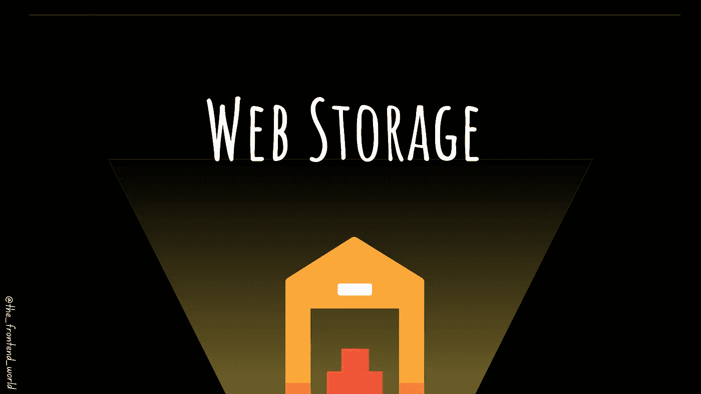
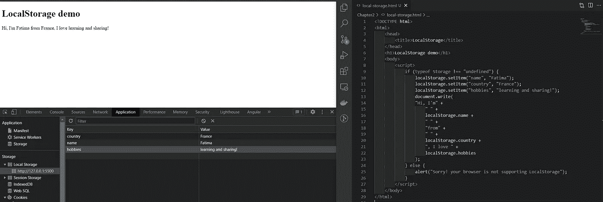
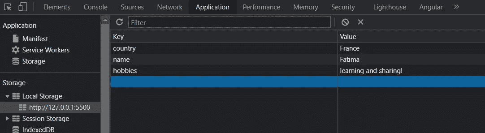
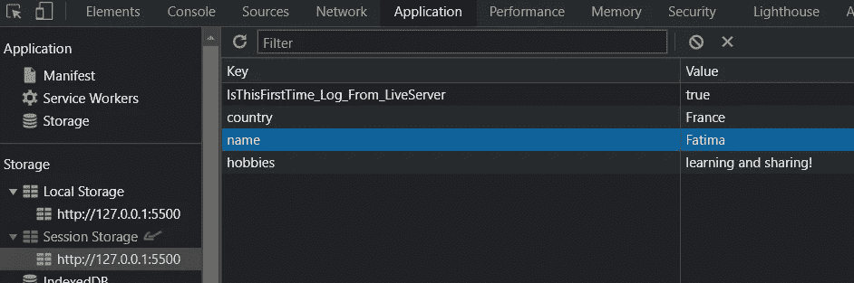

# 网络存储🗃️

> 原文：<https://levelup.gitconnected.com/web-storage-%EF%B8%8F-43ca7d1d8283>

## HTML5 中的 web 存储是什么？网络存储是用来做什么的？



作者:FAM

大家好👋,

是时候了解一下网络存储了。

# 什么是网络存储？

Web 存储是浏览器存储键/值对的能力或机制。

**还记得** [**饼干篇**](https://medium.com/geekculture/cookies-sessions-1cb9e4ad6f7b?source=your_stories_page----------------------------------------) **吗？**我简要讨论了用 cookies 存储数据的不便之处，web 存储是更好、更直观的解决方案。

应用程序可能需要在用户的浏览器中本地存储一些数据。数据的一个例子可以是`***darkMode: true***`告诉应用程序当前用户已经选择了黑暗模式或其他用户的 UI 偏好。

## 快速刷新为什么你应该存储在网络存储而不是 cookies？

在 cookies 文章中，我们了解到我们可以将数据存储在随请求一起发送的 cookies 中。但是网络存储有很多优势:

*   更安全(信息存储在本地，从不传输到服务器)
*   可以存储大量数据(最多 5MB)
*   不影响浏览器的性能。

# 有两种 web 存储机制(或对象)

根据您的需求或您的用户故事需求，您可以选择更合适的解决方案:

*   `***localStorage***` ***:*** 存储的数据没有有效期。当您关闭浏览器或标签时，数据不会被删除。您需要通过 JavaScript 或清除浏览器缓存来手动删除它们。
*   `***sessionStorage***` ***:*** 数据仅存储一个会话，这意味着当您关闭浏览器窗口或标签时，存储的数据将被删除。

# 🚉真实的用例故事

我在法国铁路公司工作时，我们用`***LocalStorage***` 保存重要数据。在应用程序中，我们有两个空间(最终可以创建未来的空间)，所以我们需要一个全球解决方案。我们当时的需求是在空间(应用程序)之间切换时，我们需要保持每个空间的当前状态。第一个空间是一个带有铁路结构和基础设施的地图应用程序，其中有小部件，我们可以搜索火车站，在地图上绘图，以及做其他复杂的功能...等等。第二个空间是从 X 位置到 Y 位置的路线的线性视图，具有基于实际位置绘制的基础设施数据。这是一个特定于旅程的应用程序，显示一种仪表板。(我不知道我的英语对你来说是否清楚，它有点专业😜)

*   这是大量的数据。我们不能用饼干。
*   数据可以存储在一个`***SessionStorage***`中，但是如果用户不小心关闭了 web app，所有数据都会被删除。
*   我们最后的选择是`***LocalStorage***`，它解决了问题！

# 要编码！

## 本地存储示例

下面是一些基本的函数或 API，可以用来创建、检索和删除数据。它总是一个名称/值对。

一旦数据存储在`***LocalStorage***` 中，您就可以在 JS 脚本中对其进行任何操作。我们暂时不需要理解这一部分。我们需要知道的是，我们可以在浏览器上本地存储数据，并且可以通过浏览器访问它们:



本地存储

要查看本地存储器中存储的数据:

*   击中`F12`
*   转到`application`选项卡
*   在左侧，转到`Local Storage`:



我需要做的就是存储这些信息:

```
***localStorage***.setItem("name", "Fatima");
***localStorage***.setItem("country", "France");
***localStorage***.setItem("hobbies", "learning and sharing!");
```

这些创建的项目将保存在您浏览器的本地存储中，并且**不会被删除，除非您自己删除。**

不是所有的浏览器都支持 web 存储，但是现代的浏览器都支持。你需要用下面的 JS 代码检查你的浏览器是否支持`***LocalStorage/SessionStorage***`:

```
if (***typeof Storage !== "undefined"***) {
    // It doens't support it
} else {
    // It doens't support it
}
```

在 JS 一章中，你会学到更多关于 JS 代码的知识。

**👉** [**获取演示代码并使用它！**](https://github.com/famzila/2022-WEB-PROGRAM/blob/main/Chapter2/local-storage.html)

## 会话存储示例

这同样适用于`***SessionStorage***` 除了当您关闭浏览器中的演示 HTML 文件标签时，您的数据将被删除。

要存储数据:

```
***sessionStorage***.setItem("name", "Fatima");
***sessionStorage***.setItem("country", "France");
***sessionStorage***.setItem("hobbies", "learning and sharing!");
```

要查看会话存储器中存储的数据:

*   点击`F12`
*   转到`application`选项卡
*   在左侧，转到`Session Storage`:



这些创建的项目将保存在浏览器的会话存储中，并且在您每次关闭标签或浏览器时**将被删除。**

**👉** [**获取 sessionStorage 演示代码并使用它！**](https://github.com/famzila/2022-WEB-PROGRAM/blob/main/Chapter2/session-storage.html)

今天就到这里，看阿雅🙋

如果您有任何问题或反馈，请点击评论或通过 LinkedIn 联系我— **我洗耳恭听！**

[**想请我喝杯咖啡吗？☕️**](https://www.buymeacoffee.com/fatimaamzil)

> 让我们为 2022 年打造一个更好的‘我们’！

## 了解有关 2022 年网络快车计划的更多信息:

## I- [通用网络知识](https://medium.com/geekculture/2022-web-program-chapter-n-1-is-done-499fb0707220?source=your_stories_page----------------------------------------)

# II-网页框架:HTML

*   [HTML 和页面结构](https://javascript.plainenglish.io/the-foundation-of-any-web-page-78ebdcb6d874?source=your_stories_page----------------------------------------)
*   [元素&属性](/what-are-elements-and-attributes-in-html-1cd709c3a418?source=your_stories_page----------------------------------------)
*   [表格、输入、图像、](https://medium.com/geekculture/html-content-essentials-that-every-web-developer-should-know-dcb8b8715125?source=your_stories_page----------------------------------------) …
*   [列出&表格](https://medium.com/codex/html-content-essentials-that-every-web-developer-should-know-a1e7b966698a)
*   [事件](https://famzil.medium.com/htmls-super-ability-1eb41726096e)

> **网络存储**

*   语义 HTML
*   易接近

[](https://medium.com/geekculture/2022-web-program-is-launched-f38a3280af1a) [## 2022 网络计划启动！

### 改变来自心态和习惯

medium.com](https://medium.com/geekculture/2022-web-program-is-launched-f38a3280af1a) 

与想成为 web 开发人员的人分享该程序！这将有助于保持进步，并在旅途中互相帮助。

> 如果你喜欢我的文章， [**订阅**](https://famzil.medium.com/subscribe) 获取我的最新。如果你自己喜欢体验媒介，可以考虑通过[**注册会员**](https://famzil.medium.com/membership) 来支持我和其他成千上万的作家。它只需要每月 5 美元，它支持我们，作家，你也有机会用你的作品赚钱。当然，你可以随时取消会员资格。通过注册[这个链接](https://famzil.medium.com/membership)，你将直接用你的一部分费用来支持我，不会花你更多的钱。如果你这样做了，万分感谢！

让我们**联系上** [**中**](https://medium.com/@famzil/)**[**Linkedin**](https://www.linkedin.com/in/fatima-amzil-9031ba95/)**[**脸书**](https://www.facebook.com/The-Front-End-World)**[**insta gram**](https://www.instagram.com/the_frontend_world/)**[**YouTube**](https://www.youtube.com/channel/UCaxr-f9r6P1u7Y7SKFHi12g)**或**********

****[](https://famzil.medium.com/membership) [## 通过我的推荐链接——FAM 加入 Medium

### 作为一个媒体会员，你的会员费的一部分会给你阅读的作家，你可以完全接触到每一个故事…

famzil.medium.com](https://famzil.medium.com/membership)****