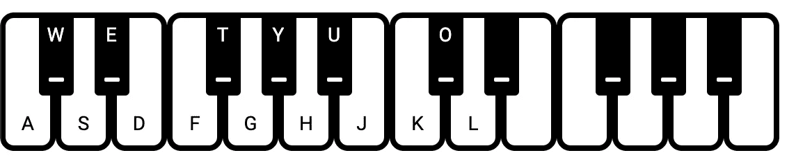

# JavaScript Web Synth 向正弦波振荡器添加键盘

> 原文：<https://levelup.gitconnected.com/web-synth-from-scratch-adding-virtual-keyboard-to-a-sine-wave-oscillator-e4dd6cb8f3fd>

在前面的[部分](https://alexjilkin.medium.com/modular-javascript-web-synth-a726d8e937b6)中，我们创建了一个简单的正弦波并播放了它。

这次我们将使用浏览器和 React 创建一个简单的虚拟键盘来播放我们的正弦波。你可以在这里找到完整的源代码

演奏与音高标准 440 赫兹有半音差的不同音符的基本方法是将 *440* 乘以 *2^(n/12)*
当 *n* 是 a 以上或以下多少个半音时

# 履行

我不会详细介绍 React 应用程序是如何工作的，但我们的基础将是一个键盘组件，你可以在 input/Keyboard.jsx 中看到，它的工作是绘制一个漂亮的键盘，并捕捉用户按下的键。

当 input/KeyboardManager.js 在 triggers 对象中记录所有这些触发器时。

我们的**引擎**将是 synth 模块，它获取这些触发器并从中生成一个“波”,我们稍后可以播放它

这里我们有主时钟变量，和一个产生下一个播放值的波形发生器。

对于每一次触发，发生器都会累积一个不同频率的正弦波，这样我们就可以同时弹奏不同的音符(用 synth 行话来说就是*复调*)

现在播放这个，我们将有我们的 browserPlayer 模块

浏览器允许我们从值中创建一个缓冲区，并播放它们。
不知道创建此输出流的最佳实践是什么(也许您可以写下并建议一些不同的内容？)
但是这种方式对我来说非常有效，它从我们之前的波形发生器中获取下一个值，并将其发送到输出端。

# 我们得到了什么？

简而言之，这个项目的结果——我们得到了一个简单的合成器，我们可以用键盘演奏，从头开始创造声音，我们可以很容易地操纵它的值。
添加扭曲？没问题，只要通过一个失真模拟方程来传递数值就行了。
添加延迟？没问题，只需保存先前状态的值，并再次将它们添加到当前值中。

查看 [**演示**](https://alexjilkin.github.io/jsynth-steps) **阅读下一步我们在这里添加一个** [**延迟模块**](https://alexjilkin.medium.com/javascript-web-synth-from-scratch-delay-module-5975d059ca83)