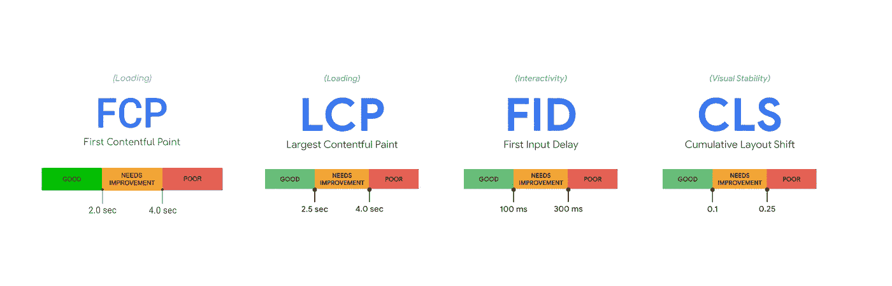
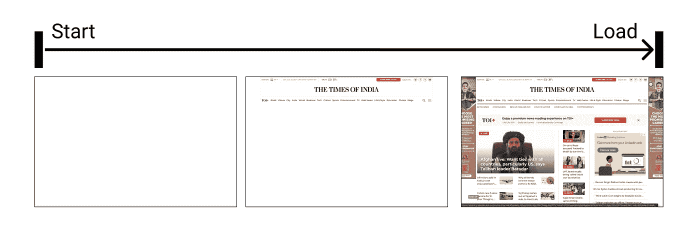
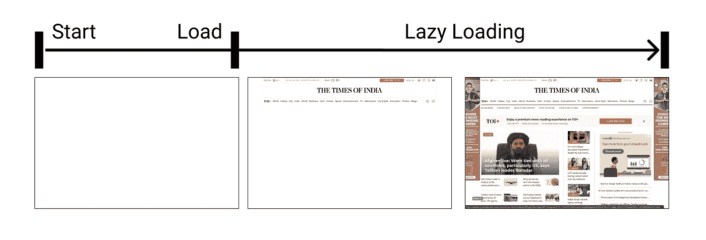
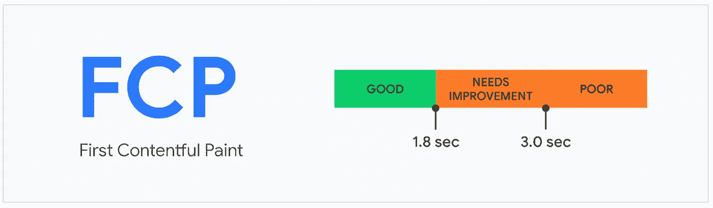
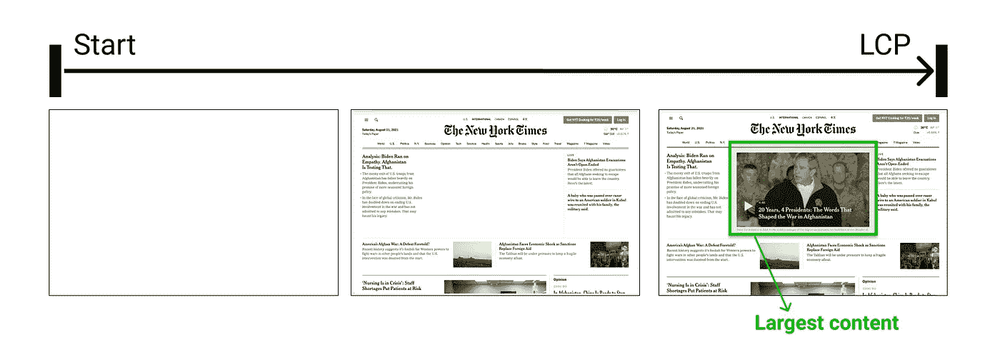
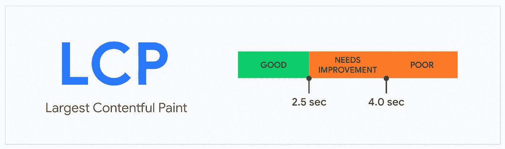
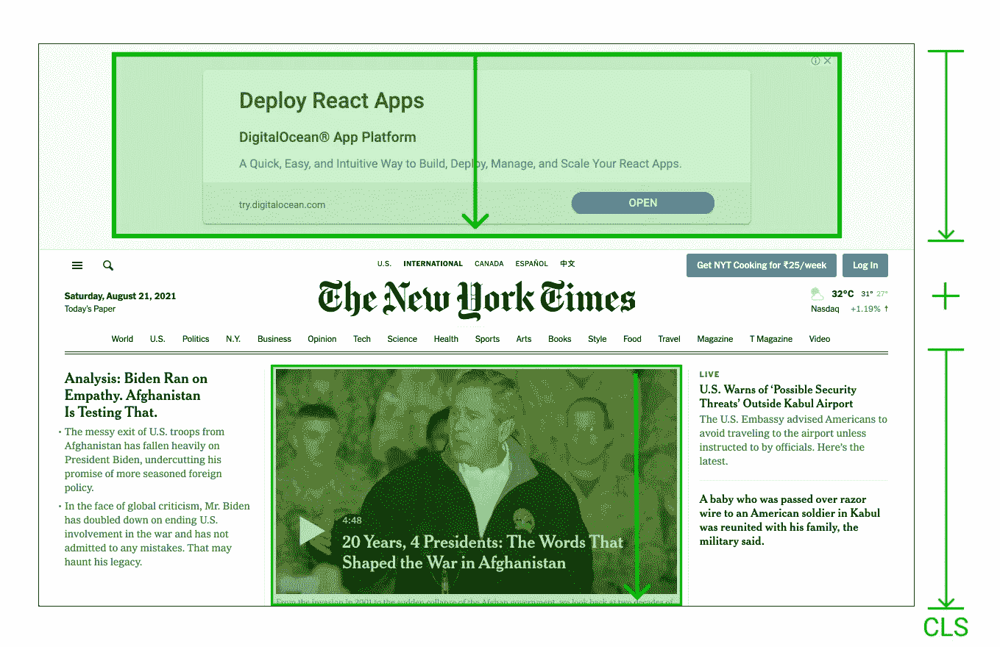
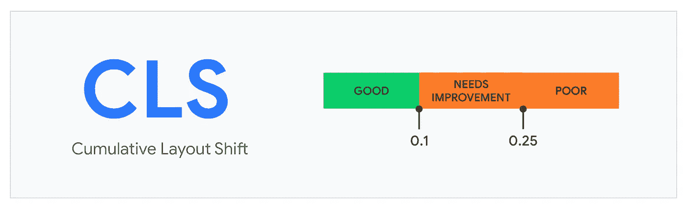
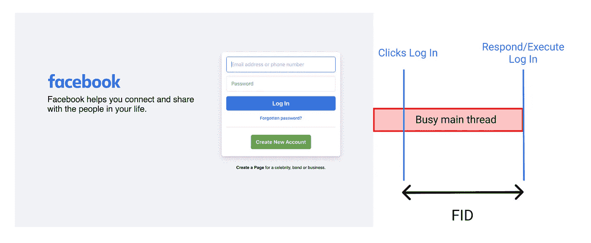
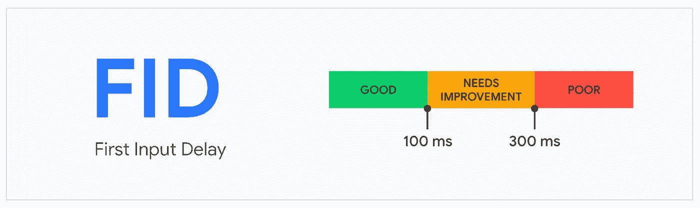

# Web Vitals——提高 web 应用性能的 4 种方法

> 原文：<https://levelup.gitconnected.com/web-vitals-4-ways-to-make-your-web-apps-more-performant-9439906d1159>



你有一个高性能的网络应用程序，是吗？如果我可以问的话，有多好？你认为你的网站表现良好的标准是什么？你相信你的应用可以做得更好吗？你如何将你的应用程序与其他应用程序进行比较，依据是什么？

嗯，在衡量你的网站性能时，你可以问很多问题。请允许我向你介绍强大的**网络生命**！

在这篇文章中，我们将着眼于 4 个核心网站的活力，这是衡量任何网站性能的指标！我们开始吧！

# 衡量绩效——老方法

如果我们回到过去，给定网站的性能是使用[页面加载](https://developer.mozilla.org/en-US/docs/Web/API/Window/load_event)事件来衡量的。页面加载时间越短，给定网站的性能就越高。

> 当加载了整个页面，包括所有相关资源(如样式表和图像)时，将触发页面加载事件



很长一段时间以来，页面负载被认为是一种性能指标，但后来人们开始使用诸如延迟加载之类的策略来利用它。

> [延迟加载](https://developer.mozilla.org/en-US/docs/Web/Performance/Lazy_loading)是一种将资源识别为非阻塞(非关键)的策略，只在需要时加载这些资源



这完全打乱了页面负载指标。当然，我们需要新的更强大的指标！

# 新方式——网络生命

随着时间的推移，更新的、以用户为中心的性能指标不断发展。

> Web Vitals 是谷歌的一项倡议，旨在为质量信号提供统一的指导，这些信号对于在网络上提供出色的用户体验至关重要。

简而言之，web vitals 是谷歌衡量你的应用性能的方式。它几乎没有适用于所有网页的规则，应该由所有网站所有者来衡量。

在这篇文章中，我将讨论以下核心网络要素—

1.  第一幅令人满意的画(FCP)
2.  最大含量涂料(LCP)
3.  累积布局偏移(CLS)
4.  第一输入延迟(FID)

## 1.第一幅令人满意的画(FCP)

> 这是从用户点击你的页面开始到第一个**有意义的** **内容**出现在屏幕上的时间。

对于此指标，“内容”是指文本、图像(包括背景图像)、`<svg>`元素或非白色`<canvas>`元素等。


一个好的 FCP 成绩是 **1.8 秒或更少**。所以为了给你的客户提供优质的用户体验，你的网站应该努力达到 1.8s 的门槛。



图片编号:[https://web.dev/](https://web.dev/)

**提高 FCP 分数的几种方法—**

*   [消除渲染阻塞资源](https://web.dev/render-blocking-resources/)
*   [移除未使用的 CSS](https://web.dev/unused-css-rules/) 。[缩小 CSS](https://web.dev/unminified-css/)
*   [避免巨大的网络负载](https://web.dev/total-byte-weight/)

## 2.最大含量涂料(LCP)

在整个加载过程中，屏幕的不同部分会被绘制出来。人们可以测量在给定的时间内屏幕被画了多少。

> 最大百分比的屏幕被渲染的时间是 LCP。

在大多数情况下，这将是一个英雄图像/视频或页面上的主要文本块。



每次渲染循环发生时，浏览器将测量刚刚进来的元素和所有其他元素的长度和宽度，这里是总面积。渲染最大区域的时间是 LCP

为了提供良好的用户体验，站点应该努力使 LCP 不超过 2.5 秒。



图像编号:[https://web.dev/](https://web.dev/)

**提高 LCP 分数的几种方法—**

*   优化服务器响应时间(BE)
*   [使用 PRPL 模式应用即时加载](https://web.dev/apply-instant-loading-with-prpl)
*   [优化您的图像](https://web.dev/fast#optimize-your-images)

## 3.累积布局偏移(CLS)

累积的布局变化(CLS)是关于视觉稳定性的。

你有没有经历过这样的情况，比如你正在网上阅读一些东西，或者你正要点击一个按钮，突然内容向下移动？

很多时候事情都很烦人，但在某些情况下，它们会造成真正的伤害！(查看下面的 gif :P)


参考:https://web.dev/

移动通常是因为资产的异步加载或者 DOM 元素向现有内容的动态插入。

> CLS 是对页面整个生命周期中发生的每一次[意外](https://web.dev/cls/#expected-vs.-unexpected-layout-shifts)布局偏移的最大突发*布局偏移分数*的度量。



计算布局偏移分数的完整公式为:

```
layout shift score = impact fraction * distance fraction
```

在这里阅读更多信息

给定网站的良好 CLS 分数被认为是 0.1 或更低。



**提高 CLS 分数的几种方法—**

*   总是在你的图像和视频元素中包含尺寸属性，或者用类似 [CSS 纵横比框](https://css-tricks.com/aspect-ratio-boxes/)的东西保留所需的空间。
*   避免在现有内容上插入内容。

阅读更多关于 CLS 优化[这里](https://web.dev/optimize-cls/)

## 4.第一输入延迟(FID)

FID 是关于用户与你的网页的互动。

> FID 测量从用户第一次与页面交互(即，当他们单击链接、点击按钮或使用自定义的 JavaScript 支持的控件)到浏览器实际能够开始处理事件处理程序以响应该交互的时间。

假设你的应用程序的所有内容都已经绘制好了，用户试图点击一些东西。如果由于浏览器忙于解析和编译 javascript 而导致延迟，甚至没有触发事件，那么这个延迟就是 FID。



考虑上面的图像。由于用户点击“登录”是在浏览器正在运行一个任务时发生的，所以它必须等到任务完成后才能响应输入。它必须等待的时间是该页面上该用户的 FID 值。

为了提供良好的用户体验，网站应该努力使 FID 分数达到 **100 毫秒或更少**



**提高 FID 分数的几种方法—**

*   [减少第三方代码的影响](https://web.dev/third-party-summary/)
*   [减少 JavaScript 执行时间](https://web.dev/bootup-time/)
*   [最小化主线程工作](https://web.dev/mainthread-work-breakdown/)
*   [保持低请求数和小传输量](https://web.dev/resource-summary/)

太好了！所以现在既然你已经有了关于网站的重要知识，那就轮到你来测试你的网站，改进所有的指标，让网络成为一个快乐的地方！

为了对照上述指标感受一下你目前的表现，试着通过 [PageSpeed Insights](https://developers.google.com/speed/pagespeed/insights/) 或[web.dev/measure](https://web.dev/measure)运行一个页面

谢谢你滚动到最后😊

放下一个👏🏻更多精彩内容请关注我。让我们连线一下——[Twitter](https://twitter.com/satyya_vachan)、 [LinkedIn](https://www.linkedin.com/in/satyam04/) 或 [Github](https://github.com/satyam-dev)

# 参考

[](https://web.dev/) [## 网络开发

### 利用 web.dev 提供的有用指导和分析，在您自己的网站和应用程序上获得 web 的现代功能。随着 web…

网络开发](https://web.dev/) [](https://developer.mozilla.org/en-US/) [## MDN Web 文档

### MDN Web Docs 站点提供了关于开放 Web 技术的信息，包括 HTML、CSS 和用于这两个网站的 APIs

developer.mozilla.org](https://developer.mozilla.org/en-US/)