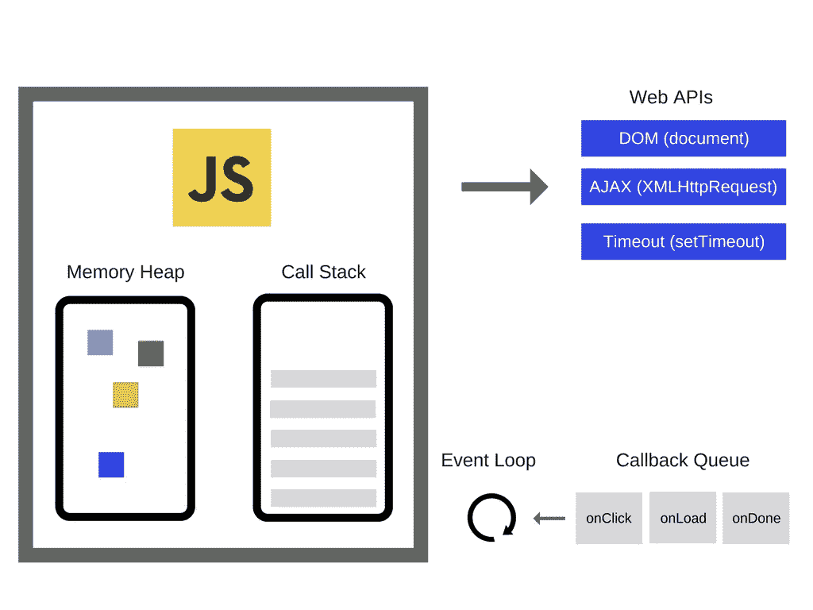
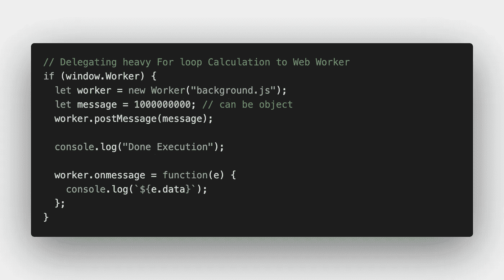
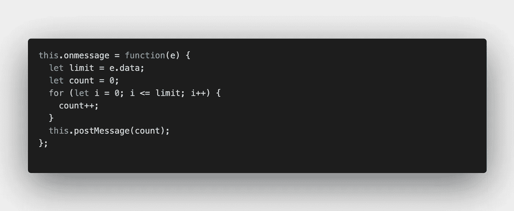

# JavaScript Web Workers，简介

> 原文：<https://levelup.gitconnected.com/web-workers-an-introduction-6b96a442411f>

JavaScript 中的 Web Workers 是什么？这是一种使用后台线程处理繁重任务而不阻塞主线程的方法。

它有 3 个主要的 API

*   `postMessage`
*   `onmessage`
*   `onerror`

在开始之前，我需要介绍一些关于 JavaScript 内部工作的要点，比如 callstack，因为要理解 web workers，我们应该知道所有这些东西的基础。

**我们知道在 JavaScript 中一切都是并行运行的，除了你的代码。这意味着你用 JS 编写的所有 I/O 代码都是非阻塞的，而(反过来)你用 JS 编写的所有非 I/O 代码都是阻塞的。**

基本上所有的 Web API，例如 **setTimeout(fn)** 、 **I/O 操作等**，都是非阻塞的，因为它进入了本地服务，并且由线程池中的一个工作线程执行。一旦执行完成，回调(响应)被放入回调队列，我们运行事件循环，不断检查调用堆栈是否为空。一旦调用堆栈为空，回调队列中的第一个回调就被放入调用堆栈并执行。

[演示](http://latentflip.com/loupe/?code=ZnVuY3Rpb24gYWNoaWV2ZU5pcnZhbmEoKXsKICAgIGNvbnNvbGUubG9nKCJZb3UgYXJlIEdvb2QiKTsKfQoKZnVuY3Rpb24gYygpewogICAgc2V0VGltZW91dChhY2hpZXZlTmlydmFuYSwgMzAwMCk7Cn0KCmZ1bmN0aW9uIGIoKXsKICAgIGMoKTsKfQoKZnVuY3Rpb24gYSgpewogICAgYigpOwp9CgphKCk7!!!PGJ1dHRvbj5DbGljayBtZSE8L2J1dHRvbj4%3D)

**注意**:默认情况下 JavaScript 是单线程的，但浏览器本身不是。回调只在主线程上执行。



这是正常情况下会发生的事情，但是如果调用了 CPU 密集型的代码，比如运行一个大的循环，或者一些繁重的计算呢？

在这种情况下，我们可以选择使用 **Web Worker** 概念。

我们可以**产生一个新线程来处理繁重的任务，然后在新产生的线程上执行该任务。**

**如何产生一个新线程？**

```
let worker = new Worker(“background.js”);
```

**向工作人员发送消息**

```
worker.postMessage(message);
```

**接收来自工人的消息**

```
worker.onmessage = function(e){
  console.log(e.message);
}
```

主线程不会被阻塞，写在 **background.js** 中的代码将在后台线程中执行。



索引. js

在上图中，你可以看到我生成了一个新线程来单独运行 background.js 文件的代码，并且我还使用`postMessage` API 向该文件发送了额外的参数。



背景. js

background.js 中的`onmessage` API 接收 index.js 中的`postMessage` API 发送的数据，然后在需要时使用该消息。如你所见，我在这个文件中运行了一个沉重的`for`循环，它不是在主线程上运行，而是在后台线程上运行，并且没有阻塞主线程。

一旦执行完成，使用`postMessage` API 将结果再次发送回主线程，并由 index.js 文件中的`onmesage` API 捕获

我强烈推荐查看这个 repo:[**https://github.com/yogain123/Web-Workers/**](https://github.com/yogain123/Web-Workers/)以了解关于 Web Workers 的见解和在 background.js 文件中编写的代码等等。

## **用例:制作音乐 App**

假设你想创建一个类似于**架子鼓**的音乐应用程序，你点击一个按钮就可以播放声音。然后，让我们说你不断地按下按钮，但你也做了一些繁重的计算后，每一个按钮按下。产生一个新线程来处理这种繁重的计算将是正确的解决方案，因为如果繁重的计算在主线程上运行，您的音乐应用程序体验将会混乱。

看看我的**架子鼓**app[**https://github.com/yogain123/drum-kit**](https://github.com/yogain123/drum-kit)就知道了。如果可能的话，试着在上面实现 web workers，看看它有多有用。

**注意**:你可以产生`n`个线程，你甚至可以从产生的线程中产生线程，等等。

快乐学习:)