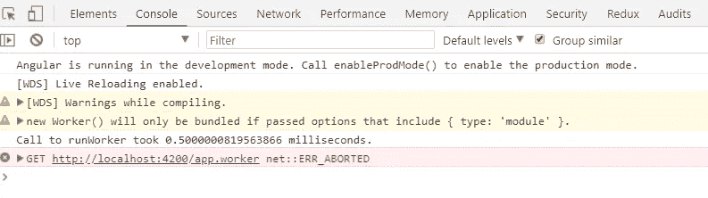

# 使用 Angular CLI 的网络工作者

> 原文：<https://levelup.gitconnected.com/web-workers-with-angular-cli-5791795989a8>

## 使用 [Angular CLI](https://cli.angular.io/) 构建 Web Worker 的简单方法指南，以及使用和不使用 Web Worker 的性能比较


照片由[黄川](https://unsplash.com/@transonhoang?utm_source=unsplash&utm_medium=referral&utm_content=creditCopyText)在 [Unsplash](https://unsplash.com/@transonhoang?utm_source=unsplash&utm_medium=referral&utm_content=creditCopyText) 拍摄

尽管 web 工作者已经存在了一段时间，但是前端工程师似乎避免在项目中使用他们。Angular 网站上有一些文档，但本文将展示如何生成工人，测试他们的性能，并展示他们的真实用例。有了这些知识，我希望你可以开始将它们集成到你现有的代码中。

更多类似的内容，请查看[https://betterfullstack.com](https://betterfullstack.com/stories/)

我们将在本文中做什么:

1.  基本的网络工作者知识
2.  如何使用 angular-cli 从头开始创建 web workers
3.  了解网络工作者的表现
4.  提供可以利用网络工作者的案例

## 基本的网络工作者知识

[Web Workers](https://developer.mozilla.org/en-US/docs/Web/API/Web_Workers_API) 允许你在后台线程中运行 CPU 密集型计算，释放主线程来更新用户界面。

如您所知，当我们在 HTML 页面上执行脚本时，页面将变得没有响应，直到脚本完成。在此期间，用户不能做任何事情——我们都经历过需要等待几秒钟才能完成复杂任务，然后应用程序才可用的痛苦。

Web 工作人员将把这些耗时超过 3 秒或 5 秒的复杂计算放在后台线程中，并允许用户继续他们的工作。

以下是我们在使用 web workers 时需要注意的几点:

1.  通过`new Worker(scriptURL, options)`创建一个[工人](https://developer.mozilla.org/en-US/docs/Web/API/Worker/Worker)。
2.  使用 [postMessage](https://developer.mozilla.org/en-US/docs/Web/API/Worker/postMessage) 作为将数据发送到工作器的方式或从工作器返回数据的方式，并在调用 [onmessage](https://developer.mozilla.org/en-US/docs/Web/API/Worker/onmessage) 的地方进行处理。
3.  使用 [onmessage](https://developer.mozilla.org/en-US/docs/Web/API/Worker/onmessage) 从 worker 获取结果。
4.  当您想要停止 web workers 并释放浏览器资源时，使用[终止](https://developer.mozilla.org/en-US/docs/Web/API/Worker/terminate)。

## 如何使用 angular-cli 创建 web worker

您可以在应用程序中的任何位置添加 web worker。如果包含您的昂贵计算的文件是`src/app/app.component.ts`，您可以使用这个命令添加一个 Web Worker。


运行此命令将:

a.配置您的项目以使用 Web Workers，如果还没有的话。

创建 tsconfig.worker.json

更新 tsconfig.app.json

更新 angular.json

b.创建 src/app/app.worker.ts

c.更新 src/app/app.component.ts


Angular CLI 会自动将此逻辑放在`app.component.ts`文件的底部。所以你需要把它移到一个组件里，再重构一次。

我们还有另一种 CLI 语法来创建 web workers:

```
ng generate webWorker <name>[options]
```

这里可以阅读更多[。](https://angular.io/cli/generate#webworker)

## 您可能在控制台中看到的常见错误

**"期望 2-3 个参数，但得到 1 个"**`postMessage`:据我目前的理解，web workers 似乎有两个版本。


应为 2-3 个参数，但得到了 1 个

一个来自 Visual Studio，我们需要提供三个参数，其中两个是必需的。然而，如果你看一下这个[文档](https://developer.mozilla.org/en-US/docs/Web/API/Worker/postMessage)，我们只有两个参数，并且只需要一个。

解决方法:在工人文件顶部添加`declare function postMessage(message:any): void;`。

**“期望 1 个参数，但得到 2 个”**为`new Worker`


应为 1 个参数，但得到了 2 个

这个问题也一样。但是根据这个[文件](https://developer.mozilla.org/en-US/docs/Web/API/Worker/Worker)，我们实际上有两个论点。

解决方法:无视就好。代码将运行，没有任何错误。

在文档中，他们没有提到什么是类型模块。从我的理解来说，我认为一个 web worker 只有在我们放`type: 'module'`的时候才会被放在文件的 bundle 里。如果浏览器看不到该工人，它将得到下面的错误。



获取[http://localhost:4200/app . worker](http://localhost:4200/app.worker)404(未找到)

注意:如果您没有看到警告，并且仍然得到关于`new Worker`的未找到问题，这意味着您必须再次重新运行服务器。

最后一个错误是`function() could not be cloned`。这是因为发送给服务人员的消息可以是任何结构化可克隆类型的**。说来话长，但是你可以阅读[这篇](https://stackoverflow.com/a/46145497/4344732)来了解更多。**

****

**无法克隆函数()**

**解决方案:不要将函数放在消息中来解决这个问题。**

**如果你发现任何问题，你可以在下面评论。我会更新文章。谢谢！**

## **网络工作者的表现**

**>在这里找到这个例子的源代码[。](https://github.com/hoangtranson/angular-webworker-sample)**

**性能始终至关重要。让我们来看看使用 web workers 可以获得什么样的收益。**

**我将比较单线程 JavaScript 和使用 web worker 进行复杂的计算来找出 10，000，000 中的质数。**

**首先，当点击线程按钮时看用户界面**

****

**用户点击 JavaScript 线程按钮**

**这会让你的浏览器挂起一段时间。在这种情况下，需要 210 秒。我是说将近 4 分钟你什么都不会，像个傻子一样坐在电脑前。请注意，在计算运行时，按钮保持按下状态。**

**在计算完成并且主线程被释放之后，这允许用户使用界面。你可以在下面看到结果。这个计算花了这么长时间。**

****

**计算结果 210 秒**

**现在，点击 Web Worker 按钮后查看 UI**

****

**用户单击 Web Worker 按钮**

**您可以立即看到 UI 在单击后立即做出响应，运行此计算的结果仅为 1 秒。计算将在后台运行，找到结果后将响应发送到接口。**

****

**完成计算后的结果**

**这是什么意思？使用 Web Worker 时的脚本编写时间远远少于我们通常做事的正常方式。**

## **网络工作者的使用案例**

**在我们理解了 web workers 的好处以及如何实现它们之后，接下来要做的事情就是找到它们可以应用的真实案例。以下是我认为网络工作者有益的几个例子:**

1.  **渐进式网络应用**
2.  **大型列表或数组的计算**
3.  **获取或缓存数据**
4.  **语法高亮显示或实时文本格式化**
5.  **拼写检查**
6.  **更新本地 web 数据库上的大量数据**
7.  **压缩或解压缩文件**
8.  **[图像过滤](https://www.html5rocks.com/en/tutorials/canvas/imagefilters/)**

**对于其他使用 Web Workers 的情况，您可以在下面进行评论。**

## **摘要**

**使用网络工作者并不难。这可能是执行消耗过多浏览器资源的复杂任务的关键解决方案。**

**我希望这篇文章对你有用！你可以在[媒体](https://medium.com/@transonhoang)上关注我。我也在[推特](https://twitter.com/transonhoang)上。欢迎在下面的评论中留下任何问题。我很乐意帮忙！**

**你可以在这里查看源代码。**

## **资源/参考资料**

**[1]:W3 学校的网络工作者[https://www.w3schools.com/html/html5_webworkers.asp](https://www.w3schools.com/html/html5_webworkers.asp)**

**[2]:使用 Web Workers[https://developer . Mozilla . org/en-US/docs/Web/API/Web _ Workers _ API/Using _ Web _ Workers](https://developer.mozilla.org/en-US/docs/Web/API/Web_Workers_API/Using_web_workers)**

**[3]:使用配有 Angular CLI[https://angular.io/guide/web-worker](https://angular.io/guide/web-worker)的网络工人**

**[4]:使用 JavaScript Web Workers 进行计算[https://johnresig.com/blog/web-workers/](https://johnresig.com/blog/web-workers/)**

**[5]:JavaScript 如何工作:Web Workers 的构建块+你应该使用它们的 5 种情况[https://blog . session stack . com/How-JavaScript-works-The-building-blocks-of-Web-Workers-5-cases-when-you-use-them-a547c 0757 f6a](https://blog.sessionstack.com/how-javascript-works-the-building-blocks-of-web-workers-5-cases-when-you-should-use-them-a547c0757f6a)**

**[](https://betterfullstack.com/stories/) [## 故事-更好的全栈

### 所有的故事故事为我们写指南提交故事到更好的编程博客 1。故事指南避免什么…

betterfullstack.com](https://betterfullstack.com/stories/)**