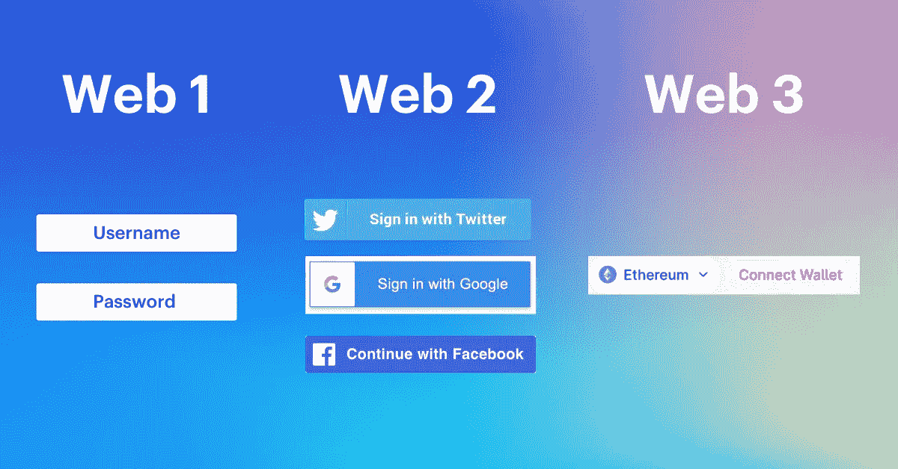
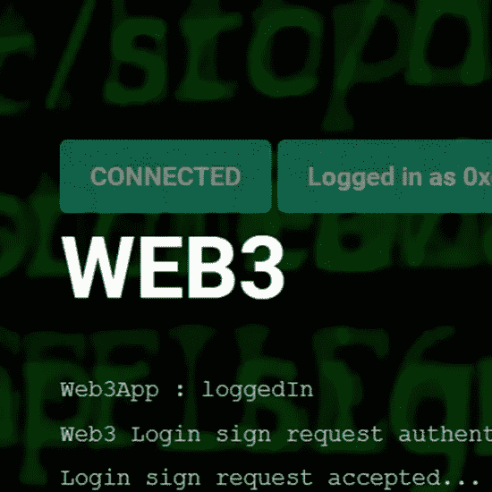
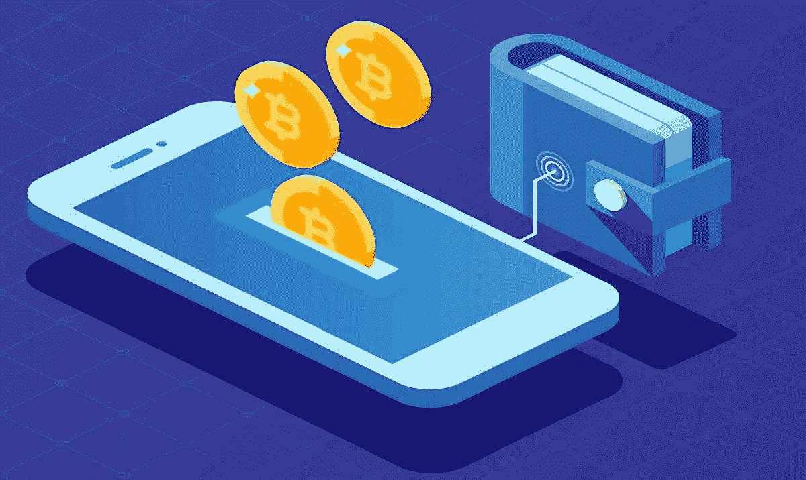
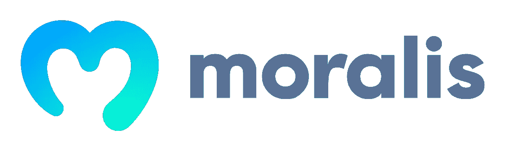
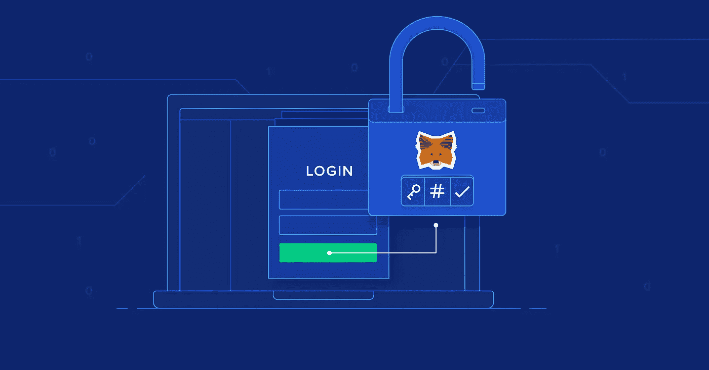
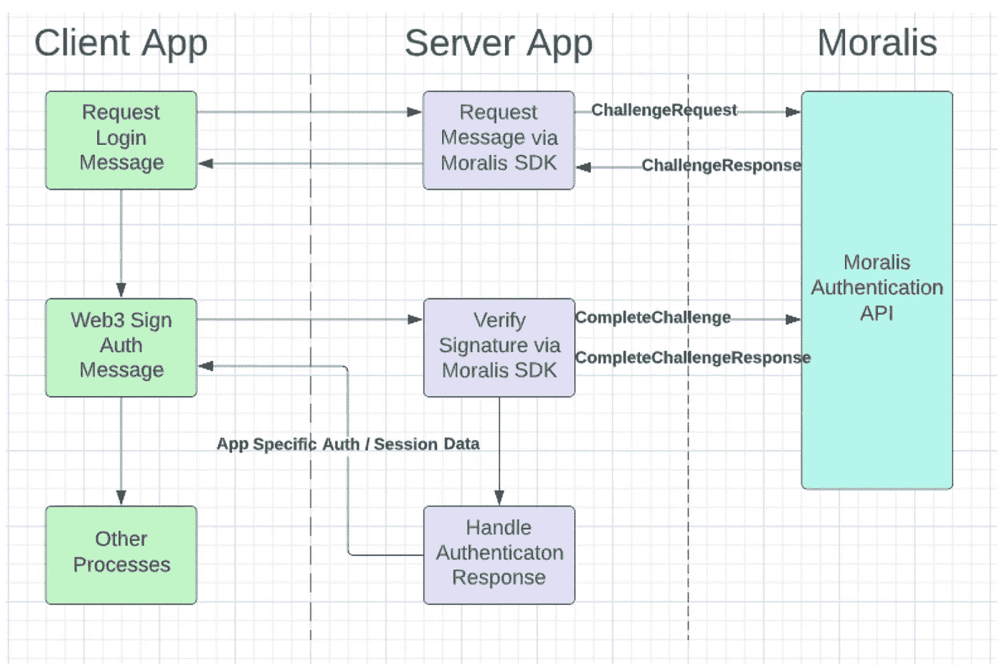

# React 应用中使用 Moralis 的 Web3 认证

> 原文：<https://levelup.gitconnected.com/web3-authentication-using-moralis-in-react-application-a0e4c295dcd2>

在构建[去中心化应用](https://www.investopedia.com/terms/d/decentralized-applications-dapps.asp) (dApps)时，Web3 认证真的很重要。因此，区块链开发人员必须知道如何构建 Web3 登录。我们将使用领先的 [Web 3.0](https://ethereum.org/en/web3/) 开发平台——[Moralis](https://moralis.io/?utm_source=blog&utm_medium=post&utm_campaign=How%2520to%2520Build%2520a%2520Web3%2520Login%2520in%25205%2520Steps)。

> 它可以被称为“密码的燃料库”

## 什么是 Web3 登录？

有时更好的说法是 Web3 身份验证。这些概念听起来可能很复杂，但幸运的是，在使用正确的工具时，我们不需要担心，这要归功于声誉良好的 [Web3 钱包](https://beincrypto.com/learn/web3-wallet/)。许多加密钱包现在以浏览器扩展和移动应用的形式出现，并提供用户友好的用户界面/UX。此外，虽然它们的主要功能可能是帮助用户处理和存储加密货币，但它们也可以用作 Web3 登录工具。Web3 认证是绝对必要的。如果不能让用户登录区块链，你的 Web3 应用很可能会失败。

简而言之，Web2 网站使用电子邮件和密码，而 Web3 应用程序使用用户的加密地址。

## 为什么我们需要 Web3 登录？

现在，我们知道 Web3 应用程序允许用户与区块链交互。因此，它们必须为用户提供连接到特定加密网络的安全方式。这就是一个合适的 Web3 登录解决方案所做的。认证成功后，用户可以与其他通过认证的用户和该网络的功能进行交互。因此，所有 dApps 都需要这种登录。

## 什么是 Web3 钱包？

Web3 钱包是进入 web3 空间的数字平台。它们类似于普通的加密钱包，允许用户存储、发送和接收加密货币。这包括从可替代到不可替代(NFTs)的所有令牌。其次，Web3 钱包也打开了密码世界的大门，允许我们与各种区块链上的 dApps 进行交互。

加密钱包通常具有非保管特性，这意味着作为钱包所有者的您可以存储数字资产，而不需要中间人。这意味着，作为用户，您可以完全控制您的所有资产，因为其他人无法访问您的令牌。然而，所有的责任都在你身上，也就是说，把私钥留给自己是至关重要的。一些最受欢迎的 web3 钱包有 MetaMask、TrustWallet、Argent 等。

## 让我们来谈谈道德:

Moralis 是一款可以让你非常快速地构建跨链 [dApps](https://www.investopedia.com/terms/d/decentralized-applications-dapps.asp) (去中心化应用)的软件。

根据他们的[官方文件](https://moralis.io):

> Moralis 为构建高性能 dapps 提供 API、SDK 和数据。将 Web3 集成到任何技术堆栈中。

Moralis 为开发高性能 dApps 提供了单一的工作流程。您首选的 web3 工具和服务与 Moralis 完全兼容。

它有几个优点:

*   Moralis 是在以太坊、BSC、Polygon、Solana、埃尔隆德等平台上创建和部署分散式应用程序(dApps)的最快方法。
*   默认情况下，所有道德 dApps 都是[交叉链](https://www.blockchain-council.org/blockchain/blockchain-interoperability/)。Moralis 确保您的 dApp 经得起未来考验。你的 dApp 可以在任何链上工作，即使创造了额外的区块链。
*   无论您是初学者还是有经验的开发人员，Moralis 都可以让您更容易地建立、维护和发展您的区块链应用程序。

## 如何将元掩码用于一键式登录解决方案:

[MetaMask](https://metamask.io/) 是一个浏览器插件，可作为 [MetaMask Chrome 扩展](https://chrome.google.com/webstore/detail/metamask/nkbihfbeogaeaoehlefnkodbefgpgknn)或 [Firefox 插件](https://addons.mozilla.org/en-US/firefox/addon/ether-metamask/)使用。在其核心，它充当一个以太坊钱包:通过安装它，我们将获得一个唯一的以太坊公共地址，通过它我们可以开始发送和接收以太或令牌。

作为一个浏览器扩展，它可以与您正在浏览的当前网页进行交互。它通过在我们访问的每个网页中注入一个名为 [web3.js](https://github.com/ethereum/web3.js/) 的 JavaScript 库来做到这一点。一旦注入，`web3`对象将通过该网站的 JavaScript 代码中的`window.web3`可用。如果我们安装了 MetaMask，我们可以在 Chrome 或 Firefox DevTools 控制台中输入`window.web3`来看看这个对象的样子。

Web3.js 是以太坊区块链的 JavaScript 接口。它可以执行的功能有:

*   获取链的最新块
*   检查元掩码上的当前活动帐户
*   获取任何帐户的余额
*   发送交易记录
*   用当前帐户的私钥签署邮件
*   还有更多…

## 实际工作原理:

1.  您的客户请求进行登录质询
2.  您的服务器从 Moralis Auth API 请求一个质询，并将其传递给客户端
3.  客户端对消息进行签名，并将其传递给服务器进行验证
4.  您的服务器使用 Moralis 验证挑战

## 详细的图形解释:

参赛:https://docs.moralis.io/reference/auth-api-overview

## 摘要

在这篇文章中，我试图解释 Web3 如何充当通往加密世界的门户。现在我们确切地知道了如何使用诸如 MetaMask 之类的工具来实现认证系统，所以我们准备创建一些令人敬畏的 dApps。

运行代码可在 https://github.com/mansern/moralis-web3-authentication[获得](https://github.com/mansern/moralis-web3-authentication)

学到了新东西？评论和反馈总能让作者开心。编码快乐！