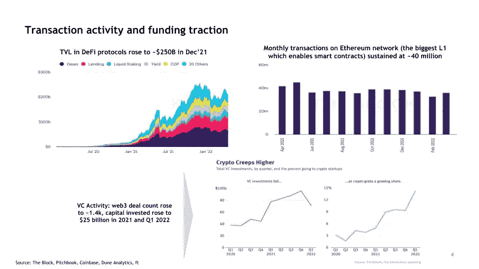

# web3 基础设施投资主题

> 原文：<https://levelup.gitconnected.com/web3-infrastructure-investment-themes-1b51a99e8be3>

在过去的一年里，我花了很多时间在 web3 和 DeFi 中挖掘主题，深入兔子洞，并对几位初创公司创始人、风投和学者进行了一手和二手研究。在这里，我提炼了 web3 的基础设施，并确定了构建和投资主题。

从 2020 年到 2022 年的 Q1，加密货币和智能合约应用达到了新的高度。“web3”已经出现，这是一个无信任、无许可和去中心化的互联网，利用了区块链技术:支撑 DeFi、NFTs、Dao 的一切，甚至可能是“元宇宙”。

受消费者采用和机构兴趣增加的驱动，web3 背后的基础设施是一个引人注目的空间。开发人员需要的基础设施、工具、安全性和数据，使 crypto 和 web3 蓬勃发展，这对生态系统的发展至关重要。

*感谢阅读！我错过了什么？我很想收到你的来信——我可以通过*[*【LinkedIn】*](https://www.linkedin.com/in/swatibhatia/)*和*[*Twitter*](https://twitter.com/swati1606)*联系到你。*

我写科技、投资和行为方面的文章，在科技、投资和咨询领域拥有非常丰富的全球经验。我目前在沃顿商学院。