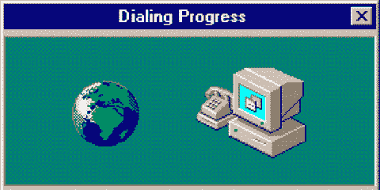
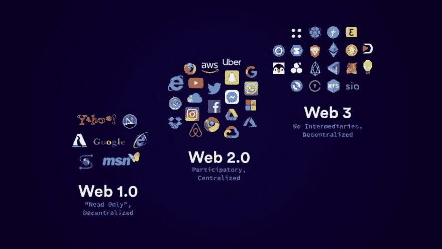
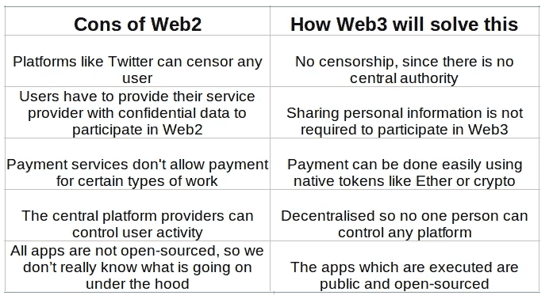

# Web3 是我们实现更好、更安全的互联网的机会 Web 的进化

> 原文：<https://levelup.gitconnected.com/web3-is-our-opportunity-for-a-better-and-safer-internet-evolution-of-web-f9b4643552df>

# 网络的演变

我们今天使用的网络是它多年进化的结果，就像“罗马不是一天建成的”，互联网也是如此。大多数人倾向于将这一演变分为 3 个阶段——**Web 1.0**、 **Web 2.0** 和 **Web 3.0**

这些阶段中的每一个都是上一个阶段的升级版，但也有自己的一系列问题，这些问题很可能在下一个阶段得到解决——很明显是这样的！毕竟，没有解决以前问题的进化不是真正的升级。

## 那么我们如何准确地将这些阶段分类—

# 网络 1—(20 世纪 80 年代末至 21 世纪初)

这是网络的第一次迭代，用户主要是互联网上信息的消费者。Web1 只包含**个静态网站**，它们是**只读的**。这些网站根本不是交互式的，并且是使用文件系统托管的。

# web 2—(2000 年代中期至今)

我们今天使用的网络是 Web2。它非常具有互动性和社会性。 **CRUD(代表创建读取更新删除)**操作是所有网站的基础。有些应用和服务让任何人都可以轻松地表达自己的观点，并与世界上的每个人分享。

Web2 之所以伟大，是因为它让资源共享变得如此简单。显然，这种**“资源共享”**是通过中介服务实现的。消费者使用这些服务提供商提供的平台(如 Twitter、脸书、苹果等。)来分享信息。人们不得不**信任这些服务**，因为信息是由这些服务提供商存储的。Web 2 也出现了几起**数据泄露**，发生在消费者的存储数据上。用户不得不向平台提供商(如脸书、youtube)放弃他们的私人信息。此外，如果他们愿意，这些平台提供商可以审查某些用户。

显而易见，共享信息的大部分权力由这些平台提供商的中央权威机构控制。

# 什么是 Web3？

Web3 是一个高度去中心化的版本。它有潜力提供一个平台，没有一个实体可以控制，但可以被每个人信任，因为每个人都将遵循同样的规则，被称为**共识协议**。它将与比特币和以太坊区块链目前的分散网络一样工作。

> 要了解去中心化网络和区块链是如何工作的，请参考我之前关于区块链的博客。:[https://www . thegeekyminds . com/post/what-are-crypto-wallet-exploring-web 3](https://www.thegeekyminds.com/post/what-are-crypto-wallets-exploring-web3)

Web3 的有趣之处在于，它所执行的一切都是开源的，世界上的任何人都可以访问。

如前所述，Web3 应用将建立在区块链的分散网络上。这些应用通常被称为 **dapps-** ，代表 **d** 去中心化**应用**。

> 如果你喜欢我的博客，你可以点击下面的按钮或者点击下面的链接[https://www.buymeacoffee.com/gouravdhar](https://www.buymeacoffee.com/gouravdhar)给我买杯咖啡

现在进入主要问题。

# 那么，Web3 将如何让互联网变得更好呢？

列出 Web2 的缺点以及 Web3 将如何解决它们

# Web3 的主要特性

*   **开放:**所有的应用都将开源
*   **无信任:**用户在共享内容时，不需要信任任何中央机构进行数据传输或通信
*   **无权限:**由于它是分散的，任何机构甚至政府这样的中央机构都不能禁止、检查或操纵以任何方式共享的数据。
*   语义网和人工智能: Web3 通常被称为语义网，因为应用程序将有能力理解共享内容的意义和情感。AI(人工智能)领域快速发展的技术将使这成为可能。我认为我们已经处于非常有利的位置。看看谷歌在 2022 年谷歌输入输出大会上展示的新项目。
*   **增强现实:**可以使用 AR 护目镜和其他外部设备体验的增强现实已经是一项正在进行的工作，并将成为 Web3 的关键部分。随着 Meta(前脸书)宣布元宇宙，似乎增强的虚拟聚会将在 Web3 中非常普遍。许多组织已经开始为这个元宇宙空间创建应用程序。

# Web3 中的挑战

尽管有这么多好处，但 Web3 目前仍有一些局限性:

*   **可伸缩性** — Web3 是分散的，因此事务较慢，因为它们需要由挖掘器处理
*   **UX/可访问性** —与 web3 应用程序交互需要额外的步骤、软件和教育。现代网络浏览器缺乏集成，使得大多数用户不太容易访问 web3。
*   **昂贵** —在 web3 上部署 dapps 是一个成本高昂的过程

> 这里邀请您探索我们的博客平台 [**极客头脑**](https://www.thegeekyminds.com/) 。一个让您了解软件开发和技术领域最新发展的一站式平台。我们在 [**的极客头脑**](https://www.thegeekyminds.com/) 旨在写一些你实际上可以用来提高工作效率和充实你的职业生活的内容。
> 
> 邀请您在[**https://thegeekyminds.com**](https://thegeekyminds.com/)通过我们的平台。并订阅我们的时事通讯，以便在我们每次发布新帖子时收到电子邮件。我们承诺不会向您的收件箱发送垃圾邮件。点击下面的按钮订阅我们的时事通讯

