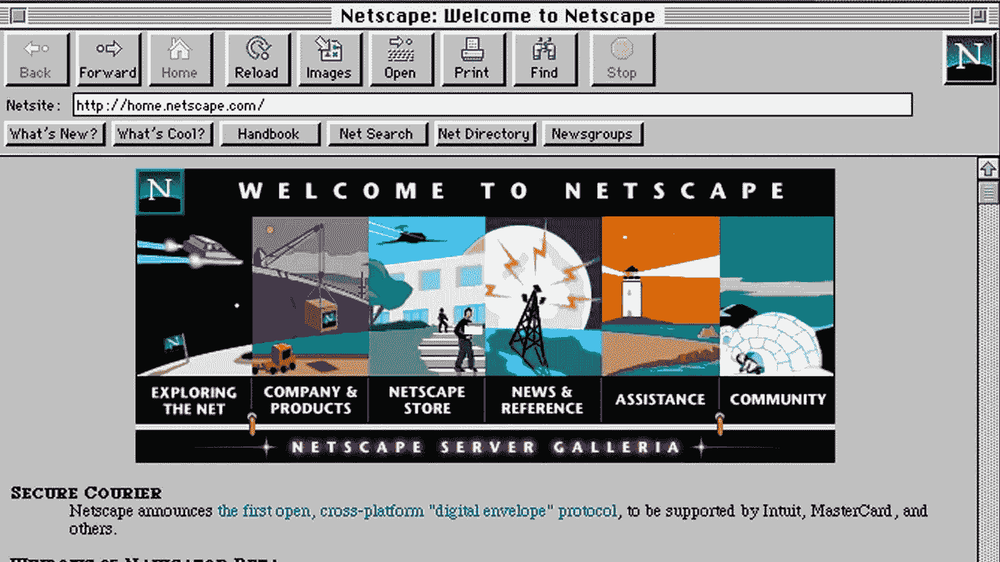
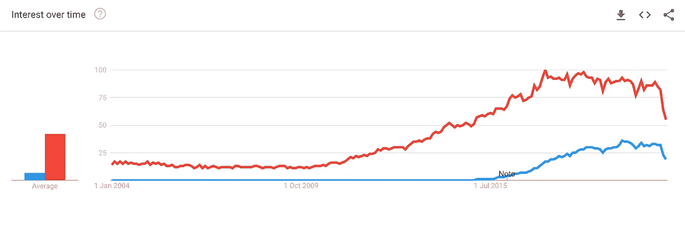
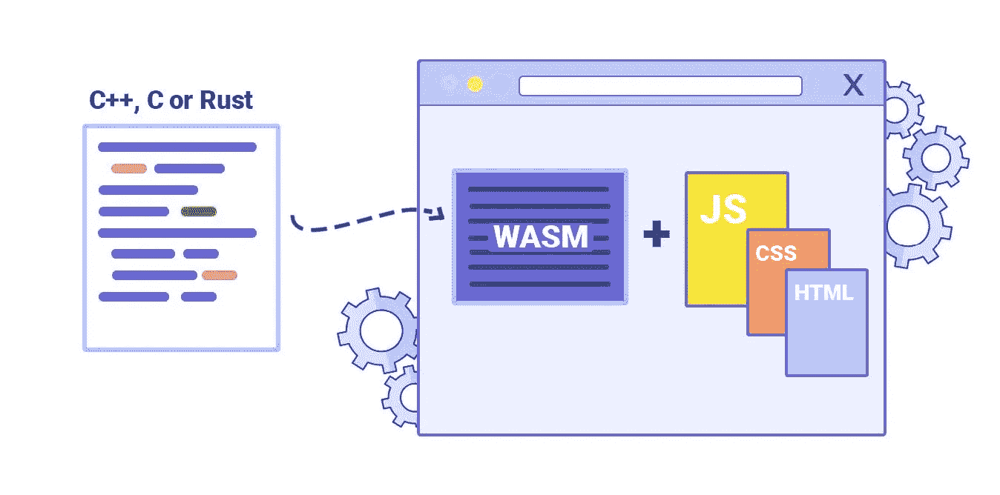
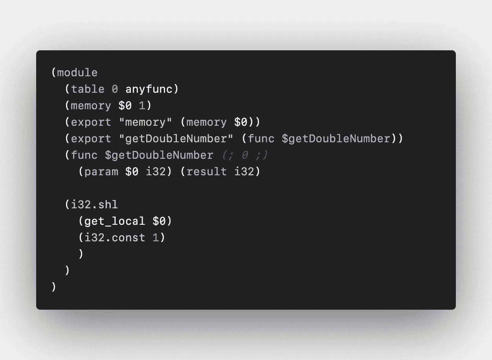
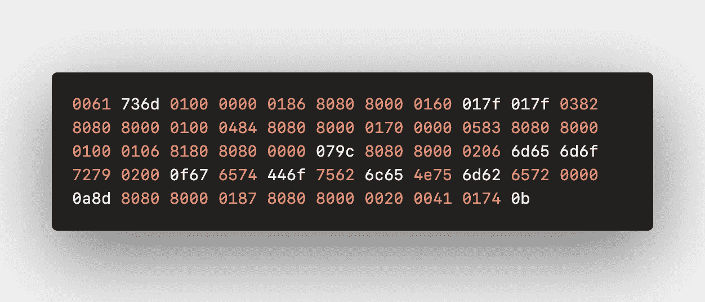
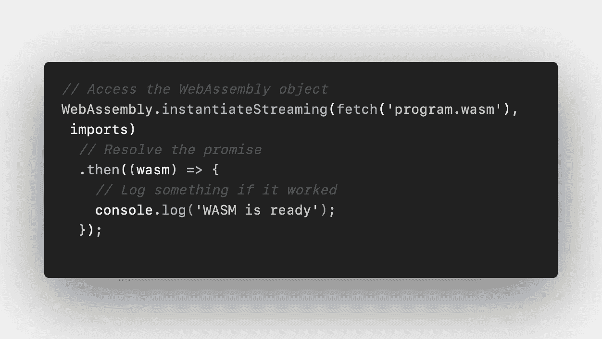
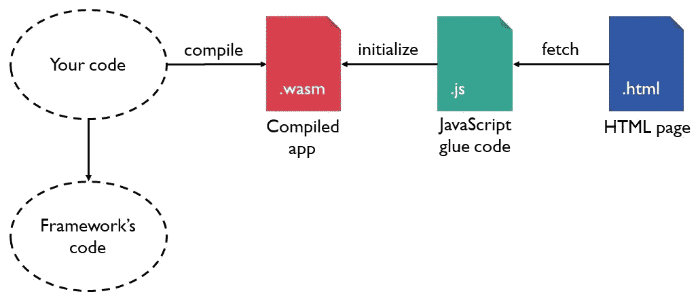

# WebAssembly 和霍格沃茨的巫师

> 原文：<https://levelup.gitconnected.com/webassembly-and-the-wizards-of-hogwarts-bd7c09e5cadf>

在 web 开发领域有一种新的类型:WebAssembly。它速度快，可移植，受大公司支持，应该能使万维网成为现存最大的软件平台。不管你是经验丰富的软件架构师还是前端开发人员，每个人都可以从 WebAssembly 的存在中获益。

在本文中，我们将了解什么是 WebAssembly，它是如何工作的，以及它如何与它的兄弟 JavaScript 一起工作。

图 1:《哈利·波特》穿黑色夹克的造型(Unsplash，2018)。

# 1.介绍

2015 年 6 月 17 日，JavaScript 的发明者 Brendan Eich 以及 Mozilla、Chromium、Edge 和 WebKit 背后的团队展示了一种新的浏览器标准:WebAssembly，这是一种可移植的高效字节码编译目标，适用于 C++和 Rust 等高级语言(Eich，2015)。

然而，这意味着什么呢？WebAssembly 首先应该存在的理由是什么？JavaScript 开发者现在应该担心吗？还有霍格沃茨的巫师和这有什么关系？

# 2.那时的网络发展

图 2:网景起始页截图(截图，[https://www.npr.org](https://www.npr.org/))。

回到你可以称自己为 web 开发人员的时候，因为你只懂 HTML，web 开发本身是一个相当缺乏互动和静态的业务领域。网景通信公司(Netscape Communications)是建立了我们今天所知的万维网的老牌公司之一，它很快意识到网站缺乏交互性和动态性(Cassel，2018)。他们希望 web 成为一种新形式的分布式操作系统，而不仅仅是计算机上一个简单的 HTML 文档访问应用程序。

网景通信公司的创始人马克·安德森提出，HTML 需要某种易于理解的“脚本语言”——可以直接粘贴到标记中的语言。这是一种容易被不希望处理编译器错误或严格类型语法的新手程序员使用的语言。

这就是他们雇佣经验丰富的编程语言和网络代码开发人员 Brendan Eich 的原因。Brendan 的第一个任务是在 10 天内完成一个几乎无法实现的目标——为 web 创建这样一种脚本语言。他们(后来)称之为:JavaScript (Severance，2012)。

# 3.JavaScript 的命运

我不需要深究 web 的历史，就可以向您展示当今 web 技术标准的一个关键痛点:JavaScript 是供浏览器解释的脚本语言。我再重复一遍: *JavaScript 是供浏览器解读*的脚本语言——而不是某种花哨的多范式系统编程语言，它关注的是速度、安全性或代码可维护性。它应该被设计成一种易于理解的动态脚本语言，为你的网站提供一些很酷的 DOM 操作和装饰性的动画。然而，看看发生了什么:

> "任何可以用 JavaScript 编写的应用程序，最终都会用 JavaScript 编写."

杰夫·阿特伍德(Stack Exchange 的联合创始人)的一句话，通常被称为阿特伍德定律(阿特伍德，2007)。自从像 NodeJS 或 React Native 这样的框架被广泛使用以来，JavaScript 的可能性已经超越了仅仅存在于浏览器客户端的边界。几乎无处不在。

此外，NodeJS 的 NPM 软件包管理器是目前最突出和最活跃的软件包注册平台。举个例子:2018 年 5 月 10 日至 5 月 17 日，JavaScript 开发者从 NPM 注册表下载了 52 亿个 NodeJS 包，创下新纪录(npm Inc .，2018)。

图 3:关于 NodeJS 和 React Native 的谷歌趋势曲线(截图，【https://trends.google.com】)。

# 4.背叛的阿特伍德定律

关于如何学习 JavaScript，有成千上万的课程、书籍和教程。每个计算机相关的学校都会时不时地教授 JavaScript。几乎每个人都可以在任何地方用最少的努力学会它。如果你在谷歌上搜索“学习 JavaScript”，你会得到 222000000 个搜索结果。相比之下:当你搜索“学习 Java”时，你会得到 305，000，000 个结果。

不过，这是好事吗？一种最初的轻量级脚本语言能够统治计算 web 开发的世界吗？我的观点是:不，不是这样的，我相信 JavaScript 不会像几乎所有人声称的那样有一个光明的未来。让我用一个哈利波特的类比来解释一下:

# 5.进入霍格沃茨的麻瓜

你知道看着前端开发者简单学了 NodeJS 就自称“全栈软件开发者”是什么感觉吗？这感觉就像麻瓜进入霍格沃茨——一所充满巫师的学校。只是在我们的例子中，这些奇才是训练有素的软件工程师和计算机科学家。这些人学习所有核心实现的算法和编译器、编程语言和操作系统。他们确切地知道如何构建软件(may，2011)。

> 前端开发人员知道如何编写实际的软件吗？我想说我们最好不要谈论它。

麻瓜不会被邀请到霍格沃茨，因为他们没有魔法能力。前端开发人员也没有被“邀请”参加软件工程，因为他们甚至不能用他们知道的语言做一些事情。然而，现在——多亏了所有跨平台的 JavaScript 运行时——它们突然在这里变魔术了。但是想象一下，如果霍格沃茨的巫师，我们亲爱的软件工程师和计算机科学家，能够在现实世界中表演魔法——或者我们的情况:前端，会怎么样？会发生什么？什么会出错？

# 6.WebAssembly 向世界问好

图 WebAssembly 模块如何交付的图示(截图，[https://blog.logrocket.com](https://blog.logrocket.com/))。

WebAssembly 是 web 开发行业的新玩家。它很快，很小，不可读，甚至不是真正的编程语言。是的，你没听错。你真的不能在 WebAssembly 中编码(Rourke，2018)。所以我可能会听到你问:为什么我们都应该为此感到兴奋？嗯，如前所述，它是高级语言的编译字节格式目标。你用 C 或 C++这样的高级语言编写代码，然后编译成 WebAssembly。神奇的是:它在浏览器中工作，而且超级快——有时比 JavaScript 快 5 到 20 倍左右(Aboukhalil，2019)。

# 7.简而言之，WebAssembly

受够了营销人员。“WebAssembly”这一术语背后的真实面目并不像它所推销的那样千篇一律。WebAssembly 本身只是工作流和概念的更大技术链的一部分。对于交付超高速 web 应用程序来说，还有其他几个重要的关键组件。了解它当前的局限性以及它对哪些用例是最好的也是很好的。但首先，让我向您介绍五个关键组件:

## 7.1 WAT — WebAssembly 文本格式

这是一种人类可读的文件格式，当你编译你的 C，C++或 Rust 代码时，你会得到它。它表示来自编程语言源代码的抽象语法树(AST)。AST——或者在 WebAssembly 的情况下:. wat 文件——可能很冗长，但是它在描述源代码组件方面做得很好。在 AST 中表示源代码使得验证和编译简单而高效。下面是一个用 C 写的简单的返回函数，名为 *getDoubleNumber* :

图 5:c 中的代码示例。

如果您编译这个 C 代码，它将返回一个. wat 文件，其中包含我们的 *getDoubleNumber* 函数的抽象语法树。看起来是这样的:

图 6:上面编译成 WebAssembly 文本格式的代码示例。

## 7.2 WASM — WebAssembly 二进制指令格式

在生产过程中，您可能不会将文本指令格式文件发送到客户端。您将只发送二进制指令格式(。wasm)。这是实际的低字节格式文件，用不可读的十六进制代码编写。通常，它们被称为 WebAssembly 模块(Mozilla Foundation，2019)。下面是上面的 *getDoubleNumber* C 函数的例子:

图 7:上面编译成 WebAssembly 二进制指令格式的代码示例。

## 7.3 WASM 模块实例化

如果您想在您的网站中访问 C 代码，您需要实例化 WebAssembly。JavaScript 中的 wat 模块。这看起来像这样:

图 8:实例化。JavaScript 中的 wasm 模块。

## 7.4 WebAssembly 编译

为了得到一个. wasm 或者。wat 文件，你首先需要编译你的源代码。对于不同的语言已经有了不同的编译器。最常见的一种，也是最著名的一种，叫做:Emscripten。Emscripten 被描述为所谓的 LLVM 源到源编译器，主要专注于将 C 代码直接编译为 JavaScript 的子集 asm.js。然而，最近 WebAssembly 的兴起促使 Emscripten 背后的团队转移其重点，以帮助使 WebAssembly 更易于访问和入门。然后，您可以在命令行界面中访问 Emscripten 编译器，轻松编译选定的源代码。

## 7.5 原始源代码

要编写高效的软件并编译成 WebAssembly，你需要精通 C、C++或者相当新的 Rust 编程语言。WebAssembly 工作组计划在不久的将来添加更多的语言。但是，现在他们的路线图上有其他优先事项和后续步骤。他们特别关注 WebAssembly 最大的痛点。

# 8.棘手问题和局限性

WebAssembly 工作流听起来好得令人难以置信，不是吗？只需用高级语言编写代码，通过 Emscripten 编译它，然后在 JavaScript 中实例化它——就这么简单。不，不是的。尽管没有垃圾收集器或异常处理程序，但将你的桌面类应用程序轻松移植到 web 仍然存在一些巨大的痛点(WebAssembly Working Group，2019)。现在最大的痛点无疑是缺少 web APIs。让我给你一个简单的用例:假设你想要一个 C++代码，它可以监听用户点击一个按钮，然后将数据库中的一些数据呈现到客户端 DOM 视图中。

嗯，我必须让你失望，这是行不通的，因为 WebAssembly 不能访问 DOM API。访问它的唯一方式是通过 JavaScript。如果你想开发真正的 WebAssembly 就绪的客户端软件，你需要编写某种 JavaScript 粘合代码(Mihaylov，2018)，作为 WASM 模块和客户端 HTML 页面之间的异步桥梁。

图 WebAssembly 如何与 JavaScript 协同工作的图示(截图， [https://boyan.io](https://boyan.io/) )。

# 9.当前最佳用例

目前，在这些情况下，WebAssembly 的最佳用例只能是在 HTML5 canvas 元素内进行图形渲染的大量数学计算。这是因为 canvas 元素是唯一可以在不访问 DOM 的情况下创建图形用户界面的地方。对于很多人来说，这听起来没什么意思，但至少对于游戏行业来说，这是非常有前途的。由于游戏依赖于繁重的着色器计算和模拟，将 WebAssembly 编译到画布中非常有意义。这就是为什么 Epic Games 在浏览器内部展示了一个编译的虚幻引擎 C++高分辨率游戏。目前，与高保真图形或模拟相关的一切都最适合 WebAssembly——但对于其他仍然需要访问或操作 DOM 的一切:在 web assembly 和 JavaScript 之间使用胶水代码混合。

# 10.粘合代码

但是等等，这听起来很耳熟？胶水代码？这不正是 JavaScript 最初的目的吗？嗯，是的，它是。然而，由于 WebAssembly 工作组正在积极开发官方的 DOM API (Mozilla Foundation，2019)，JavaScript 的主要目的是什么呢？如果我们很快就能用一种高级语言创建非常高效的全栈 web 应用程序，那么在不久的将来我们真的需要 JavaScript 吗？

嗯，我们不知道，你不可能一夜之间杀死一个拥有数百万开发者的整个生态系统。这对 PHP 不起作用，对 JavaScript 也不起作用。然而，不同的人有不同的预测。此外，这是我对未来的预测:

# 11.WebAssembly 的未来

由于对软件开发和计算机科学有深入了解的人——也就是我们霍格沃茨的巫师——很快就有能力将他们的能力移植到客户端，我们很可能会看到一个我们今天所知的万维网的全新时代。网景通信公司最初将网络视为分布式操作系统的设想最终可能成为现实。原生应用程序以及它们的应用程序商店正在灭绝，像 Adobe 和 Autodesk 这样的软件包将完全在浏览器中运行。网络将把它目前的边界远远扩展到我们现在定义的信息和娱乐产业的中心。

在不久的将来，JavaScript 仍将是一个必不可少的角色，但不会像今天这样重要。它将作为一个简单的脚本语言，为您的网站提供一些动态内容，并创建一些很酷的动画。

> JavaScript 的定位很可能会像它最初被创建时一样，WebAssembly 将作为浏览器的二进制格式来完成所有类似软件的繁重工作。

但是，尽管有这些预测，还是有一些先驱用 WebAssembly 创建了一些现实生活中的用例:

# 12.WebAssembly 的真实用例

## 12.1 Figma —基于浏览器的界面设计工具

他们最初用 C++编写 Figma，并使用从 C++到 ASM . js(web assembly 的前身之一)的交叉编译器。在所有主流浏览器显著采用 WebAssembly 之后，他们抓住机会进行了转换。打开设计文档的加载时间缩短了三倍多。

 [## Figma 由 WebAssembly 提供支持

### 因为我们的产品是用 C++编写的，可以很容易地编译成 WebAssembly，所以 Figma 是一个完美的演示…

www.figma.com](https://www.figma.com/blog/webassembly-cut-figmas-load-time-by-3x/) 

## 12.2 Autodesk AutoCAD — CAD 绘图软件

比万维网本身还要古老的 AutoCAD 原始代码库已经被编译成 WebAssembly，并作为 web 应用程序放到了互联网上。

 [## 综述:谷歌 I/O 2018 上的 AutoCAD Web 应用| AutoCAD 博客| Autodesk

### 您试用过新的 AutoCAD web 应用程序吗？无需安装，您可以在任何地方编辑您的绘图…

blogs.autodesk.com](https://blogs.autodesk.com/autocad/autocad-web-app-google-io-2018/) 

## 13.3 易贝-条形码扫描仪

两年前，易贝背后的团队编写了一个 JavaScript 条形码扫描仪的早期版本——但它只在 20%的时间里工作。他们用 C++完全重建了它，编译成 WebAssembly，在。wasm 模块，并使它成为一个工作的东西。

 [## 易贝的网络组装:一个真实的使用案例

### 从宣布之时起，WebAssembly 就在前端世界引起了巨大的轰动。网络社区随时…

tech.ebayinc.com](https://tech.ebayinc.com/engineering/webassembly-at-ebay-a-real-world-use-case/) 

# 文献学

Aboukhalil，R. (2019)“我们如何使用 WebAssembly 将我们的 Web 应用程序加速 20 倍(案例研究)” *Smashing Magazine* 【在线】可在[https://www . smashingmagazine . com/2019/04/Web assembly-Speed-We b-App](https://www.smashingmagazine.com/2019/04/webassembly-speed-web-app)(2021 年 2 月 8 日访问)

阿特伍德，J. (2007)“最小功率原理”*编码恐怖*【在线】可在[https://blog.codinghorror.com/the-principle-of-least-power](https://blog.codinghorror.com/the-principle-of-least-power)(2021 年 2 月 8 日访问)

Cassel，d .(2018)“Brendan Eich 在 10 天内创建 JavaScript，以及他今天会有什么不同”*新堆栈*【在线】可在[https://thenewstack . io/Brendan-Eich-on-Creating-JavaScript-in-10-Days-and-What-hed-Do-Differently-Today](https://thenewstack.io/brendan-eich-on-creating-javascript-in-10-days-and-what-hed-do-differently-today/)(于 2021 年 2 月 8 日访问)

Eich，B. (2015 年)“摘自 ASM。JS to web assembly "*Brendan Eich 博客*【在线】可在 https://brendaneich.com/2015/06/from-asm-js-to-webassembly(2021 年 2 月 8 日访问)

may，M. (2011)“每个计算机科学专业学生都应该知道的事情”*Matt may 博客*【在线】可在[http://matt.might.net/articles/what-cs-majors-should-know](http://matt.might.net/articles/what-cs-majors-should-know)(2021 年 2 月 8 日访问)

米哈伊洛夫，b .(2018)“web assembly 如何影响现有的 JavaScript 框架”*伯颜·米哈伊洛夫博客*【在线】可在[https://boyan . io/How-web assembly-influences-existing-JavaScript-frameworks](https://boyan.io/how-webassembly-influences-existing-javascript-frameworks)查阅(2021 年 2 月 8 日查阅)

Mozilla 基金会(2019)“web assembly。模块" *MDN JavaScript* 【在线】可从[https://developer . Mozilla . org/en-US/docs/Web/JavaScript/Reference/Global _ Objects/Web assembly/Module](https://developer.mozilla.org/en-US/docs/Web/JavaScript/Reference/Global_Objects/WebAssembly/Module)(2021 年 2 月 8 日访问)

Mozilla 基金会(2019)“什么是 WebAssembly？” *MDN WebAssembly* 【在线】可在[https://developer . Mozilla . org/en-US/docs/web assembly/Concepts](https://developer.mozilla.org/en-US/docs/WebAssembly/Concepts)(2021 年 2 月 8 日访问)

npm Inc. (2018)“你对你的 npm 琐事了解多少？” *Jaxcenter* 【在线】可在[https://jaxenter.com/npm-trivia-144846.html](https://jaxenter.com/npm-trivia-144846.html)获得(2021 年 2 月 8 日获得)

Rourke，M. (2018)“学习 WebAssembly:使用 Wasm 和 C/C++，构建具有本机性能的 Web 应用程序”，伯明翰: *Packt Publishing* ，第 32 页

Severance，c .(2012)《JavaScript:在 10 天内设计一门语言》*计算机 45* (2)，第 7–8 页，DOI: 10.1109/MC.2012.57，印刷版 ISSN:0018–9162，电子版 ISSN:1558–0814

WebAssembly 工作组(2019)“MVP 之后增加的功能” *WebAssembly 路线图*【在线】可在[https://webassembly.org/roadmap](https://webassembly.org/roadmap)获得(2021 年 2 月 8 日访问)