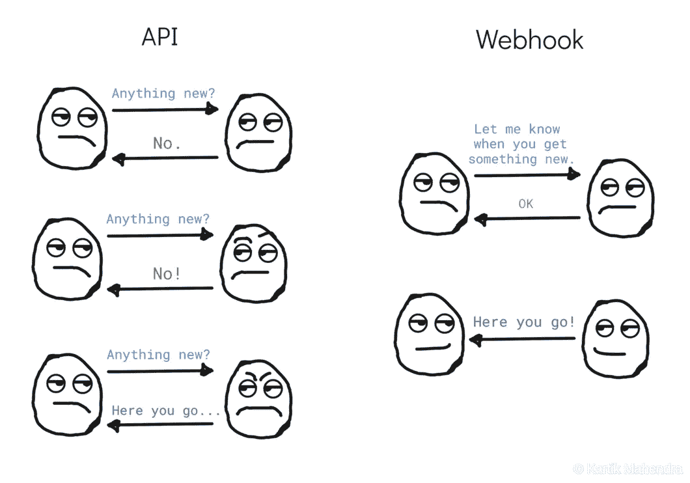

# Webhooks

> 原文：<https://levelup.gitconnected.com/webhooks-82e50720abd2>

## 关于 Webhooks、Webhooks 与 API、Webhook 集成和安全性的常见问题



API VS Webhook

# 内容

*   什么是 webhook？
*   [Webhooks 听起来很像 API。它们是一样的吗？](#4736)
*   [我什么时候用 webhooks 代替 API？](#5a6c)
*   因为 webhooks 需要更少的资源，我要用 webhooks 替换 API 吗？
*   [如何集成 webhooks？](#fce8)
*   [为什么贴？](#e9b5)
*   【webhook 数据是什么样子的？
*   webhooks 安全吗？

# 什么是 webhook？

webhook 是一种 [push](https://en.wikipedia.org/wiki/Push_technology) 通信方法，当源端发生事件时，它将数据中继到目标应用程序。设置完成后，webhook 支持两个应用程序之间的自动数据交换。

请注意:

*   Webhook 也称为反向 API、web 回调或 HTTP 推送 API。
*   提供 webhook 集成的平台称为 Webhook 提供者或发送者。
*   消费 Webhook 提供者数据的应用程序称为 Webhook 消费者或订户。

# Webhooks 听起来很像 API。它们是一样的吗？

不会。API 和 webhook 都支持应用程序之间的数据交换，但驱动数据交换的原理是不同的——API 是基于请求的( [pull](https://en.wikipedia.org/wiki/Pull_technology) )，而 web hook 是基于事件的(push)。

考虑一家服装店。一个 API 是你去商店查看你最喜欢的 t 恤是否有货。网钩是商店职员打电话通知你 t 恤有货的时候。因此，当事件发生时，商店会通知您，而不是从商店请求信息。

# 什么时候我应该使用 webhooks 而不是 API？

与 API 相比，webhooks 节省了时间和资源，因为它们:

*   根据事件给出信息。
*   不要经常检查新数据。
*   保持单向数据流——web hooks 不需要请求来发送数据。

因此，webhooks 的几个用例是:

*   任何需要实时数据或基于事件的单向数据的应用程序。
    例如，当有人进入或离开房间时，跟踪房间占用情况的应用程序需要实时更新。
*   当内容发生变化时，启动 CI/CD 管道来部署您的网站。
*   将数据库与第三方平台同步。例如，当用户订阅你的活动时，营销自动化平台 Mailchimp 会发送 webhook 通知。然后，您可以用新的用户详细信息更新您的数据库。

# 因为 webhooks 需要更少的资源，我用 webhooks 代替 API 吗？

不会。API 很有用，因为:

*   并非所有服务都支持 webhook 集成。
*   您需要一个 API 来根据 webhook 数据进行更改。例如，在收到 Mailchimp 的 webhook 用户订阅通知后，您将需要 API 来:
    a)使用 [Mailchimp 列表/受众 API 端点](https://mailchimp.com/developer/marketing/api/list-members/get-member-info/)获取用户详细信息 b)更改您的数据库，使其与 Mailchimp 保持同步。
*   并非所有的应用程序都与单个事件有关。
    例如，如果您的应用程序跟踪股票价格的每日变化，您只需要收盘价(API 调用)而不需要全天的个别价格变化(webhooks)。
*   Webhooks 包含与事件相关的最少数据。你会在平台的 API 中找到更多的细节(元数据)。
    例如，当会员退订时，Mailchimp 的 webhook 通知数据只包含 campaign_id。您可以使用该 campaign_id 通过 Campaign API 的 [GET endpoint](https://mailchimp.com/developer/marketing/api/campaigns/get-campaign-info/) 获取所有细节。

因此，这不是一个非此即彼的问题。评估你的应用程序的需求，如果需要的话，使用 API 和 webhooks 来优化你的应用程序。

# 如何集成 webhooks？

如果您的应用程序的需求非常适合 webhooks，您必须:

1.  检查您想要与之通信的平台是否支持 webhook 集成。您可以在平台的文档中找到 webhook 配置的详细信息。
2.  在应用程序中创建并公开一个 HTTPS POST 端点来接受数据。POST 端点拥有在接收数据后执行任务的逻辑。其中一些任务是更新数据库、在显示数据之前格式化数据、将数据转发到另一个应用程序或平台。
    —请注意，在大多数情况下，您还需要创建和公开 HTTP GET 端点，因为提供者使用它们来验证 webhook 消费者。**“web hooks 安全吗？”。**
3.  **将您的 POST 端点集成到提供者的 webhook 部分。集成步骤因提供商而异。例子有:
    - [Mailchimp webhook 集成](https://mailchimp.com/developer/marketing/guides/sync-audience-data-webhooks/#create-a-new-webhook)
    - [Stripe webhook 集成](https://stripe.com/docs/webhooks/integration-builder)**
4.  **指定您希望收到通知的事件(如果提供商允许)。例如， [Adobe Sign](https://helpx.adobe.com/sign/using/adobe-sign-webhooks-api.html) 让您选择想要通知的事件。**

# ****为什么贴？****

**Webhook 提供程序通过 HTTP POST 发送 webhook 通知，因为您的应用程序在从 webhook 提供程序接收数据后执行的任务将属于 HTTP 或 REST 架构或两者中的 POST 规范:**

*   **HTTP 推荐 [POST](https://developer.mozilla.org/en-US/docs/Web/HTTP/Methods/POST) 向指定的资源提交数据，经常会引起状态的改变或者对服务器产生副作用。**
*   **REST 推荐 [POST](https://restfulapi.net/http-methods/#post) 在现有的资源集合中创建一个资源。**

# **【webhook 数据是什么样子的？**

**webhook 响应主体内容类型通常是 JSON 或 XML，包含事件详细信息和与该事件相关的数据。**

**例如，Mailchimp 的 Subscribes 事件 JSON 响应包含:**

## *****事件详情*****

*   **类型(事件类型)**
*   **激发时间(事件发生的时间)**

## *****与事件相关的数据*****

*   **用户数据(id、电子邮件、id_opt、id_signup)**
*   **列表数据(list_id)**

**完整的响应看起来像这样:**

```
{
  "type": "subscribe",
  "fired_at": "2009-03-26 21:35:57",
  "data": {
    "id": "8a25ff1d98",
    "list_id": "a6b5da1054",
    "email": "[api@mailchimp.com](mailto:api@mailchimp.com)",
    "email_type": "html",
    "ip_opt": "10.20.10.30",
    "ip_signup": "10.20.10.30"
    "merges": {
      "EMAIL": "[api@mailchimp.com](mailto:api@mailchimp.com)",
      "FNAME": "Mailchimp",
      "LNAME": "API",
      "INTERESTS": "Group1,Group2"
    }
  }
}
```

# **webhooks 安全吗？**

**Webhooks 本身并不安全，但是您可以采取措施来保护 webhooks:**

## ****对回拨网址实施 HTTPS 政策****

**确保端到端加密，防止恶意玩家访问有效载荷。**

## ****验证 webhook 提供者身份****

**订阅者必须验证提供者，如果验证失败，就拒绝 webhooks。现代的 webhook 提供者通常包括验证提供者身份的说明和/或建议。其中一些是:**

*   *****验证秘密*** — Webhook 提供者生成一个共享秘密，订阅者通过每个 Webhook 验证该秘密。例如:
    *用签名头验证[条纹签名](https://stripe.com/docs/webhooks/signatures#verify-official-libraries)和 [Twitter 签名](https://developer.twitter.com/en/docs/twitter-api/enterprise/account-activity-api/guides/securing-webhooks)。
    ***** Mailchimp 建议您使用带有自定义秘密的端点 URL，并在回调代码中检查该秘密。**
*   *****防止重放攻击*** —攻击者利用[重放攻击](https://en.wikipedia.org/wiki/Replay_attack)重复或延迟有效的数据传输。 [Stripe](https://stripe.com/docs/webhooks/signatures#replay-attacks) 在其签名的有效载荷中包含时间戳，以防止此类攻击。因此，签名和时间戳都需要通过订户验证。**
*   *****实现双向 SSL 认证*** —双向 SSL 是一种 SSL 模式，在这种模式下，服务器和客户端都出示证书来标识自己。 [Adobe Sign 的](https://helpx.adobe.com/sign/using/adobe-sign-webhooks-api.html)“双向 SSL 认证”部分详细介绍了 webhooks 的 SSL 配置。**
*   *****白名单域和 IP 地址*** —用户根据提供商提供的白名单域和 IP 地址验证网页挂钩。例如，用户可以使用 [Stripe 的域和 IP](https://stripe.com/docs/ips#webhook-ip-addresses)进行安全集成。**

## ****验证 webhook 消费者身份****

**除了 webhook 消费者识别 webhook 提供者之外，一些提供者也验证消费者以确保数据安全。验证消费者身份的一种流行方法是:**

*   *****挑战-响应检查(CRC)***—[LinkedIn](https://docs.microsoft.com/en-us/linkedin/shared/api-guide/webhook-validation)和 [Twitter](https://developer.twitter.com/en/docs/twitter-api/enterprise/account-activity-api/guides/securing-webhooks) 在注册 webhook URL 时执行 [CRC](https://en.wikipedia.org/wiki/Challenge%E2%80%93response_authentication#:~:text=In%20computer%20security%2C%20challenge%E2%80%93response,response%22)%20to%20be%20authenticated.) ，并定期重复检查，以验证订户对应用和 webhook URL 的所有权。**

# **来源**

*   **Webhooks 解释了它们是什么以及如何使用它们。[https://snip cart . com/blog/what-are-web hooks-explained-example](https://snipcart.com/blog/what-are-webhooks-explained-example)**
*   **什么是 webhooks:它们如何工作以及如何设置。https://www.getvero.com/resources/webhooks/**
*   ***API vs Webhooks:有什么区别*。[https://agility CMS . com/resources/posts/-API-vs-web hooks-what-s-the-difference](https://agilitycms.com/resources/posts/-api-vs-webhooks-what-s-the-difference)**
*   ***web hooks——权威指南*。[https://requestbin.com/blog/working-with-webhooks](https://requestbin.com/blog/working-with-webhooks/#when-to-use-webhooks-apis-or-both)**
*   ***如何保护 Webhooks API* 。[https://www.easywebhooks.com/how-to-secure-a-webhooks-api](https://www.easywebhooks.com/how-to-secure-a-webhooks-api)**