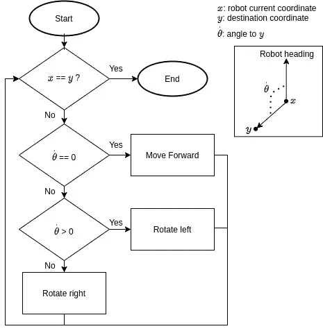

# Webots 教程系列:机器人自适应运动——e-puck 机器人

> 原文：<https://levelup.gitconnected.com/webots-series-adaptive-movement-103ed0a76f49>

这个故事是 Webots 教程系列的第四部分。稍后我们将讨论如何在 Webots 中实现粒子群优化(PSO)。PSO 在现实生活中用于搜索和救援行动。

以下是该系列的链接:

1.  [使用 Webots 机器人模拟器](https://medium.com/@albert.brucelee/8a2e2b5d22a9)轻松创建并运行您的第一个机器人程序
2.  [简单回避算法，在 e-puck 机器人上实现，在 Webots 机器人模拟器上模拟](https://medium.com/@albert.brucelee/3143c096d285)
3.  [移动你的机器人到特定的坐标](https://medium.com/@albert.brucelee/ecf50cb4244b)
4.  当前故事

在之前的故事[ [here](https://medium.com/@albert.brucelee/webots-series-move-your-robot-to-specific-coordinates-47d5823695af) ]中，我们将在这里解决算法中的一个缺陷。这里我们将讨论如何自适应地将机器人移动到特定的坐标。

# 算法

下面是算法流程。算法非常简单:

1.  检查当前位置是否在目的地上。如果是，那么机器人就会停下来。如果不是，继续第二步。
2.  θ̇ = 0 意味着机器人的头已经朝向目的地。如果是，那么机器人将向前移动并继续条件 1。如果不是，继续第 3 步。
3.  θ̇ > 0 表示机器人的目的地在左边。如果是，那么机器人将向左旋转并继续条件 1。如果不是，那么机器人将向右旋转并继续条件 1。

自适应运动算法

# 机器人参数

有关 e-puck 数据表，请参见此处的[和此处的[】。

机器人安装有以下附加组件:

*   GPS:获取关于机器人坐标的信息
*   指南针:获取关于机器人航向的信息

# 缺点

这个算法有一个缺点，如下图所示。机器人的目的地在竞技场中央。但是，有一个障碍物阻碍了机器人的移动。机器人被困住了，永远无法到达目的地。

为了克服这个问题，我们必须应用一种避障算法。我们将在下一个教程中讨论这个问题。

# 程序

代码非常简单。代码解释请在我的 GitHub 上阅读[ [此处](https://github.com/albertbrucelee/webots-e-puck_robot-tutorial/tree/master/4%20-%20Adaptive%20Movement) ]。如果你是网络机器人新手，也请阅读第一个系列[ [这里](https://medium.com/@albert.brucelee/8a2e2b5d22a9) ]。

# 模拟演示

这是模拟演示。机器人的目的地在竞技场中央。即使有物体击中机器人，机器人仍然可以到达目的地

# 谢谢你

希望这篇教程对那些正在学习机器人的人有用。我希望你能轻松地跟随这个教程。

关注我的媒体或我的 Gihub 获取更多教程。

如果你喜欢，请鼓掌，如果你有任何建议或问题，请回复。

如果你有任何问题，请随时通过 [LinkedIn](https://www.linkedin.com/in/albert-alfrianta/) 联系我，或者只是说声“嗨！”

谢谢大家！