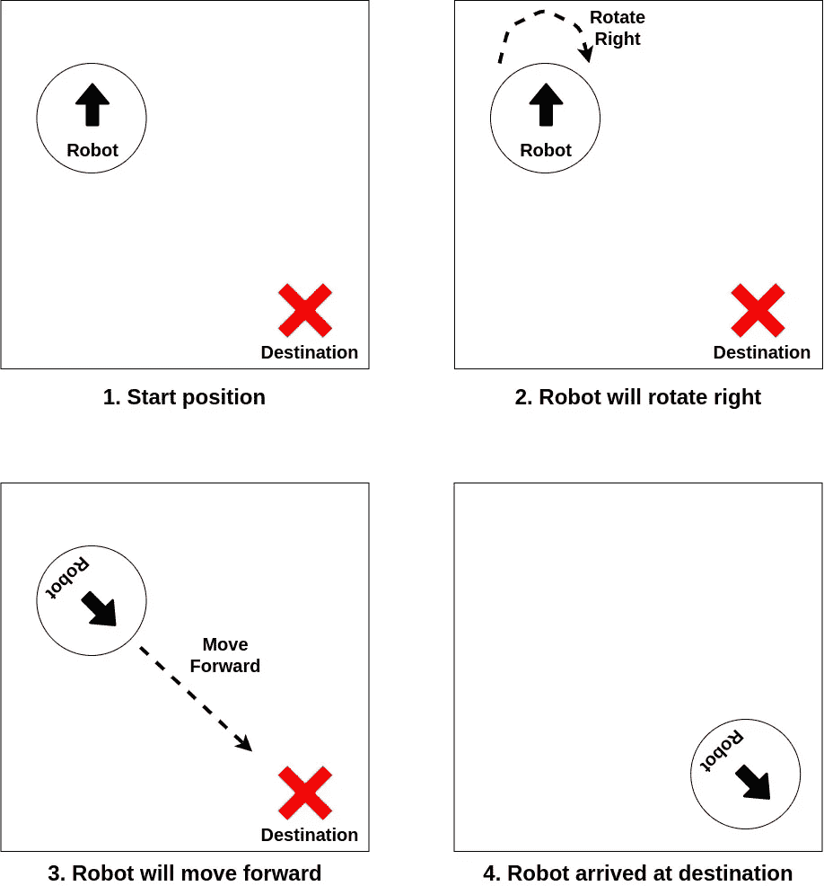
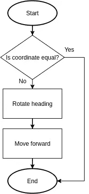
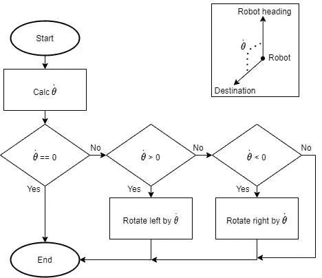
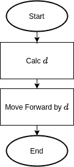
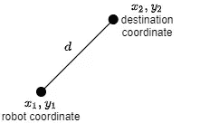
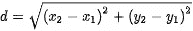
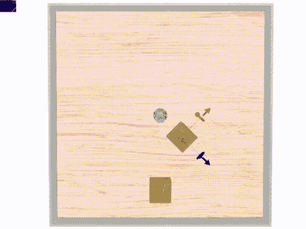

# Webots 教程系列:将您的机器人移动到特定的坐标——e-puck 机器人

> 原文：<https://levelup.gitconnected.com/webots-series-move-your-robot-to-specific-coordinates-ecf50cb4244b>

这个故事是 Webots 教程系列的第三部分。稍后我们将讨论如何在 Webots 中实现粒子群优化(PSO)。PSO 在现实生活中用于搜索和救援行动。

以下是该系列的链接:

1.  [使用 Webots 机器人模拟器](https://medium.com/@albert.brucelee/8a2e2b5d22a9)轻松创建并运行您的第一个机器人程序
2.  [简单回避算法，在 e-puck 机器人上实现，并在 Webots 机器人模拟器上模拟](https://medium.com/@albert.brucelee/3143c096d285)
3.  当前故事
4.  [自适应运动](https://medium.com/@albert.brucelee/103ed0a76f49)

在这里，我们将讨论如何在 Webots 机器人模拟器中将机器人移动到特定的坐标。

# 算法

在讨论算法之前，我们先来看看算法是如何工作的。下面是场景。向右旋转意味着让机器人在原地向左旋转。

方案

现在我们将讨论算法。下面是算法流程。算法很简单。首先，我们检查目的地是否在当前位置。然后机器人旋转航向面向目的地。最后，机器人向前移动到目的地。

算法

## 将航向旋转特定角度

关于如何旋转标题的细节，下面是算法。`θ̇` 是旋转角度。旋转航向意味着让机器人原地旋转。

*   如果目的地在机器人前面，那么机器人什么也不做
*   如果目的地在左边，那么机器人将向左旋转
*   如果目的地在右边，那么机器人将向右旋转

旋转机器人航向的算法

为了让机器人原地旋转，我们以相反的方向启动左右马达:

*   用`-max_speed` 设定左电机，用`max_speed`设定右电机，使机器人向左旋转
*   用`max_speed` 设定左电机，用`-max_speed`设定右电机，使机器人向右旋转

因此，如果我们想让机器人旋转一个特定的角度`θ̇`，首先我们将`θ̇`转换为持续时间`t`，并通过持续时间`t`激活机器人电机。我们通过下面的计算得到`t`。

> `t = abs(θ̇ ) / rotational_speed`

`rotational_speed`是机器人旋转到位的速度。我们通过使用下面的计算得到`rotational_speed`。

> `rotational_speed = 360 * tan_speed / (phi*axle_length)`

`axle_length`是车轮之间的距离。吸盘电机`tangensial_speed`为 0.12874 米/秒，`axle_length`为 0.052 米。所以`rotational_speed`是 278.237392796 度/秒。所以机器人可以每秒旋转 278.237 度。

## 向前移动特定距离

关于如何前进的细节，下面是算法。简单计算从机器人坐标到目的坐标的距离`d`。然后向前移动 d。

距离`d`简单的用欧几里德距离计算来计算。

欧几里得距离

为了使机器人向前移动，我们通过特定的持续时间激活机器人电机。因此，如果我们想通过`d`移动机器人，首先我们将`d`转换为持续时间`t`，并通过持续时间`t`激活机器人电机。我们通过使用下面的计算得到`t`。

> `t = d / tan_speed`

`tan_speed`是机器人切向速度。我们通过使用下面的计算得到`tan_speed`。

> `tan_speed= angular_speed* wheel_radius`

吸盘电机`angular_speed`为 6.28 弧度，`wheel_radius`为 0.0205 米。所以`tan_speed`为 0.12874 米/秒。

# 机器人参数

有关 e-puck 数据表，请参见此处的[和此处的[】。

机器人安装有以下附加组件:

*   GPS:获取关于机器人坐标的信息
*   指南针:获取关于机器人航向的信息

# 缺点

这个算法有一个缺点，如下图所示。机器人正在向底部的盒子移动。期望是机器人能够到达底部盒子。但是，当机器人移动时，突然有什么东西撞上了机器人，使机器人弹跳起来，使机器人无法到达目的地。

为了克服这一缺点，我们必须修改算法，使机器人自适应地移动。阅读下一篇教程【这里[关于解决方案的](https://medium.com/@albert.brucelee/103ed0a76f49)。

# 程序

代码非常简单。代码解释请在我的 GitHub 上阅读[ [此处](https://github.com/albertbrucelee/webots-e-puck_robot-tutorial/tree/master/3%20-%20Move%20To%20Destination%20Location) ]。如果你是网络机器人新手，也请阅读第一系列[ [这里](https://medium.com/@albert.brucelee/8a2e2b5d22a9)。

# 模拟演示

这是模拟演示。

# 谢谢你

希望这篇教程对那些正在学习机器人的人有用。我希望你能轻松地跟随这个教程。

关注我的媒体或我的 [Gihub](https://github.com/albertbrucelee/webots-e-puck_robot-tutorial) 获取更多教程。

如果你喜欢，请鼓掌，如果你有任何建议或问题，请回复。

如果你有任何问题，请随时通过 LinkedIn 联系我，或者只是说声“嗨！”

谢谢大家！