# WebP 图像——下一代格式

> 原文：<https://levelup.gitconnected.com/webp-images-a-next-generation-format-4255adf93cda>

来自 [Pexels](https://www.pexels.com/photo/silver-imac-turned-on-displaying-different-photos-1999463/?utm_content=attributionCopyText&utm_medium=referral&utm_source=pexels) 的[设计生态学家](https://www.pexels.com/@designecologist?utm_content=attributionCopyText&utm_medium=referral&utm_source=pexels)拍摄的照片

# **什么是 WebP 文件？**

WebP 文件是文件扩展名为“**的图像。webp** ”。

查看维基百科的定义:

> WebP 是一种采用有损和无损压缩以及动画和 alpha 透明度的图像格式。它由谷歌开发，旨在创建比 **JPEG** 、 **PNG** 或 **GIF** 图像格式更小或更好看的图像。

换句话说，WebP 是一种相对较新的图像格式，它允许开发者通过使用压缩图像来**减轻他们网站/应用程序的重量**。

# 为什么使用 WebP 图像很重要？

如果你在 IT 行业工作，你肯定知道网站和移动应用程序最重要的一个方面:它们的总重量。关于网站，它们的总权重不仅对允许用户快速加载内容很重要，而且提高了谷歌给它们的分数，因此 [**SEO**](https://en.wikipedia.org/wiki/Search_engine_optimization) 和 [**SEM**](https://en.wikipedia.org/wiki/Search_engine_marketing) 也得到提高。如果你想知道为什么优化网站速度对 SEO 和 SEM 至关重要，请查看这篇[好文章](https://digitalagencynetwork.com/why-is-optimizing-website-speed-essential-for-seo/)。

减轻网站或应用程序重量的许多方法之一是使用 WebP 图像，与传统的 JPEG、PNG 和 GIF 格式相比，WebP 图像更小。

总而言之，使用 WebP 图片比使用网站和移动应用程序有几个优势:

*   减少总重量，使内容加载速度更快
*   增强性能和用户体验
*   提高搜索引擎优化和搜索引擎优化(网页)

# 如何将图片转换成 WebP 格式？

将图像转换为 WebP 格式非常容易，有两个主要选项可以实现这一点:

## 在线转换器

将您的数字图像转换为 WebP 的最简单方法是使用在线转换器。

网上有很多不同的服务，但如果我必须推荐一个，我会建议使用****。****

**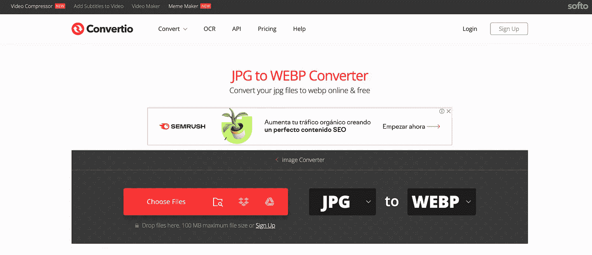**

**Convertio 在线转换器工具**

**该转换器提供了一种将图像转换为 WebP 的简单方法。Convertio 接受的格式包括 **JPG** 、 **JPEG** 、 **GIF** 、 **PNG** 和 **TIFF** 等等。**

**让我们看一个使用 Convertio 将 JPG 图片转换成 WebP 的例子:**

****JPG 格式(945KB) vs WebP 格式(264KB)****

**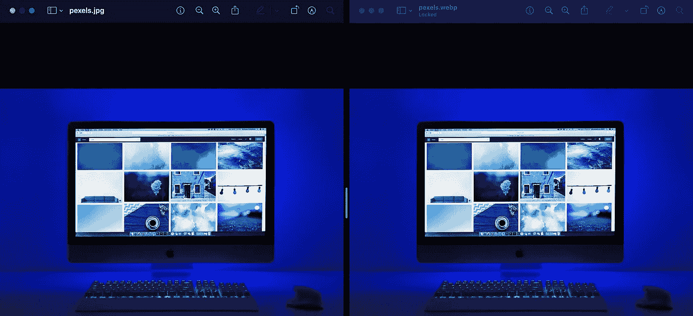**

****JPG 格式(945KB) vs WebP 格式(264KB)****

**获得的重量减少为 **-72%** 和**其中**没有显著的质量下降**。****

****

**JPG 形象**

**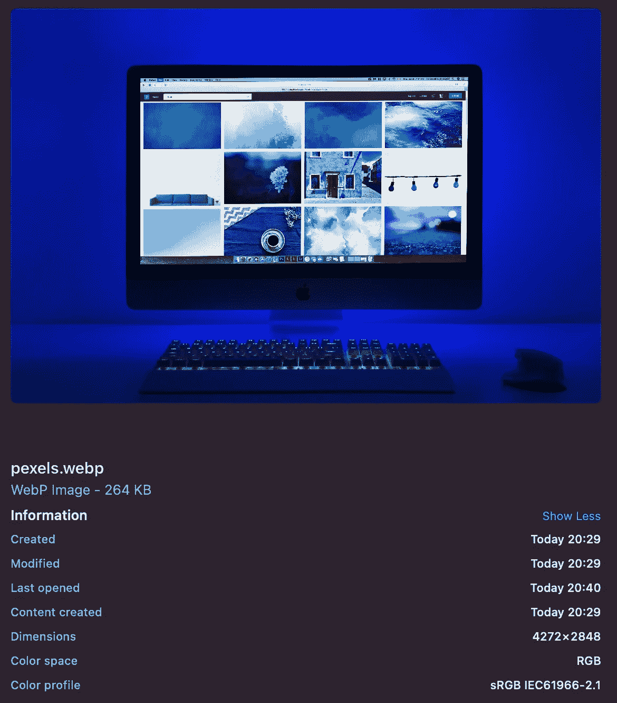**

**使用 Convertio 转换的 webp 图像**

## **手动转换**

**对于那些搜索最佳压缩结果的人来说，最好的办法是手动转换图像。有不同的库可以实现这一点，但我们打算重点介绍一下 [**Google 官方转换工具**](https://developers.google.com/speed/webp/download) 。接下来，我们将了解如何在 Mac OS 上使用它，但如果您有不同的操作系统，也不用担心，因为安装过程也很简单。**

****首先打开终端，安装 brew****

**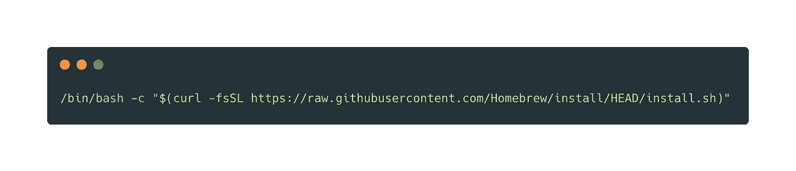**

**安装 Brew 的命令**

****其次，安装 WebP 库****

**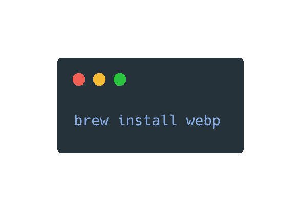**

**安装 WebP 的命令**

**目前，我们能够使用 Google WebP 库转换和压缩图像。为了转换图像，我们必须使用“cwebp”命令并指定**我们想要转换哪个图像**以及**我们想要应用什么** **压缩选项**。**

**让我们看看最基本的例子，并再次转换前一个例子的图像。我们将使用的命令是:**

****

**用于手动转换的命令**

**前面的命令将实现压缩因子为 70(可能值在 0 到 100 之间)的转换。较小的因子产生较小的文件，质量较低)。**

**下面是我们在终端上执行该命令时的输出:**

**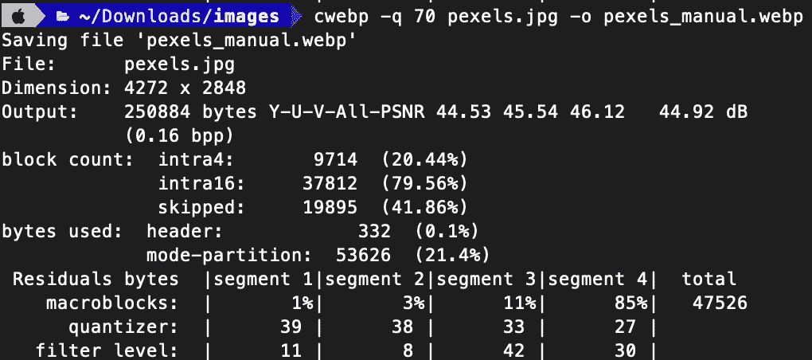**

**cwebp 命令输出**

**结果类似于用 Convertio 得到的结果，但是我们设法进一步减少了图像的重量。**

****JPG 格式(945KB) vs WebP 格式(251KB)****

****

****JPG 格式(945KB) vs WebP 格式(251KB)****

**在这种情况下，获得的重量减少为**-73.4%**，同样，**没有明显的质量下降**，其中**。****

**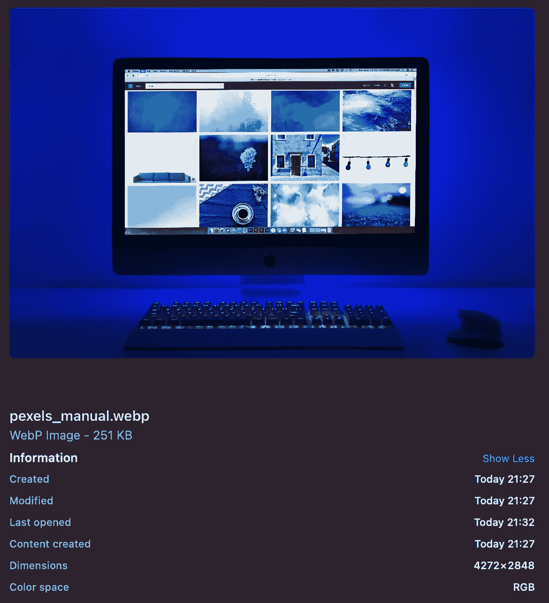**

**手动转换的 webp 图像**

**这个库真正有趣的是，它提供了不同的选项来压缩图像，同时将其转换为 WebP 格式。如果你想看完整的**压缩选项列表**请访问这个链接: [**WebP Google 转换工具**](https://developers.google.com/speed/webp/docs/cwebp) 。**

**考虑到这一点，**压缩结果可能会更好**💪，但注意不要过度降低图像质量！！😅**

# **WebP 当前支持**

**在网站或应用程序中实现新技术/文件格式等时，需要考虑的一个重要因素是其当前的全球支持。**

**关于 **web 开发**，我们可以在网站[我能用](https://caniuse.com/)中找到这类信息。WebP 当前支持如下:**

**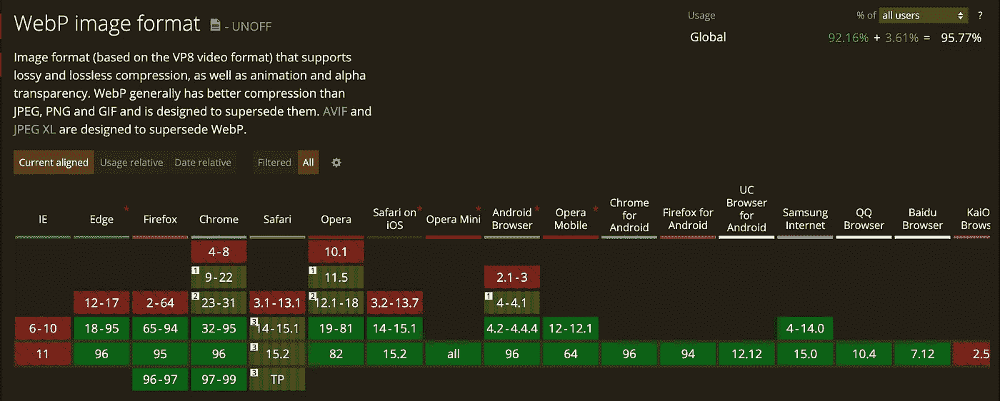**

**WebP 当前支持—来源:我可以使用吗**

**正如我们在前面的截图中看到的，现在 WebP 被几乎所有现存浏览器的最新版本广泛支持。**

**我们在这里必须考虑的是，可能有一些用户使用这些浏览器的旧版本，这就是为什么我们的网站应该使用 **polyfill** 的原因。**

## **Modernizr — Javascript Polyfill**

**为了让我们的网站能够被所有现有的浏览器完全支持，我推荐使用 JavaScript 库 [**Modernizr**](https://modernizr.com/) 。**

**这个库**自动检测下一代网络技术**在用户浏览器中的可用性。Modernizr 使用功能检测，允许您根据用户浏览器的实际功能轻松定制用户体验。**

**要使用它，只需前往他们的 [**下载页面**](https://modernizr.com/download) 并选择您想要在项目中使用的特性。一旦你完成了，只需点击**构建按钮**，你就有了自己定制的 Modernizr！**

**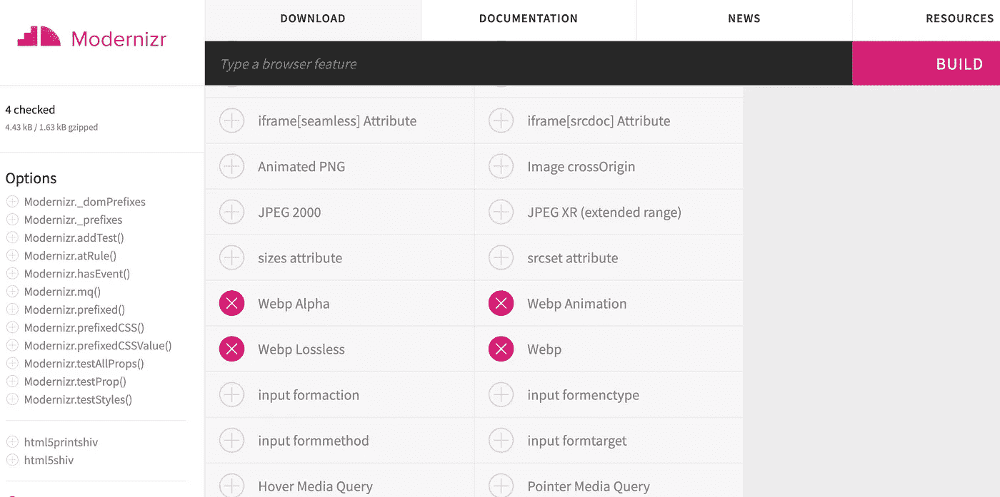**

**Modernizr 下载页面—选择的 WebP 功能**

**然后，会下载一个 **modernizr-custom.js** 文件。这个文件必须添加到 html 文件中的一个 **<脚本>** 标签内(注意，您也可以选择 **CLI 配置**和 **Grunt 配置**，这里不再解释)。**

**最后，Modernizr 必须与 CSS 或 JavaScript 一起使用。我们将关注第一个问题:**

> **默认情况下，Modernizr 为根元素上的所有测试设置类(对于网站， **< html >** )。这意味着当支持时为每个特性添加类，当不支持时添加前缀 **no-** (例如**)。特征**或**。无特征**。这使得通过渐进式增强添加功能变得非常简单！**

**假设您包括 Modernizr 对 **webp 图像**的检测。根据浏览器的不同，会产生**<html class = " webp ">**或**<html class = " no-webp ">**。现在您已经知道了这两种状态，您可以编写 CSS 来涵盖这两种情况:**

**…然后*瞧啊*！现在，您的网站将为不支持 webp 格式的浏览器提供 png 图像，而为支持 webp 格式的浏览器提供 webp 图像！**

# **奖励音轨——针对懒惰开发人员的 bash 脚本**

**对于像我一样懒惰的开发人员，我想分享一个 WebP 转换器和压缩器，在我看来，这是我通过实验找到的 **3 个最佳 WebP 压缩选项，以获得具有**良好图像质量的 WebP 文件，同时减轻其重量**。****

**webp-converter.sh 文件**

**这个脚本做的很简单:它寻找**。png** 在 **/img** 文件夹中递归地显示图像，如果找到一个，就将其转换为**。webp** 格式。反之，如果没有**。png** 图像被找到，在终端中打印一条指示这种情况的消息。**

**转换脚本从找到的每个 PNG 文件生成 3 个不同的 WebP 图像。这是因为根据图像的类型(有/无透明、有/无边框等)，必须进行不同的压缩，以保持良好的图像质量，同时减轻其重量。因此，由于没有一个神奇的命令来识别哪种类型的图像，你试图转换，三种转换方法应用。**

**该脚本创建 3 个 WebP 图像，附加到应用压缩方法的原始 PNG 图像文件名。**profile-photo.png**的例子:**

**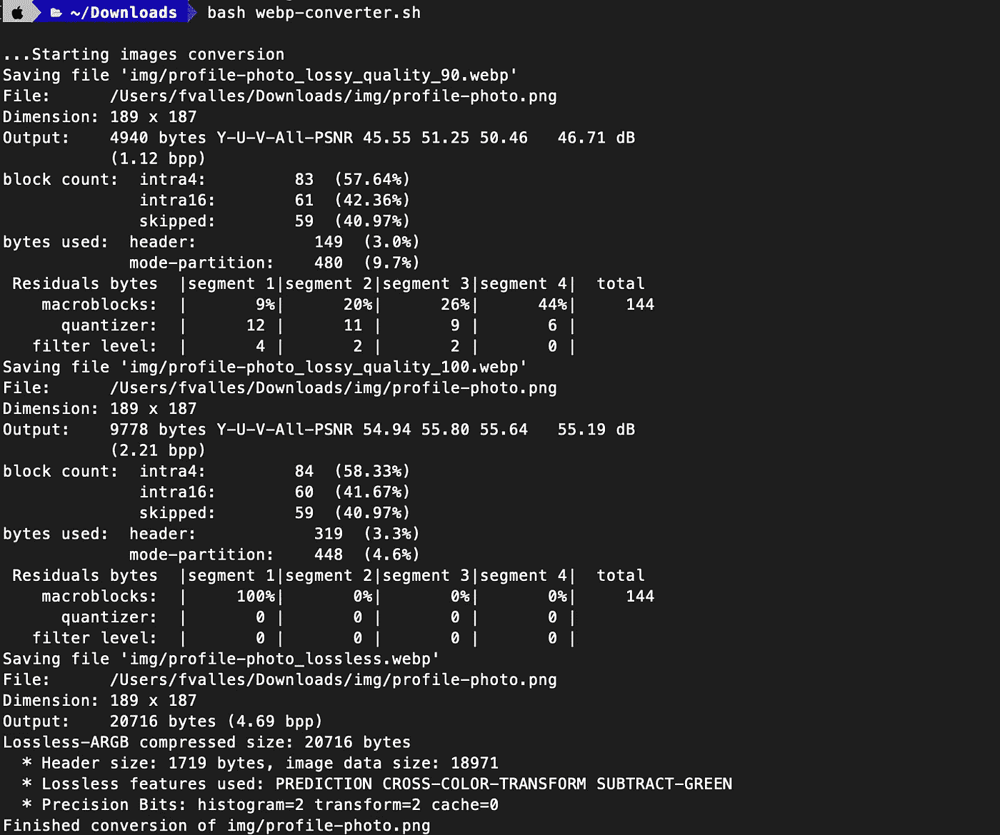**

**webp-转换器文件输出**

**而这里有**。获得的 webp** 图像与原始图像**。png** 文件:**

**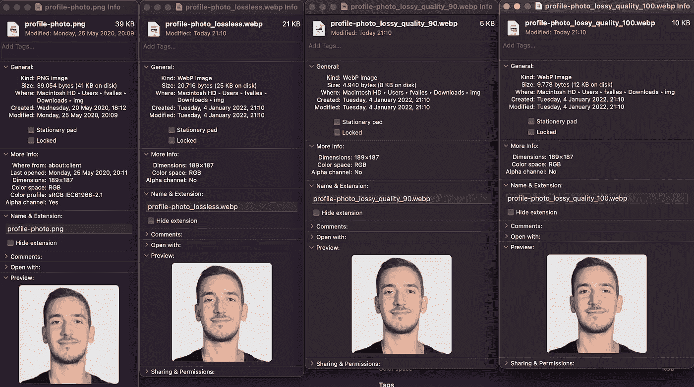**

**获得的 webp 图像与原始 png 文件**

**获得的结果相当惊人:**

*   ****原创。png 文件大小** : 39KB**
*   ****无损压缩。webp 文件** : 21KB (-46%)**
*   ****有损 _90。webp 文件** : 5KB (-87%)**
*   ****有损 _100。webp 文件** : 10KB (-74%)**

**转换相应的后要做的最后一件事。png 图像是为了直观地检查三个生成的 Webp 图像中哪一个在良好的质量和较小的文件大小之间有更好的平衡，并为您的项目选择它！😁 🚀。**

# **结论**

**现在有几种下一代图像格式。其中一个是 WebP，由谷歌推荐给**，他们改进了网页的 SEO 和 SEM。****

**与 png/jpg 格式相比，使用 WebP 图像可以减少大约 70%的文件重量(减少的值因原始图像文件而异)。**

**在线转换器是有用的，但是不要忘记，如果使用 cwebp 这样的库手动执行转换，将会获得最佳的压缩结果。**

**WebP 文件在不同的现有浏览器中有广泛的支持。对于那些可能有旧版本浏览器的用户，我们应该考虑使用像 **Modernizr** 这样的聚合填充来展示给他们看。png 或者。jpg 文件。**

# **文献学**

*   **[**Google 官方 WebP 转换器库**](https://developers.google.com/speed/webp/download)**
*   **[**Convertio: WebP 在线转换器**](https://convertio.co/jpg-webp/)**
*   **[**我能用:WebP 当前支持**](https://caniuse.com/?search=webp)**
*   **[**Modernizr:Javascript polyfill**](https://modernizr.com/)**