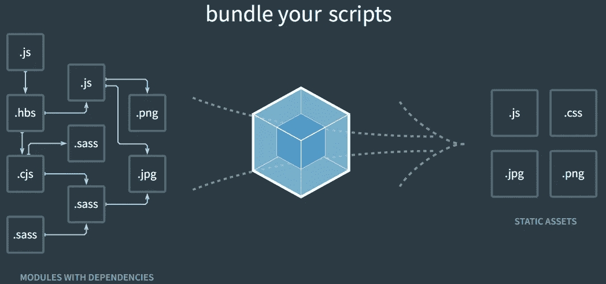

# 从零开始解释 Webpack(第 1 部分)

> 原文：<https://levelup.gitconnected.com/webpack-explained-from-scratch-part-1-7872379424a1>

大多数 FE 开发人员使用 Webpack，这在开始时可能是一个挑战。配置可能会很快变得疯狂。在这个系列中，我们将探索 Webpack 做什么以及它是如何工作的。从“hello world”示例到高级装载机。

# 为什么我们首先需要 Webpack？



资料来源:webpack.js.org

Webpack 是一个捆绑工具，它接受多个不同的源(js、ts、css、scss、vue、react、angular、images)，如果需要的话对它们进行调整，并捆绑到浏览器可以理解的结果文件中。前端开发已经变得相当先进。我们不再仅仅编写简单的 JS 函数来移动滑块或打开弹出窗口。FE 应用程序很复杂，可以做多种不同的事情。以即时通讯工具、谷歌文档、在线绘图工具为例。

复杂的应用程序需要更高级的工具和框架来简化开发。在开发过程中，我们使用浏览器无法理解的工具，如 TypeScript 或 SCSS。VueJs 这样的框架使用单个文件组件，将模板、JavaScript 和样式组合在一个文件中，浏览器不知道如何阅读。捆绑器(或一些专门的加载器)获取所有这些源，并为浏览器准备一个有意义的结果。生成的文件也以各种方式进行了优化，以减小文件大小，延迟加载等。

# 网络包的“你好，世界”

当你打开 Webpack 文档时，你可能会感到迷茫。文档很大，每个部分都有很多页面，每个函数/加载器/插件都有另一个定制配置。刚开始的时候是非常压倒性的。配置文件也会很快变大。

一些框架，比如 NuxtJs，将 Webpack 的设置打包到 Nuxt config 中，所以在很多情况下你并不需要真正理解 webpack 是如何工作的。它隐藏在 NuxtJs 后面。但是，如果需要，您可以扩展它。

## 好吧好吧，给我看看代码！

为了测试下面的例子，你只需要安装一些依赖关系的 npm。

*package.json* :

```
{
  "name": "webpack-5-examples",
  "version": "1.0.0",
  "description": "",
  "main": "index.js",
  "scripts": {
    "build": "webpack",
  },
  "repository": {},
  "keywords": [],
  "devDependencies": {
    "@types/webpack": "^5.28.0",
    "@types/core-js": "^2.5.5",
    "@types/node": "^17.0.18",
    "clean-webpack-plugin": "^4.0.0",
    "css-loader": "^6.5.1",
    "path": "^0.12.7",
    "postcss": "^8.4.6",
    "sass": "1.49.7",
    "sass-loader": "^12.6.0",
    "ts-loader": "^9.2.6",
    "ts-node": "^10.7.0",
    "typescript": "^4.6.2",
    "vue": "^3.2.31",
    "webpack": "^5.70.0",
    "webpack-cli": "^4.9.1",
    "webpack-dev-server": "^4.4.0",
    "webpack-nano": "^1.1.1",
    "webpack-node-externals": "^3.0.0"
  }
}
```

然后，我们需要 *webpack.config.js* :

```
**const** *path* **=** *require*('path');
**const** {CleanWebpackPlugin} **=** *require*("clean-webpack-plugin");

*module*.*exports* **=** {
  mode**:** 'development',

  devtool**:** false,

  entry**:** {
    main**:** './index.js',
  },

  output**:** {
    path**:** *path*.join(__dirname, 'public'),
    filename**:** '[name].js',
  },

  module**:** {
    rules**:** [],
  },

  plugins**:** [
    new CleanWebpackPlugin({
      cleanOnceBeforeBuildPatterns**:** [
        '**/*.js',
      ],
    }),
  ],
};
```

最后是一个 *index.js* 。

```
let *long_variable_name* = 1;

for(let iiii = 0; iiii < 10; iiii++) {
  *long_variable_name*++
}

*console*.log(*long_variable_name*)
```

在我们对文件或配置进行任何更改后，我们将始终运行“ *npm run build* ”。结果将在*中。/public* 文件夹。

Webpack 配置只有几个强制设置。我们必须告诉 web pack**入口文件**是什么。在我们的例子中 *index.js* 。这是 Webpack 开始处理的第一个文件。

```
entry**:** {
    main**:** './index.js',
},
```

我们也可以有多个入口文件。可以是 js/ts/scss/less 等。如果我们有多个入口文件，也会有多个输出。为此，我们必须指定结果的去向:

```
output**:** {
    path**:** *path*.join(__dirname, 'public'),
    filename**:** '[name].js',
},
```

目前，我们不使用任何模块，因此相应的部分是空的。我们甚至不需要使用任何插件。但是，在构建新文件之前删除 public 是有益的。这样，我们可以确定，我们在输出文件夹中看到的所有内容都是用最近的构建生成的，而不是从之前就被遗忘了。对于这个任务，我们使用 *clean-webpack-plugin* 。插件就像一个独立的应用程序，Webpack 称之为。它可以从 git 存储库中下载。通常，插件是由不同的团队开发的。每个插件都有自己的配置，所以必须查看文档以获取详细信息。经常有多个插件在做同一件事，所以对于一个特定的任务总是只选择一个。

在配置文件的开头，我们有两行:

```
mode**:** 'development',  // or 'production'

devtool**:** false, // or 'eval'
```

**模式**告诉 webpack 如何构建结果文件。它应该对人类可读吗？应该优化吗？它应该被浏览器开发工具使用吗？这两个选项是*生产*或*开发*。我们将看看有什么不同。浏览器的开发工具需要使用 **devtool** 选项才能正常工作。在大多数情况下，我们会关闭这个选项，因为它会增加输出文件的复杂性，而这并不是我们真正需要的。

让我们运行简单的例子。js 不做任何困难的事情。我们有一个长名称的变量、一个循环和一个 console.log 命令来显示结果。

在我们运行构建之后，我们在。/公共文件夹。

```
/******/ (() **=>** { // webpackBootstrap
**var** __webpack_exports__ **=** {};
/*!******************!*\
  !*** ./index.js ***!
  \******************/
**let** long_variable_name **=** 1;

**for**(**let** iiii **=** 0; iiii **<** 10; iiii**++**) {
  long_variable_name**++** }

*console*.log(long_variable_name)

/******/ })()
;
```

如您所见，与我们的原始文件相比，没有太大的变化。Webpack 创建一个自动运行的全局函数。在这个全局函数中:

```
/******/ (() **=>** { // webpackBootstrap
**var** __webpack_exports__ **=** {};
***.... our code ....***
/******/ })**()**
```

我们的代码没有改变。末尾的粗体括号告诉 JS engine 在加载后运行这个函数。

如果您在任何 html 文件中包含 *main.js* ，它将在加载后执行。

**开发工具开启**

如果我们允许使用开发工具，构建会有什么变化？

```
/*
 * ATTENTION: The "eval" devtool has been used (maybe by default in mode: "development").
 * This devtool is neither made for production nor for readable output files.
 * It uses "eval()" calls to create a separate source file in the browser devtools.
 * If you are trying to read the output file, select a different devtool (https://webpack.js.org/configuration/devtool/)
 * or disable the default devtool with "devtool: false".
 * If you are looking for production-ready output files, see mode: "production" (https://webpack.js.org/configuration/mode/).
 */
/******/ (() **=>** { // webpackBootstrap
/******/   **var** __webpack_modules__ **=** ({

/***/ "./index.js"**:** /*!******************!*\
  !*** ./index.js ***!
  \******************/
/***/ (() **=>** {

*eval*("let long_variable_name = 1;\r\n\r\nfor(let iiii = 0; iiii < 10; iiii++) {\r\n  long_variable_name++\r\n}\r\n\r\n*console*.log(long_variable_name)\r\n\n\n//# sourceURL=webpack://webpack-5-example/./index.js?");

/***/ })

/******/   });
/************************************************************************/
/******/   
/******/   // startup
/******/   // Load entry module and return exports
/******/   // This entry module can't be inlined because the eval devtool is used.
/******/   **var** __webpack_exports__ **=** {};
/******/   __webpack_modules__["./index.js"]();
/******/   
/******/ })()
;
```

如您所见，结果可能有点难以阅读。与前一个例子的主要区别在于使用了 *eval* 函数。这个函数基本上接受一个被认为是有效 javascript 代码的字符串并执行它。这有助于浏览器的开发工具附加到代码上，并为开发人员提供额外的功能和工具。从现在开始我们将保持 devtools **为假**。

## 为生产而制造

当我们伟大的小项目准备好了，我们想准备一个生产构建。这里的主要区别是，我们不希望代码中有任何不必要的东西。例如，注释、开发工具、调试特性等。Webpack 也可以做 mangling——这意味着将变量名减少到最少。在我们的 *index.js* 中我们有一个名为“ *long_variable_name* 的变量，但是对于 js 引擎来说，变量名是什么并不重要。因为 JS 主要用于客户端应用程序，所以我们希望通过网络传输尽可能少的数据。Webpack 自动帮助我们。让我们来看看结果:

```
(()**=>**{**let** l**=**1;**for**(**let** o**=**0;o**<**10;o**++**)l**++**;*console*.log(l)})();
```

与以前的结果相比，这个结果似乎小得惊人。如你所见，“ *long_variable_name* ”被缩短为“ *l* ”，“iiii”被缩短为“o”，所有的注释都被删除，不必要的空格被删除。

在**#第 2 部分**见，我们将介绍进口产品！