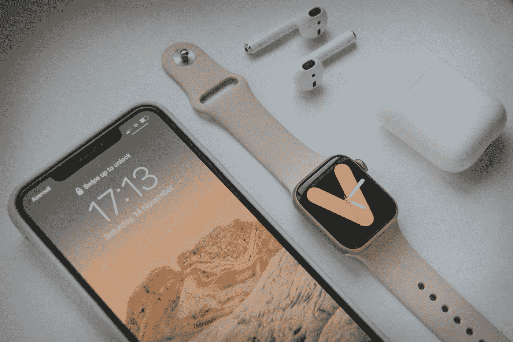
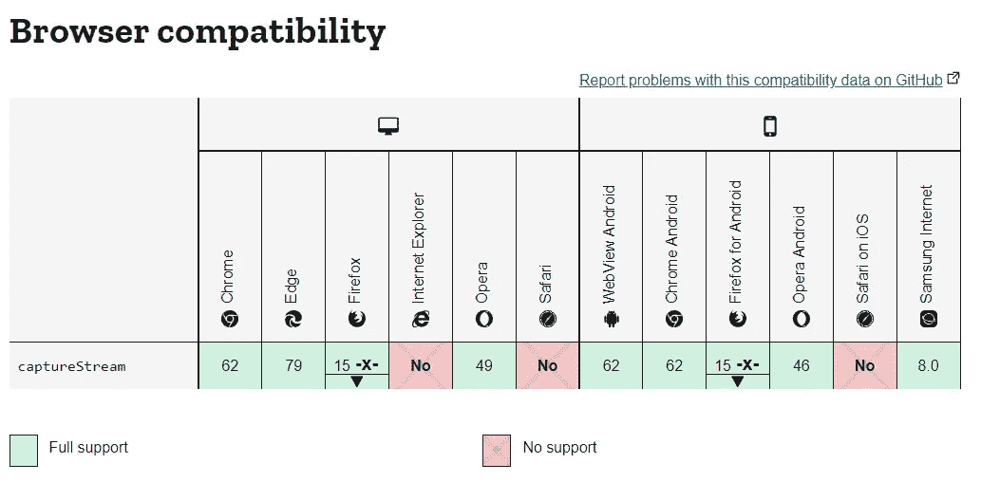
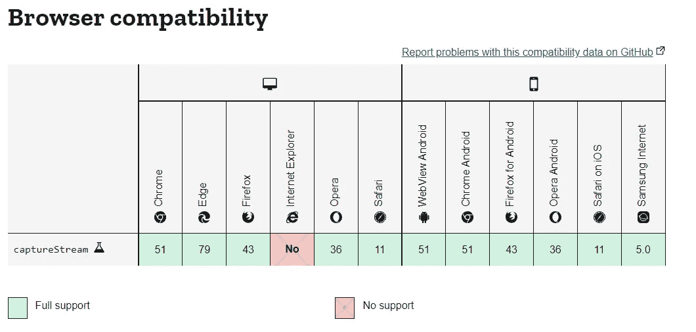

# WebRTC: CaptureStream iOS 兼容性

> 原文：<https://levelup.gitconnected.com/webrtc-capturestream-ios-compatibility-2ba51cdc7207>

[拉拉·阿兹利](https://unsplash.com/@lazizli?utm_source=medium&utm_medium=referral)在 [Unsplash](https://unsplash.com?utm_source=medium&utm_medium=referral) 上拍照

之前我们已经讨论了使用 WebRTC 技术的网络流的基础。现在说说我经历过的一些有趣的问题:iOS 兼容性。

在[之前的文章](https://blog.devgenius.io/explaining-basic-of-web-streaming-in-simple-term-e8aef988bca8)中，我们讨论了媒体流及其与`<video>`标签的关系。我们知道`<video>`可以接收媒体流作为它的输入。令我们惊讶的是，`<video>`也可以转换成 MediaStream！[htmlmediaelement . capturestream()](https://developer.mozilla.org/en-US/docs/Web/API/HTMLMediaElement/captureStream)是完成这种转换的方法。但是如果你仔细看文档，你会看到一个不幸的消息。

HTMLMediaElement.captureStream 浏览器兼容性，[MDN Web Docs](https://developer.mozilla.org/en-US/docs/Web/API/HTMLMediaElement/captureStream)2022 年 1 月 26 日

**不支持 Safari。**

如果您的应用程序的要求是可以被 iOS 用户访问，那么这个信息对您来说将是个坏消息。现在，你有三个选择:

1.  忽略 iOS 用户:(
2.  使用 [getDisplayMedia](https://developer.mozilla.org/en-US/docs/Web/API/MediaDevices/getDisplayMedia) 共享您的视频。
3.  使用[htmlcanvaselement . capturestream()](https://developer.mozilla.org/en-US/docs/Web/API/HTMLCanvasElement/captureStream)。

等等，还有另一个 captureStream？是的，这个函数不是媒体，而是从画布对象中捕获流。如果你看了这个功能的浏览器兼容性，你会发现这个功能支持 Safari。通过一些黑客攻击，我们可以用它将我们的`<video>`标签转换成媒体流！

htmlcanvaselement . capturestream 浏览器兼容性，[MDN Web Docs](https://developer.mozilla.org/en-US/docs/Web/API/HTMLCanvasElement/captureStream)2022 年 1 月 26 日

如果你只是想浏览一下，下面是总结的步骤:

1.  将视频的帧绘制到画布上
2.  重复它来创建一个[请求动画帧](https://developer.mozilla.org/en-US/docs/Web/API/window/requestAnimationFrame)

生成的代码也可以在我的存储库中看到。

 [## 教程/4-webrtc-IOs-master adyaksaw 上的 capturestream 教程

### 教程的示例代码。在 GitHub 上创建一个帐户，为 adyaksaw/tutorial 开发做贡献。

github.com](https://github.com/adyaksaw/tutorial/tree/master/4-webrtc-ios-capturestream) 

好吧，那我们来详细说说吧！让我们从我们的[上一篇文章](https://blog.devgenius.io/explaining-basic-of-web-streaming-in-simple-term-e8aef988bca8)中的基本 HTML 文件和 javascript 文件开始。

首先，我们需要将视频放到画布中。就我个人而言，我对这个任务的第一个想法是“我可以直接将视频标记放在画布标记中吗？”。令我失望的是，我不能。我们需要把每一帧画到画布上。我们将使用 [drawImage](https://developer.mozilla.org/en-US/docs/Web/API/CanvasRenderingContext2D/drawImage) 函数来完成这项任务。让我们将它设置为在视频播放后绘制，如下例所示。

如果您运行上面的代码，您可以看到画布出现在我们的网页中，但它还没有动画。这是因为我们只在视频开始时绘制一次图像。我们需要使它可重复，这就是 requestAnimationFrame 的用武之地。

解释一下[window . requestanimationframe()](https://developer.mozilla.org/en-US/docs/Web/API/window/requestAnimationFrame)函数，它是一个通过调用更新函数来重绘动画的函数。更新过程将发生在下一次重画之前，通常每秒发生 60 次。我们可以用它反复绘制画布来制作动画。现在，我们修改代码，这样我们就可以使用这个函数了。更改后的代码可以在下一节中看到。请注意，代码需要在 step 函数内部和外部调用 requestAnimationFrame 函数。

原来如此。因为画布已经一帧一帧地捕捉了我们的视频，我们现在可以将画布转换成媒体流，而不是转换视频。该转换与除 Internet Explorer 之外的几乎所有浏览器兼容，解决了 captureStream 函数的 iOS 兼容性问题。

但是将视频转换成画布动画有一个缺点。画布动画不会在非活动选项卡上运行。因此，如果另一个客户端流式传输您的画布，而您切换了标签，流式传输将会暂停，直到您返回到您的画布标签。所以你需要选择你的毒药:你需要 iOS 兼容性，还是流媒体工具切换标签的能力？

大家好，我是 Adyaksa，我写的是软件开发和我的语言学习经历。我计划每周发布一篇博客，内容是我在做兼职项目时发现的一些有趣的事情。如果你感兴趣，你可以关注我来了解它的最新情况！

资源:

*   [https://stack overflow . com/questions/4429440/html 5-display-video-inside-canvas](https://stackoverflow.com/questions/4429440/html5-display-video-inside-canvas)
*   [https://stack overflow . com/questions/61433700/how-to-assure-canvas-is-the-same-size-of-video-in-html](https://stackoverflow.com/questions/61433700/how-to-make-sure-canvas-is-of-same-size-of-video-in-html)
*   [https://developer . Mozilla . org/en-US/docs/Web/API/HTMLMediaElement/captureStream](https://developer.mozilla.org/en-US/docs/Web/API/HTMLMediaElement/captureStream)
*   [https://developer . Mozilla . org/en-US/docs/Web/API/HTMLCanvasElement/captureStream](https://developer.mozilla.org/en-US/docs/Web/API/HTMLCanvasElement/captureStream)