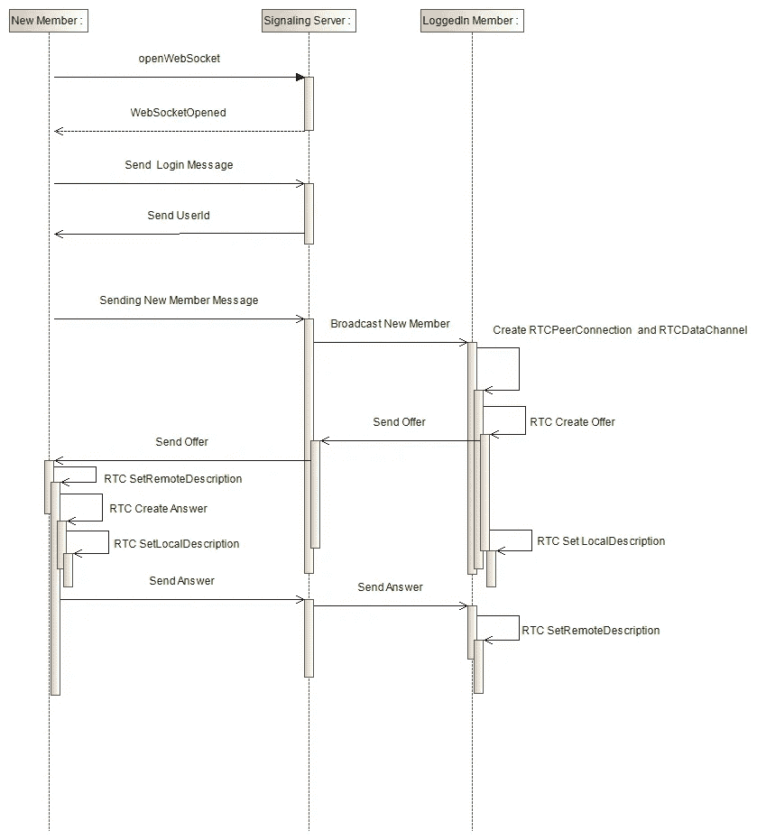
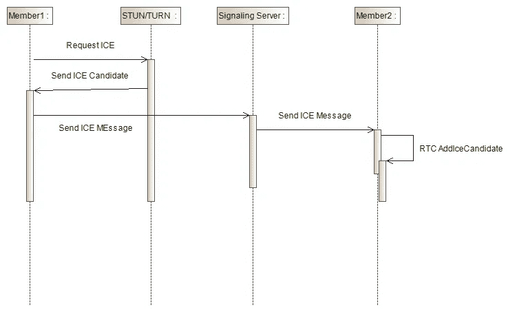

# 使用 React 的 WebRTC 客户端聊天应用程序

> 原文：<https://levelup.gitconnected.com/webrtc-client-chat-app-using-react-99bf8e803fd8>

在本文中，我将解释如何使用 React 创建 WebRTC 聊天客户端。本文使用此[博客](https://mrizkysatrio.medium.com/webrtc-chat-application-772539ae97b7)中描述的交互图，并与此[博客](https://medium.com/javarevisited/webrtc-signaling-server-example-using-spring-boot-efd5f067900a)中描述的信令服务器进行交互。

**问题陈述**

*   使用 React 的 WebRTC 聊天应用程序
*   使用本[博客](https://medium.com/javarevisited/webrtc-signaling-server-example-using-spring-boot-efd5f067900a)中描述的信令服务器，

**高级解决方案**

高层次的解决方案是实现这个[博客](https://mrizkysatrio.medium.com/webrtc-chat-application-772539ae97b7)中描述的信令流。为了您的方便，下面又是这张图:

图 1 信令流

图 2 冰流

正如我们所看到的，我们必须为这个 WebRTC 聊天客户端实现几个要点:

*   打开 websocket 连接并初始登录，
*   处理通过 websocket 接收消息，
*   处理 ICE 消息。

**启动 websocket 并初始登录**

我们从打开 websocket 连接开始。之后，处理 onOpen 事件以发送初始登录消息。

**处理通过 websocket 接收的消息**

我们有几种通过 websocket 客户端接收的消息类型:

*   新成员，当我们收到这条消息时，我们需要通过 websocket 服务器发送一条报价消息，
*   UserID，当我们收到这个消息时，我们需要向 websocket 服务器发送一个“NewMember”消息，
*   ICE 消息，当我们收到此消息时，我们需要将其作为 ICE 候选添加到我们与其他用户的对等连接中，
*   答，当我们收到这条消息时，那么我们需要将远程描述设置为我们与其他用户的对等连接，
*   提供，当我们收到这个消息，然后我们需要通过 websocket 服务器发送“应答”消息。我们还需要将连接添加到我们与其他用户的对等连接的本地描述中，

**处理 ICE 消息**

ICE 候选消息由 STUN/TURN 服务器发送，帮助我们穿越 NAT。每次我们从 STUN/TURN 服务器收到这条消息，都需要再次发送到 web socket/信令服务器。从那里，信令服务器会将其转发给其他方，因此其他方可以知道我们的地址以及如何与我们建立 p2p 连接。

**完整代码**

WebRTC Chat React 的完整代码可以在这个 [github](https://github.com/rsatrio/React-WebRTC-Chat) 上找到。请不要忘记在 [github](https://github.com/rsatrio/React-WebRTC-Chat) 仓库中留下一颗星星。你也可以试试[的工作网站这里](https://glowing-creponne-b62856.netlify.app/)。也请查看参考资料部分的其他链接，以全面了解整个解决方案。如果您有进一步的问题或询问，请留下您的评论。

**参考文献**

1.  [https://github.com/rsatrio/React-WebRTC-Chat](https://github.com/rsatrio/React-WebRTC-Chat)
2.  [https://medium . com/Java re visited/webrtc-signaling-server-example-using-spring-boot-efd5f 067900 a](https://medium.com/javarevisited/webrtc-signaling-server-example-using-spring-boot-efd5f067900a)
3.  [https://mrizkysatrio . medium . com/webrtc-chat-application-772539 AE 97 b 7](https://mrizkysatrio.medium.com/webrtc-chat-application-772539ae97b7)
4.  [https://glowing-creponne-b62856.netlify.app/](https://glowing-creponne-b62856.netlify.app/)