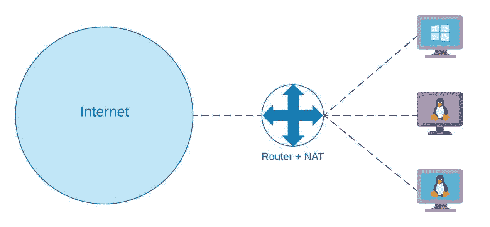
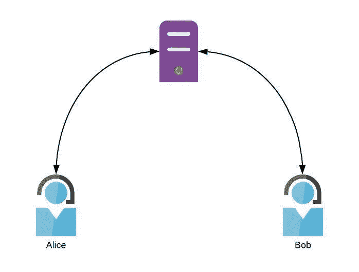

# WebRTC:ICE 框架、STUN 和 TURN 服务器

> 原文：<https://levelup.gitconnected.com/webrtc-the-ice-framework-stun-and-turn-servers-10b2972483bb>


马库斯·斯皮斯克在 [Unsplash](https://unsplash.com/s/photos/network?utm_source=unsplash&utm_medium=referral&utm_content=creditCopyText) 上的照片

WebRTC(Web Real Time Communication)是一个开源项目，支持通过 JavaScript API 创建对等(P2P)音频和视频通信。

为了建立 P2P 连接，对等体必须就它们想要交换的媒体类型进行通信，告诉彼此它们何时想要开始或停止通信，并且它们必须在网络中找到彼此。完整的过程被称为信令，但我们只对最后一部分感兴趣:如何尽可能直接地连接对等体。

这并不像听起来那么简单。用户的设备通常没有公共 IP 地址，或者可能不允许建立任何直接连接。这就是为什么我们需要交互式连接建立(ICE)框架。

# 日产防盗系统

如果两个用户正在打电话，一个只需拨打另一个的电话号码，另一个只需接听电话。每个电话号码只对应一个设备，电话号码足以实现直接连接。

另一方面，在互联网上，历史上没有足够的“号码”用于每个连接的设备。使用 IPv4，只有大约 40 亿个地址可用。地址不足的问题可以通过将许多设备归入一个公共地址来解决，路由器会翻译通过它的数据包中的地址。这个过程称为网络地址转换(NAT)。



有不同类型的 NAT，但其中一些为 UDP 流分配一个公共 IP 地址和一个端口(这是我们所需要的)。因此，当您想要创建与对等方的 P2P 连接时，第一个挑战是发现您背后的 NAT 类型，如果它们存在，则获取您可以提供给联系人的 IP 地址和端口。

# 使目瞪口呆

STUN(NAT 会话遍历实用程序)协议可以帮助您做到这一点。当试图建立 P2P 连接时，您必须提供 STUN 服务器。在 WebRTC 中，您在创建表示连接的 JavaScript 对象时提供它:

为了确定您是否在 NAT 之后，并尽可能获得一个公共 IP 地址，ICE 代理将向您指定的 STUN 服务器发送一个请求。如果有的话，NAT 将在消息头中设置它的公共地址和端口。STUN 服务器将尝试从不同的 IP 地址 ping 这个公共地址，以检查您是否在 NAT 之后，如果是，它是哪种 NAT。但是如果一切顺利，STUN 服务器会把这个地址和这个端口返回给你。

```
 You                        NAT                     STUN server          
    |------ STUN request ----->|                          |                   
    |   src:198.145.1.2:3000   |                          |                   
    |                          |------ STUN request ----->|                   
    |                          |   src:128.11.22.13:8888  |                   
    |                          |                          |                   
    |                          |<------STUN response------|                   
    |                          |   ext:128.11.22.13:8888  |                   
    |<------STUN response------|                          |                   
    |   ext:128.11.12.13:8888  |                          |
```

如果你试图与之通信的对等体工作顺利，他也会得到它的公共地址。但这并不是我们问题的结束。

# NAT 实施

NAT 的实现方式不尽相同，它们允许数据包通过的方式也可能不同。一些 NAT 实现，如一对一 NAT，将允许建立 P2P 连接。有些，比如对称的，就不会。

## 一对一 NAT(或全锥形 NAT)

在这种实现中，一旦内部 IP 地址/端口 duo 被映射到外部 IP 地址/端口 duo，到达外部地址/端口的所有分组，不管它们来自哪里，都将被发送到原始的内部地址/端口。

如果对等体在这样的 NAT 之后，那么获得两个对等体的公共 IP 地址和端口就足以建立 P2P 连接。

## 对称 NAT

在对称 NAT 中，外部 IP 地址/端口取决于内部 IP 地址/端口 duo **和目的地**。从 198.145.1.2:3000 到 TURN 服务器的请求被映射到给定的外部源 IP 地址和端口。但是，如果同一个内部主机将数据包发送到不同的目的地，例如它试图与之通信的对等主机，则外部 IP 地址/端口将会不同。除此之外，外部主机必须先从内部主机收到数据包，然后才能发回数据包。

如果对等体位于对称 NAT 之后，它们将无法通信。这就是为什么我们需要另一个解决方案:转向。

# 转动

当无法建立直接连接时，通信必须通过 TURN 服务器。TURN 代表使用中继绕过 NAT 的遍历。顾名思义，连接会经过一个中继服务器。



这显然恶化了性能，并且有财务成本。STUN 服务器处理非常小而简单的请求，而 TURN 服务器中继整个会话，这会导致更多的流量。这就是为什么你能找到公共的眩晕服务器，却找不到公共的回合服务器(至少没有一个服务器的主人知道它是公共的)。

# WebRTC 中的 ICE

对于要通过 TURN 建立的 WebRTConnection，您需要在 RCTPeerConnection 对象中指定您的 TURN 服务器的 url:

出于上述原因，TURN 服务器通常受密码保护。

ICE 代理将首先尝试在对等体之间直接建立连接，只有在不起作用时才会切换到 TURN 选项。你不用自己管，你只需要监听 RTCPeerConnection 的事件 *onicecandidate* 就可以了。每次发现候选冰时都会触发该事件。然后，您应该通过您的信号机制将候选人发送给您的同事:

当从您的同事那里收到一个候选人时，您必须通过调用 *addIceCandidate* 将其交付给 ICE 代理。剩下的谈判和候选人的最终选择由 ICE 代理负责。在候选协商结束时，如果成功，对等体可以开始通信。

我希望这篇文章对你有用。如果您想亲自了解如何构建 WebRTC 视频聊天，并了解整个信令流程，您可以查看这一系列文章:

*   [来自网络摄像头和麦克风的数据流:用 JavaScript 视频聊天第一步](/data-stream-from-your-webcam-and-microphone-videochat-with-javascript-step-1-29895b70808b)
*   [通过 WebSocket 建立连接:用 JavaScript 进行视频聊天第二步](/set-up-a-connection-over-websocket-videochat-with-javascript-step-2-f78c307c4fd3)