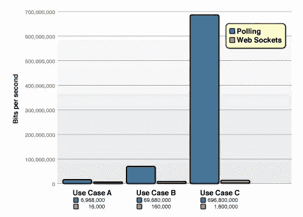
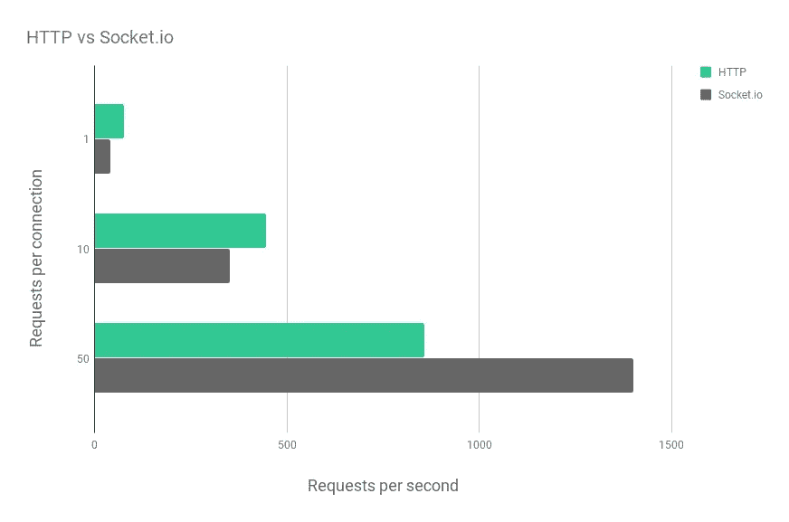
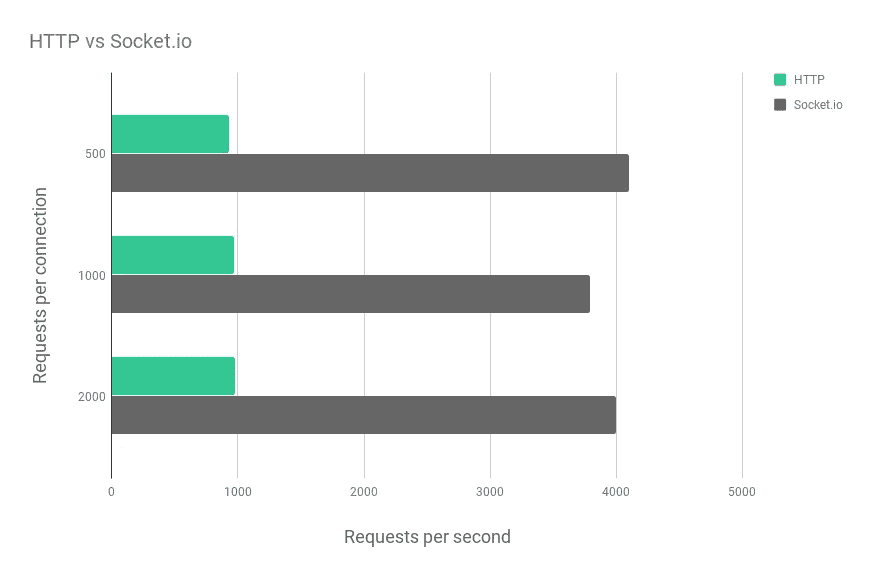
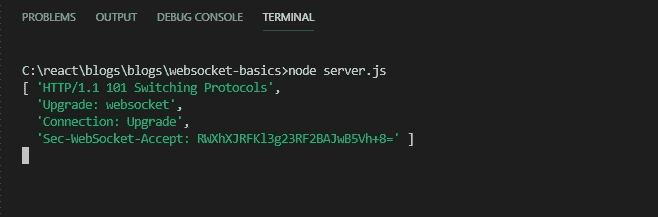
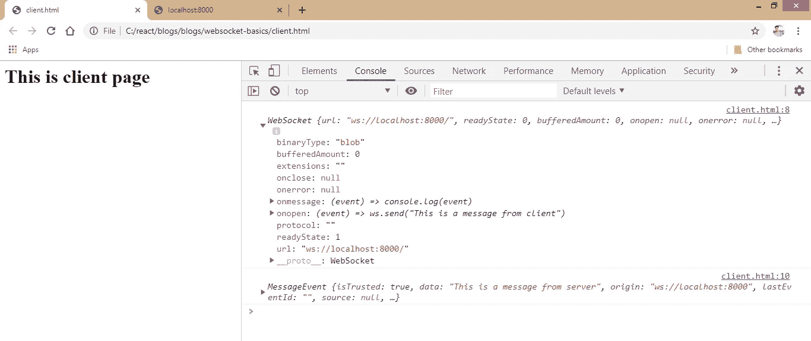
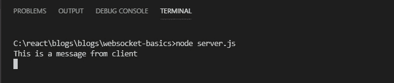

# 简化的 WebSocket

> 原文：<https://levelup.gitconnected.com/websocket-simplified-b532f266cc9f>


这是我将撰写的 WebSocket 系列的第一篇文章，目标是尽可能用最简单的方式解释事情。让我们直接开始吧。

WebSockets 允许用户通过持久的双向连接向服务器发送和接收消息。所以基本上，这是**客户端**和**服务器**之间的一种通信方式。让我们先了解一下这个**通信**，我们一会儿再回到 WebSockets。

# 客户端和服务器

Web 浏览器(客户端)和服务器通过 TCP/IP 进行通信。超文本传输协议(HTTP)是位于 TCP/IP 之上的标准应用协议*，支持请求(来自网络浏览器)和响应(来自服务器)。*

# 这是如何工作的？

让我们通过这些简单的步骤:-

1.  客户端向服务器发送请求。
2.  建立了连接。
3.  服务器发回响应。
4.  客户端收到响应。
5.  连接已关闭。

这是对客户机和服务器之间的标准通信如何工作的简单概述。现在仔细看看第五步。

> *连接关闭。*

HTTP 请求已经达到了它的目的，不再需要它，因此连接被关闭。

## 如果服务器想给客户端发送消息怎么办

在我们的标准请求/响应场景中，必须从请求开始建立连接以开始通信。如果服务器想要发送一条消息，客户端必须发送另一个请求来建立连接并接收消息。

## 客户端如何知道服务器想要发送消息？

考虑这个例子:
*客户快要饿死了，在网上订购了一些食物。他每秒发出一个请求来检查订单是否准备好了。*

> 食物准备好了吗？(客户端)
> 0 秒:不，等等。(服务器)
> 1 秒:菜好了吗？(客户端)
> 1 秒:不，等等。2 秒:食物准备好了吗？2 秒:不，等等。3 秒:食物准备好了吗？是的，先生，这是您点的菜。(服务器)

这就是你所谓的 **HTTP 轮询**。客户端反复向服务器发出请求，并检查是否有消息要接收。

如你所见，这不是很有效率。我们正在使用不必要的资源，失败请求的数量也很麻烦。

## 有什么方法可以克服这个问题吗

是的，有一种轮询技术可以用来克服这种缺陷，它被称为 ***长轮询*** 。

> *长轮询基本上包括向服务器发出一个 HTTP 请求，然后保持连接打开，以允许服务器稍后响应(由服务器决定)。*

考虑上面例子的**长轮询**版本:-

> 食物准备好了吗？是的，先生，这是您点的菜。(服务器)

耶，问题解决了。
不完全是。虽然长轮询有效，但它在 CPU、内存和带宽方面非常昂贵(*，因为我们在保持连接打开时阻塞了资源*)。

我们现在要干嘛？看起来事情正在失去控制。让我们回到我们的救世主: **WebSocket** 。

# 为什么选择 WebSockets

如您所见，为了模拟客户机和服务器之间的实时通信，轮询和长轮询都是非常昂贵的选择。这种性能瓶颈是您希望使用 WebSocket 的原因。

WebSockets 不需要你发送请求来响应。它们允许双向数据流，所以你只需要监听任何数据。

> 你可以监听服务器，当它可用时，它会给你发送一条信息。

让我们看看 WebSocket 的性能方面。

# 资源消耗

下图显示了在一个相对常见的用例中，WebSockets 与长轮询之间的带宽消耗差异:



这种差异是巨大的，并且随着请求的数量呈指数增长。

# 速度

以下是每秒钟每个连接处理 1、10 和 50 个请求的结果:



如您所见，使用 [Socket.io](https://hashnode.com/util/redirect?url=http://Socket.io) 为每个连接发出一个请求要慢 50%,因为必须首先建立连接。这种开销较小，但对于十个请求来说仍然很明显。对于来自同一连接的 50 个请求， [Socket.io](https://hashnode.com/util/redirect?url=http://Socket.io) 已经快了 50%。为了更好地了解峰值吞吐量，我们将查看每个连接请求数量更大(500、1000 和 2000)的基准:



这里您可以看到 HTTP 基准测试的峰值大约是每秒 950 个请求，而 [Socket.io](https://hashnode.com/util/redirect?url=http://Socket.io) 每秒处理大约 3900 个请求。有效吧？

> *注:*[*socket . io*](https://hashnode.com/util/redirect?url=http://Socket.io)*是一个面向实时 web 应用的 JavaScript 库。它在内部实现 WebSocket。可以把它看作 WebSocket 的包装器，它提供了更多的特性*(本系列的下一篇博文将详细解释[socket . io](https://hashnode.com/util/redirect?url=http://Socket.io))*。*

# WebSockets 如何工作

这些是建立 WebSocket 连接所涉及的步骤。

1.  客户端(浏览器)向服务器发送一个 HTTP 请求。
2.  通过 HTTP 协议建立连接。
3.  如果服务器支持 WebSocket 协议，它同意升级连接。这叫做握手。
4.  既然握手已经完成，初始的 HTTP 连接就被一个使用相同的底层 TCP/IP 协议的 WebSocket 连接所取代。
5.  此时，数据可以在客户机和服务器之间自由地来回流动。

我们将创建两个文件:一个服务器和一个客户端。
首先，创建一个名为`client.html`的简单的`<html>`文档，其中包含一个`<script>`标签。让我们看看它看起来怎么样

# Client.html

```
<html>

<script>
    // Our code goes here
</script>

<body>
    <h1>This is a client page</h1>
</body>

</html>
```

# Server.js

现在创建另一个文件`server.js`。导入 HTTP 模块并创建服务器。让它听`port 8000`的。

这将作为一个简单的`http`服务器监听`port 8000`。让我们也来看看:

```
//importing http module
const http = require('http');

//creating a http server
const server = http.createServer((req, res) => {
    res.end("I am connected");
});

//making it listen to port 8000
server.listen(8000);
```

> *运行命令* `*node server.js*` *开始监听* `*port 8000*` *。你可以选择任何你喜欢的端口，我只是选择了 8000，没有具体原因。*

客户端和服务器的基本设置已经完成。很简单，对吧？现在让我们来看看好东西。

# 客户端设置

要构造一个 **WebSocket** ，使用返回`websocket`对象的`WebSocket()`构造函数。该对象提供了用于创建和管理到**服务器**的 WebSocket 连接的 API。

简而言之，这个`websocket`对象将帮助我们建立与服务器的连接，并创建双向数据流，即*从两端*发送和接收数据。

让我们看看如何:

```
<html>

<script>
    //calling the constructor which gives us the websocket object: ws
    let ws = new WebSocket('url'); 
</script>

<body>
    <h1>This is a client page</h1>
</body>

</html>
```

`WebSocket`构造函数需要一个 URL 来监听。在我们的例子中是`'ws://localhost:8000'`,因为我们的服务器在那里运行。现在，这可能和你习惯的有点不同。我们没有使用`HTTP`协议，而是使用`WebSocket`协议。这将告诉客户端**‘嘿，我们正在使用 websocket 协议’**，因此是`'ws://'`而不是`'http://'`。够简单吗？现在让我们在`server.js`中实际创建一个 WebSocket 服务器。

# 服务器设置

我们的节点服务器中需要一个第三方模块`ws`来使用和设置`WebSocket`服务器。

首先，我们将导入`ws`模块。然后我们将创建一个 websocket 服务器，并把监听`port 8000`的`HTTP`服务器交给它。

> *HTTP 服务器监听端口 8000，WebSocket 服务器监听该 HTTP 服务器。基本上，就是听听者的话。*

现在我们的 websocket 正在观察`port 8000`上的流量。这意味着一旦客户端可用，它将尝试建立连接。我们的`server.js`文件将如下所示:

```
const http = require('http');
//importing ws module
const websocket = require('ws');

const server = http.createServer((req, res) => {
    res.end("I am connected");
});
//creating websocket server
const wss = new websocket.Server({ server });

server.listen(8000);
```

正如我们之前讨论过的——`WebSocket()`构造函数返回一个 websocket 对象，提供 API 来创建和管理到**服务器**的 WebSocket 连接。

在这里，`wss`对象会帮助我们监听某些事情发生时发出的`Event`。如连接建立或握手完成或连接关闭等。

让我们来看看如何收听留言:

```
const http = require('http');
const websocket = require('ws');

const server = http.createServer((req, res) => {
    res.end("I am connected");
});
const wss = new websocket.Server({ server });
//calling a method 'on' which is available on websocket object
wss.on('headers', (headers, req) => {
    //logging the header
    console.log(headers);
});

server.listen(8000);
```

方法`'on'`需要两个参数:事件名和回调。事件名是我们想要监听/发出的，回调指定了如何处理它。在这里，我们只是记录了`headers`事件。让我们看看我们得到了什么:



这是我们的 HTTP 头，我想让你对它好奇，因为这正是幕后发生的事情。让我们分解一下，以便更好地理解它。

*   您将注意到的第一件事是我们获得了状态代码`101`。您可能见过`200`、`201`、`404`状态代码，但这看起来不同。`101`实际上是交换协议的状态码。上面写着**“嘿，我想升级”**。
*   第二行显示升级信息。它指定它想要升级到`websocket`协议。
*   这实际上是握手过程中发生的事情。浏览器使用`HTTP`连接建立使用`HTTP/1.1`协议的连接，然后`Upgrade`连接到`websocket`协议。

现在这将更有意义。

作为握手的一部分，在响应头被写入套接字之前发出`Headers`事件。这允许您在发送前检查/修改标题。这意味着您可以修改标题以接受、拒绝或其他任何您喜欢的内容。默认情况下，它接受请求。

类似地，我们可以再添加一个事件`connection`，当握手完成时发出这个事件。成功建立连接后，我们将向客户端发送一条消息。让我们看看如何:

```
const http = require('http');
const websocket = require('ws');

const server = http.createServer((req, res) => {
    res.end("I am connected");
});
const wss = new websocket.Server({ server });

wss.on('headers', (headers, req) => {
    //console.log(headers); Not logging the header anymore
});

//Event: 'connection'
wss.on('connection', (ws, req) => {
    ws.send('This is a message from server, connection is established');
    //receive the message from client on Event: 'message'
    ws.on('message', (msg) => {
        console.log(msg);
    });
});

server.listen(8000);
```

我们也在监听来自客户的事件`message`。让我们来创建它:-

```
<html>

<script>
    let ws = new WebSocket('url'); 
    //logging the websocket property properties
    console.log(ws);
    //sending a message when connection opens
    ws.onopen = (event) => ws.send("This is a message from client");
    //receiving the message from server
    ws.onmessage = (message) => console.log(message);
</script>

<body>
    <h1>This is a client page</h1>
</body>

</html>
```

这是它在浏览器中的样子:-



第一个日志是列出 websocket 对象所有属性的`WebSocket`，第二个日志是具有`data`属性的`MessageEvent`。如果你仔细看，你会看到我们从服务器上得到我们的信息。

服务器日志将如下所示:



我们正确地接收了客户的信息。这标志着我们的连接成功建立。干杯！

# 结论

综上所述，让我们回顾一下我们所学的内容:

*   我们已经介绍了 HTTP 服务器如何工作，什么是轮询，长轮询。
*   什么是 WebSockets，为什么我们需要它们。
*   我们讨论了它们在幕后是如何工作的，并对所使用的头文件有了更好的理解。
*   我们创建了自己的客户端和服务器，并成功地建立了它们之间的连接。

这是 WebSockets 及其工作原理的基础。本系列的下一篇文章将会更详细地介绍和使用`socket.io`。我们还将看到，当唯一的原生`WebSocket()`运行良好时，我们到底为什么需要`socket.io`。当我们可以很好地成功发送和接收消息时，为什么要使用笨重臃肿的库呢？

如果你觉得这篇文章有帮助，请分享，并关注下一篇。
沙德。

# 参考

*   Web socket—Web API | MDN:[https://developer.mozilla.org/en-US/docs/Web/API/WebSocket](https://developer.mozilla.org/en-US/docs/Web/API/WebSocket)
*   `ws`节点服务器| Docs 的模块:[https://github . com/web sockets/ws/blob/HEAD/doc/ws . MD # event-headers](https://github.com/websockets/ws/blob/HEAD/doc/ws.md#event-headers)

*最初发布于*[*https://iamshadmirza . hashnode . dev*](https://iamshadmirza.hashnode.dev/websocket-simplified-cjxjzcu0m002i3hs1eewt2p80)*。*