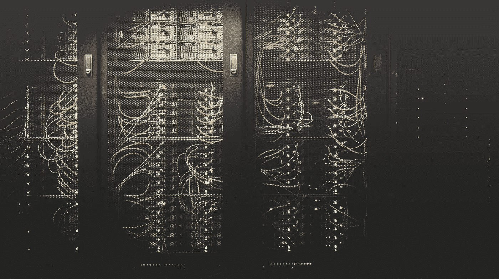
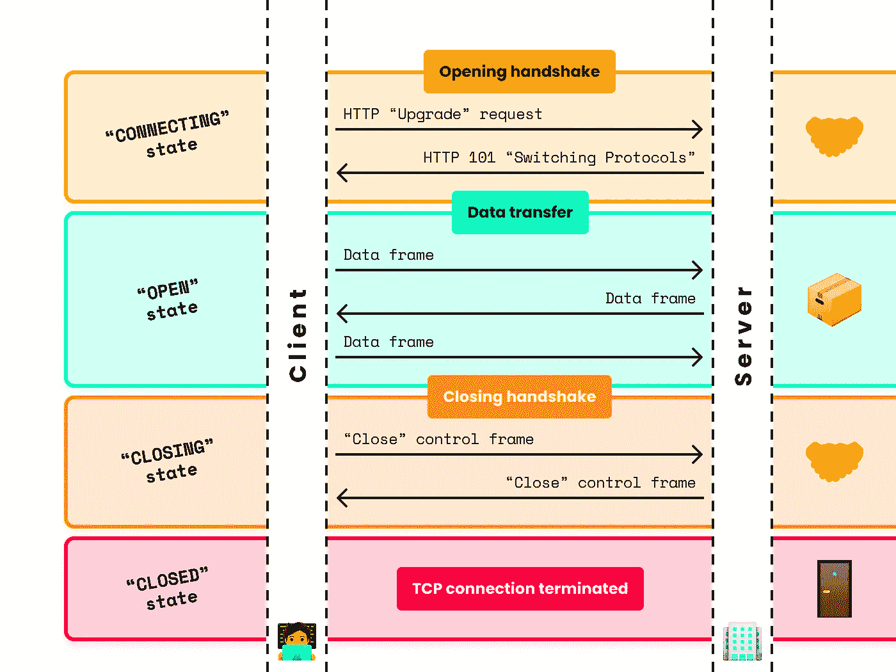
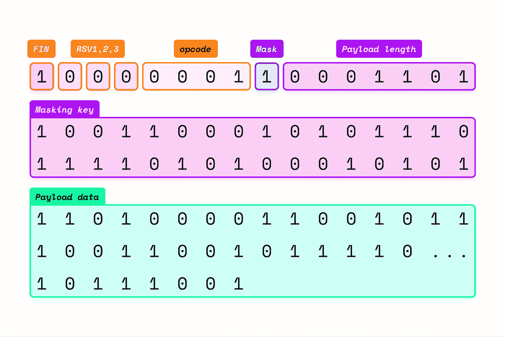

# WebSockets 揭秘，第 1 部分:理解协议

> 原文：<https://levelup.gitconnected.com/websockets-demystified-part-1-understanding-the-protocol-fccca2ca75eb>

## 深入了解 WebSocket 连接的生命周期



照片由[泰勒维克](https://unsplash.com/@tvick?utm_source=medium&utm_medium=referral)在 [Unsplash](https://unsplash.com?utm_source=medium&utm_medium=referral) 拍摄

发出请求，得到响应:大多数 HTTP 连接都是这样开始和结束的。但有时，这还不够:当你需要在应用程序和服务器之间实现实时双向通信时(例如，如果你正在构建一个聊天应用程序或基于网络的协作编辑器)，这就是 WebSockets 的用武之地。在本文中，我们将了解 WebSocket 协议是如何工作的；在第 2 部分中，我们将使用 React 构建一个聊天室应用程序——最重要的是，我们不会屈服于套接字的抽象。IO 提供。

*注意:为了简单起见，本文将只广泛讨论 HTTP/1.1 上的 WebSockets。尽管这不是最前沿的技术(Chrome 和 Firefox 最近通过 HTTP/2 提供了对 WebSockets 的支持)，但它是迄今为止最成熟和最健壮的技术，对它的支持可以追溯到 2011 年。*

# WebSocket 连接的生命周期



显示 WebSocket 连接生命周期的简化图。

从广义上讲，WebSocket 连接可以分为三个部分，总共有四种状态:开始握手(对应于`CONNECTING`状态)、数据传输(可能发生在`OPEN`状态期间)和结束握手(将连接从`CLOSING`状态带到`CLOSED`状态)。这一切都从一个简单的 HTTP 请求开始…

## 开场握手

首先，什么是握手？你可能已经听说过这个词在 HTTPS 的上下文中使用，因为那确实是这个概念适用的另一个地方。简单地说，正如你可能想象的那样，握手由网络上的两方之间的协议组成，在大多数情况下，这两方是客户端(应用程序或浏览器)和服务器。既然是协议，那么双方都有发言权是合理的——相当不奇怪，事实上，客户端和服务器都积极参与握手。

如上所述，第一次握手以来自客户端的 HTTP 请求开始，看起来像这样:

```
GET /chat HTTP/1.1
Host: server.example.com
Connection: upgrade
Upgrade: websocket
Origin: <http://example.com>
Sec-WebSocket-Key: NnRlZW4gYnl0ZXMgbG9uZw==
Sec-WebSocket-Protocol: html-chat, text-chat
Sec-WebSocket-Version: 13
```

感觉不知所措？让我们来分解一下:

*   前两行是对几乎所有 HTTP 请求的介绍:它们告诉网络客户机想要连接到什么服务器(在本例中是`server.example.com`)以及它想要如何连接到服务器(握手是一个`GET`请求，它使用 HTTP/1.1 连接到 WebSocket 端点，在本例中是`/chat`)。
*   第二两行通知服务器，如果握手成功，客户端希望*将连接升级*到 WebSocket 协议(即，将其协议从 HTTP 更改为 WebSocket)。
*   浏览器会自动包含`Origin`标头，并告知服务器请求来自哪个网站。

最后三个头包含一些特定于 WebSocket 的信息，这些信息允许服务器建立连接。

*   `Sec-Websocket-Key`是一个随机的 16 字节 base64 编码的字符串，稍后将使用它来确保服务器支持 WebSocket 协议。
*   `Sec-Websocket-Protocol`是客户想要使用的内部*子协议*的列表。你会问，什么是子协议？仅仅是一个内部约定，规定了什么数据将被交换——你可以把它看作类似于“API 版本”字段的东西。在上面的例子中，客户机实际上是在告诉服务器，“我想使用`html-chat`协议与您交谈，但是如果那不可用，我也可以使用`text-chat`”。
*   最后，`Sec-WebSocket-Version`告诉服务器应该使用哪个版本的 WebSocket 协议:2011 年 12 月发布的版本 13 是最新的官方标准。

除了这三个之外，客户端还可以指定一个`Sec-WebSocket-Extensions`头，请求服务器启用 WebSocket 协议的一个或多个扩展——但是这本身就是一个完整的世界，远远超出了本文的范围。

这是客户端握手的一部分 WebSocket 连接现在处于`CONNECTING`状态。但是服务器在这个协议中也有发言权—让我们看看它是如何回应的:

```
HTTP/1.1 101 Switching Protocols
Connection: upgrade
Upgrade: websocket
Sec-WebSocket-Accept: 5TJpHv9RoAl7w8ytsXcWxTOZ9Q==
Sec-WebSocket-Protocol: new-chat
```

这个应该更简单一点。正如我们阅读的前三行，握手是成功的:**连接已经被转换成 WebSocket，并将保持活动状态**(这与 HTTP/1.1 连接不同，后者往往在服务器响应时就被关闭)。此外，`Sec-WebSocket-Protocol`头用于向客户机传达服务器支持`html-chat`子协议，因此，根据请求，这将在整个通信中使用。但是`Sec-WebSocket-Accept`呢？这是服务器向客户机证明它支持 WebSockets 的方式，事实上，它是使用`Sec-WebSocket-Key`计算的(还记得吗？)作为起点。这个过程并不简单，但应该很容易理解——它只是一系列操作字符串的步骤:

1.  首先，服务器从请求头中读取`Sec-WebSocket-Key`，并将其与“神奇字符串”`258EAFA5-E914-47DA-95CA-C5AB0DC85B11`(一个任意的常量)连接起来。使用我们例子中的密钥，我们得到`NnRlZW4gYnl0ZXMgbG9uZw==` + `258EAFA5-E914-47DA-95CA-C5AB0DC85B11` = `NnRlZW4gYnl0ZXMgbG9uZw==258EAFA5-E914-47DA-95CA-C5AB0DC85B11`。
2.  然后，服务器计算这个新字符串的 SHA-1 散列，在我们的例子中是`SHA1(NnRlZW4gYnl0ZXMgbG9uZw==258EAFA5-E914-47DA-95CA-C5AB0DC85B11)` = `e53269001eff51a0097bc3ccadb17716c53399f5`。
3.  最后，服务器将这个散列编码为 Base64(请记住，它将散列视为一个字节列表，因此是`0xe5`、`0x32`、`0x29`等，而不是实际的字符串)，这是计算`Sec-WebSocket-Accept`、`5TJpHv9RoAl7w8ytsXcWxTOZ9Q==`的最后一步。

响应被发送到客户端，连接保持打开:握手完成！连接现在处于`OPEN`状态。是时候交换一些数据了…

## 数据传输



显示 WebSocket 消息框架结构的简化图。

既然已经执行了开始握手，客户端和服务器可以自由地以*消息帧*的形式互相发送数据，即具有特定结构和含义的一系列位。消息帧不是 WebSockets 特有的概念，因为它们适用于 TCP 协议上的所有连接(TCP 协议是 HTTP/1.1 和 HTTP/2 的基础)，但出于我们的目的，我们将只考虑 WebSocket 帧的结构。让我们按顺序进行:

*   WebSocket 消息帧的第一位是`FIN`位，表示该帧是否是消息的最后一帧。在绝大多数用例中，这个位总是`1`(即`true`)，因为每个消息都将在自己的帧中发送。然而，如果，比如说，数据的初始大小未知，或者它非常大并且分割它很方便，那么`FIN`位可以被设置为`0`，表示更多的数据将出现在随后的帧中。
*   `FIN`位之后是另外三个位，分别称为`RSV1`、`RSV2`和`RSV3`，它们可能包含一些用于已启用的任何扩展的额外数据。如果没有启用扩展，则三者都必须为零。
*   另外四位组成了`opcode`，它回答了“应该如何解释这些数据”的问题在本文的后面，我们将深入探讨这四个位的含义以及它们可能取的值。
*   在`opcode`之后，单个`Mask`位指示数据是否已经被*屏蔽*。在 WebSockets 中，屏蔽是指出于安全目的对消息数据进行简单的对称加密——从客户端发送到服务器的所有数据都必须屏蔽，而服务器可以决定不屏蔽它发送的数据。
*   接下来的几个位(数量为 7、7+16 或 7+64，取决于它们的值)以字节为单位指定有效载荷数据的长度。
*   如果`Mask`位被设置为`1`，则代表有效载荷长度的位后面将跟随`Masking key`，即用于加密数据的 4 字节随机密钥。否则，如果消息没有被屏蔽，这 32 位将被省略。
*   最后，可变数量的字节组成了`Payload data`，正如您所想象的，这是消息的实际内容。

**帧类型和** `**opcode**` **帧类型**

我们之前忽略了它，所以现在让我们更详细地了解一下`opcode`位的含义。但是我们应该首先后退一步，定义 WebSocket 连接的两种抽象框架类型:

*   **数据帧**用于传输应用数据(咄！)并且有三种类型:包含文本数据的帧、包含二进制数据的帧、以及为通过前一帧传输的部分数据提供延续的帧(这些帧必须跟随将`FIN`位设置为`0`的帧，即携带不完整数据的帧)。
*   **控制帧**传输关于连接本身的元数据，包括“关闭”帧、“ping”帧和“pong”帧。“Ping”和“pong”帧可用于验证连接的状态，而“close”帧启动结束握手——稍后将详细介绍！

考虑到这一点，`opcode`很容易理解:每个`opcode`值对应一个帧类型。具体来说，

*   `0000`(十六进制`0x0` ) →“连续帧”(用于跨多个帧拆分的消息)，
*   `0001` ( `0x1` ) →文字框架，
*   `0010` ( `0x2` ) →二进制帧，
*   `1000` ( `0x8` ) →关闭框架，
*   `1001` ( `0x9` ) → ping 帧，
*   `1010` ( `0xA` ) →乓帧，以及
*   所有其他可能的值(`0x3`至`0x7`和`0xB`至`0xF`)保留供将来使用。

有一点需要注意:对于数据帧，前导(第一)位总是`0`，对于控制帧总是`1`。

## 闭幕握手

天下没有不散的宴席，每个 WebSocket 连接也是如此。不过谢天谢地，结束握手比开始握手简单多了！它只包括几个步骤:

1.  两个对等体中的一个——无论是客户端还是服务器——发送“关闭”控制帧，可选地指定状态代码和/或关闭连接的原因。WebSocket 连接进入`CLOSING`状态。
2.  另一个对等体用另一个“关闭”帧来响应。

此时，WebSocket 连接处于其`CLOSED`状态，底层 TCP 连接可以安全地终止。然而，如果两个对等体中的一个突然关闭了 TCP 连接，该怎么办呢？这也很好:用技术术语来说，我们会说 WebSocket 连接被关闭了，但不是“干净地”(也就是说，它跳过了`CLOSING`状态)。

# 我必须自己编码这些东西吗？

这样做将是一个奇妙的编程练习！但是，幸运的是，许多现有的解决方案处理了庞大的底层逻辑(最著名的是自 2011 年以来内置于所有浏览器中的 JavaScript `WebSocket` API)，使我们能够专注于最重要的事情:**我们的应用程序和服务器之间简单、实时、双向的消息交换**。

在第 2 部分中，我们将利用内置的`WebSocket`浏览器 API 和 Node.js `ws`库来构建一个简单的聊天室应用程序，它还将提供一些额外的特性来充分利用 WebSockets 的能力。

# 附录:出于好奇…

我试图在整篇文章中尽可能地详细，但是至少有一点我必须承认我故意忽略了，那就是为什么屏蔽对于客户端到服务器的消息帧是必要的解释。如果你想了解更多，我推荐你参考 StackOverflow 上的[这个问题以及它的答案和评论链接到的许多有用的资源。](https://stackoverflow.com/questions/33250207/why-are-websockets-masked)

或者，为了更深入、更全面地解释 WebSocket 协议，这里的是该标准的链接——它相当长，但我认为值得一看！