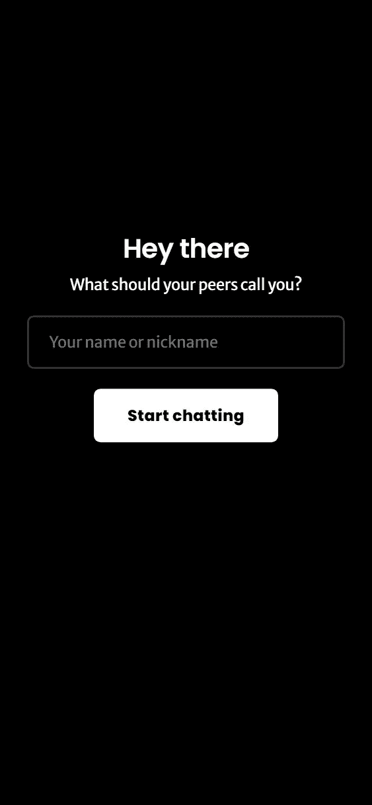
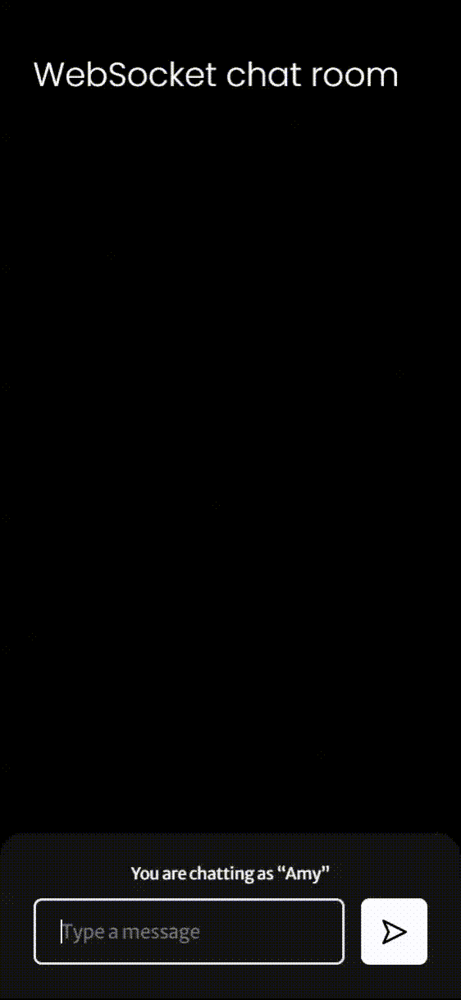
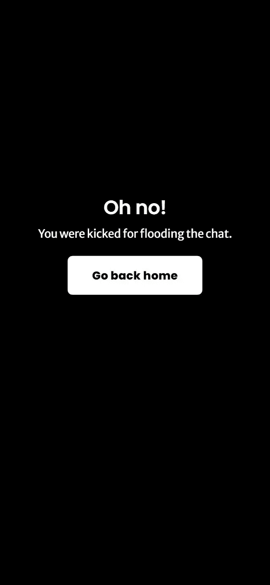

# WebSockets 非神秘化，第 2 部分:使用 React 和 Node.js 构建聊天应用程序——不使用 Socket。超正析象管(Image Orthicon)

> 原文：<https://levelup.gitconnected.com/websockets-demystified-part-2-building-a-chat-application-with-react-and-node-js-a52e0b7accf8>

## 让我们不要屈服于其他库提供的抽象


安妮·斯普拉特在 [Unsplash](https://unsplash.com/) 上拍摄的照片

在这个简短系列的[第 1 部分中，我们深入了解了 WebSocket 在 web socket 连接的整个生命周期中的工作方式。现在，我们将使用 React 和 Node.js 构建一个简单的聊天室应用程序，只需添加一些附加功能，就可以充分利用 WebSocket 协议提供的特性。](https://medium.com/p/fccca2ca75eb)

# 先决条件

本教程适用于大多数人，但不是所有人——但是如果你点击了这篇文章，你就满足了所有的要求。要构建此应用程序，您需要

*   良好的 HTML 和 JS 知识，
*   React 和 Node.js 的一些经验，以及
*   对 WebSocket 连接生命周期的深刻理解(我们在第 1 部分中讨论过)。

除此之外，如果你有使用像 Webpack 这样的工具链的经验，还有额外的好处——在本教程中我们将使用 Vite，但是我已经设置好了。

# 首先:搭建应用程序

为了简洁起见，我将避免描述启动和运行我们的项目所需的所有无聊的设置步骤:我们将从一个样板文件开始，您可以通过运行

```
npx degit https://github.com/DamianoMagrini/websocket-chat-room-boilerplate.git websocket-chat-room
```

这会创建一个带有两个子目录的`websocket-chat-room`文件夹:

*   `client`，我已经用 Vite 构建工具建立了一个 React 应用程序，并用 React 路由器连接了一些页面
*   `server`，它包含一个非常简单的 Node.js 应用程序，安装了`ws`依赖项和一个导入它的`main.js`文件。

通过构建这两个样板，我们将有机会在客户端和服务器端实践 WebSocket。先从后者说起吧！然而，在开始之前，您应该运行`client`和`server`目录中的`npm install`(或`yarn`)。

# 实现服务器

# 我们将会建造什么

在进入实际代码之前，让我们概述一下我们的行动过程:

1.  首先，我们将启动一个服务器来监听 HTTP/1.1 连接，并能够将它们`Upgrade`到 web sockets——虽然这听起来可能很复杂，但由于有了`ws`库，这实际上是一个单行程序。
2.  然后，每次启动一个新的 WebSocket 连接时，服务器应该存储一个对用户套接字的引用，并将其添加到一个打开的套接字的`Set`(对应于当前连接的用户)。
3.  每当服务器接收到来自一个套接字/用户的消息时，它应该将它们发送给每个套接字/用户。
4.  最后，当一个套接字关闭时，服务器应该从`Set`中删除它的引用(不这样做将导致内存泄漏)。

# 代码

我们现在可以直接进入代码了！在运行了`server`目录中的`npm install`(或`yarn`)之后，让我们打开`lib/main.js`，在这里，正如您将看到的，`ws`包已经被`require` d 了。在这里，我们可以通过键入:

这行代码将启动一个 WebSocket 服务器，该服务器接受端口`8081`上的连接(`8080`也是一个合理的选择，但这恰好是我们的客户端应用程序的默认端口)。如果我们想在服务器启动时得到通知，我们还可以包括一个回调，如下所示:

在这一点上，我们的服务器是相对无用的:除了处理打开和关闭握手之外，它不会对它接收到的连接做任何事情。让我们通过监听新的 WebSocket 连接来解决这个问题——同时让我们初始化用户的`Set`:

每次初始化新的 WebSocket 连接时，`server.on`中的代码都会运行。这段代码目前做两件事:

*   它将两个(当前为空)事件侦听器附加到每个新套接字，并且
*   它创建一个`userRef`对象，并将其添加到`users`集合中(我们将使用它来存储关于每个用户的一些额外数据——但是现在，它只包含一个对套接字的引用)。

至于`close`监听器，这很简单:当用户断开连接时，我们将从集合中删除他们的`userRef`。因此，我们的代码变成了:

如果您想知道为什么我使用了一个`Set`而不是一个`Array`，这个片段可能会让您更清楚:`Set` s 允许您通过值来删除(因此我们可以简单地将`userRef`传递给`delete`方法)，而`Array` s 要求您提供一个索引(使用`Array`，我们将需要编写`users.splice(users.indexOf(userRef))`，更冗长且性能更差)。

因此，在这一点上，剩下要做的就是实现接收和转发消息的逻辑。让我们从编写一个基本的`sendMessage`函数开始，该函数遍历每个用户并向他们发送消息。(记住 WebSockets 只能传输文本或二进制数据，所以 JS 对象需要被字符串化。你可能会问，“消息不是已经是字符串了吗？”是和否—对于我们的目的，每条消息将有三个属性:发送它的用户的姓名、消息的正文和发送它的时间。)

现在，让我们编写负责处理每个用户发送的消息的逻辑。但首先，让我们来分解一下我们希望发生的事情:

1.  用户发送一条 JSON 消息，它有两个属性:`sender`(用户名)和`body`(消息体)。两者都必须是字符串，否则消息无效。
2.  服务器确保它刚刚收到的消息是有效的 JSON，并试图解析它。如果它不是有效的 JSON，服务器`catch`会接收`JSON.parse`抛出的错误，并在控制台记录一个错误。
3.  服务器还确保`sender`和`body`属性都是字符串。如果不是，它会在控制台记录一个错误并暂停(它不会将消息转发到聊天室)。
4.  最后，如果所有其他步骤都成功，服务器将消息发送给所有用户(使用我们上面定义的`sendMessage`函数)，将其`sentAt`设置为`Date.now()`(发送消息的时间戳)。

相应的代码将如下所示:

## 额外功能:踢不活跃的用户和洪水

让我们首先创建一个简单的系统来踢不活动的用户，即那些在过去 5 分钟(300 秒，或 300，000 毫秒)内没有发送消息的用户。我们将向`userRef`对象添加一个`lastActiveAt`属性，并在用户成功发送消息时更新它(在`try`块的末尾)。

尽管，不可否认，这不是一个很好的实践，我们将使用一个全局`setInterval`来周期性地踢不活动的用户(每 10 秒)。怎么会？就像关闭连接一样简单！

请注意，我们还指定了

*   close 代码(这是任意的:为了一致，每次我们踢用户——不管什么原因——我们将使用代码`4000`；一般来说，该代码的范围可以从`4000`到`4999`，而所有其他值都被保留)和
*   关闭连接的原因(“不活动”)，

这两者稍后都会派上用场。

现在，是时候踢那些泛滥聊天的用户了！👢这样做的逻辑很简单:用户被允许每分钟最多发送 30 条消息，如果他们在过去 60 秒内发送的消息数量超过这个限制，就会因为淹没聊天而被踢。我们将分三步实施:

1.我们首先创建一个全局`recentMessages`数组，在其中我们将存储过去 60 秒内发送的所有消息。

2.每当用户成功发送一条消息时(同样，在`try`块的末尾)，我们将其添加到数组中，并开始超时，60 秒后，将从数组中删除该消息。

最后，我们在调用`sendMessage`之前增加了另一项检查:用户发送的`recentMessages`的数量(即那些`sender`属性等于用户提供的属性)还不大于 30。如果是，我们只是踢用户，再次提供

*   关闭代码`4000`(与之前相同，表示用户被踢)和
*   原因“泛滥聊天”。

这就是我们的后端！概括地说，我们构建了一个服务器，它

*   处理 WebSocket 握手(将 HTTP/1.1 连接转换为 WebSocket 连接)，
*   存储当前连接的所有用户的记录，
*   监听来自每个用户的消息并将它们转发给每个人，并且
*   踢不活跃的用户和那些一直充斥着聊天。

这是我们得到的最终代码:

我们现在可以开始处理客户端了。

# 实现客户端

像以前一样，让我们从概述我们将构建的内容开始:

*   一个身份验证页面，用户可以在其中输入他们的姓名；
*   聊天页面，允许用户发送和接收消息；
*   一个“被踢”的页面，通知用户他们被踢出了聊天，并提供一些关于为什么会这样的附加信息(它将利用前面的关闭代码和原因)。

我已经编写了页面的 CSS 并用 React Router 将它们连接起来，所以我们将跳过这一部分。

## 授权页面



我们将会建造什么

让我们打开`client/src/pages`中的`AuthPage.jsx`文件。正如你所看到的，页面的一部分已经被写好了(T2 钩子提供了一个 T3 函数，可以用来在 React 路由器的路由之间移动)。在`<main>`元素内部，让我们搭建页面的静态内容:

你会注意到我在这里和那里使用了一些奇怪的类名:它们只是为了设计应用程序的样式，使它看起来更好一些——如果你想调整样式或者只是好奇，请随意查看`src/index.scss`内部！

现在，让我们使用`useState`创建一个`name`状态:

然后，让我们通过添加几个属性将其值绑定到`<input>`元素:

最后，让我们创建一个`onSubmit`函数，该函数(只要名称不为空)会将用户路由到聊天室页面...

…让我们在点击按钮或用户按下 `Enter`键时运行此功能。

概括一下，这是这个页面的完整代码:

## 聊天页面



我们将会建造什么

这是我们应用程序的核心，在这里我们打开、交互和关闭 WebSocket 连接。如果你打开`src/pages/ChatPage.jsx`，你可能会注意到我已经包含了一个`sendIcon`元素，我们稍后会用到它。但是首先，让我们通过创建一个标题、一个聊天容器和一个用于消息输入字段的容器来搭建页面:

虽然这可能看起来很多，但我们所做的只是创建静态元素:标题、聊天容器和允许用户键入和发送消息的元素。

**在屏幕上显示信息**

在发送和接收消息之前，让我们编写一些逻辑来将它们显示在屏幕上:我们将创建一个`messages`状态(一个消息数组，每个消息都有`sender`、`body`和`sentAt`属性)，然后将每个消息映射到我们的`chat-view-container`中的一个元素。

然而，如果消息是由当前用户发送的(即，如果`message.sender === name`)，其显示应该略有不同。特别是，

1.  消息容器应该有不同的背景，应该向右刷新而不是向左(`.own-message`类负责这一点)
2.  它应该显示“您”，而不是显示发件人的姓名。

让我们实现这些变化:

**接收消息**

WebSockets 时代到了！让我们在安装了`ChatPage`组件时建立一个 WebSocket 连接——我们将使用一个`useEffect`钩子来启动连接，并使用一个`useRef`钩子来保存对它的引用。

如您所见，这段代码将连接到`localhost`的端口`8081`(您可能还记得，我们的服务器就在这里)，但它不做任何其他事情。让我们添加两个侦听器:

*   一个`onmessage`监听器，在这里我们将向`messages`数组追加新消息；
*   一个`onclose`监听器，我们将检测用户是否被踢(在这种情况下，关闭代码将是`4000`)，如果是，将他们重定向到“被踢”的页面，包括 React 路由器的状态中被踢的原因。

下面是它在代码中的样子:

注意，我们没有包括`try` / `catch`块，因为我们可以相信服务器只会发送有效的 JSON。最后，让我们添加一些清理代码，以便在用户离开页面时关闭连接:

因为我们已经将`messages`数组与用户将在屏幕上看到的内容连接起来，所以我们没有更多工作要做。

**发送信息**

我们已经设置了`message-input-container`，所以现在我们需要让它具有交互性。让我们创建一个`messageBody`状态，并将其值绑定到`<input>`:

现在，让我们编写一个`send`函数

1.  确保消息正文不为空，
2.  发送消息，然后
3.  清除输入内容。

我们将把它连接到`<input>`和`<button>`，就像我们在 auth 页面中做的那样。

让我们添加一些收尾工作。

**禁用按钮，直到连接打开**

如果用户在特别慢的网络上，WebSocket 连接可能需要一些额外的时间来打开——为了确保在连接打开之前没有消息被发送，我们可以禁用该按钮。这很容易做到:我们会的

1.  创建默认为`false`的`isConnectionOpen`状态，
2.  如果`isConnectionOpen`为`false`，禁用该按钮
3.  一旦连接打开，就将状态设置为 true。

在代码中，

**滚动到最后一条消息**

这是这一页的最后一步，我保证。每当接收到新消息并将其添加到`messages`数组中时(这相当于说，“每当`messages`数组的长度改变时”)，我们将滚动到聊天容器的底部，显示新消息。这很容易做到:我们只需要在聊天容器的最底部添加一个占位符`<div>`，每当`messages.length`发生变化时就滚动到视图中(我们将用一个`useEffect`钩子来实现)。

这就是聊天页面——唷！😅让我们回顾一下我们编写的整个代码:

最后一次努力！让我们创建“被踢”的页面。

## “被踢”的一页



我们将会建造什么

这个页面在结构上与 auth 页面非常相似，都有一个标题、一个副标题和一个返回主页的按钮(这里没有输入——简单多了！).您可能还记得，我们将被踢的原因作为这条路由的状态进行了传递:在第 6 行(`const { state } = useLocation()`)我们检索了这个状态。在`<main>`元素内部，让我们模拟一下 auth 页面的结构:

搞定了。👌为了方便起见，下面是完整的代码:

# 把所有的放在一起

我们现在可以打开两个终端窗口，一个在`server`目录，一个在`client`目录。在服务器目录中，我们可以运行`npm start`或`yarn start`来启动服务器；另一个中，`npm run dev` / `yarn dev`会启动开发服务器，打开 app。玩弄它！打开多个窗口，输入愚蠢的用户名，等待被踢或淹没聊天——世界是你的牡蛎。一旦您觉得已经准备好构建应用程序，您可以通过运行`client`目录中的`npm run build` / `yarn build`来完成(服务器可以按原样运行)。

# 总结:我们学到并应用的东西

为了巩固我们的知识，让我们回顾一下我们在这个由两部分组成的系列中所学的概念:

*   我们研究了 WebSocket 协议的内部工作和生命周期。
*   使用 Node.js 和`ws`，我们建立了一个 WebSocket 服务器，将每个用户的消息转发给所有用户，踢走不活跃的用户和那些淹没聊天的用户。
*   使用 React 和原生的`WebSocket` API，我们为我们的应用程序编写了一个 WebSocket 客户端，它处理消息交换和发送。

你觉得你掌握了所有这些概念吗？如果是这样的话，我全心全意鼓励你去实践，自己打造一些东西去实践。如果有不清楚的地方，请告诉我——我很乐意与您联系并提供帮助！