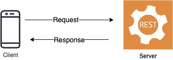
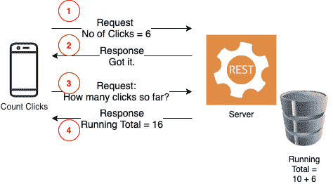
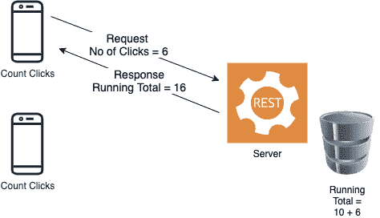
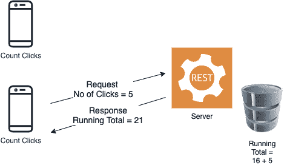

# WebSockets:数据工程中鲜为人知的模式

> 原文：<https://levelup.gitconnected.com/websockets-lesser-known-pattern-in-data-engineering-200329e90331>

*了解如何使用 API 方法，使用 WebSockets 在客户端和服务器之间异步进行全双工数据传输，web sockets 是 HTTP 的升级版，提供了一个有效的 Python 代码。*


图片提供:【http://www.freepik.com】>Freepik</a>

# 让我们补上 API

T 典型的数据集成管道通常是单向的，例如移动应用程序等客户端调用运行在某处服务器上的 RESTful API。API 完成所有工作，并将结果发送回客户端。如果客户机再次需要相同的数据，它必须再次调用 API。如果它需要持续的数据，例如更新它自己的仪表板，它必须反复调用 API 来获取最新的数据。



这种模式的成功有多种原因。请求和响应通过 http(或 https，如果需要的话)调用，这是相当标准的。有效载荷可以是可变的，以适应所有类型的数据，并且响应可以是可预测的。如果一切顺利，它将获得 200 的响应代码。请求响应对也是异步的，即一个 API 可以在任何时候接收 1000 个调用，并行处理它们，并且并行发送响应。

# HTTP 的问题是

有两个问题。首先，这种情况下的服务器或 API 是被动的。它等待来自客户端的调用，然后才发送数据。在任何时候，通信都是单向的。请求来自客户端；API 处理它，响应它，这就是通信的结束。请注意，这是一次纯单向的数据移动；这不是双向的，也不是闲聊。换句话说，它不是全双工的，也不是实时的。

第二个问题是，API 本身不会将任何其他内容发送回客户端。这是第一个问题的必然结果。由于通信是由客户机驱动的，而不是由服务器驱动的，所以服务器没有利用向客户机发送数据的时间来发送自己的数据。因此，客户端不断轮询 API 以获取最新的数据。不仅浪费带宽；这增加了流程的延迟，因为数据仅与上次轮询时一样好。

例如，考虑一个客户端应用程序，它测量用户在网页上的点击，并将计数发送到 API，该 API 计算所有客户端的运行总数，并将其存储在数据库中。但是客户端还需要知道所有客户端的总数，以便显示在其网页上。在普通的 API 设计中，它是这样工作的:



## 事件顺序:

1.  客户端使用参数点击次数= 6 调用 API
2.  API 得到它，更新它的数据库，并以“得到它”作为响应。在 API 术语中，我们称之为响应代码 200。所有客户端的累计点击量为 10 次。随着来自客户端的新计数 6，累计总数现在是 10+ 6 = 16。通讯关闭。
3.  但是客户端仍然需要知道显示在其页面上的总数。所以它向 API 发送另一个请求。这次是一个 GET 请求。
4.  API 以 16 作为响应。通讯关闭。

有两个通信线程，都是由客户端发起的。既然通信已经打开，让服务器在第一个线程上把运行总数推送到客户机不是很好吗？例如，除了 200 代码之外，它还可以发送累计总数，从而消除第二次通信。更好的是，这将是客户端的实时数据更新，而不是单独的请求，如下图所示。



考虑一个真实的例子，其中多个客户端正在报告它们的计数，当它们报告计数时，将从 API 获得运行总数。例如，另一个客户端报告它的点击，5，在它的情况下:



# 直接耦合系统的问题

难道我们不能通过使两个系统(客户机和服务器)直接耦合来使过程双向化吗？当然，我们可以；但是我们遇到了两个问题:

首先，它将不是一个 RESTful API。这将只是两个程序同步通信，这降低了可伸缩性。想象一下在前面的例子中，当两个客户端进行同步调用时，其中一个必须等待。成千上万的客户同时打电话会使情况变得更糟。

第二，它不会通过 http 进行通信，http 是与为它配置的防火墙进行数据通信的公认标准，代理服务器理解它，并且客户端(如 web 浏览器和 SDK)可供它使用。

仔细想想，我们真的不需要持续的、专用的或同步的连接。我们只是想让数据交换是双向的，这样服务器就有机会向客户端推送一些东西，而无需客户端明确请求。我们喜欢 API 方法；但是我们需要做些什么来使这个过程更轻松。

让我们稍微清楚地检查一下问题陈述:

> 我们希望让服务器通过 http(或 https)将一些数据推送到客户端，而无需客户端显式请求。

# 那么，我们怎么解决呢？

有多种选择。一种选择是进行 http 长轮询。我们只是保持客户端和 API 之间的连接长时间开放，允许客户端实时获得更新。在某些情况下，这可能是可取的；但不是全部。而且它也不可伸缩。对于全双工数据传输，出现了一套统称为 **Comet** 的方法([https://en . Wikipedia . org/wiki/Comet _(programming)](https://en.wikipedia.org/wiki/Comet_(programming)))。它没有被采用；但它确实引发了对标准化过程的需求的思考，以便通过 http 协议实现全双工数据传输。这些标准化产生了两种模式:websockets 和服务器发送事件(SSE)。WebSockets 是一种协议，允许全双工数据传输。在这个博客中，你将了解 websockets，将 SSEs 留给未来的博客。

不要把它和一个看似相似但不同的概念混淆，这个概念叫做双向 API 调用，通常叫做 **webhooks** 。我们将在另一篇博客中探讨这个问题。

# 让我们探索一下 websockets

我将把 WebSockets 的完整历史和发展留给它在维基百科上的文章([https://en.wikipedia.org/wiki/WebSocket](https://en.wikipedia.org/wiki/WebSocket))。简而言之，WebSockets 协议允许数据通过 TCP 协议从服务器返回到客户端。它们与 http 协议不同，但与之兼容，因此通信分别通过 http 和 https 的端口 80 和 443 进行。这在已经考虑到这些端口的防火墙和代理配置中非常有用。

等等！这是令人困惑的。WebSockets 是一个*不同的*协议，不是 http 但是*跟它兼容*吗？你可能会问，这实际上意味着什么。

# 免费升级

这就是 http 中引入的一个特性有所帮助的地方。HTTP 允许您将请求的连接升级到其他连接。HTTP 1.1 允许的升级屈指可数，分别是 h2c、HTTPS/1.3、IRC/6.9、RTA/x11、websocket。升级允许请求以普通 http 协议的形式出现，但随后升级到协议列表中的其他协议。在这种情况下，websocket 是经过批准的升级。在握手期间，协议被升级。

典型的 http 请求具有以下 URI(统一资源标识符)结构

```
http://host[:port]path[?query]
```

WebSocket 请求看起来与此完全一样，只是使用了不同的协议标识符(“ws”)

```
ws://host[:port]path[?query]
```

就像 http 的 https 一样，安全 ws 也有 wss 版本。需要 WebSocket 连接的客户端发送以下内容:

```
GET ws://www.proligence.com:5678/ HTTP/1.1Host: localhost:5678Connection: UpgradePragma: no-cacheCache-Control: no-cacheUpgrade: websocketSec-WebSocket-Version: 13Sec-WebSocket-Key: q4xkcO32u266gldTuKaSOw==```
```

注意这些线条

```
Connection: UpgradeUpgrade: websocket
```

这是客户端要求将此连接请求升级到 WebSocket 连接的地方。假设服务器支持 WS 并愿意这样做，它会做出如下响应:

```
HTTP/1.1 101 Switching ProtocolsUpgrade: websocketConnection: UpgradeSec-WebSocket-Accept: fA9dggdnMPU79lJgAE3W4TRnyDM=
```

行`HTTP/1.1 101 Switching Protocols`在告诉客户端协议已经从 http 切换到 WS 时非常关键。现在客户机有了一个从 http 连接升级的 WebSocket 连接。没有比免费升级更好的了。

顺便说一下，如果你想了解 WebSocket 协议的数据包格式规范，欢迎你访问 https://tools.ietf.org/html/rfc6455#section-5.1 的 IETF 官方页面。但是请放心，要利用 WebSockets 的强大功能，您不需要学习这些。

# Sec 参数

你可能会问，上面回答中的`Sec-WebSocket-Key`和`Sec-WebSocket-Accept`值是什么？

请记住，WebSocket 在客户端和服务器之间建立了双向双工通信。两者*再利用*http；但是协议不是 http。这带来了安全风险。如果其中一个将 WebSocket 数据误解为正常的 http 请求怎么办？他们都必须明确地知道，在整个过程中，他们都支持 WebSocket，并且通信是基于 web socket 的；不是 http。因此，他们必须建立某种验证，以确保 WS 请求不会被误解为 http。这就是为什么他们需要用一个密钥来验证请求，而 http 并不需要这个密钥。客户端在其请求中发送一个随机生成的密钥(称为“nonce”):

`Sec-WebSocket-Key: dGhlIHNhbXBsZSBub25jZQ==`

服务器接受这个值，连接一个静态值 258 eafa 5-E914–47DA-95CA-C5 ab 0 DC 85 b 11(在 RFC 6455 中定义)，接受结果值的 base-64 编码，这是它在自己的响应中发回的内容:

```
Sec-WebSocket-Accept: fA9dggdnMPU79lJgAE3W4TRnyDM=
```

客户端检查报头并计算相同的值，只有当值匹配时才接受 WebSockets 帧。这样，客户机和服务器就可以确信 WS 请求不会被误解为 http。

# 行动中的准则

充足的理论。如果你像我一样，你一定渴望行动。使用 WebSockets 有多容易？你需要知道所有的帧布局，基数 64 的值是如何计算的，等等。？

幸运的是，没有。大多数现代语言都支持 SDK 来启动 WebSockets。让我们考虑我们上面描述的例子，即，在全双工通信中，客户端需要将其计数发送到 API，并在相同的数据传输中从服务器获得运行计数。我们将用 Python 实现它。

我们将创建两个程序:

1.  **服务器**，它是一个 API，监听来自客户端的 WebSocket 请求。当连接建立后，它从客户端接收计数数据，从所有客户端更新其运行总数，并将当前运行总数发送到客户端，所有这些都在同一个线程中。
2.  **客户端**，这只是一个简单的微服务，它发送计数数据(为了简单起见，我们让用户在运行时输入数据)并从服务器接收总计数，显示它并切断连接。

以下是代码:

**Server.py**

```
import asyncio as aioimport websockets as wsssum = 0print(f”Waiting for clients to connect. Running total = {sum}”)async def add(wss, ev): global sum event = await wss.recv() print(f”Debug: Received {event}”) sum = sum + int(event) await wss.send(str(sum)) print(f”Running total = {sum}”)ws_server = wss.serve(add, “localhost”, 8181)aio.get_event_loop().run_until_complete(ws_server)aio.get_event_loop().run_forever()
```

让我们来剖析一下代码。

因为这是一个 API 调用，我们需要这个调用是异步的(你马上就会了解到)，因此我们需要导入模块 asyncio。我们还需要导入模块 websockets，它封装了使用 WebSockets 所需的所有基础。如果您没有它们，当然需要使用以下命令来安装它们:

```
pip install websockets
pip install asyncio
```

接下来，我们定义一个名为“sum”的变量，并在服务器启动时将其设置为 0。我们计算累计总数的主要函数名为“add”。在这个函数中，我们将添加从客户端获得的计数；但是我们需要这个值对整个程序可见，所以我们需要将这个变量定义为一个全局变量。这在 python 中至关重要。否则变量将是函数的局部变量，从函数外部对它的任何引用都将是无效的。

接下来，您可能会看到不太常见的声明

```
async def add(wss, ev)
await wss.send(str(sum))
```

这些是在 python 中定义异步流程所必需的。在这个小博客中，不可能公正地评价这些关键词的作用；所以我会留到下次。

其余的是不言自明的。我们在端口 8181 上定义了一个名为 ws_server 的 web 服务器，它支持 websockets 协议，当收到请求时，它调用 add()函数来更新 sum 变量，然后通过相同的连接将变量的值发送给客户端。

现在让我们编写一个简单的客户端程序，它通过 API 调用将其计数发送给服务器，并接受服务器通过同一连接发送的任何内容。我们将使计数成为用户的输入。

**Client.py**

```
import asyncio as aioimport websockets as wsasync def send_event(): uri = “ws://localhost:8181” async with ws.connect(uri) as wss: event = input(“What is the number you want to send? “) await wss.send(event) recv_event = await wss.recv() print(f”Running total so far (received): {recv_event}”)aio.get_event_loop().run_until_complete(send_event())
```

有了这两个工具，在一个窗口中，从命令行运行`python server.py`。该程序将显示以下内容，并等待客户端连接。

```
Server> python server.pyWaiting for clients to connect. Running total = 0
```

在不同的窗口中，从命令行运行`python client.py`。

```
Client> python client.pyWhat is the number you want to send? 1Running total so far (received): 1
```

在服务器窗口中，您可以看到以下消息:

```
Debug: Received 1Running total = 1
```

客户端程序已经退出。在另一个窗口中，运行相同的 client.py，这次传递“3”:

```
Client> python client.pyWhat is the number you want to send? 3Running total so far (received): 4
```

在服务器窗口上，您可以看到以下内容:

```
Debug: Received 3Running total = 4
```

服务器保持运行总数，这并不有趣。但是关键的事情是**服务器将它推送给客户端**。客户端没有从服务器中提取它。所有这些都是通过 API 调用实现的；不是两个系统之间的同步数据传输。

这仅仅是说明 WebSockets 概念的一个例子。这并不像看起来那样具有限制性。服务器可以发送它想要的任何数据；而不仅仅是本例中显示的累计计数。在实际使用中，它可能会发送一个 JSON 对象，客户端将解析该对象并从中获取有意义的数据。例如，在工厂的机器中运行的客户端可以发送由其传感器记录的功耗数据，而服务器可以跟踪所有客户端的最大功耗。如果任何地方达到最大功耗，服务器将发出警告，甚至命令关闭一些机器以降低整体功耗，从而降低电网风险。该警告通过同一通信从服务器实时发送到客户端，而无需客户端明确请求。

# 概括起来

1.  WebSocket 是一种新的协议
2.  它与 HTTP 兼容
3.  请求以 WS 协议的形式出现；但是通过普通的 HTTP 端口
4.  该请求包括升级连接的请求
5.  如果连接从 HTTP 升级到 WS，连接将变成全双工
6.  这允许以正常的 API 请求-响应方式进行完全双向的数据传输
7.  服务器可以将数据推送到客户端，而无需客户端通过同一连接明确请求数据