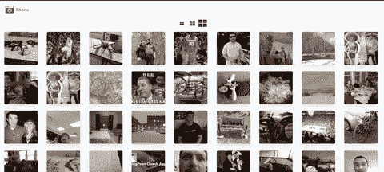
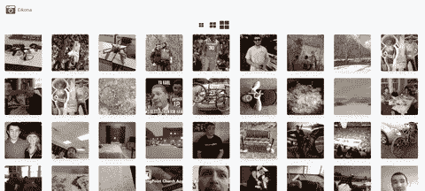

# Websockets streaming magic —在 Vue.js 中加载成千上万的图像。

> 原文：<https://levelup.gitconnected.com/websockets-streaming-magic-loading-thousands-of-images-in-vue-js-26f29eac5fe6>

Eikona 照片托管服务(原型)

在我的上一篇文章中，我简要地谈到了廉价的、可伸缩的、最重要的是性能良好的基于云的对象存储的重要性。然后，我花时间向您介绍了如何设置和导入您的数据到 B2，我目前正在使用。在这篇文章中，我将向你展示我是如何在没有任何加载指示器、屏幕或用户体验中断的情况下，优化加载数千幅图像的(UX)。如果你想继续下去，赶上我们现在的位置，请随时查看我上一篇关于 B2 的文章。

 [## 用于原型制作和生产的廉价且高性能的对象存储。

### 如果你一直在关注我过去的一两篇文章，那么你就会知道我正在寻求创造一个高性能的…

thomasunderwoodii.medium.com](https://thomasunderwoodii.medium.com/cheap-and-performant-object-storage-for-prototyping-and-production-8664d317dc8e) 

任务是:从用户的照片库中加载成千上万的图片。问题是:速度、不同的硬件和网络配置以及成本。让我简单介绍一下我们是如何解决这些不同问题的。

**性能**

为了提高性能，我们做了几件事。首先，我们在上传用户图像时对其进行预处理。这意味着，当用户上传他们的图像到 Eikona 时，我们会创建一个缩略图，它是全分辨率图像的缩小版本。我们将原始图像存储在 B2，并将大幅缩小的缩略图(原始照片的 1/10 或更小)保存在服务器的本地磁盘上。当我们的应用程序加载时，我们提供缩略图。这使得我们可以快速加载数千张图片，而不会降低用户体验。

我目前实现了最后一项性能改进。我们在前端和后端服务之间保持一个持久的 WebSocket 连接，而不是直接将图像与 Webpack 捆绑在一起，或者同时处理数千个 HTTP 请求并使浏览器过载。这允许我们在短时间内传输大量数据，并使 UX 和数据读取看起来无缝。

一次加载 2584 张图像(约 4 秒)

**成本**

通过使用廉价的基于云的对象存储解决方案，如 B2 的全分辨率图像，我们能够存储 100 GB 的照片，每月只需几美元。使用像 B2 这样的解决方案的另一个成本效益是，我们只需要在运行后端的服务器上保存缩略图，而不是全分辨率图像。这大大降低了运营成本，因为对于照片或视频等大量数据，基于服务器的块存储与基于云的对象存储相比极其昂贵。

*根据我们的互联网连接速度和用户照片库的大小，我们甚至可以在每次会话前后下载和删除缩略图。

**变化的硬件和网络**

这是一个有趣的问题，我才刚刚开始解决它。大多数性能改进应该也有助于解决这个问题。我提到的性能改进之一是，由于我们使用了 WebSockets，现在我们能够将数据流式传输到前端。这对于互联网连接速度较慢或硬件功能较弱的设备来说非常强大。流式数据允许我们将数据分成更小的一口大小的块，并且只发送在特定时间点请求或需要的内容。WebSockets 对性能影响最大的是初始连接，之后的一切都非常快。然而，重要的是要跟踪哪些数据已经发送到 UI，哪些数据仍然需要流式传输，这与 HTTP 请求不同，在 HTTP 请求中，您通常一次获取所有数据，或者尝试根据 REST 约定将数据拆分。现在，您必须在后端服务级别实现类似于分页的东西。涵盖不同的边缘情况也很重要，例如由于互联网连接不良或浏览器标签被关闭导致的连接断开、浏览器刷新、注销等。

每个请求流式传输 175 张图片(<1s)

# Websocket Implementation Walk-Through

***请注意，这是原型代码，没有验证或最终产品代码所需的其他考虑因素。**

## **前端视角**

让我们一步一步地分解它。

## 已创建()

在将任何组件安装到文档对象模型(DOM)并向用户显示之前，在*创建的*生命周期挂钩中，WebSocket 连接从第一次使用 *this.socket* 对象实例开始，其中 socket.io 正在等待从后端发出的 *connect* 事件。然后是从客户端(前端)Websocket 向 */requestThumbnails* 发出的第一个事件，以在页面加载之前加载前 175 个缩略图。这让用户觉得几乎没有加载时间。最后，在 unload 之前，您会注意到*的事件监听器。*该事件监听器是在浏览器刷新时重置当前加载的缩略图所必需的。

## 已安装()

一旦 UI 通过 Vue.js 挂载到 DOM，就会调用*挂载的*生命周期钩子并执行下面的代码。首先，套接字等待来自 */respondThumbnails 的响应。*第一次触发*/响应缩略图*将响应在*创建的*生命周期挂钩中发出的第一个*/请求缩略图*事件。值得注意的是，所有的**this . socket . on 事件在 *mounted* 生命周期钩子中总是活动的，因为这是 Vue.js 生命周期的当前阶段，当用户查看页面时是活动的。一旦 */respondThumbails* 接收到一个事件，来自后端的新缩略图数据被添加到当前图像中，并且*进入的*状态被设置为假。*进入的*状态与图像加载进度条一起使用，我将在下面解释。下面是一个 W3schools 的链接，我在那里得到了进度条的代码。**

前端 Websocket 代码

 [## 如何创建滚动指示器

### 页眉样式:固定位置(始终位于顶部)*/。表头{位置:固定；top:0；z 指数:1；宽度:100%…

www.w3schools.com](https://www.w3schools.com/howto/howto_js_scroll_indicator.asp) 

## 滚动进度条— Websocket 流魔术

我无意中发现了使用这个滚动进度条的想法，以便直观地向用户显示他们在查看照片的过程中所处的位置，以及他们已经加载了多少照片。许多人使用观察器(一个不可见的 DOM 元素),在请求和/或在 UI 上加载更多数据之前，等待用户在观察器的范围内滚动。我发现这种方法导致了比我希望的更差的用户体验(UX)。我将很快就我的发现写一篇文章。与此同时，我发现使用进度条滚动计算有助于确定用户在页面上的位置，以及他们还能滚动多远。这比观察者惰性加载模式**更有帮助，能创建更好的 UX。让我们回到滚动进度条是如何给我灵感来创建一个比使用观察者惰性加载模式更平滑的 UX 的。当用户滚动时， *window.onscroll* 事件触发，下面代码中相应的函数运行。一旦用户滚动超过页面高度的 75%，就会向后端发出 */requestThumbnails* 事件。这个想法是，相应的响应 */respondThumbnails* 在用户达到页面高度的 100%之前返回，除非所有的图像都已加载。*输入的*变量控制是否可以调用/requestThumbnails。这确保了不会发生对 */requestThumbnails* 的多次调用。**

## **后端透视**

我使用了 *makeMetaData* 来创建一个指定大小的数组——目前是 175。这意味着随着每个 */requestThumbnails* 事件返回到 UI 的图像数量将是 175。 *loadThumbNails* 获取分块的缩略图元数据(175 张图像)并将缩略图从服务器硬盘加载到内存中。 */requestThumbnails* 遍历所有的元数据数组(每个数组有 175 个图像块)，根据元数据加载相应的缩略图，并用缩略图响应 UI。然后代码推进索引。由于图像数据的流式传输只需要向前进行，并且我们知道初始索引，所以不需要我们使用循环。最后，我们在 *disconnect* socket 事件中将所有东西的状态重置回初始状态。

后端 Websocket 代码

我希望您喜欢这篇关于 Websockets 和为 web 应用程序获得良好的性能、成本和 UX 的文章。在我的下一篇文章中，我将讨论基于观察器的延迟加载模式与我使用的滚动高度计算方法的优缺点。