# 有邮递员和不和谐的网络插座

> 原文：<https://levelup.gitconnected.com/websockets-with-postman-and-discord-db26efed56c1>

Postman 现在支持 Web 套接字！让我们看看我们能用 Discord 的 WebSocket 网关做些什么。

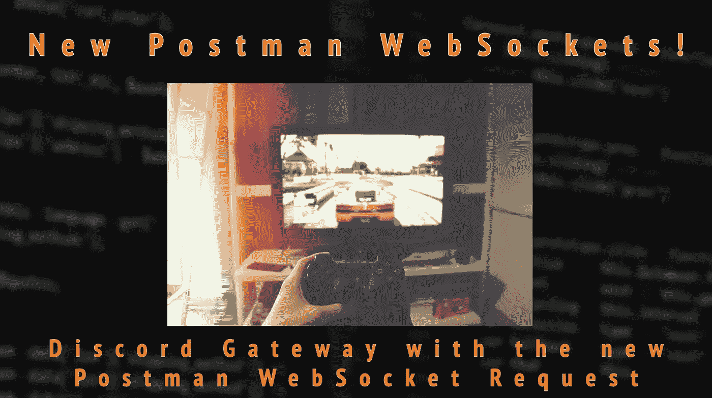

Postman 发布了使用 WebSockets 与服务器通信的能力。使它可以连接的服务类型多样化，并在与事件驱动架构的交互方面迈出一大步。WebSockets 用于实时通信(RTC ),而不是常规的 REST API 端点。

REST APIs 非常适合更新和检索数据库中的数据，或者通过表单或页面元素与服务进行交互。但 WebSockets 让你能够拥有聊天应用，并在 HTTP 协议的保证下传输实时数据。

为了更好地理解这一点，我想展示一个使用现有 WebSocket 服务的现场演示。由于受欢迎，我决定使用不和谐。

Discord 调用他们的 WebSocket 服务**网关**:

> 网关是 Discord 通过安全 WebSockets 进行实时通信的一种形式。客户端将通过它们所连接的网关接收事件和数据，并通过 REST API 发送数据。

正如你在上面看到的，我们只能订阅服务器中的事件，有点像 webhook。

## **这里的计划是使用 Postman 获得并连接到一个 Discord Gateway WebSocket 连接，然后从那里，我们可以订阅通道内的事件。**

# 检查您的应用程序中是否有 WebSocket 请求

Postman WebSockets 请求仍然被认为是一个测试功能，所以你的 Postman 应用程序需要更新到最新版本的 **v8** 。或者你可以直接进入网络应用[在线](https://go.postman.co/build)。在那里，您可以单击角落中的加号图标来创建 WebSocket 连接。

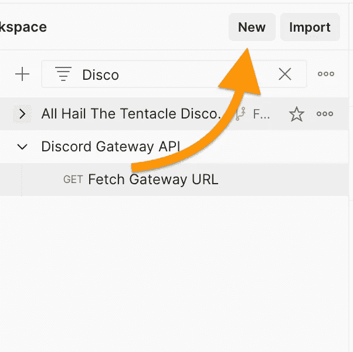

单击“新建”创建新请求

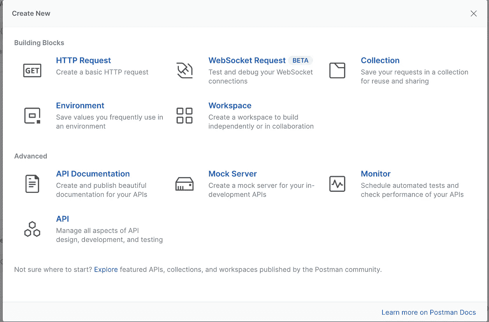

从菜单中选择 WebSocket 请求

# 创造不和谐机器人

我们需要创建一个不和谐的机器人来代替我们想要观看的频道的用户。为此，我们创建了一个不和谐应用程序，然后创建了一个不和谐机器人。

转到 [Discord 应用平台](https://discord.com/developers/applications/)，然后创建一个新的应用。给它一个唯一的名称。在左侧菜单中选择机器人。

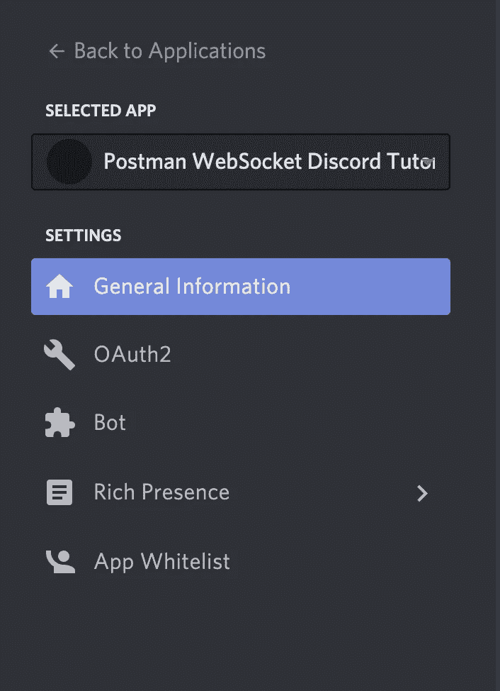

在 Discord 应用子菜单中点击 Bot

一旦您在菜单中创建了一个 Bot，您现在就有了一个令牌来进行身份验证。我们稍后会用到它。

# 将机器人添加到频道

要将机器人添加到我们想要观看的 Discord 频道，请进入左侧菜单并选择 OAuth2。在范围下选择*机器人*复选框*。*现在，我们在 scopes 框的底部有了一个 URL。

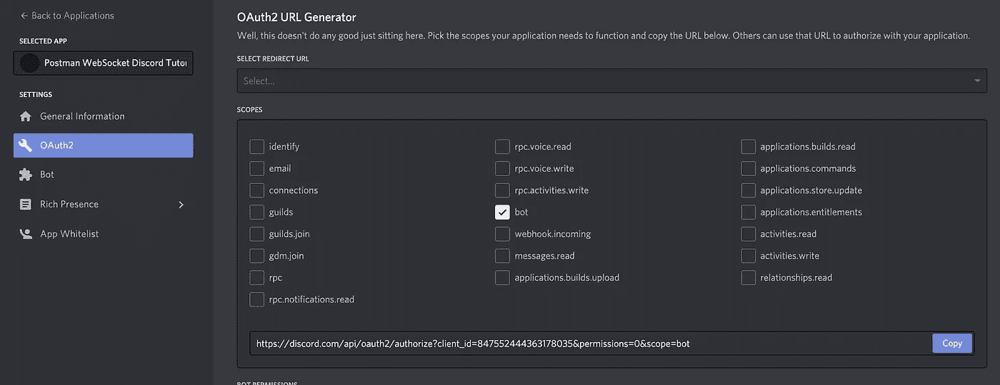

生成一个 OAuth2.0 链接，为服务器订阅 Bot

导航到此 URL，您将可以选择要将此 Bot 添加到哪个服务器。

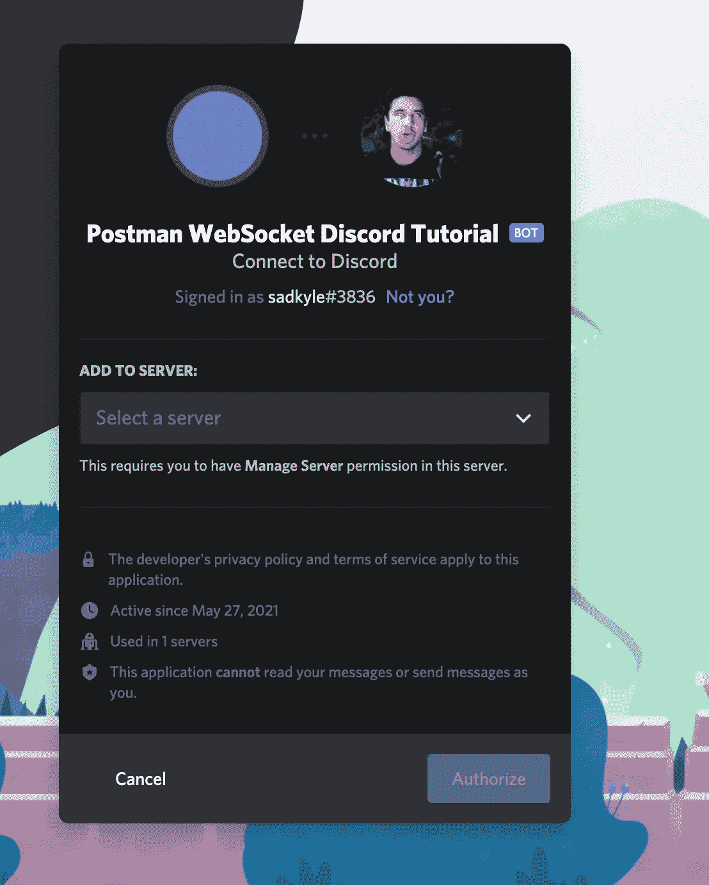

选择希望机器人加入的服务器

您应该会在常规聊天中看到一条消息，说明添加了一个机器人。

你可以看到机器人已经加入了服务器

# 获取 WebSocket URL

现在我们有了一个不和谐机器人，我们可以调用网关端点来获得一个有效的 WSS 端点。

打开 Postman 应用程序，创建一个新的标准请求。只需调用一个 GET 到下面的 URL。不需要标记、头、参数和主体。

> [https://discordapp.com/api/gateway/](https://discordapp.com/api/gateway/)

从这里您将得到一个返回 WebSocket 网关 URL 的简单响应。

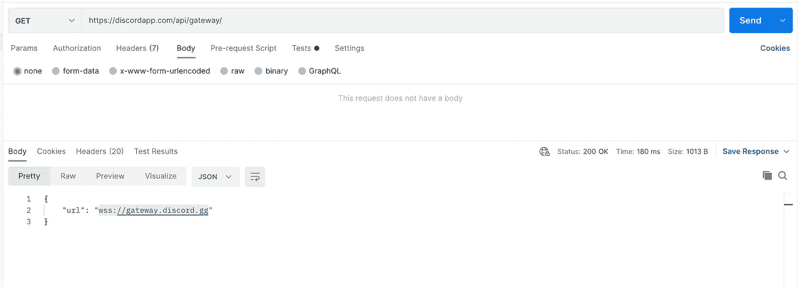

用于从 Discord API 连接的 WebSocket URL

为了让这更有趣，我添加了一个环境，并用我的机器人令牌填充了它，我们可以从 Discord 的开发人员应用程序平台上获取这些令牌。

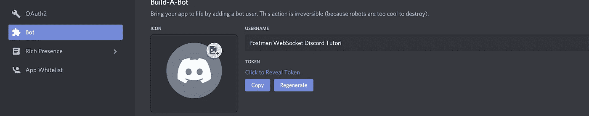

获取需要识别的机器人令牌

在这里，我创建了一个简单的脚本，将 URL 保存到 Postman 环境中。

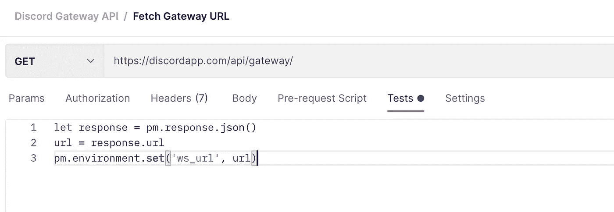

获取 url 并将其放入环境中的脚本

添加令牌并运行请求后，您的环境应该如下所示:

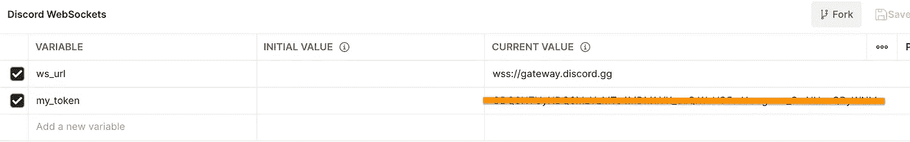

在我们开始连接之前，我们的环境应该是什么样的

**一定要在右上角选择你的环境！！！**

现在让我们弄清楚如何在 Postman 中使用 WebSocket 与 Discord 交互。在本教程的顶部，我们单击 ***新建按钮*** ，然后我们可以选择我们的 ***WebSocket 请求*** 选项*。*

从这里使用我们的环境我们可以添加 WebSocket URL，***{ { ws _ URL } }****。*

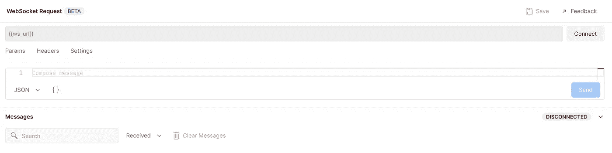

WebSocket 请求窗口

我们连线吧！成功连接后，我们应该会看到一个蓝色的向下箭头和一些数据。蓝色的向下箭头是从 Discord Gateway 收到的 WebSocket 消息。

不和谐的第一反应通常是这样的:

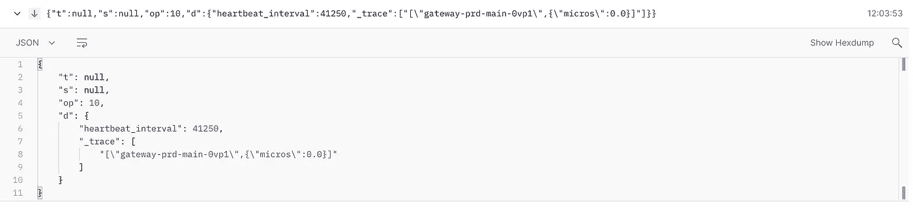

第一次响应与心跳间隔不一致

# 心跳

在第一个响应中，我们可以看到在 Discord 的消息对象模式后面有一个 JSON 块，你可以在这里阅读更多关于[的信息。](https://discord.com/developers/docs/topics/gateway#heartbeating)

在“ ***d*** ”或数据段中，我们有一个 **heartbeat_intreval** 。这告诉我们每隔**毫秒发送一条**心跳**消息，以保持连接打开，否则连接将关闭，您必须保持重新连接。**

根据 Discord 的文档，要发送**心跳**消息，我们需要发送 **1 操作码**。您可以在数据中设置会话号，“ ***d*** ”。会话号只是正在发送的消息的订单号，但它可以是任何数字，并且仍然有效。

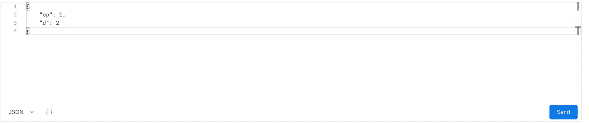

心跳消息

当您成功地向网关发送了一个**心跳**消息时，您应该得到一个带有 **11** **操作码**的消息。这仅仅意味着 Discord 已经认可了你的**心跳**，并将保持连接。

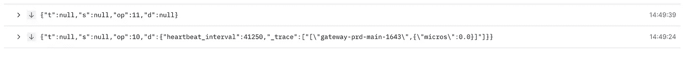

心跳响应

我们必须经常向 WebSocket 发送这个请求，否则我们将面临连接关闭的风险！

# 识别

有了标识，我们开始接触 Discord 协议是如何工作的。每个 WebSocket 服务都不一样，*这个只和 Discord 的服务有关。*

最小不一致消息包含一个*操作码*，如我们之前所见(1 表示心跳，10 表示 Hello)。对于*，标识*为 2。

我们根据 [Discord 的身份模式](https://discord.com/developers/docs/topics/gateway#identify-identify-structure)来创建 JSON。

**使用这个环境，我们在请求的“d”部分添加我们的 Bot 令牌**和属性。

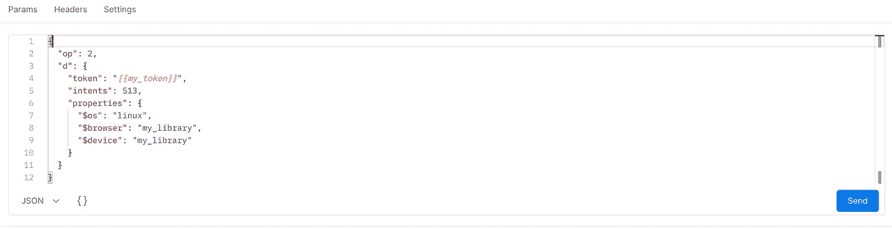

识别消息

发送之后，您应该会在连接窗口中收到一条**就绪**消息。这让您知道您已成功通过身份验证。有时，如果你是第一次与服务器互动，你也会看到一条 **GUILD_CREATE** 消息。这只是不和谐创建一些元数据附加到您的不和谐机器人和您连接的服务器。我们不会进入公会，因为严格来说这是一个不和谐的概念，在本教程中没有必要理解。

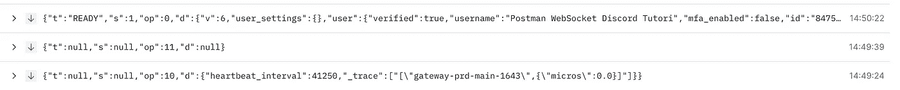

识别就绪消息

现在这个机器人已经通过认证了！

# **捕捉事件**

现在我们在 WebSocket 连接上通过了身份验证，让我们在您添加了机器人的服务器的常规聊天中创建一条消息，或者邀请某人，或者让某人加入。

即使您没有创建 WebSocket 请求，您也会看到在 WebSocket 连接上收到的新消息，*！*

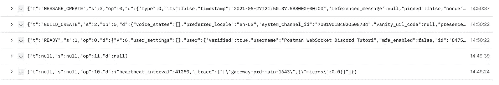

捕获到不一致的新消息

检查这个 **MESSAGE_CREATE** 消息，您应该看到消息的详细信息以及创建它的用户。即使不是你，也是实时的。

现在，您可以通过 Postman 监控和管理您的频道活动！

Postman 的 WebSockets 还是很新的。我们可以看到有一个未来的选项来创建脚本，并希望在 Monitor 中运行它，这样我们就可以在未来创建持久的机器人。但这是非常令人兴奋的，我个人迫不及待地想知道这个功能的下一步是什么！

# TL；速度三角形定位法(dead reckoning)

*   Postman 在 v8 中具有与 WebSockets 连接和发送/接收的能力！引入了一种全新的与 RTC 数据交互的方式。
*   我们连接到 Discord 的 WebSocket 服务网关来监听服务器事件，并能够通过发送 WebSocket 消息来管理它们
*   Postman WebSockets 请求仍处于测试阶段，因此请留意脚本和监视器等新功能！

如果你喜欢你所阅读的内容，请在 Twitter 或 T2 LinkedIn 上关注我