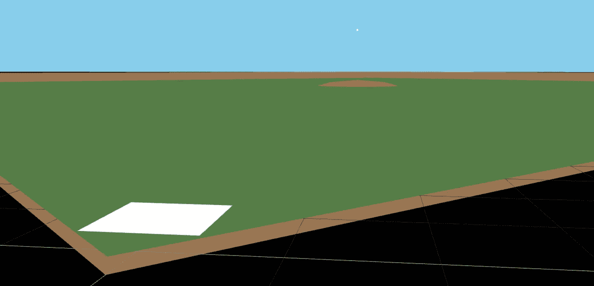
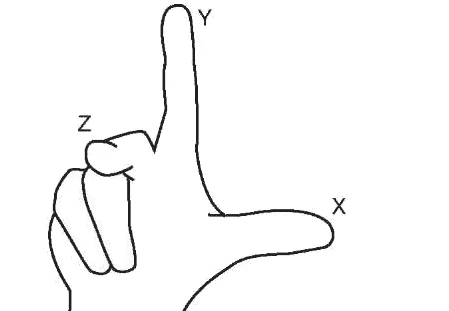
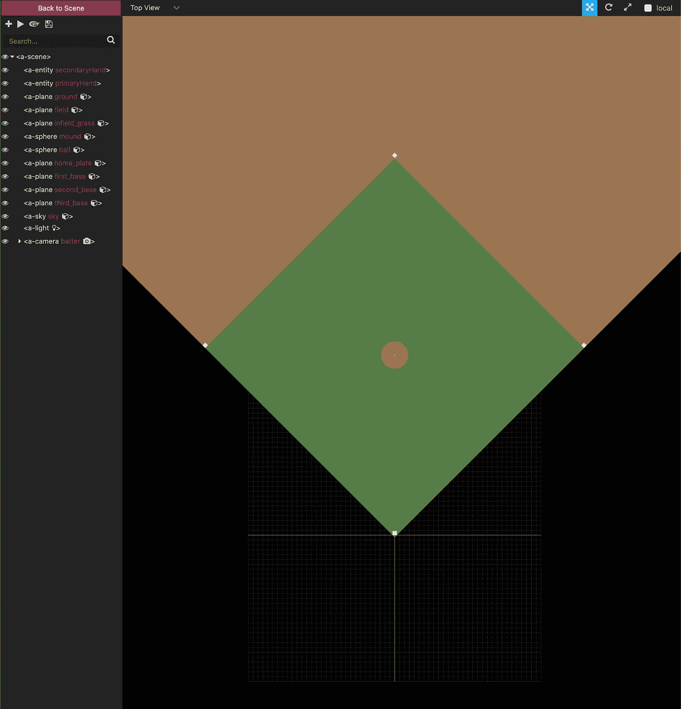

# 用 A 帧模拟一个 100 英里每小时的快速球

> 原文：<https://levelup.gitconnected.com/webvr-simulating-a-100-mph-fastball-with-a-frame-fbad3edaa782>

## 通过示例学习 A-Frame



【https://baseball-simulator.netlify.app/ 

# 摘要

在这篇文章中，我将通过构建一个 100 英里/小时的快速球模拟，带你通过一个叫做 A-Frame 的[网络虚拟现实框架。我不会费神去探究这次经历的每一个细节，但我会强调我发现有教育意义的几个方面。我们将从建造一个基本的棒球场开始。然后，我们将探索从投手丘到本垒板的棒球动画。这篇文章仅仅是为了补充官方文件。强烈建议您在阅读本文之前/之后通读这些文档，以便更全面地了解该框架及其所有特性。](https://aframe.io/)

# 基元

在 A-Frame 中，“基本体”是框架附带的基本形状。例如一个[球体](https://aframe.io/docs/master/primitives/a-sphere.html)、[圆柱体](https://aframe.io/docs/master/primitives/a-cylinder.html)、[平面](https://aframe.io/docs/master/primitives/a-plane.html)、[盒子](https://aframe.io/docs/master/primitives/a-box.html)等。利用这些基本形状，我们可以建造几乎任何结构。例如，为了构建这个模拟，我们将只使用两个:球体和平面。球体将用于土墩和棒球，而平面用于其他一切:基地，内场和外场。为了说明，让我们看看球是如何构成的:

`a-sphere`是 A 形框架附带的组件。它支持许多属性，但是在这种情况下，我们只需要指定`radius`、`color`和`position`。请注意，在 A 形框架中，所有测量单位均为**米**。在很多情况下，知道测量单位可能不是很重要，但在构建精确的音高模拟时，知道准确的尺寸和距离是至关重要的。

# 右手坐标系

对我来说，在虚拟现实开发中最困难的一个方面是三维思考。x 轴和 y 轴很直观，但 z 轴证明有点棘手。当我被介绍到“右手坐标系”时，我终于明白了。这是 A 形框架用来定位物体的系统。只需在脸前伸出右手，用中指指着自己，同时用拇指和食指形成一个“L”。



右手坐标系

中指代表 z 轴、食指、y 轴，拇指代表 x 轴。此外，请注意手指指向的方向。他们所指的方向代表轴上的正值。因此，正的 z 值会将物体拉向你，而负值会将物体放得离你更远。在球的情况下，我们想从投手丘开始，向上大约 7 英尺 8 英寸，或兰迪·约翰逊在投手丘上的高度。从上面的例子中检查球的位置:

```
position="0 2.34 -18.4404"
```

这个位置值意味着:将球定位在 x 轴上的 0，y 轴上的 2.34 米，并且在 z 轴上远离本垒板(位于 0，0，0)60 英尺 6 英寸或 18.4404 米。现在我们对基本体和定位有了足够的了解，可以创建一个球，并将其放在站在投手丘上的 Randy Johnson 的手中。

# 检查员

在这一点上，后退一步，简单地谈谈检查员是有意义的。inspector 是 A-Frame 附带的开发工具。可以用`control + option + i`访问。除此之外，检查器允许您切换视角和实体值，以及通过收缩来放大/缩小和右键单击拖动来移动来遍历场景。这是可视化实体在整个场景中的位置并试验不同值的非常有用的方法。



场地的俯视透视图

# 动画片

下一步是动画球从土墩到本垒板。为了做到这一点，我们想将球的位置从`0 2.34 -18.4404`移动到`0 0.9144 0`(离家 3 英尺)。幸运的是，A-Frame 有一个动画组件使这变得非常容易:

请注意，我们只是将 position 属性设置为一个新值。我们还以毫秒为单位指定持续时间。显然，一个时速 100 英里的棒球需要大约 375 毫秒才能到家。

# 控制器

接下来，我们需要添加一些控制器到场景中。这将允许我们利用控制器上的触发器来启动投掷动画。我构建了这个模拟来与我的 Oculus Quest 一起工作，因此，我添加了 [oculus-touch-controls](https://aframe.io/docs/master/components/oculus-touch-controls.html) ，这是一个带有 A-Frame 的组件。一旦这些控制器被添加到场景中，当您在耳机中观看体验时，您将实际上能够看到它们。我们也将能够监听它们产生的事件。

# 事件

A-Frame 中的事件与任何普通的 JS 事件没有什么不同。因为我们的组件只是 DOM 元素，所以我们可以在我们想要关注的实体上使用`addEventListener`来设置监听器。在这种情况下，我们希望球监听控制器发出的触发事件。

在上面的例子中，我们只是注册了一个新的组件，并将其作为一个属性附加到主 hand 控制器上。该组件所做的就是为`triggerdown`事件添加一个监听器，然后它在球实体上发出一个`throw`事件，我给了它一个`ball`的`id`。最后一步是在`throw`上启动动画。

```
animation="property: position; to: 0 0.9144 0; dur: 375; startEvents: throw"
```

如您所见，要做到这一点，只需在球的动画属性上添加一个`startEvents`定义，并指定`throw`的事件！

# 后续步骤

在[https://baseball-simulator.netlify.app/](https://baseball-simulator.netlify.app/)体验一下。随意追加？如果您想在浏览器中而不是在 VR 设备上测试抛出，则 debug=true to the URL。使用`shift + spacebar`在浏览器中进行测试。另外，请随时在 https://github.com/bretmorris/baseball-simulator[查看代码。很明显，这些代码还没有准备好投入生产，但是希望看到完整的代码可以帮助澄清一些我可能已经忽略或者完全忽略的事情。](https://github.com/bretmorris/baseball-simulator)