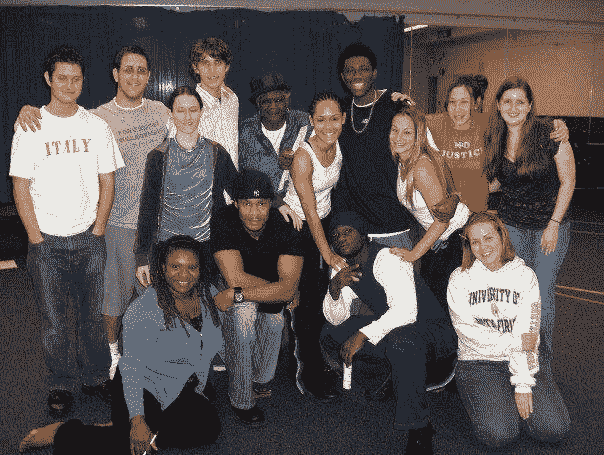

# 第 0 周:努力、决心和一点点运气——我的 Web 编程之旅

> 原文：<https://levelup.gitconnected.com/week-0-hard-work-determination-and-a-little-bit-of-luck-my-journey-into-web-programming-f523e0570fc8>

照片由 [Maik Jonietz](https://unsplash.com/@der_maik_?utm_source=medium&utm_medium=referral) 在 [Unsplash](https://unsplash.com?utm_source=medium&utm_medium=referral) 上拍摄

这是一个漫长而艰难的旅程，但我终于开始看到隧道尽头的光明。作为一个身体残疾的人，找工作并不容易，但我决心做出改变。过几天我就要开始 Devslopes 学院了，我想用每周的博客来记录我的进步！然而，对于这篇介绍性的文章，我想回忆一下我是如何走到这一步的。谢谢你跟随我的旅程！

# 大学时代

我获得了戏剧艺术学士学位。我到底在想什么？？我有轻微的运动障碍和严重的语言障碍。作为一名演员，我永远不会“成功”(你在剧院、电视或电影中认识多少残疾人？？)没有人能够理解我。我可以在后台或电影片场做剧组工作，但我想把这作为职业，累死自己，长时间工作，不！

我的一门戏剧课

我在大三的时候发现了这一点，当时一位导师把我拉进他的办公室，基本上是说:“你为什么要浪费时间？?"苛刻？是的。真的吗？是的。

转专业太晚了，就坚持下来了。

我开始研究研究生课程。我只知道我讨厌研究论文。

我看了三所学校。全速电影制作(太贵了)，UCF 电影制作，USF 教学技术。我最终选择了 USF，因为我对它已经很熟悉了。

我必须克服一个巨大的障碍…..我的平均成绩。我最初被该计划拒绝是因为我的 GPA 太低。我决定去见学生申诉专员办公室，看看他们是否能为我辩护…..而且成功了！！！！！

# 研究所

在研究生课程的第一学期，我决定注册一门 JavaScript 课程。该计划要求你完成一门编程语言课程。有两种选择:Flash 和 JavaScript。因为我知道 flash 即将过时，所以我选择了 JavaScript 作为我的选择。

我鄙视 JavaScript！我们每周见面一次，每次两小时，持续了 16 周。最后，我差点没通过这门课。不知何故，我设法通过了这门课！

我告诉自己我再也不会学习另一种语言了！

后来在研究生课程中，我选了一门我非常喜欢的网页设计课！

毕业后，我申请了一份又一份的工作，却一再遭到拒绝…..

# 毕业后

我决定进入零工经济，开始按自己的节奏前进。由于没有人愿意雇用我，我决定自己当老板。

旁注:由于社会对我们的刻板印象，残疾人经常被迫从事自由职业。这里有一篇[福布斯文章](https://www.forbes.com/sites/gusalexiou/2021/11/28/disabled-entrepreneurs-speak-out-on-the-choice-to-go-it-alone-and-be-your-own-boss/?sh=6bff39091431)，了解更多信息。

我最初是通过 Wix、Squarespace 和 WordPress 做网页设计的。然后我决定扩展业务，开始做优步。

优步一直很好，直到有几个乘客试图指责我因为我的语言障碍而喝醉了。到那时，我已经不在乎那些废话了！

然后我转向他们的外卖服务 UberEATS。因为，哎，吃货不顶嘴！我喜欢送外卖。当然，我偶尔也会有混蛋，但我不会把他们当成乘客来对待！由于我的身体限制，我会礼貌地请顾客到我的车那里见我，尤其是当他们在没有电梯的楼上时。大多数人很乐意这样做！

我最终从做 UberEATS 中获得了如此多的乐趣，我决定扩展我的产品。在我的巅峰时期，我在做；UberEATS、Doordash、Instacart、Postmates、Grubhub 和 Dispatch。

# 2021

我已经厌倦了过度劳累。

2021 年 11 月/12 月，我决定开始学习新技能。然而，这些技能会让我继续从事自由职业。

2022 年初，有东西告诉我要研究一下 web 编程。于是我开始上 Udemy。

Udemy 总是有很大的折扣。我找到了两门课程，每门 50 小时，非常深入，所以我花了 20 美元得到了 100 小时的综合培训！

我拿起:

柯尔特·斯蒂尔[网络开发者训练营 2022](https://www.udemy.com/course/the-web-developer-bootcamp/)

于安琪博士[完成 2022 年网络开发训练营](https://www.udemy.com/course/the-complete-web-development-bootcamp/)

HTML 和 CSS 轻而易举！但是后来 JavaScript 出现了。课程可能会提到 2022 年，但有些视频已经是 2-3 年前的了，非常过时。于博士的课程就是如此。

如果你还记得，在研究生院，我在学习 JavaScript 时遇到了很大的问题。我再次面临同样的问题。一开始我以为是教官。所以，我会尝试更多的课程:

Andrei Neagoie 的零到精通

Kyle Cook 简化的 Web 开发

这些都是很棒的项目，但是由于我不同的学习障碍，我需要更多的东西

我一直被卡住，变得非常沮丧。

# 更多的学校教育？？

然后我开始研究在线程序。我遇到的第一个是 [Devslopes](https://devslopes.com/) 。德弗斯洛普引起我的注意有几个原因。

他们的网站声明他们提供:

***恒一对一师徒***

***1–1 职业辅导/准备***

***终身访问***

所以，我和他们安排了一次咨询，我喜欢我所听到的。第二周，财务部门告诉我，我获得了 3000 美元的奖学金！我兴奋极了！！我立即启动了一个 GoFundMe 来帮助筹集其余的资金。

我保留了上面提到的其他课程，作为在 Devslopes 中的补充学习材料。

# 利用你的残疾，骄傲吧！

我在努力筹集所需的资金。

有一天，我在浏览 Instagram 时，发现了一个关于多元化领导集体的直播。四名成员正在分享他们的经验。我开始感兴趣，所以我做了他们为期一周的免费试用。

[在此获得 1 周免费试用！](https://diversability.mn.co/share/Y3DSgWoBzs6XPl8E?utm_source=manual)

我参加了一些活动。感觉*见过*。我感觉到了*听到了*。这是一次愉快的经历。我毫不犹豫地马上加入了。

就在第二天，创始人 [Tiffany Yu](https://www.tiffanyyu.com/) 通过[Better Internet Initiative](https://www.betterinternetinitiative.org/)向我提供了一个社交媒体宣传机会。

她帮我联系了 BII，进行了面试，并且被录取了！所以，我会在 BII 的帮助下制作教育内容。

最酷的是，他们已经同意支付我的学费，这样我就可以进入德弗斯洛普斯学院学习了！！

# 今天

截至 2/25/22，我正等着注册和开始。一旦我开始，期待每周更新概括我的知识，加上我对这个项目的感受。

在 [Medium](https://medium.com/@jamesabillity) 和 [Github](https://github.com/jgeiger2) 上成为我旅程的一部分，跟踪我的进步。