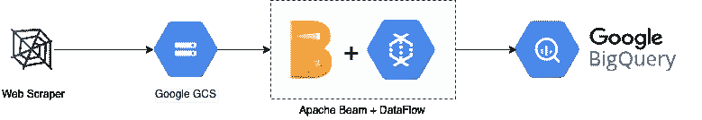
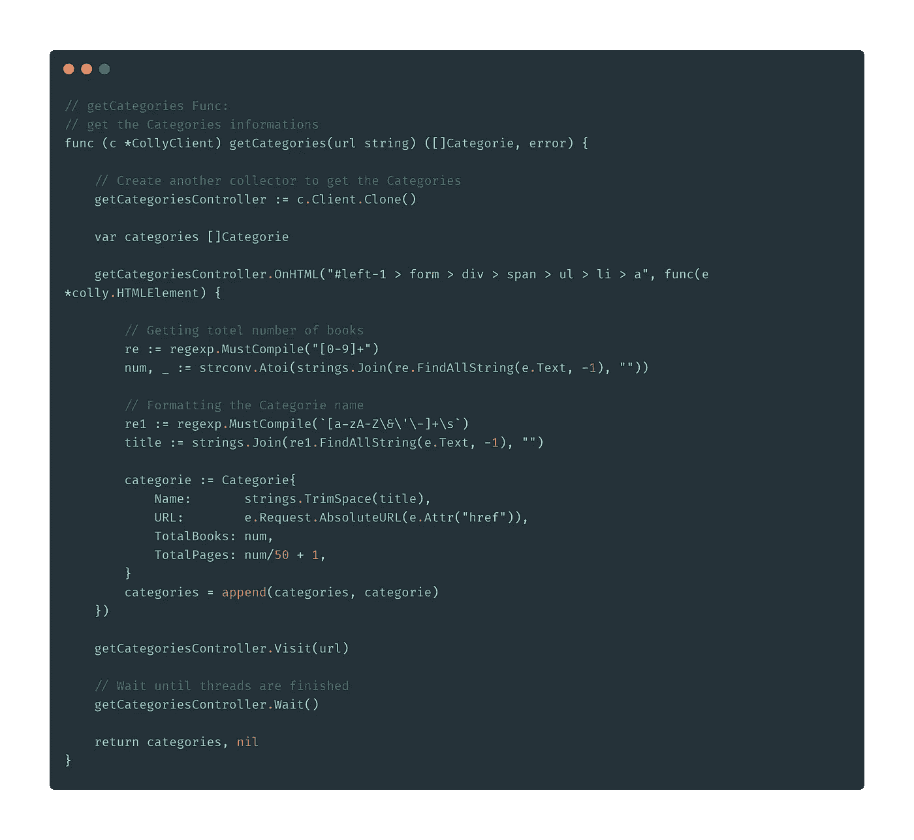
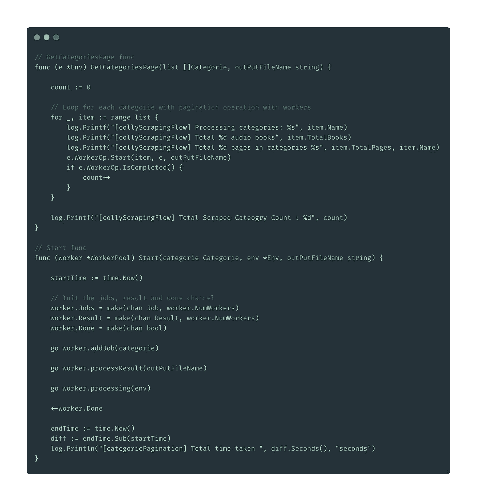
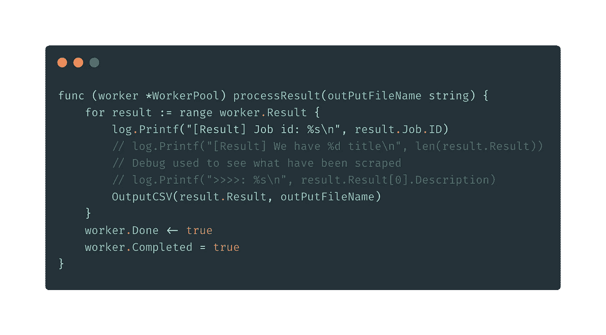
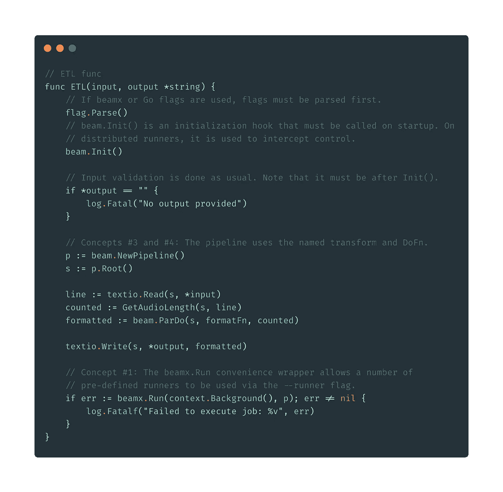
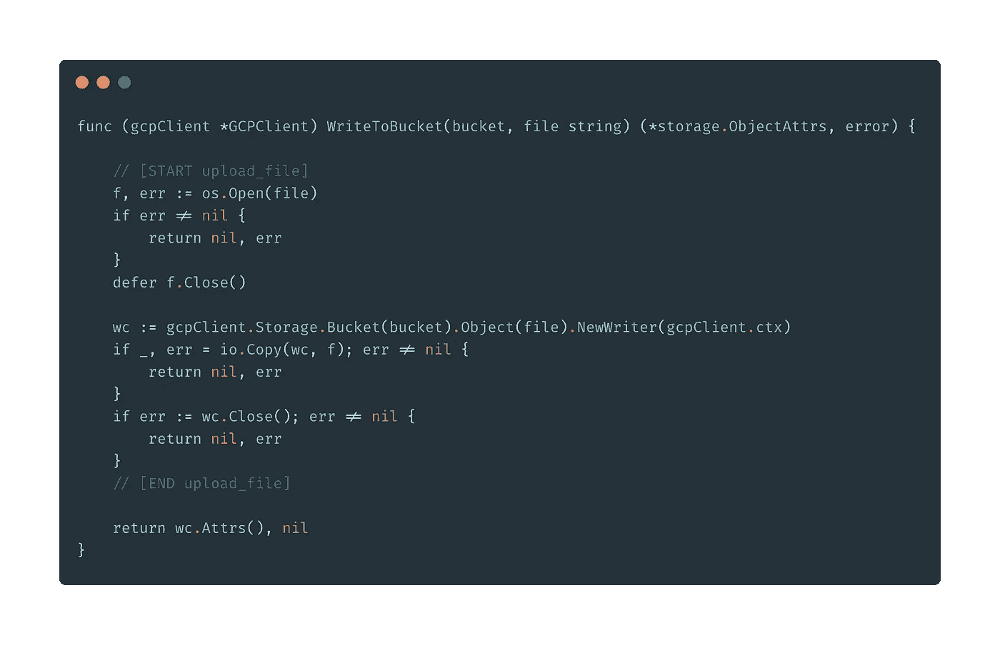
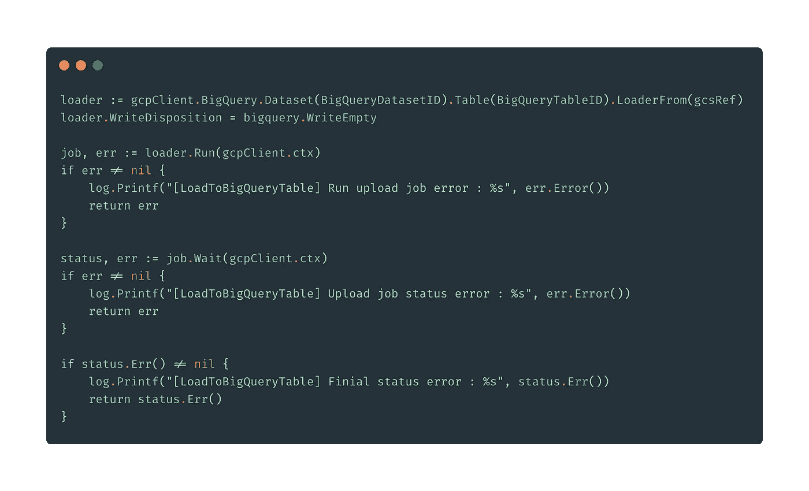
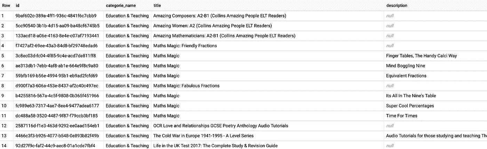
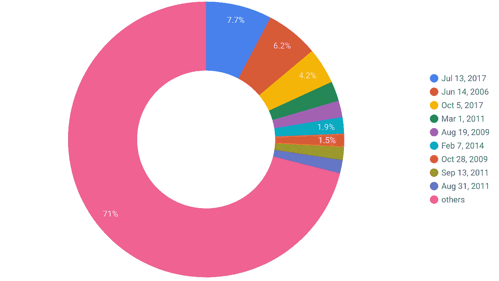

# 使用 GCP 堆栈构建基于批处理的产品数据管道。

> 原文：<https://levelup.gitconnected.com/weekend-build-learn-part-1-8a1fc7edf8cc>

## 周末建设和学习。

> 我将开始一个新的系列文章，讲述我在周末所做的和学到的东西。
> 
> 正如我之前提到的，要成为一名伟大的工程领导者，我始终认为，我们应该知道如何“战斗”。

这个周末，我将使用 GCP 堆栈构建一个基于批处理的产品数据管道。

这是数据流。

1.  我们要刮亚马逊 Audible 网站。和 mock 作为产品数据源。(免责声明这仅适用于自学者)
2.  使用 Apache Beam + DataFlow 进行数据转换。
3.  我们会把数据上传到 GCS。
4.  将数据加载到 BigQuery。

先说架构的高层。

具有 GCP 堆栈的批量数据流水线

## 网页抓取

我们将通过使用最优秀的 Go 并发特性来抓取可听的全部 **515，845 个项目**。以下是详细步骤:

1.  抓取类别页面，得到每个类别的链接和每个类别的总页面数。

获取类别 URL 和总页面

2.启动 worker 并同时抓取类别页面。

抓取每个类别页面的工人

3.将输出写入 CSV

工作进程输出

因此，完成所有任务大约需要 **45 -50 分钟**，文件大小大约为 **78.67 MB** 。

## 阿帕奇波束

Apache beam 可以实现在任何执行引擎上运行的批处理和流数据处理作业。

为了在这个数据管道中尝试 Apache Beam，我打算在进行 web 抓取时用整个字符串获取 CSV 中的最后一列。

然后，我将使用 Apache Beam 处理全部 515，845 个项目，例如，将“长度:21 分钟”转换为 21 分钟，或者将“长度:3 小时 12 分钟”转换为 3 * 60 + 12 = 192 分钟。

阿帕奇波束数据转换管道

并且总执行时间为 **6 ~ 10s，t** 这是一个令人印象深刻的表现。想象一下，这只是局部执行。我将在稍后的另一篇文章中对此进行深入探讨。

底线。阿帕奇光束的关键是便携。它可以在多种执行环境下执行流水线，如 Apache Spark、GCP 数据流、Apache Flink 等。，可以根据需要取刻度。

## **上传至 GCS**

GCP 有一个很棒的客户端库，可以用于他们拥有的任何一个应用程序，比如 GCS、BigQuery、IAM 等。

上传到存储桶

## 加载到 BigQuery

一旦文件被加载到 GCS 中，BigQuery 加载就开始了

并加载最终的 BigQuery 表。

BigQuery 表

你也可以使用 GCP 数据工作室开始你的分析。

发布数据指示器

## 我学到了什么？

1.  并发的网页抓取和大规模的性能。
2.  阿帕奇波束数据管道。
3.  GCP 客户端 API 与自定义数据管道的集成。
4.  BigQuery Load 和 Data Studio 自然功能集成。

## 如果你想看我的其他系列文章，请看下面:

[https://medium.com/@jayhuang75](https://medium.com/@jayhuang75)