# “this”综合指南——可视化解释 JavaScript 的怪异部分(第 2 部分)

> 原文：<https://levelup.gitconnected.com/weird-parts-of-javascript-visually-explained-part-2-7d5122618d76>

这是本系列的第 2 部分，假设您已经阅读了第 1 部分。如果您还没有看过，请点击这里查看第 1 部分:

 [## JavaScript 的怪异部分:可视化解释(第 1 部分)

### 深入探究 JavaScript 的古怪之处

medium.com](https://medium.com/swlh/weird-parts-of-javascript-visually-explained-part-1-25efb0eea153) 

既然我们对什么是词法环境、执行上下文是如何创建的、作用域链是如何工作的有了相当好的理解，我们现在可以在现有知识的基础上进行构建。

# 这

正如我们前面看到的，`**this**` **是一个执行上下文** *的属性。*

在非严格模式下，`this`的值总是**一个对象，**而在严格模式下，它可以是**任何值**。

如果你不知道**严格模式👨‍🔧**，它增加了某些限制，使 JS 代码更安全，并可能允许 JavaScript 执行某些优化。本系列后面将详细讨论严格模式。

让我们看看`this`在几乎所有可能的场景中的值是多少，这样你就永远不必去猜测了💩

# this ===全局对象🌐

## 在全局执行上下文中🌻

`this`的值在全局执行上下文中，总是`global object`(浏览器中的窗口)，无论是否处于严格模式。

## 在被直接调用的函数中🌷

如果一个函数被直接调用而不是作为对象的方法，那么那个函数里面的`this`的值在**非严格**模式下是一个`global object` ，在严格模式下是一个`undefined` **。**

让我们举个例子:

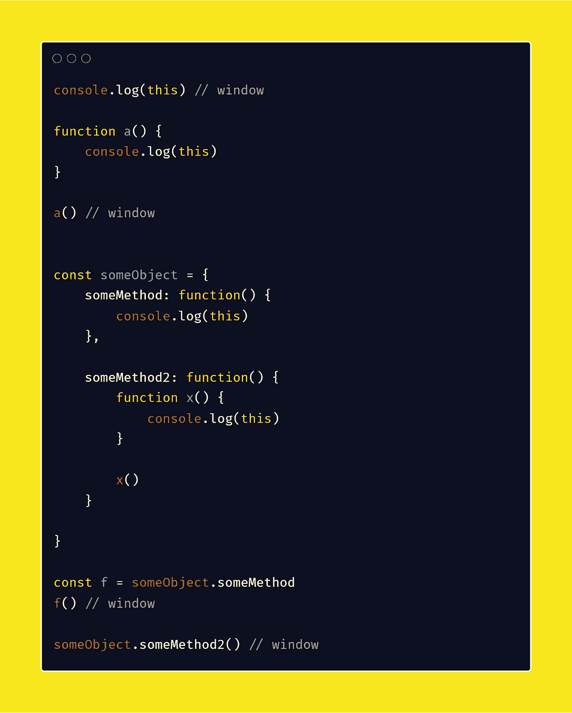

非严格模式示例

`window`如果运行此代码，将在控制台中记录四次。

虽然前两个日志可能看起来很直观，但另外两个一开始可能看起来很奇怪。让我们逐一分析，看看发生了什么。

**第一个日志**是`window` 因为，在全局执行上下文中，它的值总是一个全局对象，在浏览器的情况下是窗口对象

**第二个日志**是`window` 因为函数`a()`被直接调用，而不是作为某个对象的方法

**第三个日志**是`window` 因为函数`f()`的定义来自`someObject`的`someMethod`，函数调用是直接完成的，而不是作为某个对象的某个方法。

**第四个日志**是`window` 因为，虽然我们调用`someMethod2`作为`someObject`的方法，但是实际的函数调用`x()`是作为直接调用而不是作为对象的一部分来完成的。**这经常被描述为 JavaScript 语言**中的一个错误，但是如果你知道`this`如何工作的基本逻辑，这是合乎逻辑的。如果这个结果看起来很奇怪，有几个解决方法，其中一个将在本文后面讨论(使用箭头函数代替函数语句)

下面是在严格模式下运行的相同代码:

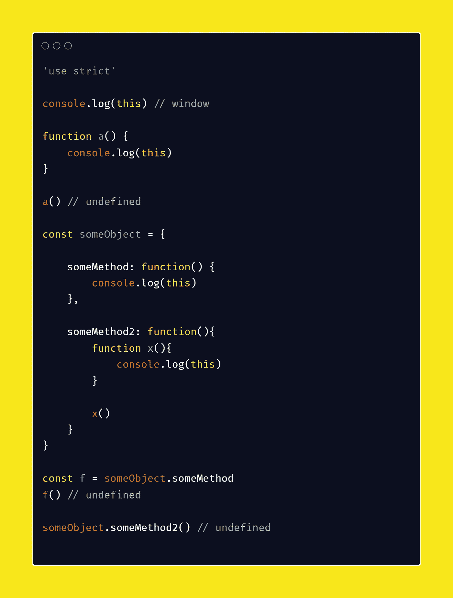

严格模式

## 在生活中🌺

在非严格模式下，无论使用函数语句还是箭头函数，IIFE 内部的值总是全局对象。

如果你不知道什么是生活，这有点像定义一个函数，同时又调用它。我将在本系列的后面详细解释。

> 您可能已经注意到我不使用分号，但是我在下面的代码中使用了它，因为在编写 IIFEs 时不使用分号会使语法分析器混乱并抛出错误。这将在后面的系列中解释

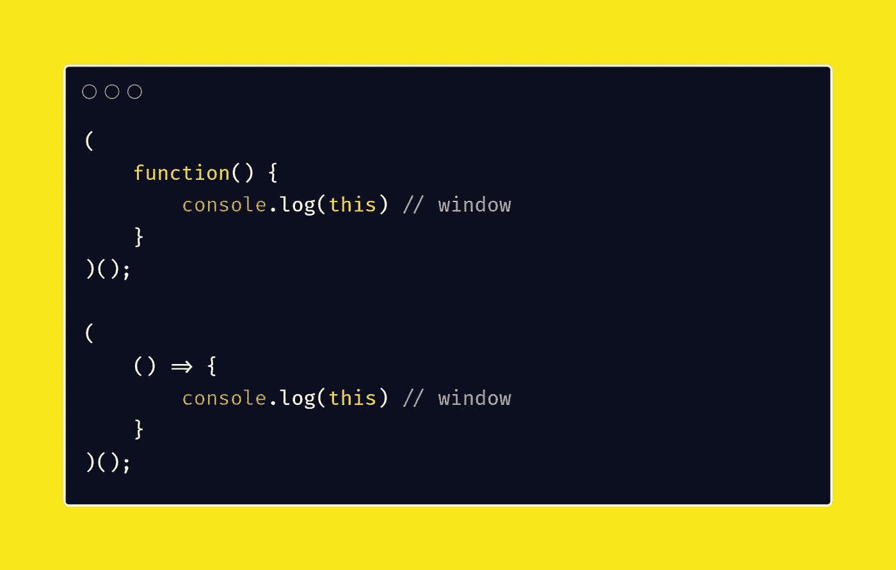

非严格模式

在**严格模式下，**带有**函数语句**的 life 中该值为**未定义，**而在带有**箭头函数的 life 中，**仍为**全局对象。**

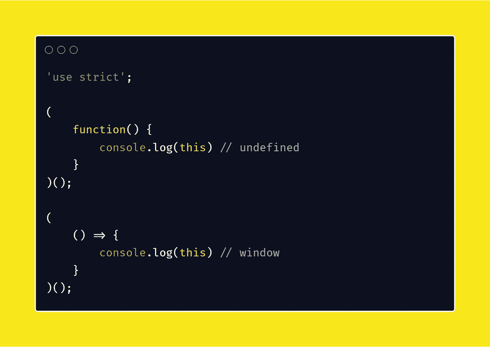

严格模式

# this ===新实例🌟

这个值是**构造函数**中的**新对象实例**，在严格和非严格模式下都用`new`关键字调用

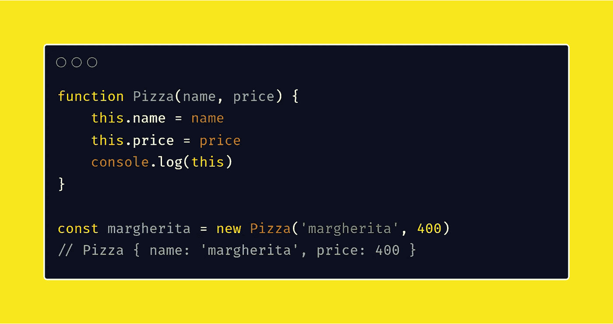

> 好吧，刚刚发生了什么？

关键字`new`创建一个新的空对象，并使变量指向新创建的对象。然后，它执行构造函数并返回新创建的对象，除非构造函数返回某些内容。

# this ===调用函数⚡的对象

用某个对象调用的函数内的`this`的值就是对象本身。函数的定义来自哪里并不重要。这对于严格和非严格模式都是一样的。

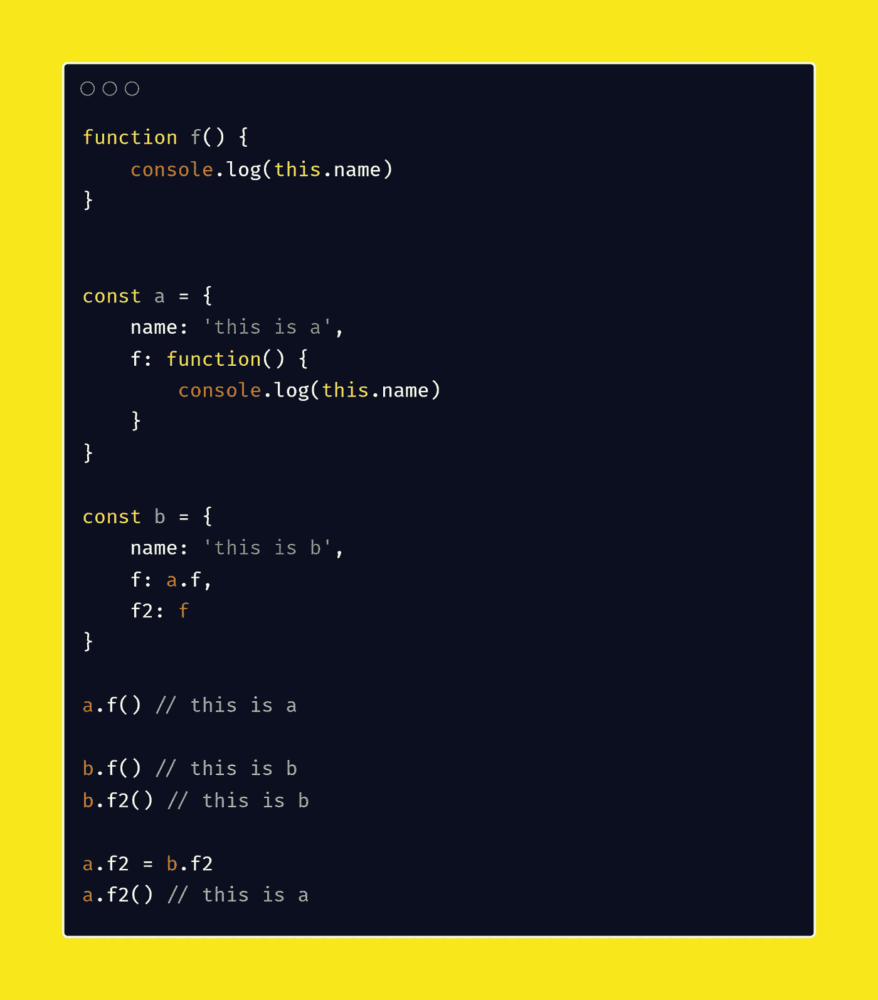

# 这个===和外面一样🌞

这发生在我们使用箭头函数的时候。**箭头函数**内部没有自己的 this 值，所以该值不会改变，在函数外部保持不变。这对于严格和非严格模式都是一样的。

arrow 函数的这种行为是确保对象的方法中的所有函数都有指向该对象而不是全局对象的值`this`的最佳变通方法之一。这在下面通过使用正常功能`x()`和箭头功能`y()`来说明

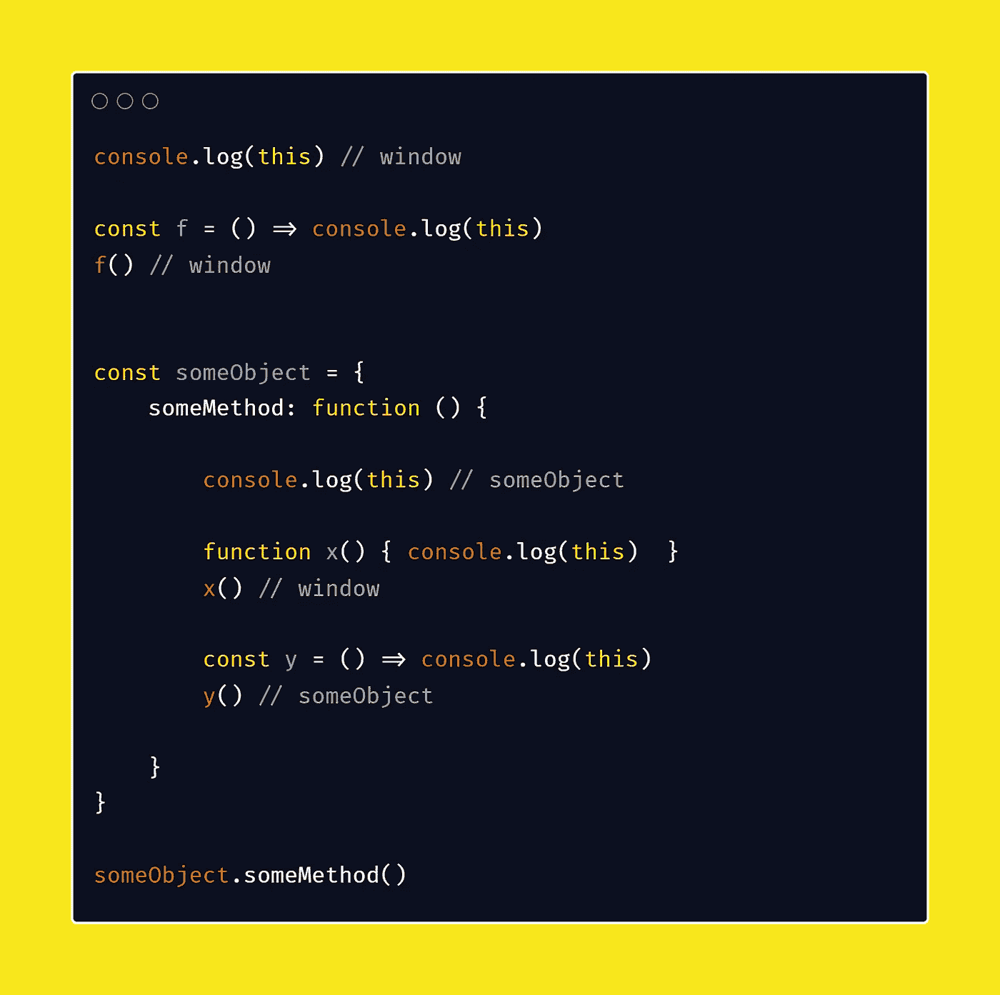

哇，这是很多信息，让我们快速回顾一下:😴

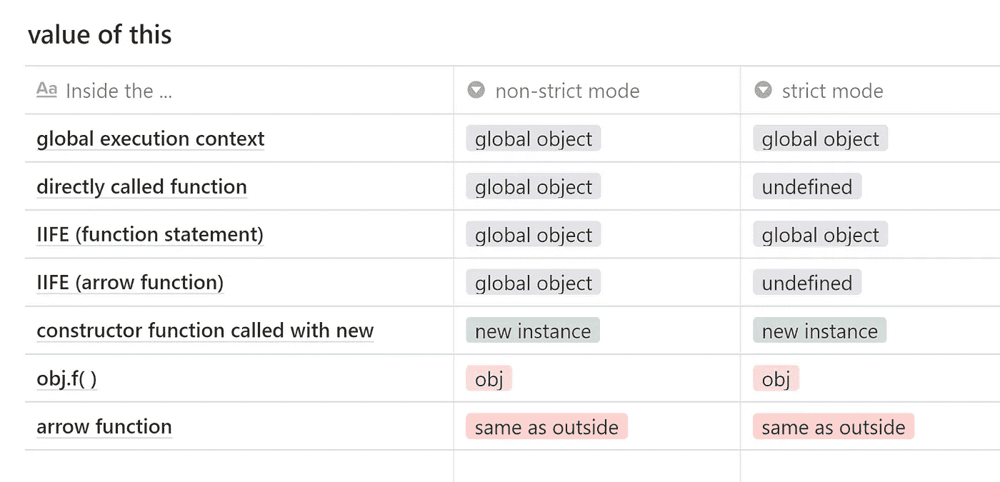

此表的值

起初这可能看起来让人不知所措，但是随着你不断使用`this`，它变得非常直观。

# 设置此☕的自定义值

有时我们想为某个函数设置自定义值。这可以通过使用`call()`、`bind()`和`apply()`来完成。

> 注意:箭头功能内 `*this*` **的**值不可更改。**使用`*call()*`、`*bind()*`、*、*和`*apply()*`中的任何一个，在非严格模式下不做任何事情，在严格模式下给出错误。**

## 绑定( )🥨

`bind`创建一个函数的副本，该函数的给定值设置为`this`的值，并返回该函数。

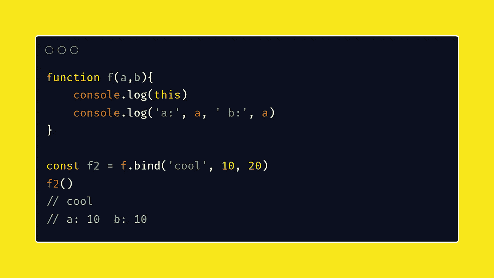

绑定()

## 调用( )😏

`call`调用函数，第一个参数设置为`this`的值，其余参数用作普通参数。

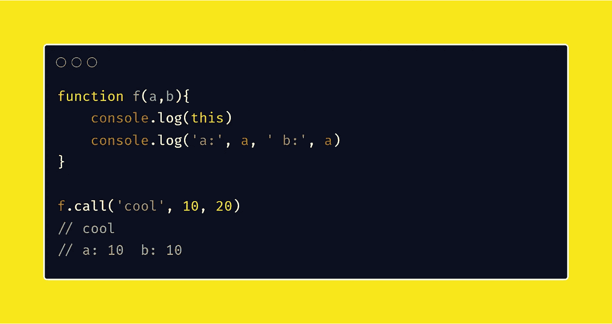

调用( )

## 应用( )😙

它与`call()`相同，唯一的区别是它只需要两个参数。第一个用于设置`this`的值，第二个用作参数数组。

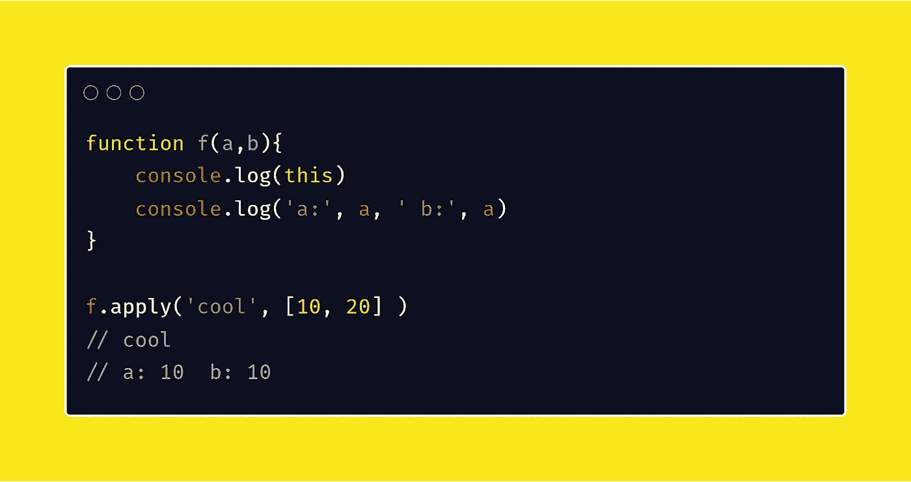

应用( )

## 奖励:函数 currying with bind()👏

函数 currying 是一种使用一些预设参数创建函数副本的机制。如果您正在创建一些数学密集型库，这将非常有用

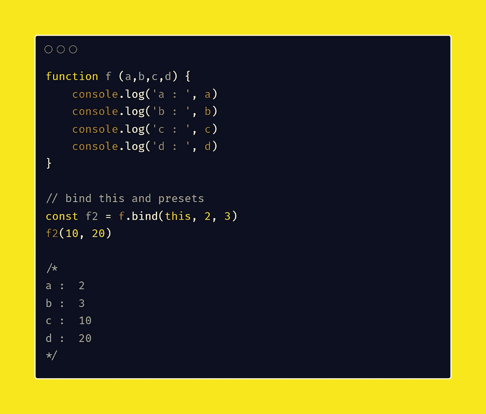

使用绑定的函数

这就是第 2 部分🤗请关注本系列的未来更新。

感谢阅读👏