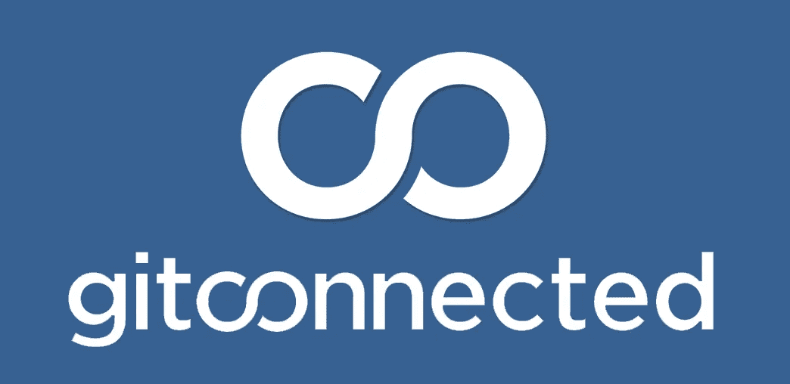

# 欢迎来到 Gitconnected！

> 原文：<https://levelup.gitconnected.com/welcome-to-gitconnected-a5c6b419395e>

## 我们的愿景是为开发人员和软件工程师创建一个社区。看看吧！

我们很兴奋地宣布 [**gitconnected**](https://gitconnected.com/?utm_source=medium article&utm_medium=About gitconnected) 即将推出！对构建社区的支持和热情令人难以置信，我们希望这个平台将有助于改进开源软件并连接构建它的人们。

## [加入 git connected>](https://gitconnected.com)

对于第一次发现 gitconnected 的用户，欢迎！

> 最初是一个回报开源社区的激情项目，现在已经发展成为一个使命，将所有对构建软件充满热情的人联系起来。gitconnected 是由像您这样的人为您打造的。不管你的背景，你来自哪里，或者你相信什么，我们希望你能在这里找到朋友和家。我们的目标是加强各行各业的开发人员之间的联系，并支持开源软件，开源软件已经成为世界上一切事物的基础。

社区是 gitconnected 的基础。随着我们发展和加强 it，我们生产的软件的数量和质量无疑会提高。总体范围和影响将远远超出 gitconnected 的成员。我们创造的东西会对每个使用它的人产生积极的影响。

尽管我们仍然是一家年轻的初创公司，但我们很高兴能够继续发展这个平台和社区。我们目前只有一小部分的功能和工具，我们想为你建立。作为一名开发人员，如果您对我们拥有一个社区和一个单一位置来找到对您来说重要的一切的愿景充满热情，我们鼓励您分享 gitconnected 并参与进来！