# Redis 迁移教会了我们如何处理突发 EC2 实例

> 原文：<https://levelup.gitconnected.com/what-a-redis-migration-taught-us-about-burstable-ec2-instances-508990b002b3>

***由我们的工程师西蒙·怀杜格*自豪地写下的**

在 DPG 媒体公司，我们开发各种软件来支持、发展和数字化我们的媒体足迹。其中一个产品是 [VTM GO](https://vtm.be/vtmgo) ，这是我们的流媒体解决方案，可以让你观看我们的视频内容直播和点播。

标识 Redis

让 VTM 继续前进的支柱是我们的长格式视频平台(简称 LFVP)。这个主干的一部分是所有 VTM GO 客户端使用的后端 API。这个后端 API 有一个致命弱点:Redis，一个内存中的键值数据库。就像阿基里斯一样，雷迪斯也是一个英雄！

# 雷迪斯

这位特别的英雄有三重目的(1):

*   首先，它是一个持久的数据库。这个数据库是由从各种上游主要事实来源收到的事件构成的。
*   其次，它充当了一个通读/直写缓存，其中持久性并不是真正的关键，但是如果没有这个缓存，上游依赖性将会受到(太)严重的影响。
*   第三，当人们观看内容时，它可以作为视频播放的临时存储。只有在某人停止观看之后，他们的视频进展才被写入永久存储器。

综上所述，Redis 是必不可少的、节省成本的骨干组件。但是如果那个致命弱点消失了…

# AWS ElastiCache

直到最近，我们还使用 AWS ElastiCache 来托管 Redis 主实例和副本实例。然而，Redis 故障转移和升级场景从未真正为我们带来 ElastiCache。AWS 没有使用几乎所有流行的 Redis 客户端库都支持的 Redis Sentinel，而是决定采用一种不同的方法。他们在幕后实现了自己的故障转移机制。发生故障转移时，它们会发布主端点和副本端点的新 DNS 记录。非常简单，但是没有适当的客户端支持(2)，非常无用。

我们决定离开 ElastiCache，在 EC2 上自己主持一个 Redis Sentinel 设置。这将使我们受益于久经考验的莴苣客户端库哨兵支持。DPG 媒体的另一项工程工作是我们的投票系统，我们在“好声音”和“比利时达人”等节目中使用该系统进行现场投票。已经在那里建立并使用了一个相当类似的 Redis Sentinel 设置，我们觉得继续这样做很舒服。

# 迁移到 EC2

我们的 ElastiCache 设置运行在 cache.m5.large 实例上。我们不妨也重新评估一下这个选择，对吧？让我们看一些指标，看看哪种 EC2 实例能够满足我们的使用。这是典型的 VTM 围棋使用模式:

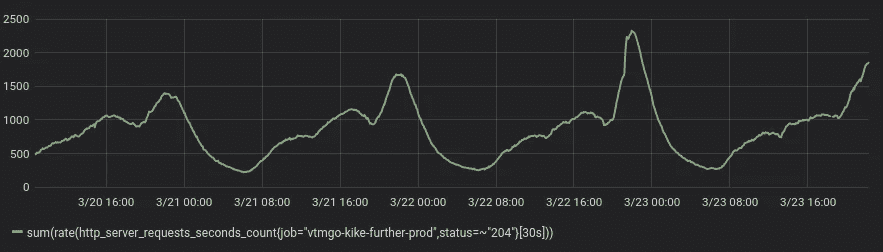

使用量在一天中慢慢增加，在晚餐时间下降，然后通常在 22 小时左右达到峰值，除非有计划的行动号召。这反映在 Redis 引擎的 CPU 使用率中:

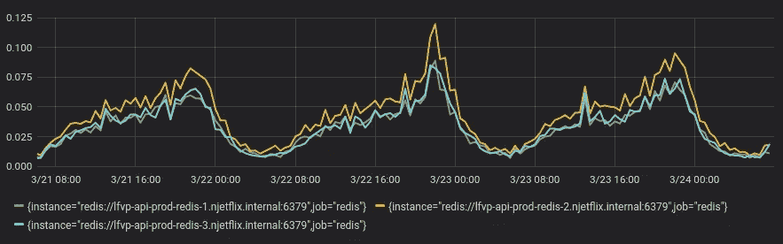

Redis 主服务器的使用率略高于副本服务器。总而言之，我们似乎只使用了 CPU 内核的 10%多一点。让我们看看 Redis 实例的内存使用情况:

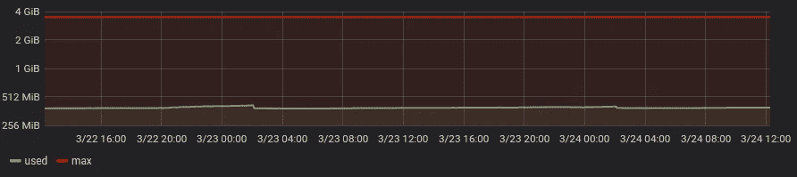

我们目前的内存使用量是 400MiB 左右，没有那么多。我们确实存储了一些相当大的物体，其大小可达几百 KiB。某些 Redis 查询可能导致高达几个 MiB 的响应。让我们来看看网络的使用情况:

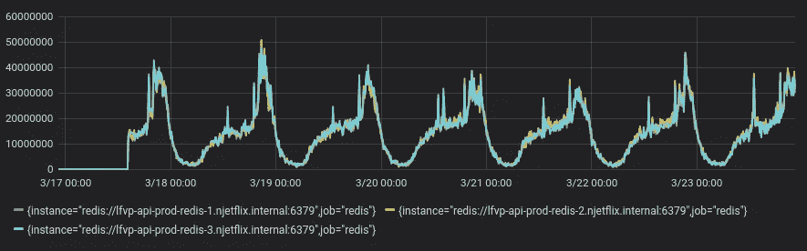

典型的网络总使用率约为 20 MB/s (160 Mbit/s)，峰值约为 50MB/s (400 Mbit/s)。现在我们有了数据，让我们选择一个实例类型。关于 CPU 和内存，t3a.small 实例已经足够了:

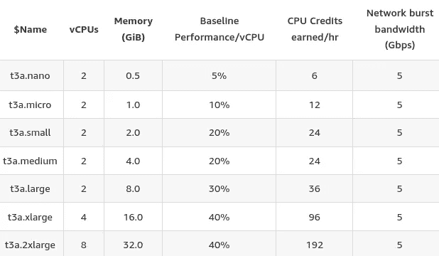

评估带宽有点棘手。在很多情况下，AWS 只公布最大突发速率，但没有提供你可以预期的持续带宽的数据。正如 AWS 自己建议的那样，做出明智决策的唯一真正方法是进行基准测试(3)。一个快速的 iperf 基准测试之后，它似乎是 t3a。小实例只能支持大约 122 Mbit/s 的持续带宽，低于所需的 160 Mbit/s。但是，t3a.medium 实例可以支持大约 255 Mbit/s，这就足够了。所有实例都成功地突发高达 5Gbps。所以做出了选择，还是来个 t3a.medium 吧。

在设置好一切并执行彻底的迁移测试之后，是时候进行生产迁移了。Redis 数据库转储来自 ElastiCache 集群，并恢复到 Redis Sentinel 集群。然后，我们部署了一个新的代码库，切换到新的 Redis Sentinel 端点。随后执行上游事件重放，以恢复在此窗口期间丢失的任何重要写入。看，切换:

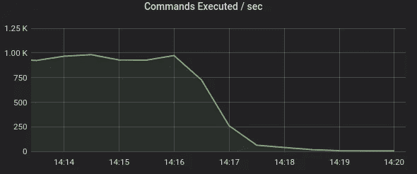

上面是旧的 ElastiCache 实例。下面是新的自托管 Redis Sentinel 实例

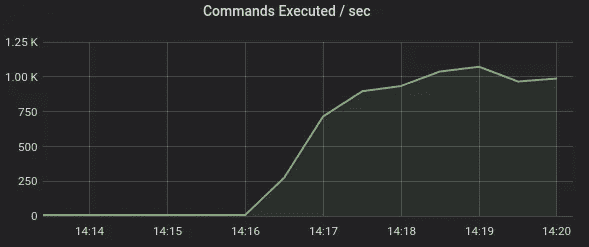

好了，完成了，让我们打包回家吧！嘿，等等，那边的度量标准是什么？

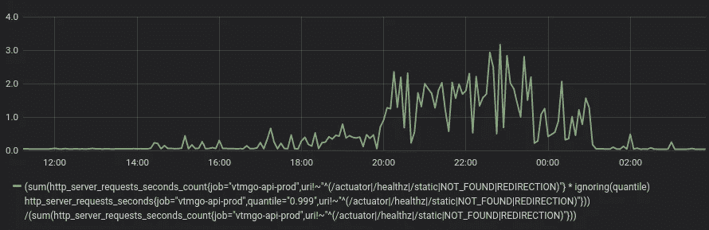

# 排除故障

上面的指标是 99.9%的延迟，这看起来有点寒酸，因为迁移已经完成。大多数请求仍然以相当可观的延迟得到处理，但是对于少数请求，延迟似乎变得更加令人不安。但是这些机器应该能承受这种负荷，不是吗？这些机器甚至没有浪费 CPU 信用，因为它们几乎一直低于 20% CPU 使用率的突发基线。也许我们应该看看 CPU 窃取指标:

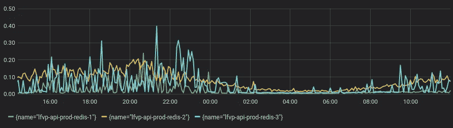

嗯，那也很紧张。等等，什么叫 CPU 偷来着？atop 手册页(4)是这样定义 CPU 偷取时间的:

对于虚拟机，将显示窃取百分比(“steal”)，反映在相同硬件上运行的其他虚拟机窃取的 CPU 时间的百分比。

这就是可突发 EC2 机器的情况，比如 t3 和 t3a 类型。基本上，它们更便宜，因为 AWS 在同一个硬件虚拟机管理程序上打包了比 c5 等其他类更多的组件。这使得他们尽管价格较低，但仍能从中获利。与内存(5)不同，CPU 是一种可扩展的资源，这意味着您可以在更多的机器上扩展这种资源，并且当物理 CPU 被完全使用时，它们不会全部崩溃。它们可能更慢，性能更不可预测，但是它们不会因此而死(不像当你的机器内存耗尽，Linux OOM 杀手来毁了你的生活)。“吵闹的邻居”(其他需要大量 CPU 的虚拟机)越多，CPU 占用率就越高。请注意，如果您在没有“无限制”模式(7)的情况下运行突发实例，高 CPU 占用率也可能表明您已经耗尽了 CPU 信用。注意度量。

实验有时是解决问题的最快方法，所以让我们把这些讨厌的机器升级到 c5.large，看看会发生什么。这些是 99.9%的延迟指标:

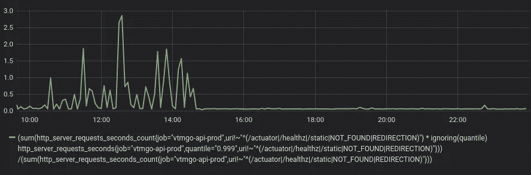

我猜你能认出升级是什么时候完成的。偷 CPU 的事怎么样了？

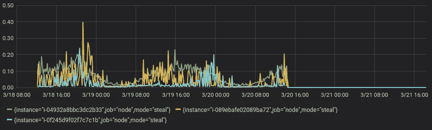

嗯，这是我见过的最明显的关联。迁移完成！

# 让我们结束它

结论:

*   CPU、内存和带宽是选择正确实例类型的关键，但是您还必须考虑其他因素。尤其是延迟敏感型应用程序，Redis 就是其中之一，可能会受到过度调配的虚拟机管理程序容量的严重影响。
*   这并不意味着可爆发的实例没有用。你还得运行的那个 FTP 服务器？当然，为什么不呢？对于轻量级应用，它们是完美的。延迟不是真正问题的批处理工作负载，它们可能也很适合。永远记住要逐案评估。
*   当你处理吵闹的邻居时，你总是可以尝试停止你的实例，然后重新启动它。这将在不同的虚拟机管理程序上启动您的虚拟机，并且您可能会摆脱那些烦人的邻居(一段时间)。如果 CPU 占用率达到某个阈值，您甚至可以设置一个警报。
*   具体到 Redis 延迟调试，有一些有用的信息和很好的工具:

[https://redis.io/topics/latency](https://redis.io/topics/latency)
https://redis.io/topics/latency-monitor

(1)将单个 Redis 集群混合用于持久存储和缓存的目的可能会被认为是一种反模式。这是一个架构遗产，超出了本文的范围。

(2)生菜问题:[https://github . com/莴苣-io/莴苣-core/issues/338 # issue comment-397618666](https://github.com/lettuce-io/lettuce-core/issues/338#issuecomment-397618666)

(3)[https://AWS . Amazon . com/premium support/knowledge-center/network-throughput-benchmark-Linux-ec2/](https://aws.amazon.com/premiumsupport/knowledge-center/network-throughput-benchmark-linux-ec2/)

④https://linux.die.net/man/1/atop

(5)虽然不完全正确:[https://en.wikipedia.org/wiki/Memory_overcommitment](https://en.wikipedia.org/wiki/Memory_overcommitment)

(6)[https://linux-mm.org/OOM_Killer](https://linux-mm.org/OOM_Killer)

(7)[https://docs . AWS . Amazon . com/AWS C2/latest/user guide/burst able-performance-instances-unlimited-mode . html](https://docs.aws.amazon.com/AWSEC2/latest/UserGuide/burstable-performance-instances-unlimited-mode.html)