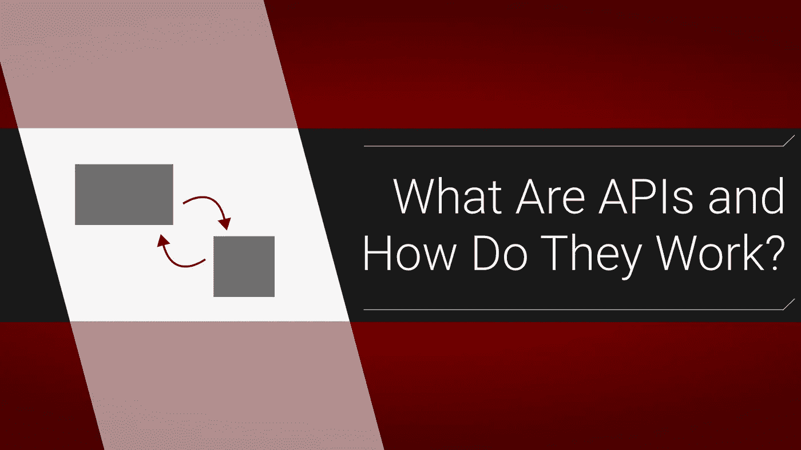
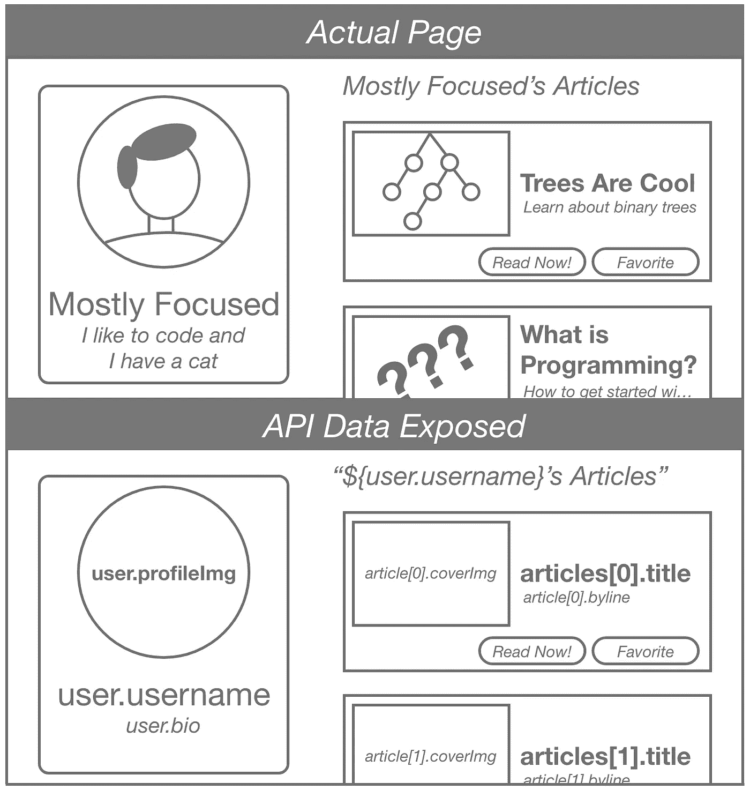

# 什么是 API，它们是如何工作的？

> 原文：<https://levelup.gitconnected.com/what-are-apis-and-how-do-they-work-a36c10441274>

## 互联网的主干解释道



当我第一次开始学习 JavaScript 时，术语“***【API】***真的吓到我了。回想起来，我觉得我只是假设它很复杂，所以我回避了，这增加了我对*未知*的恐惧。我希望我花了时间在幕后达到顶峰，因为真的没有什么可怕的。API 只是使用程序的另一种方式。

# 解释 GUI 与 CLI 和 API

在我们进入 API 之前，描述一下与程序交互的三种主要方式可能会有所帮助:

1.  GUI - **G** *图形***U***ser***I***接口*
2.  C *命令* **L** *线* **I** *接口*
3.  API - ***A*** *应用* **P** *编程* **I** *接口*

到目前为止，图形用户界面是最常见的，你现在正在使用一个！Medium 是一个 GUI，它只是用户使用*图形*对象来响应数据的一种方式。但是事情并不总是那么容易。当计算机还很新的时候，你只能用文本和程序交流。这个界面被称为“命令行”如果您曾经使用过 bash shell，您仍然会这样做。基本上，如果你能点击，它就是一个 GUI 如果你只是使用文本，它是一个命令行界面。但是如果*你*根本不做任何事情…它就是一个 API。

# 删除用户

GUI 和 CLI 是让用户对程序作出反应的，但是 API 去掉了中间人；它们的存在使得两个*应用*可以相互交互。作为一名 web 开发人员，API 最常见的用途是当后端服务器有数据，而前端希望使用它时。前端获取数据的方式是通过点击特定的 URL，经由其 API 从后端查询(请求)数据。

# 简单的例子

让我们假设有一个允许用户发布文章的网站。当你进入一个用户的页面，比如说`example.com/users/12`你会看到他们的个人资料信息，以及他们的文章。但是，生成页面的方式是由前端客户端在不同的 url(如 T1)上点击服务器。然后，这个 url 发回[一个叫做 JSON](https://flaviocopes.com/json/) 的东西，它本质上是一个 JavaScript 对象:

```
{
  "***user***": {
    "***id***": 12,
    "***username***": "Mostly Focused",
    "***bio***": "I like to code and I have a cat",
    "***profileImg***": "hoster.com/users/12/profile-12.jpg"
  },
  "***articles***": [
    {
      "***id***": 12113,
      "***title***": "Trees Are Cool",
      "***byline***": "Learn about binary trees",
      "***coverImg***": "hoster.com/cover-images/c-12113.jpg"
    },
    {
      "***id***": 13438,
      "***title***": "What is Programming",
      "***byline***": "How to get started on your developer journey",
      "***coverImg***": "hoster.com/cover-images/c-13438.jpg"
    }
  ]
}
```

为了更直观地理解这一点，让我们看一下假装页面，然后看一下通过其键名“公开”的 JSON 数据:



一旦你开始编程一段时间，你会直观地注意到什么是动态的 API 数据，什么是静态的。请记住，API 不仅仅是用来传递数据的，它们也是用来将数据保存到服务器的。

# 各种 API

像 GUI 和 CLI 一样，API 是一个极其宽泛的术语。API 只是程序之间相互交流的链接。所以，当互联网还年轻的时候，事情是疯狂的。人们把数据放在各种形状和网址中，这是无政府状态。然而，这很快让位给了标准，在标准中，某些模式被粗略地遵循*，以便设计师和程序员知道会发生什么。今天，作为一名 web 开发人员，您可能会遇到两种主要模式: [REST](https://www.codecademy.com/articles/what-is-rest) 和 [GraphQL](https://www.youtube.com/watch?v=ed8SzALpx1Q&t=4183s) 。然而，没有什么是完美的，所以即使你在一个声称坚持这些模式的项目中工作，你仍然会发现一些变化。*

## *更多种类的 API*

*请注意，您可能还会听到类似于[获取 API](https://itnext.io/that-data-looks-so-fetching-on-you-understanding-the-js-fetch-api-880eae0c8d25) 或[其他 web API](https://developer.mozilla.org/en-US/docs/Web/API)的东西。这些可能看起来不像我刚才解释的东西，但它们在技术上是合适的。看，*你*没有使用获取 API，你的*程序*正在使用它来与*浏览器*交互。有时，服务器、浏览器或其他程序通过函数公开它们的 API。但是，通常当人们谈论 API 时，他们指的是从一个服务器到另一个数据源的数据传输。归根结底，API 只是两个程序之间的链接。*

# ***下一步***

*既然你知道什么是 API，我建议你先学习 REST 模式，因为它仍然主导着这个行业。但是，一旦你习惯了处理这个问题，你应该检查一下新的 GraphQL。*

*大家编码快乐，*

*麦克风*