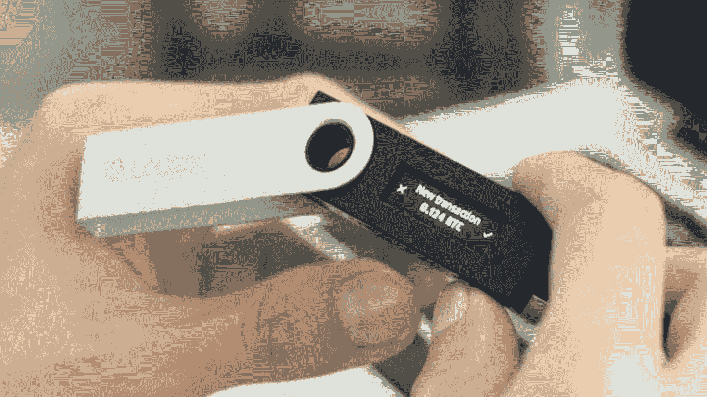
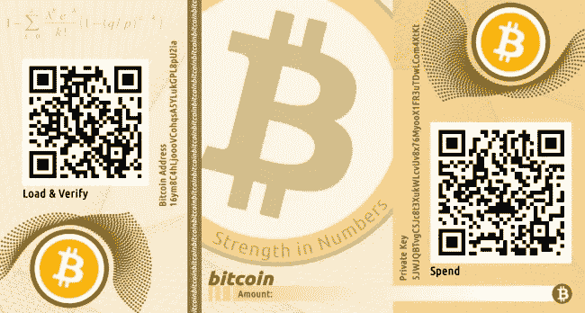

# 什么是加密钱包—探索 Web3

> 原文：<https://levelup.gitconnected.com/what-are-crypto-wallets-exploring-web3-60cf1674aa4a>

> 加密钱包是一个工具，可以用来与区块链网络进行交互。

从名字`crypto wallet`来看，它似乎是用来存储加密货币的，但事实并非如此。**加密钱包提供了与区块链网络通信所需的工具。**这些钱包生成使用加密货币所需的所有信息。

例如，您想从朋友那里收到一笔加密货币付款。最简单的方法是使用**加密钱包应用程序**。

> 注:加密货币不以物理形式存在，仅在像**区块链**这样的去中心化网络中以交易和数字记录的形式存在。**区块链是总账的数字记录。**要了解更多关于区块链及其运作的信息，请点击我写的关于区块链的文章的链接:

[https://www . the geekyminds . com/post/what-are-crypto-wallet-exploring-web 3](https://www.thegeekyminds.com/post/what-are-crypto-wallets-exploring-web3)

# 那么到底什么是加密钱包呢？

加密钱包是一个应用程序

*   存储我们的公钥和私钥
*   监控加密余额
*   与区块链互动
*   提供转移和接收加密货币的能力。

# 简单来说就是私钥和公钥

**公钥** — `Public key`或`wallet address`是您提供给其他人的地址，用于将资金存入您的账户。

**私钥** — `Private key`就像一个秘密密钥，你需要它来访问你的密码。顾名思义，这需要保密，因为任何获得私钥的人都可以访问你的密码，显然会拿走你的加密货币。

**公钥类似于银行账户 id** ，与其他人共享以接收资金，**私钥类似于网上银行密码**，提供对网上账户的访问。

**使用公钥和私钥时有一点限制** —与比特币区块链相关的密钥只能用于接收或发送比特币。这是一个问题——你需要记住每种区块链的私钥和公钥对(一个用于比特币，一个用于以太网等)。).为了解决这个问题，大多数现代钱包利用一个种子短语来生成多个私有和公共密钥。因此，用户只需要记住种子短语，而不是备份所有的私钥和公钥对。

# 加密钱包的类型

不同类型的钱包可分为两大类

*   热门钱包—软件钱包
*   冷钱包——硬件钱包、纸质钱包

## 热门钱包

热门钱包主要由用户可以用来兑换加密货币的软件应用组成。在这些钱包中，私钥是在连接到互联网的应用程序上生成的，因此我们称之为热钱包。

## 冰冷的钱包

*   **硬件钱包** —硬件钱包是利用随机数生成器生成密钥的物理电子钱包。这些密钥存储在设备本身上。由于它不需要互联网连接来存储和检索密钥，我们将其归类于冷钱包。

> 注意:与软件钱包相比，硬件钱包对长期投资者来说更安全。由于软件钱包利用互联网，它们更容易受到网络攻击。然而，软件钱包对于经常交易的人来说更方便。

*   **纸质钱包**——纸质钱包是一张纸，上面印有区块链的地址和私人密钥(大多以二维码的形式)。由于其安全风险和使用上的限制，非常不鼓励使用纸质钱包。由于这些限制，欺诈和诈骗变得更加容易，所以它们已经过时了。

现在你已经知道了加密钱包的类型及其功能，明智地选择你的钱包类型吧！

> 这里邀请您探索我们的博客平台 [**极客头脑**](https://www.thegeekyminds.com/) 。一个让您了解软件开发和技术领域最新发展的一站式平台。我们在 [**的极客头脑**](https://www.thegeekyminds.com/) 旨在写一些你实际上可以用来提高工作效率和充实你的职业生活的内容。
> 
> 邀请您在[**https://thegeekyminds.com**](https://thegeekyminds.com/)通过我们的平台。并订阅我们的时事通讯，以便在我们每次发布新帖子时收到电子邮件。我们承诺不会向您的收件箱发送垃圾邮件。点击下面的按钮订阅我们的时事通讯

