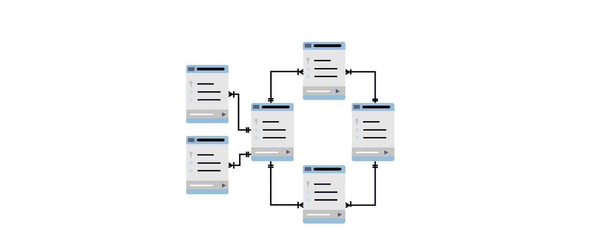
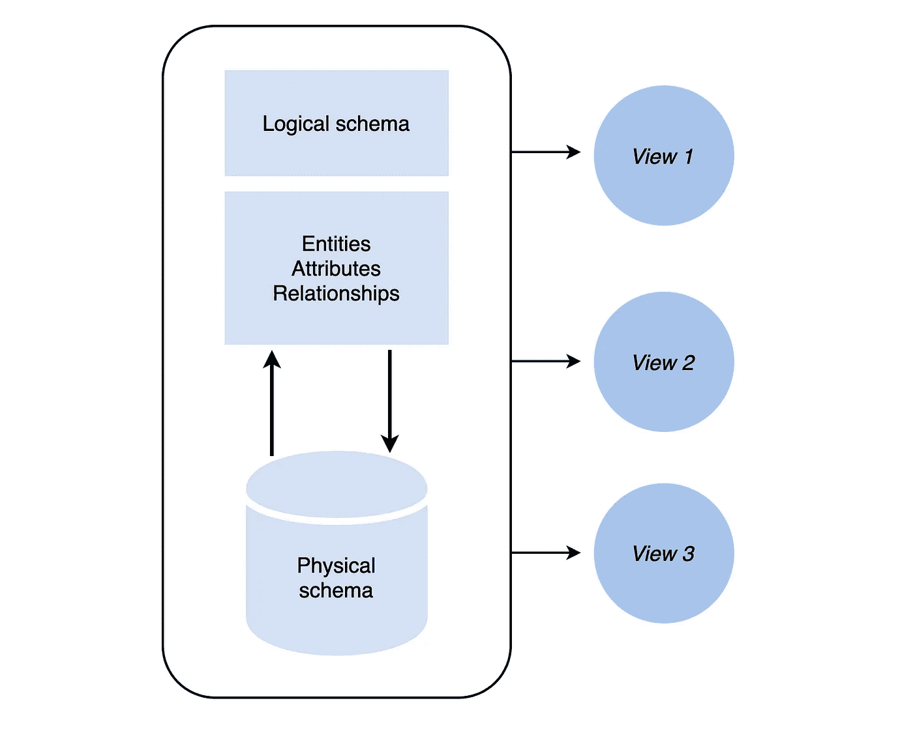
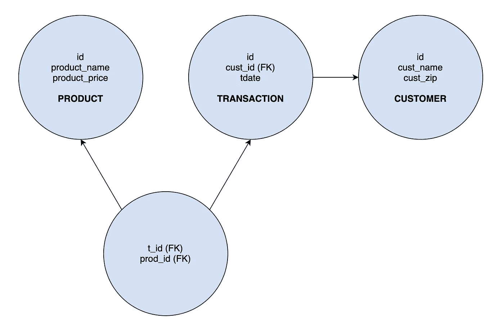
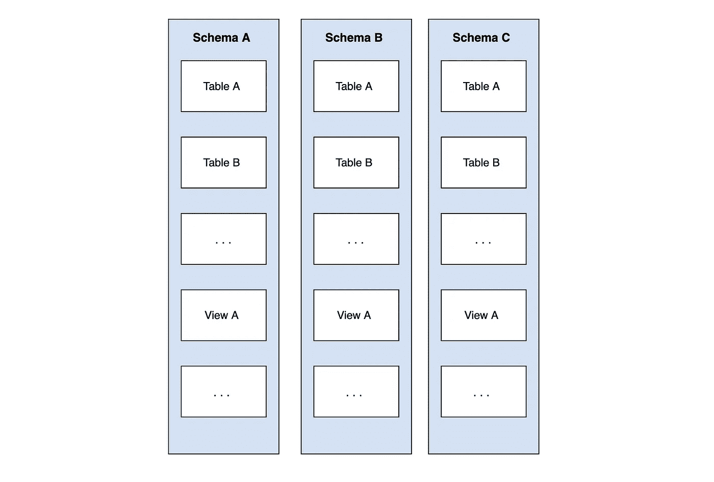

# 什么是数据库模式？带示例的 5 分钟指南

> 原文：<https://levelup.gitconnected.com/what-are-database-schemas-5-minute-guide-with-examples-4d1f09710798>

## 数据库模式是一种抽象的设计，表示数据库中数据的存储。通过常见的例子学习数据库模式的基础:PostgreSQL、NoSQL 和 MySQL。


当构建应用程序的后端时，您需要考虑前端如何与后端对话。然而，更重要的是数据库的构造和设计。数据表单的关系将导致数据库模式的构建。

一个**数据库模式**是一个抽象的设计，代表你的数据在数据库中的存储。它描述了给定数据库中数据的组织和表之间的关系。开发人员提前计划数据库模式，这样他们就知道哪些组件是必需的，以及它们如何相互连接。

在本指南中，我们将学习什么是数据库模式以及为什么使用它们。我们将讨论几个常见的例子，以便您可以学习如何自己配置数据库模式。

**今天，我们来复习一下:**

*   什么是数据库模式？
*   数据库模式类型
*   NoSQL 的例子
*   SQL server 示例
*   PostgreSQL 示例
*   接下来学什么



# 什么是数据库模式？

在选择数据库时，您必须考虑的一件事是数据的形状，它将遵循什么模型，以及形成的关系如何在我们开发模式时帮助我们。

数据库模式是我们数据外观的**蓝图**或**架构**。它本身并不保存数据，而是描述数据的形状以及它与其他表或模型的关系。我们数据库中的一个条目将是数据库模式的一个实例。它将包含模式中描述的所有属性。

> *将数据库模式视为一种数据结构。它表示组织数据内容的框架和安排。*

**数据库模式将包括:**

*   所有重要或相关的数据
*   所有数据条目的格式一致
*   所有条目和数据库对象的唯一键
*   表中的每一列都有一个名称和数据类型

数据库模式的大小和复杂性取决于项目的大小。数据库模式的视觉风格允许程序员在进入代码之前正确地构建数据库及其关系。规划数据库设计的过程称为数据建模。

模式对于设计数据库管理系统(DBMS)或关系数据库管理系统(RDBMS)非常重要。DBMS 是一种软件，它以遵循 ACID 概念的安全方式存储和检索用户数据。

在许多公司，数据库设计和 DBMS 的职责通常落在**数据库管理员(DBA)** 的角色上。DBA 负责确保数据分析师和数据库用户能够方便地访问信息。他们与管理团队一起规划和安全地管理组织的数据库。

> ***注:*** *一些流行的 DBMS 系统有 MySQL、Oracle、PostgreSQL、Microsoft Access、MariaBB、dBASE 等。*

# 数据库模式类型

有两种主要的数据库模式类型定义了模式的不同部分:**逻辑**和**物理**。



## 逻辑学的

一个逻辑数据库模式代表了**数据是如何以表格的形式组织的**。它还解释了表中的属性是如何链接在一起的。不同的模式使用不同的语法来定义逻辑架构和约束。

> ***注:*** *完整性约束是 DBMS 保持数据插入和更新质量的一组规则。*

为了创建逻辑数据库模式，我们使用工具来说明数据组件之间的关系。这被称为实体关系建模(ER 建模)。它指定了实体类型之间的关系。

下面的模式图是一个非常简单的 ER 模型，显示了一个基本商业应用程序中的逻辑流程。它向购买产品的顾客解释产品。



上面三个圆圈中的 id 表示对象的**主键**。这是唯一标识文档或表格中条目的 id。图中的 FK 是**外键**。这是从一个表到下一个表的关系的链接。

*   **主键:**标识表中的一条记录
*   **外键:**另一个表的主键

实体关系模型可以通过各种方式创建，在线工具可以帮助您构建图表、表格，甚至 SQL 来从现有的 ER 模型创建数据库。这将有助于构建数据库模式的物理表示。

## 身体的

物理数据库模式表示数据如何存储在**磁盘存储器**上。换句话说，它是用于创建数据库结构的实际代码。例如，在使用 mongose 的 MongoDB 中，这将采用 mongose 模型的形式。在 MySQL 中，您将使用 SQL 构建一个包含表的数据库。

> *与逻辑模式相比，它包括数据库表名、列名和数据类型。*

现在我们已经熟悉了数据库模式的基础，让我们看几个例子。我们将讨论你可能会遇到的最常见的例子。

# NoSQL 的例子

NoSQL 数据库主要是指非关系或分布式数据库。为 NoSQL 设计一个模式是一个争论的话题，因为他们有一个动态的模式。一些人认为 NoSQL 的吸引力在于你不需要创建一个模式，但是其他人认为设计对于这种类型的数据库非常重要，因为它没有提供一个解决方案。

这个片段是一个示例，展示了当使用 mongose(MongoDB)创建一个表示上面的实体关系图的数据库时，物理数据库模式是什么样子。

*ConsumerSchema.js*

```
const mongoose = require('mongoose');

const Customer = new mongoose.Schema({
   name: {
       type: String,
       required: true
   },
   zipcode: {
       type: Number,
   }
})

module.exports = mongoose.model("Customer", Customer);
```

*ProductSchema.js*

```
const mongoose = require('mongoose');

const Product = new mongoose.Schema({
   name: {
       type: String,
       required: true
   },
   price: {
       type: String,
       required: true
   }
})

module.exports = mongoose.model("Product", Product);
```

*TransactionSchema.js*

```
const mongoose = require('mongoose');const Transaction = new mongoose.Schema({date: {type: String,required: true},cust_id: {type: mongoose.Schema.Types.ObjectId, // signifies relationship to Customer Schemaref: 'Customer'},products: [{type: mongoose.Schema.Types.ObjectId, // signifies relationship to Product Schemaref: 'Product'}]})module.exports = mongoose.model("Transaction", Transaction);
```

这里需要记住的重要一点是，在像 MongoDB 这样的 NoSQL 数据库中，没有外键。换句话说，模式之间没有关系。`ObjectId`只是表示另一个集合中文档的一个`_id`(Mongo 在创建时自动分配的 id)。它实际上并没有创建一个连接。

> 继续学习。
> 
> 学习设计数据库的最佳技术，让您的后端技能更上一层楼。Educative 基于文本的课程易于浏览，并以实时编码环境为特色，使学习快速高效。
> 
> [**软件工程师数据库设计基础**](https://www.educative.io/courses/database-design-fundamentals)

# SQL server 示例

SQL 数据库包含视图、表、函数、索引和视图等对象。我们可以使用的对象数量没有限制。SQL 模式是在逻辑级别定义的，拥有该模式的用户称为模式所有者。

> *SQL 用于访问、更新和操作数据。MySQL 是一个用于存储和组织的 RDBMS。*

我们可以使用 SQL Server `CREATE SCHEMA`在数据库中创建一个新的模式。在 MySQL 中，模式是数据库的同义词。您可以用关键字`SCHEMA`代替 MySQL SQL 语法中的`DATABASE`。

其他一些数据库产品有所区别。例如，在 **Oracle 数据库产品**中，模式仅代表数据库的一部分:表和其他对象归单个用户所有。

> ***注意:*** *在 SQL 中，视图是基于语句结果集的虚拟表。视图包含行和列。*

主键和外键在这里被证明是有用的，因为它们代表了从一个表到下一个表的关系。

```
CREATE DATABASE example;
USE example;

DROP TABLE IF EXISTS customer;

CREATE TABLE customer (
 id INT AUTO_INCREMENT PRIMARY KEY,
 postalCode VARCHAR(15) default NULL,
)

DROP TABLE IF EXISTS product;

CREATE TABLE product (
 id INT AUTO_INCREMENT PRIMARY KEY,
 product_name VARCHAR(50) NOT NULL,
 price VARCHAR(7) NOT NULL,
 qty VARCHAR(4) NOT NULL
)

DROP TABLE IF EXISTS transactions;

CREATE TABLE transactions (
 id INT AUTO_INCREMENT PRIMARY KEY,
 cust_id INT,
 timedate TIMESTAMP,
 FOREIGN KEY(cust_id)
     REFERENCES customer(id),
)

CREATE TABLE product_transaction (
 prod_id INT,
 trans_id INT,
 PRIMARY KEY(prod_id, trans_id),
 FOREIGN KEY(prod_id)
     REFERENCES product(id),
 FOREIGN KEY(trans_id)
     REFERENCES transactions(id)
```

# PostgreSQL 示例

PostgreSQL 是一个免费的、开源的关系数据库管理系统，具有高度的可扩展性，并遵循 SQL 规范。在 PostgreSQL 中，数据库模式是带有命名数据库对象的**名称空间**。

这包括表、视图、索引、数据类型、函数和运算符。在这个系统中，模式与目录同义，但是它们不能嵌套在层次结构中。

> ***注:*** *在编程中，命名空间是我们用来标识对象的一组符号(称为名字)。名称空间确保所有对象都有唯一的名称，以便于识别。*

因此，虽然 Postgres 数据库可以包含多个模式，但只有一个级别。让我们来看一个视觉表现:



在 PostgreSQL 中，数据库**集群**包含一个或多个数据库。用户在整个集群中共享，但数据不共享。您可以在多个模式中使用相同的对象名。

我们使用语句`CREATE SCHEMA`开始。请注意，PostgreSQL 将自动创建一个公共模式。每一个新的物体都会被放在这里。

```
CREATE SCHEMA name;
```

为了在数据库模式中创建对象，我们编写一个包括模式名和表名的限定名:

```
schema.table
```

下面的例子来自 Postgres 文档`CREATE` `SCHEMA`来初始化一个名为`scm`的新模式、一个名为`deliveries`的表和一个名为`delivery_due_list`的视图。

```
CREATE SCHEMA scm 
    CREATE TABLE deliveries(
        id SERIAL NOT NULL, 
        customer_id INT NOT NULL, 
        ship_date DATE NOT NULL
    )
    CREATE VIEW delivery_due_list AS 
        SELECT ID, ship_date 
        FROM deliveries 
        WHERE ship_date <= CURRENT_DATE;
```

# 接下来学什么

*恭喜恭喜！*您现在已经了解了数据库模式的基础，并准备好将您的数据库设计技能提升到一个新的水平。数据库模式对于数据库的创建至关重要。无论您使用基于 NoSQL 还是基于 SQL 的数据库，数据库模式都是您的应用程序的基础。

**为了继续学习，下一个主题是:**

*   三模式架构
*   实体关系模型
*   关系模型概念
*   功能依赖性
*   正常化

要开始了解这些概念，请查看 Educative 的数据库设计一站式商店: [**软件工程师数据库设计基础**](https://www.educative.io/editor-page/blog/educative.io/courses/database-design-fundamentals) 。本课程涵盖了数据库的基本概念。您将发现像规范化这样有助于提高数据库效率的技术。完成本课程后，您将能够进入更高级的概念，如涉及数据库系统！

## 继续阅读关于数据库的内容

*   [数据库设计教程](https://www.educative.io/blog/database-design-tutorial)
*   [什么是数据库查询？SQL 和 NoSQL 查询解释](https://www.educative.io/blog/what-is-database-query-sql-nosql)
*   [MongoDB vs PostgreSQL:选择数据库要考虑什么](https://www.educative.io/blog/mongodb-versus-postgresql-databases)