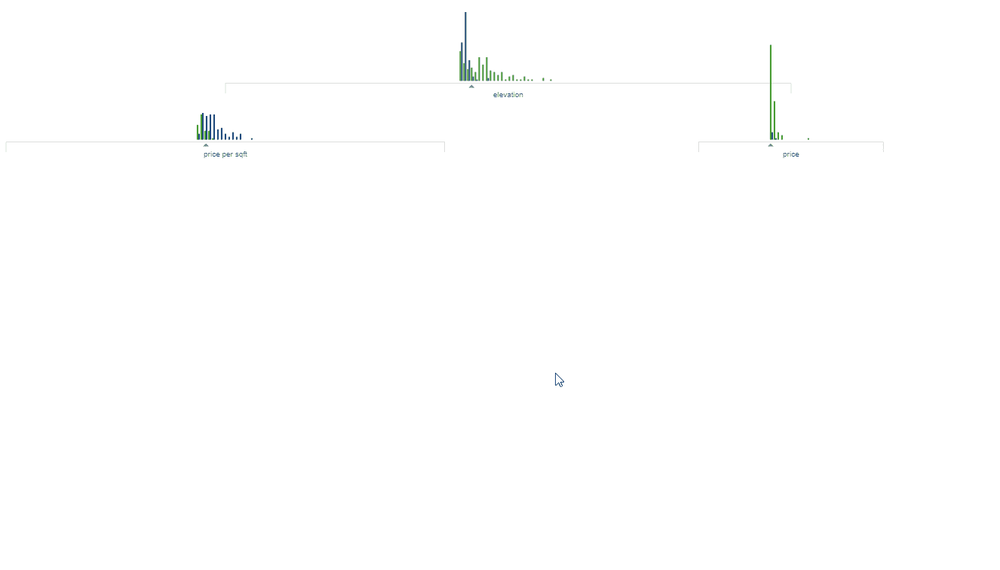
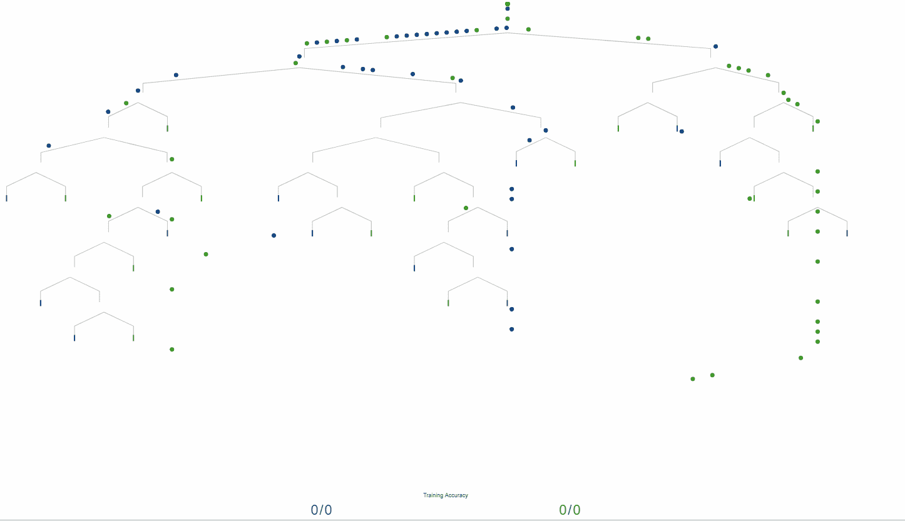
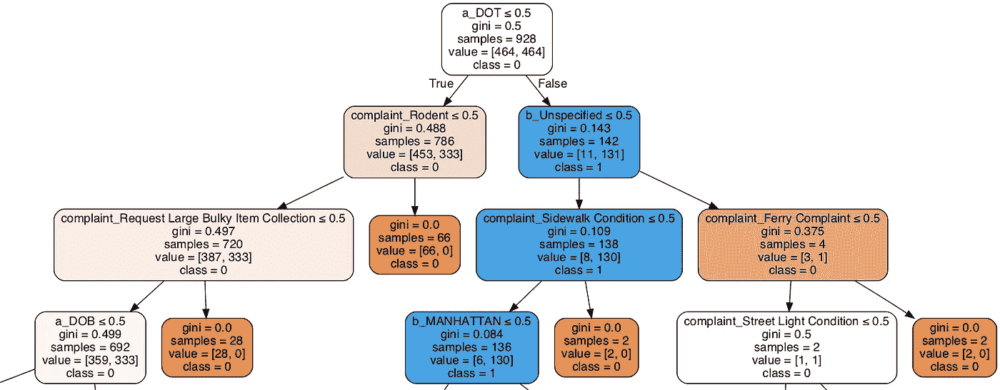

# 理解机器学习中的决策树以及如何使用 sklearn 在 Python 中实现它

> 原文：<https://levelup.gitconnected.com/what-are-decision-trees-4bfac0fbb179>

图片由 r2d3.us 提供

决策树是一种监督学习，用于分类(是/否)和回归(连续数据)，其中数据根据某个参数连续分割。预测类别是从数据的特征中导出的。以下文章从 3.11 项目的 [311 创建了一个决策树。在这个项目中，预测的是正面或负面的解决结果。决定这一点的特征是:](https://medium.com/@FhelDimaano/the-311-on-3-11-bbb05716e1c7)

> ***机构*** *: NYPD、交通部、卫生部&精神卫生、环境卫生、住房保护和发展部、公园和娱乐部等* ***区*** *:布鲁克林、皇后区、曼哈顿、布朗克斯、斯塔滕岛* ***地点*** *:经度/纬度、十字路口、 十字路口* ***创建/关闭日期******投诉*** ***类型*** *:高温/热水、啮齿动物、噪音、街道状况、违章停车、不卫生状况、车道堵塞等等。* ***解决方案*** ***描述*** *:描述响应 311 服务请求所做的事情。*

使用决策树的最大好处之一就是它的可解释性。这不是一个黑盒模型，它吐出一个答案，你不知道为什么或如何得出这个结论。在这个决策树中，它考虑了哪个机构处理了 311 呼叫，以预测是否有正面或负面的解决方案。决策树拆分的其他功能是显示投诉类型(啮齿动物、噪音、暖气/热水)以及 311 投诉发生在哪个区。

该树是根据基尼指数分割的。**基尼指数**的程度在 0 和 1 之间变化，其中 0 表示所有要素都属于某个阶层，1 表示要素随机分布在各个阶层。0.5 的基尼指数表示在某些阶层中的要素分布均等。

# 如何使用 sklearn 在 Python 中制作决策树

我们在熊猫数据库中有我们的数据。我们将所有特征设为 X，并移除`resolution_outcome`,因为这就是我们所预测的。我们设 Y 为`resolution_outcome`。

然后我们训练分类器并进行预测:

图片由 r2d3.us 提供

# 超参数调整和优化

超参数调整和优化对决策树的预测能力有很大影响。决策树的深度是一个非常重要的考虑因素。非常深的树容易过拟合训练数据，而深度不够的树可能过拟合。使用 **GridSearch** 是确定理想的超参数集的一个很好的解决方案。GridSearch 将使用不同的超参数集运行决策树，并返回产生最高分数的最佳参数。

在那里，我们使用 graphviz 和 pydotplus 创建一个可视化:

