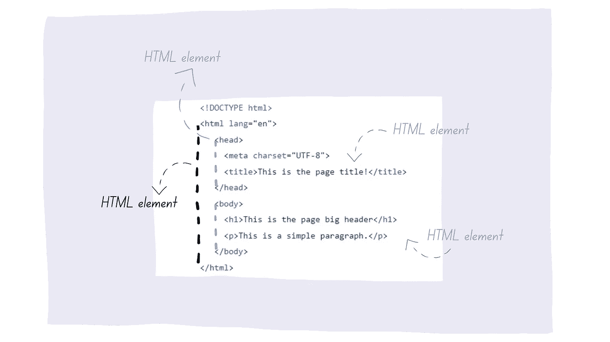

# HTML 中的元素和属性是什么

> 原文：<https://levelup.gitconnected.com/what-are-elements-and-attributes-in-html-1cd709c3a418>

## HTML 元素和属性的例子！

什么是 HTML 属性？什么是 HTML 元素？

在学习了 HTML 页面的一般结构之后，我们将学习 HTML 的属性和元素。一个空白的 HTML 页面并不有趣，^^'，不是吗？

# HTML 元素

一个 HTML 元素是我们从一个 ***标签*** 开始到它的结尾所创建的。

> <tag>这是一个 HTML 元素</tag>

标签由`<`和`>`包围。如果是结束标签，我们需要添加一个`/`。

不过，这条规则也有例外。是`*** ***`标签没有用来定义换行符的结束标签。

## **一些 HTML 元素的例子:**

您已经在 [HTML 结构文章](https://famzil.medium.com/the-foundation-of-any-web-page-78ebdcb6d874)中使用了一些 HTML 元素。

*   `***<h1>***This is the page big header***</h1>***`为大标题
*   `***
***This is a simple paragraph***
***`为小段

您可能已经注意到了 [HTML 结构文章示例](https://github.com/famzila/2022-WEB-PROGRAM/blob/main/Chapter2/html-structure.html)中的其他元素。

`***body***`*`***html***`和`***head***`。*

**

*作者:FAM*

*每个 HTML 元素都有自己的工作。`p`的工作就是定义一个段落。`h1`的作用是定义一级表头(最大的表头)、*

*对于您想要在 web 页面上呈现的任何内容，都有一个 HTML 元素可以用于该目的。*

*你必须记住它们来创建你的网页内容吗？*

*一点也不。通过练习，你会无意识地记住它们(就像开车一样😉，一开始，你每次都会看着变速箱，直到它无意识地变成后天的！)*

*所以这里的关键词是练习！每当你需要一个工具，你检查工具箱并且得到它。这是斯坦福设计的工具箱:*

# *HTML 属性*

*好了，现在我们学习了 HTML 元素，是时候学习 HTML 属性了。*

## *什么是 HTML 属性？*

> *HTML 属性就像我们需要提供给 HTML 元素的参数/信息/数据。*

*所以，是的，HTML 元素有属性。因此，每个属性总是在开始标记中使用，其格式是类似于`attributename= “valueoftheattribute"`的键/值对。*

## *例子*

*HTML 结构与 HTML 元素`img`相同的例子。在下面的例子中，这个元素使用了 3 个属性:`src`、`width`和`height`:*

**

*作者:FAM*

*您已经学习了 HTML 元素和属性背后的逻辑。这同样适用于其他现有的 HTML 元素及其属性。每个元素都有其属性。*

*顺便说一句，你可能已经注意到`**img**`元素没有结束标记，`**.**` **T** 同样的逻辑也适用，只是在结尾有一个`**/**`，只是语法上的一个小区别。还有一些其他元素没有结束标记:*

*`<input />`、`<meta />`、`<link />`和``。*

*同样，不需要记住它们。你最终会无意识地这样做。这里有一个超级好的资源，可以帮助你在编写 HTML 页面时得到你想要的东西:*

* [## HTML 备忘单

### HTML 备忘单在一个页面上包含有用的代码示例和 web 开发工具、标记生成器等…

htmlcheatsheet.com](https://htmlcheatsheet.com/) 

今天到此为止！

[2022 网络计划回购。](https://github.com/famzila/2022-WEB-PROGRAM)* 

# *2022 年网络计划路线图*

## *I- [网络常识](https://medium.com/geekculture/2022-web-program-chapter-n-1-is-done-499fb0707220?source=your_stories_page----------------------------------------)*

## *II-网页框架:HTML*

*   *[HTML &页面结构](https://famzil.medium.com/the-foundation-of-any-web-page-78ebdcb6d874?source=your_stories_page----------------------------------------)*

> ***元素&属性***

*   *表单、输入、图像、多媒体、画布和 iFrame*
*   *列表和表格*
*   *事件*
*   *网络存储*
*   *语义 HTML*
*   *易接近*

## *了解更多信息:*

* [## 2022 网络计划启动！

### 改变来自心态和习惯

medium.com](https://medium.com/geekculture/2022-web-program-is-launched-f38a3280af1a) 

与想成为 web 开发人员的人分享该程序！这将有助于保持进步，并在旅途中互相帮助。

> 让我们为 2022 年打造一个更好的‘我们’！

> 如果你喜欢我的文章， [**订阅**](https://famzil.medium.com/subscribe) 获取我的最新。如果你自己喜欢体验媒介，可以考虑通过[**注册会员**](https://famzil.medium.com/membership) 来支持我和其他成千上万的作家。它只需要每月 5 美元，它支持我们，作家，你也有机会用你的作品赚钱。当然，你可以随时取消会员资格。通过注册[这个链接](https://famzil.medium.com/membership)，你将直接用你的一部分费用来支持我，不会花你更多的钱。如果你这样做了，万分感谢！

让我们**联系上** [**中**](https://medium.com/@famzil/)**[**Linkedin**](https://www.linkedin.com/in/fatima-amzil-9031ba95/)**[**脸书**](https://www.facebook.com/The-Front-End-World)**[**insta gram**](https://www.instagram.com/the_frontend_world/)**[**YouTube**](https://www.youtube.com/channel/UCaxr-f9r6P1u7Y7SKFHi12g)**或**********

**** [## 通过我的推荐链接——FAM 加入 Medium

### 作为一个媒体会员，你的会员费的一部分会给你阅读的作家，你可以完全接触到每一个故事…

famzil.medium.com](https://famzil.medium.com/membership)  [## 如果你喜欢看我的文章… ♥️

### 如果你喜欢读我的文章… ♥️，当我的文章发表时，欢迎你第一个得到通知…

famzil.medium.com](https://famzil.medium.com/subscribe)*****