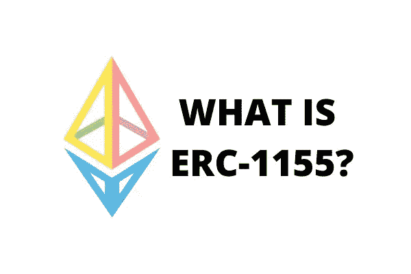
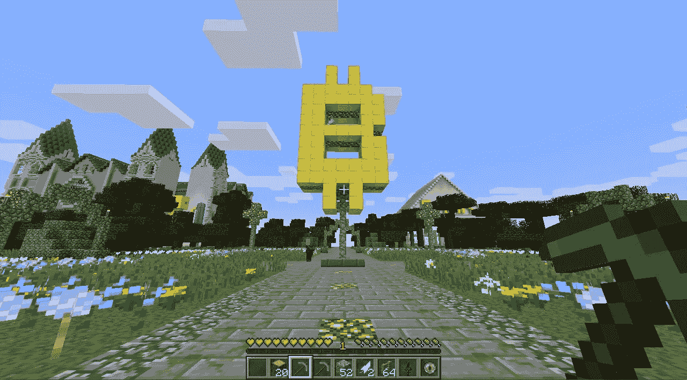
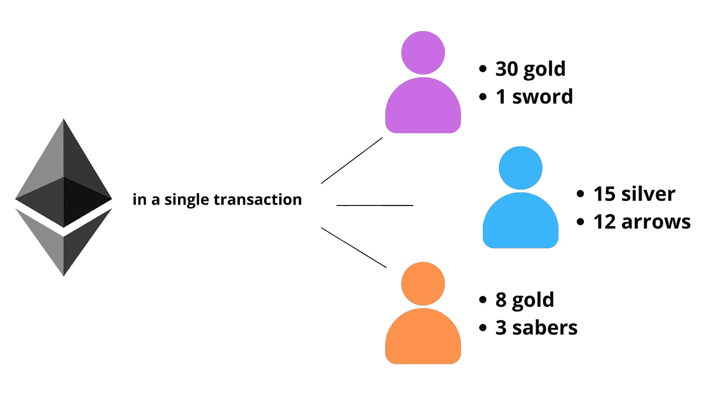

# 什么是 ERC-1155 代币？

> 原文：<https://levelup.gitconnected.com/what-are-erc-1155-tokens-eab5c276b63>

一个新的以太坊令牌标准已经向公众发布。它被缩写为 **ERC-1155** ，旨在解决未来在线区块链游戏将面临的一些潜在问题。
它现在的主要目的是让物品交易变得更容易。新的代币标准是由“游戏玩家社交平台”Enjin.com 的创造者推出的

***eip: 1155
标题:密码项标准
作者:威泰克·拉多姆斯基，安德鲁·库克
类别:ERC
状态:草稿
创建时间:2018–06–17
讨论:https://github.com/ethereum/EIPs/issues/1155***

> 先前的标准 [ERC-721](https://ethereum.org/en/developers/docs/standards/tokens/erc-721/) 是用于收集的

为什么需要另一个令牌标准？当您想到以太坊代币时，您可能会很快想到 ERC-20 代币。这是以太坊区块链大多数资产的经典选择。

该标准表示一种由智能合约验证的数字所有权形式。这些类型的令牌可以拆分成更小的片段，然后重新组合。所有这些代币都是可以互换的。假设我有 1 个代表，我会将它送出，并通过另一个交易获得一个新令牌，这没关系—系统中一个单位的价值将是相同的。

第二种以太币最近开始流行，它就是臭名昭著的 ERC-721。您可以在上面链接的独立文章中了解更多信息，但它的主要创新是这种令牌不可互换。这一点很重要，因为在生活中可能会出现需要不可分割的令牌化资产或所有权证明的情况。

一个形象化的例子:如果你想买一辆车，难道你不打算买件吗？或者，你不会想在汽车经销商 A 只买一半的汽车，然后开车到经销商 B 买四分之一的汽车，等等。相反，将车辆作为一个整体进行交易是有意义的，除非我们谈论的是零件和细节。

## 但是我们能对新的 ERC-115 说些什么呢？

当我们谈到在视频游戏中使用区块链时，我们假设一个混合设置。区块链不是特别快，所以不是在游戏的每一个时刻都用。它更适合交易和存储权限。因此，如果你想运行一个 MMO，你仍然必须使用传统的方式来连接，比如为游戏玩家提供集中的服务器。区块链可以直接用来交易物品。

让我们想象你作为一个弓箭手在玩一个网络幻想游戏。在游戏中，你会惊奇地发现一把非常有价值的剑。你个人不需要剑，你是个弓箭手，但是剑真的很值钱。如果这把剑是区块链上的一件资产，其所有权通过一个令牌得到证明，你可以用它来交换更适合你游戏角色的东西。甚至卖了它换加密货币。

虽然这听起来很有希望，但对于那些了解令牌标准的人来说，问题变得很明显。特别是，ERC-20 代币彼此完全相同。

这意味着，如果他们要记录游戏资产，必须为每个游戏项目创建不同的令牌。这就导致了这样一个事实，如果游戏中有成千上万的物品，你需要做一千个不同的 ERC 20。而且都需要自己的地址，自己的交易费用等等。这不仅对开发人员来说成本很高，而且还会损害网络:状态将被加载，因为每个节点都必须处理这些数据。

> Runescape 有 35，000 个项目，MMO 之王魔兽世界为玩家提供了超过 100，000 个不同的项目！像《守望先锋》和《团队堡垒 2》这样的射手也有上千个皮肤和物品。

这时，新的 ERC-1155 标准令牌出现了。它允许同时处理多组可互换和不可分割的数字项目。更简单地说，您可以在一次交易中向一个或多个收件人发送任意数量的项目。

> 它采用了一种新的方法来定义令牌。项目存储在单个协定中，其中包含区分令牌所需的最少数据量。

例如，如果你有一把超级剑，一堆黄金和一些魔法药水，你想把它们都卖掉，你可以只使用一个 ERC-1155 交易进行单独交易。

在一次交易中发送不同令牌的示例

此外，游戏本身不需要创建大量不同的令牌来支持游戏世界中可用的不同类型的物品。

可替代项目和不可替代项目的组合也很重要。记住，游戏有急救包、杂志和库存中的其他消耗品。有很多，你不必在意每件物品的独特性。

甚至更大更显眼的物品，比如盔甲，可以根据游戏的机制进行不同的开发。

令牌 ERC-1155 结合了 20 和 721。

## 不超过游戏的标准？

有人可能会问一个合理的问题:ERC-1155 仅限于游戏吗？

从理论上讲，这种规则可以用在任何情况下，复杂的和“多向的”交易必须定期发生在许多不同的文章。

以同样的传统投资世界为例。ERC-1155 可用于聚合不同的资产，如股票、债券、房地产、衍生品、贵金属等。

但是，虽然在游戏环境中测试令牌会给出良好的统计数据，显示 ERC-1155 的弱点和优点。

## **在线游戏的 1155 令牌实现示例**

opensepelin 的描述可以在[这里](https://docs.openzeppelin.com/contracts/3.x/erc1155)找到。
令牌 1155 的源代码见[这里](https://github.com/OpenZeppelin/openzeppelin-contracts/blob/master/contracts/token/ERC1155/ERC1155.sol)。

*今天就到这里，期待更多文章。祝你好运，再见！*

感谢您成为我们社区的一员！在你离开之前:

*   👏为故事鼓掌，跟着作者走👉
*   📰查看[升级编码出版物](https://levelup.gitconnected.com/?utm_source=pub&utm_medium=post)中的更多内容
*   🔔关注我们:[Twitter](https://twitter.com/gitconnected)|[LinkedIn](https://www.linkedin.com/company/gitconnected)|[时事通讯](https://newsletter.levelup.dev)

🚀👉 [**加入人才集体，找到一份令人惊喜的工作**](https://jobs.levelup.dev/talent/welcome?referral=true)