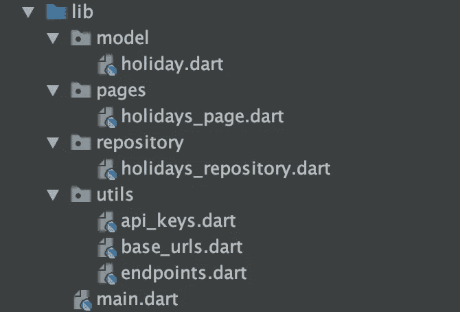
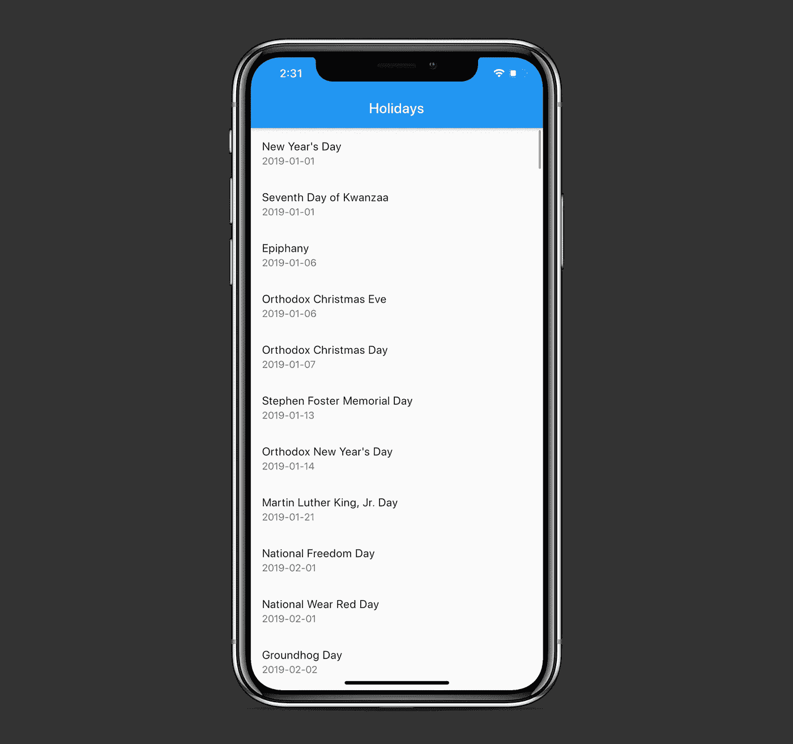

# 什么是扑朔迷离的未来？你什么时候应该使用它们

> 原文：<https://levelup.gitconnected.com/what-are-futures-in-flutter-and-when-should-you-use-them-151b1c10c744>

## 让您的跨平台应用程序真正异步

照片由 [Radek Grzybowski](https://unsplash.com/@rgrzybowski?utm_source=medium&utm_medium=referral) 在[unsprash](https://unsplash.com?utm_source=medium&utm_medium=referral)上拍摄

今天，我们将在一个获取假期列表并在`ListView`中显示的示例应用程序上探索什么是颤振中的`Future`及其用例。作为额外收获，我们将介绍如何发送简单的网络请求，以及如何将不那么琐碎的 JSON 解码成模型。

简而言之，当我们想要在一段时间后获得某个价值或事件时，我们就使用`Future`。示例包括联网、向图像添加过滤器、从磁盘读取数据。

项目的源代码可以在文章的底部找到。

不用多说，让我们开始在实践中探索`Future`！

# 我们开始吧

首先，从[https://holidayapi.com/](https://holidayapi.com/)获取您的免费 API 密钥:

然后将其粘贴到`api_keys.dart`文件里面:

现在我们准备在`ListView`中获取并显示假期。

我们的应用程序结构如下:

`model`包由具有`name`和`date`特性的`Holiday`类组成:

我们将使用`fromJson`方法从 JSON 中获取实际的`HolidaysResponse`和`Holiday`对象。

`utils`包包含构建我们的网络请求所需的简单设置:

实际的联网发生在`repository`包内:

我们使用建议的`http`包创建一个`GET`请求，然后用`parseHolidays`方法将接收到的 JSON 解析成一个`Holiday`对象列表:

# 使用未来

请注意，网络操作需要时间，所以我们在`getHolidays()`方法中返回`Future<List<Holiday>>`。我们把这个方法标记为`async`，所以我们可以用`await`关键字等待从互联网上检索数据:

如果您想知道我们如何为我们的请求构造完整的 url，我们使用`Uri.https`工厂，它接受一个基本 url(没有 https://部分，它将被自动添加)、端点和参数。

太好了！现在我们有了一个工作网络请求和数据。让我们看看如何构建表示层，即`HolidaysPage`:

正如我们所看到的，我们依赖于`HolidaysRepository`类，它为我们的`ListView`返回一个假期列表。在`initState()`方法中，我们触发存储库的`getHolidays()`方法，然后在`setState()`中分配收到的假期:

这触发了`build()`方法，该方法给出了它需要的`ListView`数据:

因此，我们显示了一个假期列表:

# 资源

该项目的源代码可以在 GitHub 上找到:

 [## 扎法里瓦耶夫/未来网络

### 新的颤振应用。这个项目是颤振应用的起点。一些资源让你…

github.com](https://github.com/zafarivaev/Future-Networking) 

# 包扎

对旋舞和飞镖感兴趣吗？请随意查看我的其他相关作品:

*   [颤振中的导航仪是什么？](https://medium.com/better-programming/what-is-the-navigator-in-flutter-640e864892e2)
*   [Flutter 中的‘copy with()’操作是什么？](https://medium.com/better-programming/what-is-the-copywith-operation-in-flutter-2567e4d924bf)
*   [在 Flutter 中创建跨平台标签式 App](https://medium.com/better-programming/create-a-cross-platform-tabbed-app-in-flutter-c728ca5e30f6)
*   [如何在 Dart 中实现委托设计模式](https://medium.com/better-programming/how-to-implement-the-delegation-design-pattern-in-dart-d782de77c886)

感谢阅读！