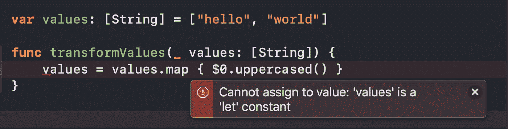
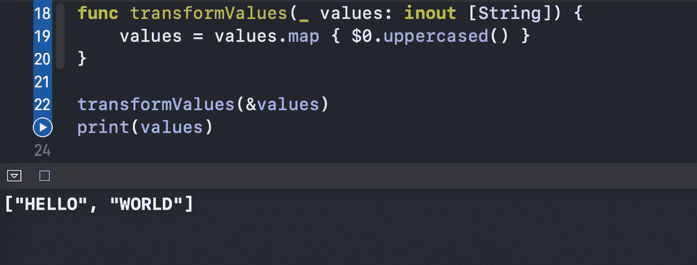

# Swift 中的输入输出参数是什么？

> 原文：<https://levelup.gitconnected.com/what-are-in-out-parameters-in-swift-f96c659fae2c>

## 修改函数中传递的变量

图片来自 [Pixabay](https://pixabay.com/?utm_source=link-attribution&utm_medium=referral&utm_campaign=image&utm_content=1846281) 的 [Pexels](https://pixabay.com/users/Pexels-2286921/?utm_source=link-attribution&utm_medium=referral&utm_campaign=image&utm_content=1846281)

在本文中，我们将学习输入输出参数。它们允许我们修改在函数中作为参数传递的变量。

让我们在 Xcode 游乐场中快速探索它们。

# 我们开始吧

考虑以下简单的`String`值数组:

我们想让数组的每个成员都大写，所以我们写了下面的函数:

但是，我们会得到以下编译器错误:

`values`参数是一个常量，怎么才能让它成为变量呢？答案是将其用作输入输出参数:

现在，如果我们运行这个函数(注意，当传递一个变量作为输入输出参数时，我们使用' & '符号),我们将看到我们想要的输出:

# 包扎

对 Swift 更多鲜为人知的功能感兴趣？请随意查看我的其他相关文章:

*   [Swift 中有哪些物业观察员？](/what-are-property-observers-in-swift-4bda0945973)
*   [Swift 中的 ExpressibleByIntegerLiteral 协议是什么？](https://levelup.gitconnected.com/cleansoftware/what-is-the-expressiblebyintegerliteral-protocol-in-swift-e71ad4a37a96)
*   [Swift 中的价值绑定模式是什么？](https://levelup.gitconnected.com/better-programming/what-is-the-value-binding-pattern-in-swift-a644be3e0597)
*   [Swift 中的 vDSP 框架是什么？](https://levelup.gitconnected.com/better-programming/what-is-the-vdsp-framework-in-swift-fe2539693e9a)
*   [Swift 中的 CustomStringConvertible 协议是什么？](https://levelup.gitconnected.com/better-programming/what-is-the-customstringconvertible-protocol-in-swift-4b7ddbc5785b)
*   [Swift 中的类和静态有什么区别？](https://levelup.gitconnected.com/better-programming/what-is-the-difference-between-class-and-static-in-swift-3493848ed831)

感谢阅读！