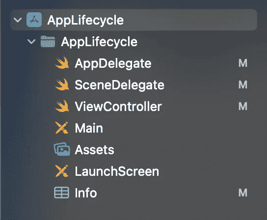
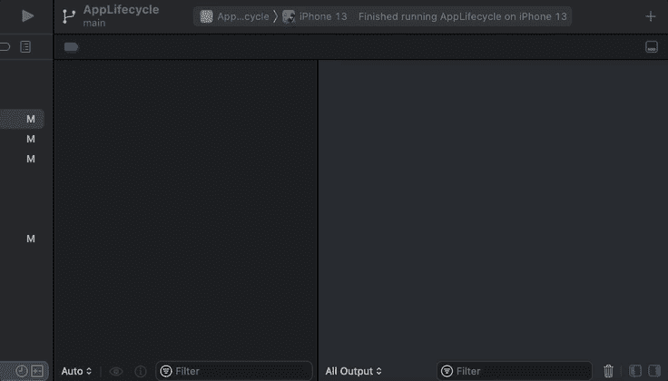
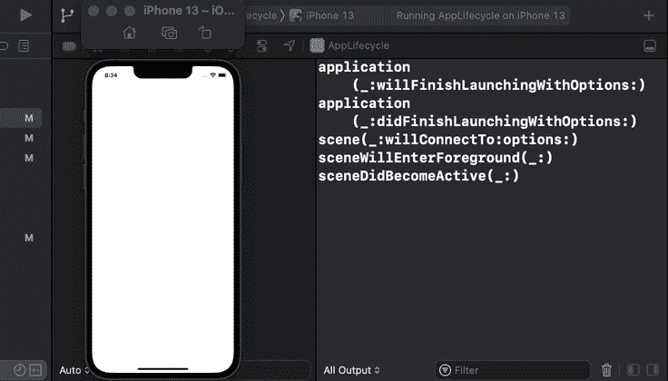
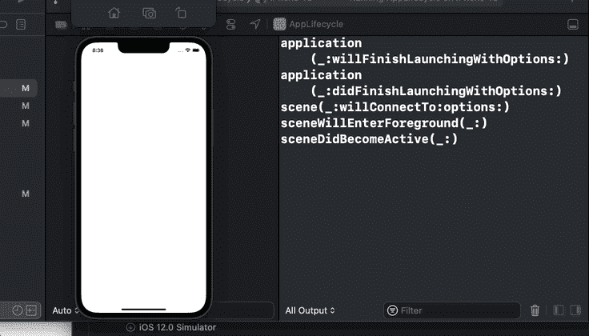
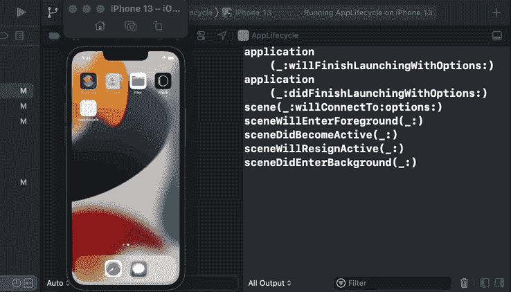
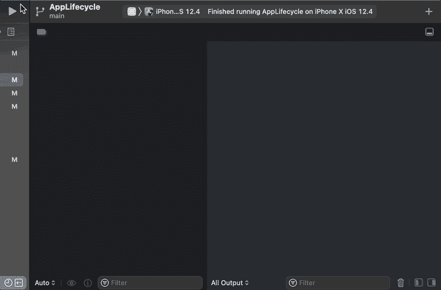
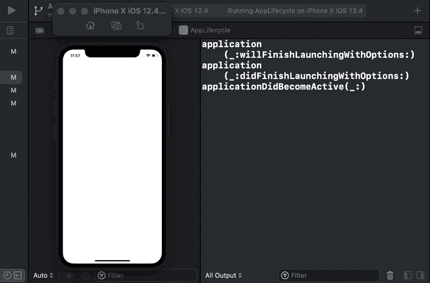
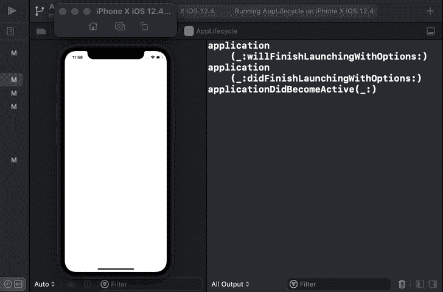
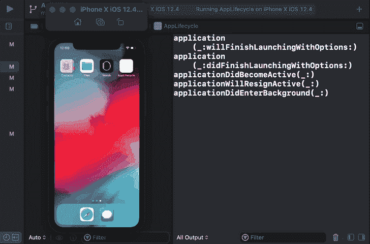

# 什么是 iOS 应用生命周期方法

> 原文：<https://levelup.gitconnected.com/what-are-ios-app-lifecycle-methods-cc1c8c4dcb7f>

## 了解 iOS 版本 12-和 13+之间的细微差别

[布兰登·罗马丘克](https://unsplash.com/@currentspaces?utm_source=medium&utm_medium=referral)在 [Unsplash](https://unsplash.com?utm_source=medium&utm_medium=referral) 拍摄的照片

在本文中，我们将了解 iOS 应用程序的生命周期。此外，我们还将通过在模拟器中测试那些生命周期方法的执行来探索 iOS 12 和 13 中生命周期的差异。这是本教程结束时您将学到的内容:

*   我们可以用什么方法来监控生命周期
*   调用这些方法的顺序
*   iOS 版本如何影响*调用什么*方法

本文底部提供了一个示例项目的源代码。事不宜迟，我们开始吧。

# 我们开始吧

我们从一个几乎是空的项目开始，只有一个屏幕:

我们的目标是实现生命周期方法，然后看看它们被调用的顺序。此外，我们还想知道每种方法最适合什么。在我们开始研究代码之前，让我们回顾一下任何 iOS 应用程序的状态:

*   非活动-应用程序进程处于前台，但它无法响应事件。
*   活动-应用程序进程处于前台，可以响应事件。
*   后台-应用程序进程在后台运行，并执行一些逻辑。
*   暂停-应用程序进程在后台运行，但不执行任何逻辑。
*   未运行-应用程序进程未启动，这意味着它既不在前台也不在后台。

我们从`AppDelegate`开始:

这里我们添加以下方法:

*   `application(_:willFinishLaunchingWithOptions:)` —应用程序启动时调用。在调用该方法时，我们的应用程序处于非活动状态，但它已经加载了主故事板。此外，[状态恢复](https://developer.apple.com/documentation/uikit/view_controllers/preserving_your_app_s_ui_across_launches)(从用户上次使用该应用程序时恢复屏幕层次和 UI 状态)尚未开始。有`userInfo`参数，我们可以用它来确定应用程序启动的原因。例如，如果启动应用程序是为了打开特定 URL 上的文档，我们可能希望阻止状态恢复的发生。要了解更多可能的发布原因，请访问[文档](https://developer.apple.com/documentation/uikit/uiapplication/launchoptionskey)。
*   `application(_:didFinishLaunchingWithOptions:)` —当我们的应用程序启动时被调用，如果需要，应用程序的[状态被恢复](https://developer.apple.com/documentation/uikit/uiscenedelegate/restoring_your_app_s_state)。但是，UI 还没有显示出来。就像前面的方法一样，也有`userInfo`参数。正如苹果指出的，这是执行与该属性相关的逻辑的最后机会。
*   `applicationWillEnterForeground(_:)` —调用不支持[场景](https://developer.apple.com/documentation/uikit/app_and_environment/scenes)的应用。否则，它将被它的`sceneWillEnterForeground(_:)`协变所取代，我们将在稍后检查`SceneDelegate`时深入探讨这一点。当应用程序从后台进入活动状态*时，该方法被调用。*
*   `applicationDidBecomeActive(_:)` —在不支持[场景](https://developer.apple.com/documentation/uikit/app_and_environment/scenes)的应用中调用。否则，它将被其在`SceneDelegate`中的`sceneDidBecomeActive(_:)`协变所取代。当应用程序进入活动状态时，将调用方法。此时，UI 已经加载，但尚未显示。
*   `applicationWillResignActive(_:)` —在不支持[场景](https://developer.apple.com/documentation/uikit/app_and_environment/scenes)的应用中调用。否则，它就被它的`sceneWillResignActive(_:)` **替换为`SceneDelegate`中的**协变。当应用程序被系统警报、电话呼叫等中断时，会调用该方法。当我们使用 Home 键关闭应用程序时，我们也会触发它。我们可以使用这个方法来保存未保存的数据。例如，我们可能希望将项目列表保存在磁盘中，这样，如果系统终止了应用程序，或者我们强制退出它，下次启动它时，我们可以再次看到所有项目。
*   `applicationDidEnterBackground(_:)` —在不支持[场景](https://developer.apple.com/documentation/uikit/app_and_environment/scenes)的应用中调用。否则，就用它在`SceneDelegate`中的`sceneDidEnterBackground(_:)` 共变来代替。当我们将应用程序移动到后台时，会调用该方法。在这里，我们需要确保停止计时器，减少应用程序的内存使用，如果必要的话，为应用程序终止时的状态恢复做准备。另外，*在*该方法返回后，UIKit 会对应用的最新 UI 进行快照，以显示在应用切换器中。因此，我们需要对 UI 隐藏用户的敏感信息，比如密码。
*   `applicationWillTerminate(_:)` —当应用程序即将被终止并从内存中删除时，调用此方法。对于不支持后台模式的应用程序，它总是被调用。然而，对于具有后台功能的应用程序，该方法通常不被调用，因为应用程序进入后台状态。另一方面，如果系统决定释放内存并终止后台的应用程序，那么这个方法就会被调用。

`AppDelegate`做完了，现在我们来检查一下`SceneDelegate`:

这里我们有这些方法:

*   `scene(_:willConnectTo:options:)` —当应用程序请求用户界面时调用。如[场景文档](https://developer.apple.com/documentation/uikit/app_and_environment/scenes)中所述，场景包含一个窗口和视图控制器。所以本质上，当我们添加一个场景到应用程序时，这个方法被调用。大多数 app 只有一个场景，所以这种情况下会调用一次这个方法。在该方法中，我们配置了层次结构，并为窗口设置了根视图控制器。例如:

*   `sceneWillEnterForeground(_:)` —就像它的非场景对应物`applicationWillEnterForeground(_:)`一样，当应用程序处于前台非活动状态并准备显示给用户时，该方法被调用。
*   `sceneDidBecomeActive(_:)` —与`applicationDidBecomeActive(_:)`相同，当 UI 进入前台活动模式且 UI 已加载但尚未显示时，调用该方法。
*   `sceneWillResignActive(_:)` —正如它的非场景协变`applicationWillResignActive(_:)`一样，当应用程序被电话或系统警报中断时，该方法被调用。我们也可以通过点击 Home 键来触发它。
*   `sceneDidEnterBackground(_:)` —当应用程序不再出现在屏幕上时调用。正如苹果建议的那样，我们可以使用这种方法来减少场景的内存使用，并从屏幕上隐藏敏感的用户信息，因为在这种方法返回后，UIKit 将创建 UI 的快照，并在应用程序切换器中显示它。
*   `sceneDidDisconnect(_:)` —当用户通过关闭应用切换器从应用中移除场景时调用。如果需要，系统还可以断开场景以释放内存空间。

完成方法描述后，现在让我们检查调用这些方法的顺序和条件。

为了查看被调用的每个方法的名称，我们在添加到`AppDelegate`和`SceneDelegate`的每个方法中包含了`print(#function)`命令:

现在我们可以很容易地测试这些方法的执行。首先，我们将在 iOS 13+模拟器上测试它，然后在 iOS 12 one 上测试。

# 在 iOS 13+上测试

*   启动应用程序:

*   关闭应用程序:

*   将应用移至后台，而不是关闭:

*   从后台返回应用程序:

现在让我们用一个 iOS 12 模拟器做同样的事情。

# 在 iOS 12 上测试

*   启动应用程序:

*   关闭应用程序:

*   将应用移至后台，而不是关闭:

*   从后台返回应用程序:

# 检查差异

正如我们在上面看到的，执行在某些阶段是不同的。

1.  当应用程序在 iOS 13+上启动时，这些方法会运行:

*   `application(_:willFinishLaunchingWithOptions:)`，
*   `application(_:didFinishLaunchingWithOptions:)`，
*   `scene(_:willConnectTo:options:),`
*   `sceneWillEnterForeground(_:)`，
*   `sceneDidBecomeActive(_:)`。

然而，在 iOS 12 上，我们只看到三种方法在运行:

*   `application(_:willFinishLaunchingWithOptions:)`，
*   `application(_:didFinishLaunchingWithOptions:)`，
*   `applicationDidBecomeActive(_:)`。

这里最明显的区别是在 iOS 12 上没有调用`applicationWillEnterForeground(_:)`方法，尽管在 iOS 13+上`sceneWillEnterForeground(_:)`是它的替代品，并且它是在 iOS 13 设备上执行的。

2.当应用在 iOS 13+上被终止时，这些方法被运行:

*   `sceneWillResignActive(_:)`
*   `sceneDidDisconnect(_:)`
*   `applicationWillTerminate(_:)`

在 iOS 12 上，我们看到这些方法正在执行:

*   `applicationWillResignActive(_:)`
*   `applicationDidEnterBackground(_:)`
*   `applicationWillTerminate(_:)`

这里我们注意到，在 iOS 12 上，应用程序在被终止之前被移到了后台，而在 iOS 13+上，协变方法`sceneDidEnterBackground(_:)`没有被调用。

3.在 iOS 13+上，当应用程序只是被解除而不是终止时，这些方法会运行:

*   `sceneWillResignActive(_:)`
*   `sceneDidEnterBackground(_:)`

在 iOS 12 上:

*   `applicationWillResignActive(_:)`
*   `applicationDidEnterBackground(_:)`

在这个阶段，我们没有注意到任何不同，因为正如官方文档所说，iOS 12 及之前版本的`application`方法被 iOS 13 及以后版本的`scene`方法所取代。

4.在 iOS 13+上，当我们将应用从后台移回活动状态时，我们看到打印了以下方法:

*   `sceneWillEnterForeground(_:)`
*   `sceneDidBecomeActive(_:)`

在 iOS 12 上:

*   `applicationWillEnterForeground(_:)`
*   `applicationDidBecomeActive(_:)`

就像上一步一样，这里我们也没有执行的区别。

# 资源

源代码可在 [GitHub](https://github.com/zafarivaev/app-lifecycle-methods) 上获得。

# 包扎

要了解更多关于应用生命周期的信息，包括场景和状态恢复，请访问[官方文档](https://developer.apple.com/documentation/uikit/app_and_environment/managing_your_app_s_life_cycle)。

感谢阅读！