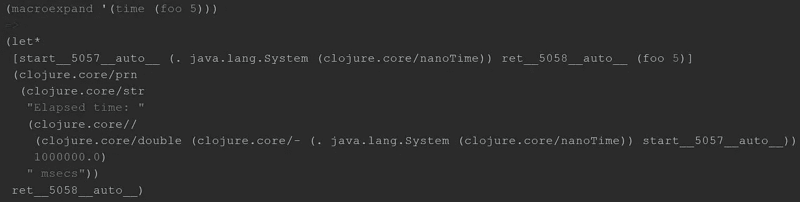

# 不管怎样，Lisp 宏有什么用？

> 原文：<https://levelup.gitconnected.com/what-are-lisp-macros-good-for-anyway-dac97d74904a>

问一个口齿不清的人，为什么任何心智健全的人都会选择这么奇怪的编程语言，他们可能会开始谈论宏。就像，Lisp 有宏，而你的语言没有。也许你说“C 有宏，它们大多只是危险的”，他们说“Lisp 宏不是这样的，它们是**不同的**”。那么，在像 Common Lisp 或 Clojure 这样的语言中，你能用宏做什么，而在其他编程语言中你却不能(理智地)做什么呢？让我们看一个例子，看看我们如何用 Java、Python 和 Clojure(一种 Lisp)做一些事情。

# 旁白:C/C++中的宏

下面的例子可能是在 C 或 C++中用一个宏完成的。我想大多数人都会同意这种文本替换宏是有问题的。此外，他们没有完整的语言可供他们使用。如果有人想对 C/C++宏发表评论或展示如何用它们来做这个例子，那就去做吧。

# 操作时间

假设我们编写了一个名为`foo`的函数，它接受一个参数并返回一个数字。我们想知道这个函数在一些典型参数上大概需要多长时间。

## **Python**

python 中的一个选项是内置的 [timeit](https://docs.python.org/2/library/timeit.html) 库。用法可能如下所示:

使用 timeit

注意传递一个字符串，该字符串包含要计时执行的代码。还要注意，之后不能使用对`avg`的调用的返回值。`setup`的说法有点麻烦，也许这是一个解决办法。

Pythonista 更常用的方法似乎是使用`time`:

手动使用时间

这可能有点容易出错，但一般来说没问题。由于在一行之前和之后都需要时间，如果被计时的行更复杂，那么就不容易对该行的一部分计时(例如，它的一些子表达式)。

我们也可以编写自己的计时函数，它采用不带参数的函数:

自定义计时功能

那么用法将如下所示:

使用时间呼叫

请注意，这允许捕获和使用对`foo`的调用结果。这种方法更适合在一段较大的代码中添加计时，然后在不久之后删除它。

## **Java**

据我所知，Java 中没有内置任何有助于此的东西。我们可以编写一些相当通用的计时函数:

Java 的自定义计时函数

带一个`Supplier`的签名是为了返回值的东西，带一个`Runnable`的签名是为了不返回值的东西。用法如下:

在 Java 中使用自定义计时函数

这非常类似于 Python 的情况，尽管由于类型系统而更加冗长。但是请注意，在 Python 和 Java 中，对一段代码计时可能需要将其包装在另一个表达式中，这样它就是某种函数。

## 轮到 Clojure 了

Clojure 有一个名为`[time](https://clojuredocs.org/clojure.core/time)`的内置操作，我们可以这样使用它:

使用 Clojure 时间

`time`也返回它的参数，所以如果对`foo`的调用在其他代码的上下文中(这是典型的)，它可以很容易地随意插入和删除:

在你说“但我必须在删除或添加对时间的调用时平衡父母”之前，像 Clojure 这样的 Lisp 优秀编辑器会让这变得轻松。移除`(time`会自动移除该表达式的相应右括号。

不需要它的参数来实现一些接口或契约，`time`是如何工作的？在 Python 中，参数可以是一个字符串，就像使用`timeit`时一样，但是`timeit`不会返回评估代码的结果；此外，插入一个`timeit`调用并不容易，因为它需要将代码转换成字符串。在 Python 和 Java 中，都可以通过接受函数来计时，但这需要调用者将需要计时的代码包装在 lambda 表达式中。

答案当然是 Clojure `time`是 Lisp 宏的一个例子，而不是一个函数。让我们看看`time`的[实现](https://github.com/clojure/clojure/blob/clojure-1.9.0/src/clj/clojure/core.clj#L3850)(为简洁起见，文档省略):

clojure.core 中时间的实现

`time`是一个带有一个名为`expr`的参数的宏。神奇的事情发生在表达式`ret# ~expr`中，它执行提供的表达式如`(foo 5)`并将其赋给变量`ret#`。宏*中的`~`运算符对表达式*求值。`#`与`ret#`一样，是一种确保该宏范围内唯一变量名的方法，以避免错误使用封闭范围内的变量(即程序中其他地方定义的变量)。

因此，Clojure 版本的`time`获取一个任意的代码片段——在类似 Lisp 的 Clojure 中表示为一个由`()`包围的列表——对其进行评估，打印花费的时间，并返回结果。

我们可以通过使用[宏展开](https://clojuredocs.org/clojure.core/macroexpand)来看看这个宏是如何工作的:

`macroexpand`举例说明了什么是 Lisp 宏。它们是从源代码到源代码的函数；也就是一个从列表到列表的函数。在 Clojure 中，您使用 [defmacro](https://clojuredocs.org/clojure.core/defmacro) 注册这样的函数，然后在编译期间调用您的宏来‘扩展’表达式。在上面的例子中，列表`(time (foo 5))`被扩展成一个对`(foo 5)`的执行进行计时的列表，然后返回它的结果。Lisp 宏的特殊能力在于它们可以控制求值(通过`~expr`对输入表达式求值可以看出),并利用语言的全部能力进行任意的源到源转换。

# 更多宏观例子

讨论`time`宏的部分原因是因为在大多数语言中实现类似的东西是可能的(尽管不那么方便)。这可能会让你怀疑宏是否值得。下面是 Clojure 中宏的更多例子；考虑如何用你的语言实现这一功能，或者这样做是否可行。

*   方便的控制流构造，如 [when](https://clojuredocs.org/clojure.core/when) 、 [when-not](https://clojuredocs.org/clojure.core/when-not) 、 [if-not](https://clojuredocs.org/clojure.core/if-not) 。
*   [cond](https://clojuredocs.org/clojure.core/cond) ，类似于 Java 12 中的 [switch 表达式，但更通用。请注意，cond 是一个宏，因为它不会计算不会被执行的分支的表达式，这就是为什么大多数没有宏的语言需要内置的支持。](https://docs.oracle.com/en/java/javase/13/language/switch-expressions.html)
*   列出对的理解，如[。](https://clojuredocs.org/clojure.core/for)
*   [线程宏](https://clojure.org/guides/threading_macros)类似[->-](https://clojuredocs.org/clojure.core/-%3E)可以用来使嵌套表达式更容易阅读，在外观上类似于 Javascript 中的[管道运算符](https://developer.mozilla.org/en-US/docs/Web/JavaScript/Reference/Operators/Pipeline_operator)。
*   像 [doto](https://clojuredocs.org/clojure.core/doto) 和`..`这样的宏使得在 Clojure 中与“宿主”语言(Java/Javascript)的互操作更容易。
*   测试库经常使用宏来使测试变得易读。例如， [Midje](https://github.com/marick/Midje) 使测试看起来像 Clojure 书中的例子。
*   [批注](https://clojuredocs.org/clojure.core/comment)
*   宏可以支持更熟悉的数学中缀符号，例如`(1 + (2 * 3))`通过将其重写为 Lisps 使用的前缀符号`(+ 1 (* 2 3))`。一个例子是[中缀](https://github.com/rm-hull/infix)库。

Lisp 社区中的一个重要想法是，您可以自己编写这些东西(或者从库中获取)，而不是向语言委员会或[仁慈的终身独裁者](https://en.wikipedia.org/wiki/Benevolent_dictator_for_life)请愿以支持它们，从而保持核心语言的短小和连贯性。这种可扩展性的缺点是[lisp 的诅咒](http://winestockwebdesign.com/Essays/Lisp_Curse.html)。

# 结论

Lisp 宏提供了在其他语言中不容易复制的强大功能。它们强大的关键在于 Lisp 是[同形的](https://en.wikipedia.org/wiki/Homoiconicity)，这意味着 Lisp 中的源代码可以用语言本身可以处理的数据结构来表示(即列表)，这使得这些定制的源代码转换变得明智和有用。

你可能会问，在一种语言中增加力量是否总是一件好事。这难道不是另一种把事情搞得一团糟的方式吗？强大的功能可能是一把双刃剑，但我真的很喜欢格伦·范德堡的说法:

> 弱小的开发者会竭尽全力去做错误的事情。你不能通过锁住锋利的工具来限制它们造成的伤害。他们只会更用力地挥动钝器。

我当然不是说不写 Lisp 宏的开发者‘弱’。但是我们不应该因为害怕别人会用它来做什么而限制我们的能力。

# 附录

非常感谢 Reddit 用户 *lispm* 为[展示了*时间*可能是一个宏](https://www.reddit.com/r/lisp/comments/f05xvw/what_are_lisp_macros_good_for_anyway/fh10skf?utm_source=share&utm_medium=web2x)的另一个原因:如果*时间*是一个宏，它可以在计时输出中包含原始源代码。这太棒了，我希望 Clojure 版本的 *time* 能做到这一点。