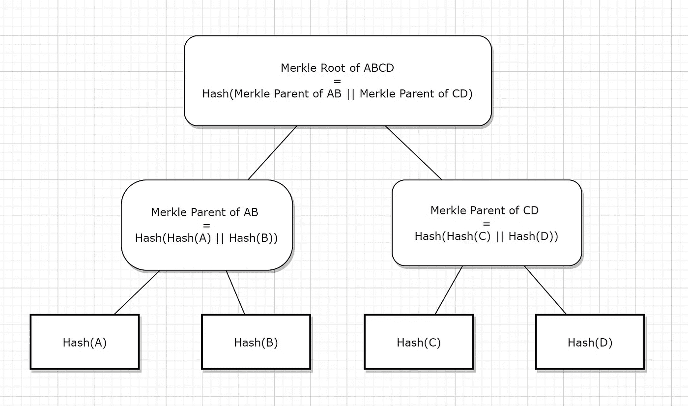
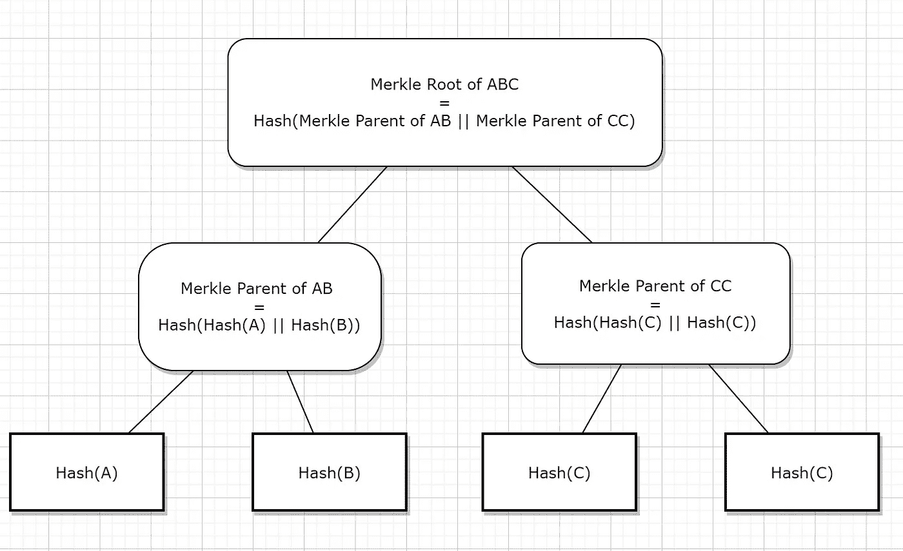
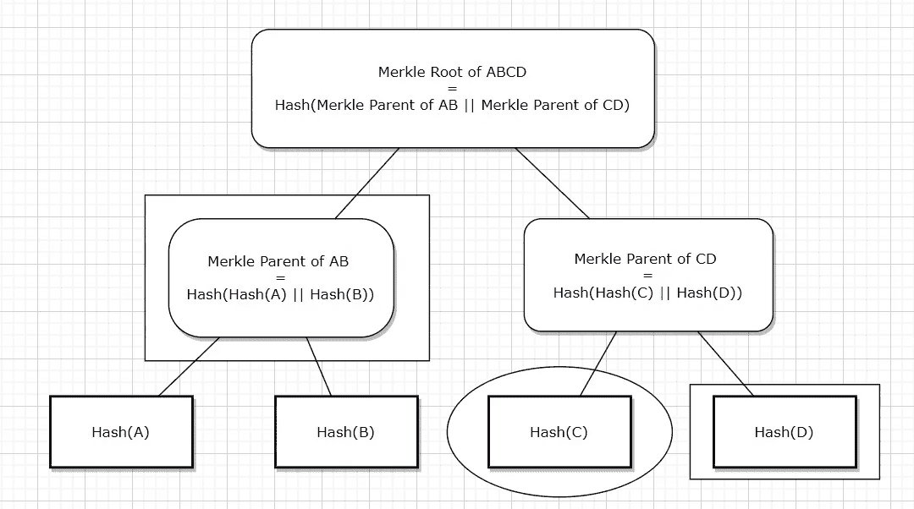

# 什么是 Merkle 树？

> 原文：<https://levelup.gitconnected.com/what-are-merkle-trees-9508b1c97c88>

Merkle 树广泛用于比特币和以太坊。

来说说他们吧！

克里斯汀·休姆在 [Unsplash](https://unsplash.com?utm_source=medium&utm_medium=referral) 上拍摄的照片

# 它们是什么？

Merkle 树是一种数据结构，旨在**证明包含**。

# 如何创建 Merkle 树？

要创建 Merkle 树，需要一个有序列表，并使用散列函数(如 SHA256)对其项目进行散列。

我们举个例子。

我们有一个有序的比特币交易列表，名为 A、B、C 和 d。

我们将连接两个后续的事务，并对它们进行哈希处理，以达到一个 **Merkle 父节点**。

这个父对象将代表两个事务散列。

M **erkle Parent** =左事务+右事务拼接的哈希)

Merkle 父节点被连接和散列以到达 **Merkle 根节点**。

M

比特币交易 A、B 和 D 的 Merkle 树(||代表串联)

## 如果有序列表中有奇数个事务，会发生什么？

*   您将复制列表中的最后一个元素
*   然后，将其添加到列表的末尾，以创建偶数个元素供以后散列

我们举个例子。

我们有一个有序的比特币交易列表，名为 A、B 和 c。

Merkle 树看起来会像这样。

比特币交易 A、B、C 的 Merkle 树(||代表串联)

# Merkle 树的组成

*   Merkle 根
*   Merkle 父母
*   Leaves:哈希的最下面一行
*   内部节点:除叶子以外的所有节点

# Merkle 树背后的想法

使用它们的想法是找到一个能够代表整个有序列表的单一散列。

这个散列就是 **Merkle 根**。

丹·弗里曼在 [Unsplash](https://unsplash.com?utm_source=medium&utm_medium=referral) 上拍摄的照片

# 它们在比特币/以太坊中是如何使用的？

*   假设你用比特币买了一杯咖啡。
*   你会发一些比特币到咖啡店老板的钱包里。
*   该交易必须经过验证，然后添加到区块链中。
*   一旦发生这种情况，你会收到你的咖啡。

德米特里·德米德科在 [Unsplash](https://unsplash.com?utm_source=medium&utm_medium=referral) 上拍摄的照片

在幕后，咖啡店老板的钱包必须确认该交易是有效的，并且已经通过使用工作证明对其进行了验证并将其添加到区块链上的块中。

*   当钱包可以访问包含所有先前有效交易数据的整个区块链时，很容易验证这一点。
*   比特币/以太坊区块链占据了多个 100 GB 的空间。
*   当存储在包含钱包的设备中时，这会占用大量空间。
*   可以下载块头(表示为 Merkle Root ),而不是下载整个区块链。
*   由于这个块头是通过工作证明挖掘的，咖啡店老板可以确信这个交易是有效的。
*   这被称为通过包含证明进行的**验证**。

# 深入使用 Merkle 树

假设你感兴趣的交易是 c。

*   您将获得散列 D 和 AB 的 Merkle 父节点的数据(由完整节点提供)
*   有了这些数据，你就可以计算 ABCD 的 Merkle 根了。
*   将此与工作证明验证的块标题进行比较。
*   如果它们匹配，则交易有效。

是的，你可以喝你的咖啡了！

圆圈标记代表感兴趣的交易。矩形标记代表提供的散列。

回到文章的第一句，

> Merkle 树是一种数据结构，设计用于**证明包含**。

希望你现在明白这一点！

凯西·霍纳在 [Unsplash](https://unsplash.com?utm_source=medium&utm_medium=referral) 上的照片

# 分级编码

感谢您成为我们社区的一员！更多内容见[升级编码出版物](https://levelup.gitconnected.com/)。

关注: [Twitter](https://twitter.com/gitconnected) ， [LinkedIn](https://www.linkedin.com/company/gitconnected) ，[时事通讯](https://newsletter.levelup.dev/)

**等级提升正在改造科技招募**👉 [**加入我们的人才集体**](https://jobs.levelup.dev/talent/welcome?referral=true)