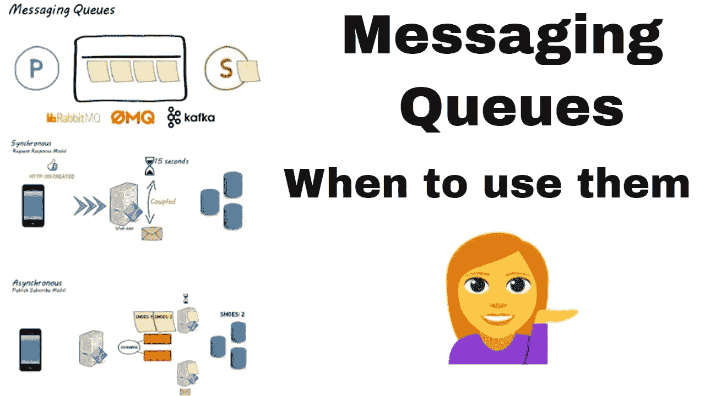
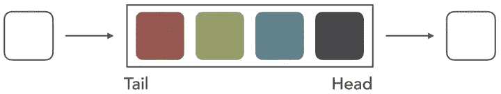
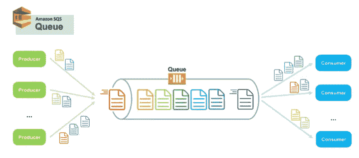
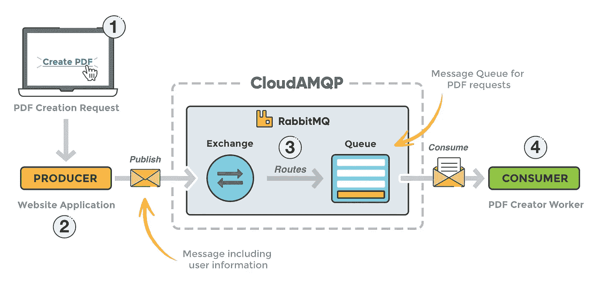
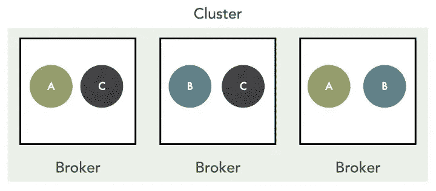
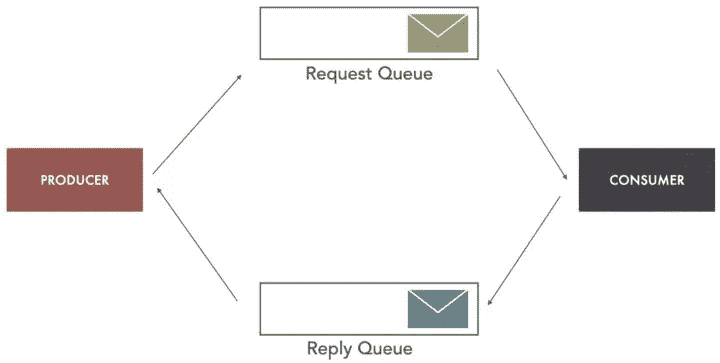
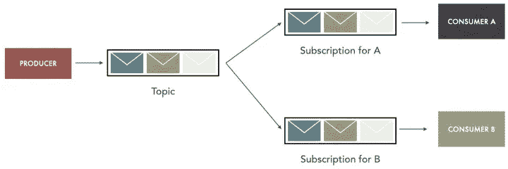
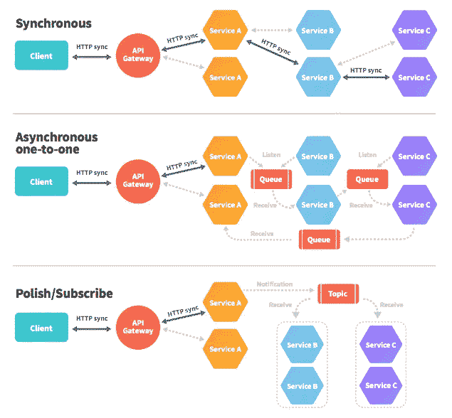

# 什么是消息队列，为什么它们在分布式系统中被广泛使用

> 原文：<https://levelup.gitconnected.com/what-are-message-queues-and-why-they-are-widely-used-in-distributed-systems-cf9735e9afd7>



图片来源:[https://i.ytimg.com/vi/sfQwMu0SCT8/maxresdefault.jpg](https://i.ytimg.com/vi/sfQwMu0SCT8/maxresdefault.jpg)

在本文中，我们将了解消息队列——分布式系统中常见且广泛使用的组件。我们将开始理解消息队列及其内部结构，然后详细了解消息模式、用例以及消息队列的优势。最后，我们还将看到现在正在使用的流行消息队列列表。

# 什么是队列？



图片来源:[https://miro . medium . com/max/720/1 * IEA 8 kwcf 25 jendeo 3 rraw . JPEG](https://miro.medium.com/max/720/1*ieA8kwcF25JENDEO3rRrAw.jpeg)

队列是编程中遵循真实队列的数据结构。它遵循 FIFO 模式(先进先出)。进入队列的人最先出现。同样，在队列数据结构中，首先添加的元素将首先被移除。元素在队列的尾部进入队列，并向队列的头部退出。

# 什么是消息队列？

消息队列用于异步服务对服务通信，它们广泛用于无服务器和微服务架构。



图片来源:[https://miro . medium . com/max/720/1 * drw 4 lvuoic 2 QS 6 wel 4 caw . png](https://miro.medium.com/max/720/1*DRW4lVeUoIc2qS6Wel4Caw.png)

在现代的云原生架构中，应用被解耦成更小的独立构建块，以便可以轻松地开发、部署和维护它们。消息队列在分布式组件/应用程序之间提供了完美的通信和协调。

消息存储在队列中，直到被使用者处理。每条消息只被一个消费者处理一次，然后消息被删除以避免重复处理。

消息队列提供了临时存储消息的轻量级缓冲区。它提供端点，允许软件系统(生产者和消费者)连接到队列，以便发送和接收消息。消息通常很小，包括请求、回复、错误消息或简单的信息。消息只不过是一个序列化的数据结构，主要采用 XML 或 JSON 格式，其中包含处理请求所需的所有信息。

消息队列可用于分离繁重的工作负载并异步处理它们，这样做可以大大加快分离应用程序的开发，同时提高性能、可靠性和可伸缩性。

## Rabbit MQ 的架构

让我们看看 Rabbit MQ 的体系结构，它是现代体系结构中使用最广泛的消息队列之一。

在 RabbitMQ 中，生产者不直接向队列发送消息。相反，它使用交换作为路由中介。交换决定消息是进入一个队列、多个队列，还是被简单地丢弃。



图片来源:[https://www . cloudamqp . com/img/blog/rabbit MQ-初学者-已更新. png](https://www.cloudamqp.com/img/blog/rabbitmq-beginners-updated.png)

如上图所示，Rabbit MQ 由 4 个组件组成

*   **生产者:**将消息添加到队列中的组件称为消息生产者。
*   **消费者:**使用队列中的消息进行某些处理的组件被称为消息消费者。
*   **Queue:** 这是消息代理使用 FIFO 逻辑存储消息的数据类型。
*   **交换器:**启用路由消息并将它们发送到队列。根据交换的类型对消息进行过滤和路由。

## 什么是消息代理？

消息队列是一个分布式系统，由多个名为**代理**的服务器组成。这些代理一起形成一个集群，从而使排队系统具有高可用性、可伸缩性和可靠性。



图片来源:[https://miro . medium . com/max/720/1 * viucjcdxzqz B1 rved q 7 UCA . JPEG](https://miro.medium.com/max/720/1*viuCjcDxZQzB1rVedq7uCA.jpeg)

接收到消息后，消息队列会在多个代理之间冗余地存储消息，以保证可用性和持久性。如上图所示，消息 A、B 和 C 分别存储在两个不同的代理中。

这意味着同一消息可以有多个副本，存储在多个代理中。在代理出现故障的情况下，可以从集群中剩余的代理中恢复消息。

简而言之，消息队列系统遵循与分布式系统完全相同的原则。

# 消息模式

让我们看看消息队列中使用的不同类型的消息传递模式。

## 1.单向消息传递(点对点)


图片来源:[https://miro . medium . com/max/720/1 * 23 io 3 fbkoxzq 9 L1 aihlaew . JPEG](https://miro.medium.com/max/720/1*23io3fbKOXzq9L1aihlaew.jpeg)

在这种消息传递模式中，生产者将消息推送到队列，消费者消费并处理它。

**示例**:单向消息传递的一个很好的用例是在用户在线购买商品时向其发送电子邮件。生产者可以将电子邮件内容、主题和发件人的电子邮件放在消息中，消费者使用这些内容向用户发送电子邮件。

## 2.请求响应模式

在这种模式中，生产者将消息发送到一个由消费者使用的队列。稍后在处理请求时，消费者将在另一个队列中发送一个响应，由生产者使用以完成该过程。



图片来源:[https://miro . medium . com/max/720/1 * wxo 5 RWC xqx _ p 2 igsiihtw . JPEG](https://miro.medium.com/max/720/1*WxO5RwcxQX_P2iGSIiHtHw.jpeg)

**例子**:一个很好的用例是使用 Saga 模式的分布式事务管理。生产者可以是订单服务，消费者可以是支付服务。当用户提交订单时，支付服务被通知。一旦支付成功或失败，支付服务发送消息通知订单服务。订单服务根据支付服务的结果将订单状态标记为成功或失败。

请看看我下面的文章，了解更多关于传奇模式的信息。

[](https://medium.com/javarevisited/distributed-transaction-management-in-microservices-part-2-saga-pattern-53808a55e641) [## 微服务中的分布式事务管理—第 2 部分— Saga 模式

### 大家好。这篇文章是上一篇文章的延续

medium.com](https://medium.com/javarevisited/distributed-transaction-management-in-microservices-part-2-saga-pattern-53808a55e641) 

## 3.发布-订阅/扇出模式

这是分布式系统中广泛使用的模式之一。



图片来源:[https://miro . medium . com/max/720/1 * 0 vtmfkpk 3 rfr w8 a-tzq 5-g . JPEG](https://miro.medium.com/max/720/1*0vtmfkPK3RFrw8a-tzq5-g.jpeg)

生产者向一个主题发送消息，这个主题被多个队列监听。这种模式称为发布-订阅或扇出。广播消息传递是这种模式的一个非常好的用例。

另一个例子是网上订购。收到订单后，订单服务会将消息发送到主题。可能有许多消费者，如支付服务、发票服务和通知服务，它们将由订单服务发送的消息触发。

基本上，这种模式可以用来触发许多异步事件。

# 同步(API)与异步(消息队列)

让我们比较一下微服务之间的同步和异步通信方式。我们使用 **API 调用进行同步**，使用**消息队列/主题**进行异步调用。

REST APIs 通常用于微服务间的通信，它使用 HTTP，这是一种请求/响应协议。它可以用于需要同步请求/回复的情况。这意味着通过 REST APIs 发出请求的服务必须被设计成能够立即得到响应。如果接收响应的客户端关闭，发送服务将在等待回复时被阻塞。这将对从客户端到服务的所有后续调用产生级联效应。



图片来源:[https://dz2 cdn 1 . dzone . com/storage/temp/7542942-screen-shot-2017-12-14-at-42543-pm . png](https://dz2cdn1.dzone.com/storage/temp/7542942-screen-shot-2017-12-14-at-42543-pm.png)

在上图中的**同步**下，服务 A 调用服务 B，服务 B 又调用服务 C。现在服务 A 被阻塞，等待服务 C 和服务 B 的响应

消息代理支持服务之间的异步通信，因此发送服务不需要等待接收服务的回复。

在上面的图中，在**异步一对一**下，服务 A 使用消息队列与服务 B 进行通信，服务 B 使用消息队列与服务 c 进行通信。现在系统完全解耦，没有阻塞请求，因此效率很高。

**发布/订阅**下的部分也是解耦的，但是它使用发布-订阅机制向多个消费者发送消息。

# 消息队列的最佳用例

消息队列可用于处理不同系统架构中的各种业务用例

常见的使用案例有

*   **电子商务订单处理和履行:**消息代理能够提高容错能力并确保消息只被使用一次，因此是在线订单处理的明显选择。
*   **金融交易和支付处理**:确保支付仅发送一次是至关重要的。使用消息代理来处理来自这些交易的数据可以确保支付信息不会丢失或意外复制。
*   **保护静态和传输中的高度敏感数据:**在一个高度管控且存在重大安全风险的环境中，使用支持端到端加密的消息队列将是一个很好的选择。
*   **长时间运行的流程和后台作业:**当请求花费大量时间时，合并消息队列是最理想的场景。一些现实生活中的例子可能包括图像缩放、发送大量电子邮件、文件扫描、PDF 处理、计算等

# 消息队列的应用

1.  异步通信
2.  可靠性
3.  可量测性
4.  分离系统
5.  缓冲和负载管理
6.  交货保证

# 常用的消息队列

现在大多数架构使用消息队列，因此现在有很多队列在运行。最受欢迎的如下

1.  兔子 MQ
2.  阿帕奇卡夫卡
3.  Apache ActiveMQ
4.  谷歌发布订阅
5.  AWS SNS / SQS
6.  Azure 队列

# 摘要

在本文中，我们看到了什么是队列，并了解了消息队列是什么。然后我们看到了消息队列、消息代理和不同类型的消息传递模式的架构。之后我们看到了微服务中同步和异步通信的区别。在本文的结尾，我们看到了消息队列及其应用程序的用例，然后我们通过列出一些常用的队列来结束本文。

非常感谢你阅读这篇文章，希望你喜欢！！！

```
If you like to get more updates from me, please follow me on Medium and subscribe to the email alerts.If you are considering buying a medium membership, please buy through my referral link [https://dineshchandgr.medium.com/membership](https://dineshchandgr.medium.com/membership)
```

请浏览我下面关于分布式系统的文章

[](https://medium.com/javarevisited/distributed-transaction-management-in-microservices-part-1-bb7dc1fbee9f) [## 微服务中的分布式事务管理—第 1 部分

### 大家好。在本文中，我们将了解跨微服务的分布式事务管理。

medium.com](https://medium.com/javarevisited/distributed-transaction-management-in-microservices-part-1-bb7dc1fbee9f) [](https://medium.com/javarevisited/distributed-transaction-management-in-microservices-part-2-saga-pattern-53808a55e641) [## 微服务中的分布式事务管理—第 2 部分— Saga 模式

### 大家好。这篇文章是上一篇文章的延续

medium.com](https://medium.com/javarevisited/distributed-transaction-management-in-microservices-part-2-saga-pattern-53808a55e641) [](https://dineshchandgr.medium.com/do-you-know-about-microservices-and-their-design-patterns-e8d7c8193dfe) [## 你了解微服务及其设计模式吗？

### 大家好。在本文中，我们将了解微服务架构，以及它与

dineshchandgr.medium.com](https://dineshchandgr.medium.com/do-you-know-about-microservices-and-their-design-patterns-e8d7c8193dfe) [](https://dineshchandgr.medium.com/do-you-know-distributed-job-scheduling-in-microservices-architecture-44082adad8ac) [## 你知道微服务架构中的分布式作业调度吗？

### 大家好。在本文中，我们将了解微服务架构中的分布式作业调度器。在…

dineshchandgr.medium.com](https://dineshchandgr.medium.com/do-you-know-distributed-job-scheduling-in-microservices-architecture-44082adad8ac) [](https://medium.com/javarevisited/microservices-communication-part-1-every-programmer-must-know-7c6607d2d563) [## 微服务通信第 1 部分-每个程序员都必须知道

### 大家好。微服务通信是任何微服务架构的心脏，设计它们可以…

medium.com](https://medium.com/javarevisited/microservices-communication-part-1-every-programmer-must-know-7c6607d2d563) [](https://dineshchandgr.medium.com/microservices-communication-part-2-sync-vs-async-vs-hybrid-23d057e137d8) [## 微服务通信——第二部分——同步还是异步还是混合？

### 大家好。在上一篇文章中，我们看到服务之间只有 3 种通信方式，即…

dineshchandgr.medium.com](https://dineshchandgr.medium.com/microservices-communication-part-2-sync-vs-async-vs-hybrid-23d057e137d8)