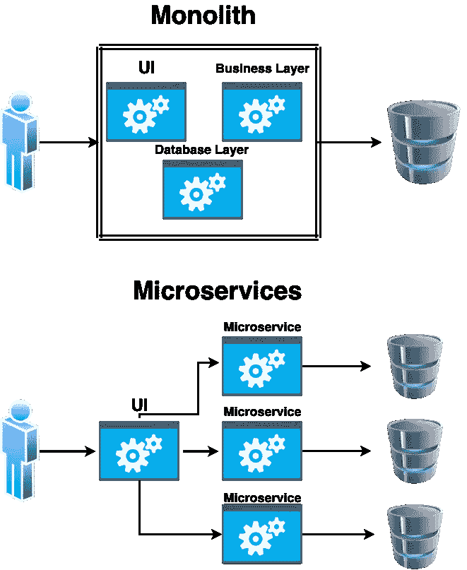

# 什么是微服务

> 原文：<https://levelup.gitconnected.com/what-are-microservices-3c309feb4d45>

## 为什么它们如此受科技巨头的喜爱

[斯科特·格雷厄姆](https://unsplash.com/@homajob)在 [Unsplash](https://unsplash.com/photos/5fNmWej4tAA) 上拍照

## **微服务背后的理念是什么**

微服务已经存在了一段时间，现在它们似乎是一个热门话题，因为它们被许多科技巨头所使用，当它们符合目的时，可能会很棒。

他们背后的想法是将一个应用程序拆分成独立的小服务，这些小服务可以独立工作，但它们也可以通过 API 或消息与其他服务通信。

## 整体服务和微服务之间的差异

正如我们在上面看到的，Monolith 是一个巨大的代码库，拥有应用程序的所有功能。一切都在一个地方，软件的任何部分都不能独立工作。这也意味着应用程序必须作为一个整体进行测试。

另一方面，monoliths 更容易启动和运行，因为微服务更复杂，需要更大的团队和更多的资源。

但是，当你作为一个公司拥有资源时，微服务确实很棒，因为一个团队可以自主开发和部署单个微服务。

我还有一篇关于微服务会带来什么问题的文章，更多的是关于什么时候不要使用微服务，以及团队选择微服务架构时会出现的常见错误。你可以看看下面。

 [## 微服务的问题是

### 什么是微服务，何时使用微服务，需要考虑什么

levelup.gitconnected.com](/the-problem-with-microservices-2068f64c52e2) 

## 为什么要使用微服务

使用微服务有很多好处，让我们来看看其中的一些。

**可扩展性**

大概采用微服务的主要原因是可扩展性。想想看，在整体式方法中，当流量很高并且您想要扩展时，您需要运行整个应用程序的副本才能进行扩展。

微服务允许您只部署遭受打击最严重的微服务的另一个副本(例如，如果您有一个电子商务网站，并且正在进行销售，您可能只希望运行订单服务的另一个副本，以便它处理额外的订单，但其余的服务可能不需要进一步扩展)。

**小型团队**

另一个好处是开发团队可以保持小规模和紧凑，这导致了更好的沟通。

**频繁发布**

开发和测试周期将会更短，因为服务本身比一个大的整体更小，这意味着部署将会更快。

**自由选择技术组合**

不同的服务可能使用不同的技术栈，以最佳方式满足服务的目的。这给了团队一些灵活性，并把事情搞混了，这样你就不必一直看着同样的旧语言。

## 好处看起来不错，但是有什么负面影响吗？

尽管有这些好处，但在设计微服务时仍然存在一些挑战。我不会用负面来形容他们，而是在选择微服务架构时要考虑的障碍和事情。

**保持小尺寸**

一个微服务必须足够小，一个人就能看懂。我见过的一个确定微服务是否足够小的好指标是查看服务并确定它是否可以在单次 sprint 中重写。如果答案是否定的，那么很可能是不够小。

**只有一件事**

正如我们提到的，微服务需要能够独立工作，因此它只需要专注于一个方面(例如，订单、客户、电子邮件)。

**松耦合**

微服务可以依赖于其他微服务，但重要的是，如果两个或更多服务之间有通信，也有某种程度的抽象，以防止在我们更新其中一个服务时破坏行为变化。

**微服务需要能够独立部署**

松散耦合意味着一个团队可以在很少甚至没有与其他团队协调的情况下部署他们的服务。

## 结论

微服务很棒，但它们有自己的目的，不应该马上成为第一选择。如果一家公司资源有限，并且一开始就不需要这种可伸缩性，那么也许一个整体应用程序就能解决问题，而且启动和运行起来会更快。因此，在选择微服务架构之前，在做出最终决定之前，请回顾利弊。

 [## 通过我的推荐链接加入 Medium-Ivan Stoev

### 作为一个媒体会员，你的会员费的一部分会给你阅读的作家，你可以完全接触到每一个故事…

medium.com](https://medium.com/@ivan.zstoev/membership)