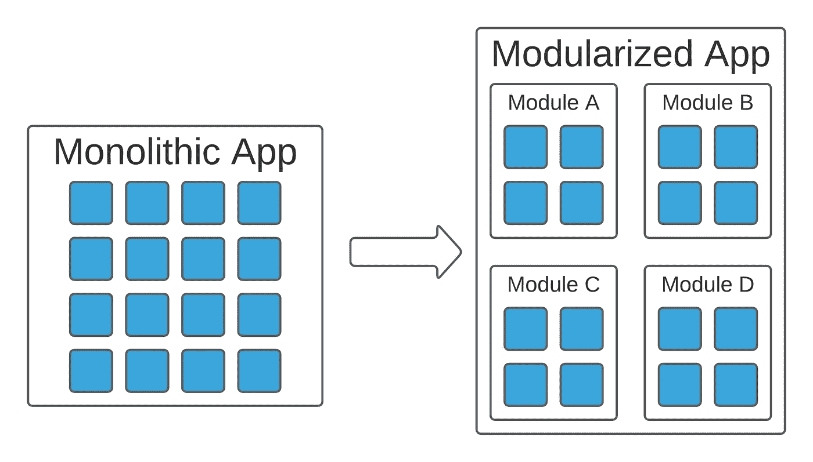
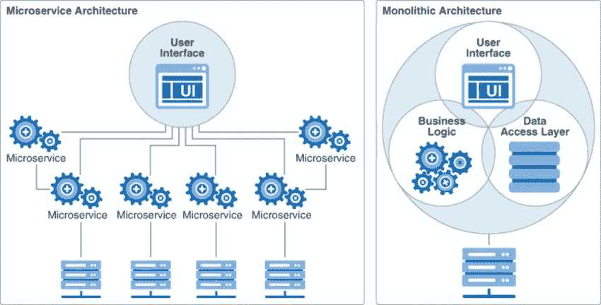
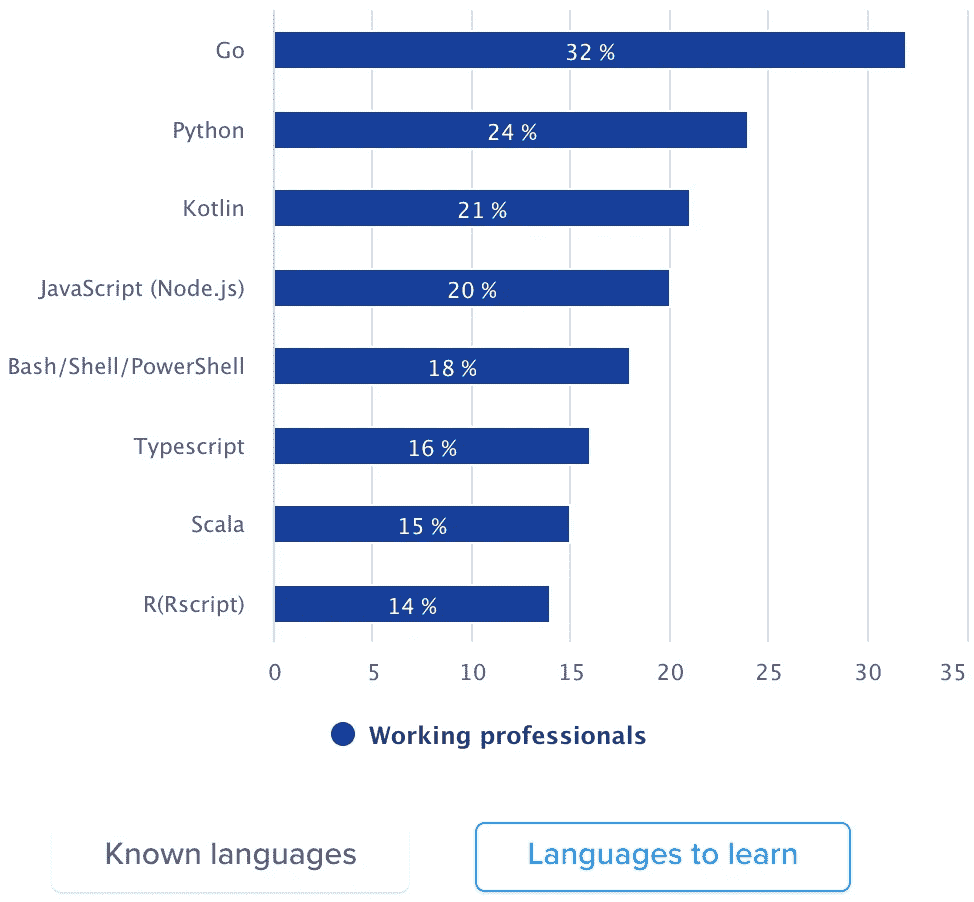

# 什么是微服务&为什么要去？

> 原文：<https://levelup.gitconnected.com/what-are-microservices-why-go-5a23873b9c30>

## 两项正在兴起的技术。

Go 正在成为 2021 年最受欢迎的编程语言之一。它是在考虑到并发性的情况下构建的，目的是构建强调通信和效率的大型分布式系统。由谷歌创造的运行笑话是，Go 是由工程师在等待他们的其他项目运行时开发的。

此外，**微服务**由于其高度可扩展的设计，正在成为**领先的软件架构**之一。根据[这份报告](https://tsh.io/state-of-microservices/#ebook)，近 85%的高级工程师和经理认为微服务将成为后端开发和复杂系统的标准。

在本文中，我们将介绍微服务的基本前提，它们产生的原因，以及为什么 Go 正在成为它们开发中最流行的语言选择之一。

# 对可扩展性的需求

让我们从一堂快速的历史课开始。从计算机一开始，与应用程序交互的标准方式就是让某种形式的可执行程序完全在主机上运行。如果你想要一个新特性，你可以添加到**单一代码库**。新的操作系统更新？添加到代码库。每个新的数据库连接？代码库。

这个过程导致**单片软件架构**维护起来是一场噩梦，即使你是少数几个包括测试的团队之一。因此，工程师们开始将这些大型代码生态系统分成**模块**。

用 LucidChart 做的

这个想法是，你可以**重用模块**用于其他应用程序。但是，最终的可执行文件通常是所有的东西组合在一起。下一个改进来自于 web 应用程序，在 web 应用程序中，不是直接将应用程序托管在客户机上，而是将应用程序托管在服务器上。然后，所有的客户端都可以通过服务器访问 app，您不必担心在不同的客户端设备上托管应用程序的相关问题。

然而，随着谷歌搜索引擎、亚马逊网络商店和优步乘车共享技术的出现，这些应用的规模急剧膨胀。就在不久前，交通高峰很容易让这些庞然大物中的一个崩溃！虽然已经有了一些改进，如随着流量而扩展的弹性数据存储，但单一应用程序以浪费资源和连接来试图充分最大化数据存储和处理而闻名。

# 微服务简介

与其有一个与应用程序所有形式交互的中央代码库，为什么不应用 S.O.L.I.D .原则，将应用程序不仅仅分离成模块，而是完全独立的大规模服务呢？这正是微服务所要实现的！

> *微服务体现了 Robert C. Martin 的术语“* [*单一责任原则*](https://en.wikipedia.org/wiki/Single_responsibility_principle) *”背后的许多含义，即“将那些因相同原因而变化的事物聚集在一起，并将那些因不同原因而变化的事物分开。”*

在下图中，我们可以看到一个整体架构，它有一个引用单个数据库的巨大代码库。另一方面，一个微服务架构可以有一个**单一 UI** ，但是有**多个微服务**，每个微服务都可以处理支付、认证、业务逻辑等。此外，每个微服务可以引用自己的数据存储，以确保一个服务的故障不会影响另一个服务。

来自 ResearchGate 网站上的 Anna Rozeva

记住这个例子，当您扩展基于微服务的架构时，执行以下原则非常重要。

1.  **标准化** —让微服务按照您自己的设计所指定的方式一致地相互交互，这对于可伸缩性非常重要。
2.  **抽象的使用** —隐藏内部逻辑细节将促进通过标准化接口交互的独立服务。
3.  **松耦合** —理想情况下，微服务可以独立运行，但是最小的依赖性总是优先考虑的。
4.  **可重用** —随着数据需求的增加或减少，扩展服务应该很容易，从而创建一个灵活的架构。
5.  **独立** —每个服务应该处理自己的业务逻辑，不需要其他服务的帮助。
6.  **无状态** —服务不应该保存来自任何先前请求的信息或状态。
7.  **可发现的** —你的服务只有在能够大规模动态识别对方的情况下才有用。
8.  可组合的——组合一组微服务来创建适应性应用是他们设计的一个关键方面

> 如你所见，微服务没有任何严格的规则或方法。相反，它是一种创建高效、可伸缩和健壮的架构的软件策略。

# 天作之合

Go 已经成为创建微服务最流行的编程语言之一。首先，围棋是一门简单易学的语言。Go 的构建也考虑到了并发性，每秒可以处理超过 1000 个并发请求。这是因为它在任何给定的机器上利用了多个内核，这立即使它大大领先于 Python 等竞争语言。此外，Go 有一个强大而全面的标准库，它是为 web 服务而构建的。

此外， **Go 是一种静态类型和编译的语言**,以使代码能够大规模执行。它具有出色的内置测试支持，使开发人员能够快速编写可扩展和可维护的代码，这在构建微服务时至关重要。

**Go 也对微服务架构**赞不绝口，因为它对模块的划分非常严格。这促进了独立组件提供遵循微服务设计模式的业务逻辑。不仅如此，编译后的 Go 二进制文件的有效大小也体现了微服务本身的小设计。

此外，**围棋让事情变得简单**。它促进了事件驱动的编程，而不需要继承、回调、未来、承诺或策略，这些往往会导致不必要的复杂逻辑。通过保持事物的简洁，Go 微服务避免了单一服务职责的相互耦合。

最后， **Go 吸取了编程世界的精华**。保证了像 C/C++一样的高编译性能，匹配 Java 一样的高效并发，像 Python 一样的清晰可读性。它有缺陷，但它的集体优势使它非常适合基于微服务的架构。

毕竟，来自 HackerEarth Insights 调查的 16000 多名开发人员发现，Go 是 2020 年最受欢迎的语言。难怪 Go 和微服务并肩越来越受欢迎！

来自[黑客地球洞察](https://www.hackerearth.com/recruit/developer-survey/?utm_source=twt-vid-1&utm_medium=twt&utm_campaign=devreport2020)

当谈到 Go 中的微服务时，还有更多的内容需要介绍。本文从较高的层面概述了微服务架构流行的一些原因及其编程实现选择 Go。我希望您能够找到一些见解，甚至受到启发，为您自己的软件设计进一步研究微服务。如果你觉得这篇文章有什么不足之处，或者想进一步了解这些话题，我鼓励你在下面留下评论！感谢阅读。