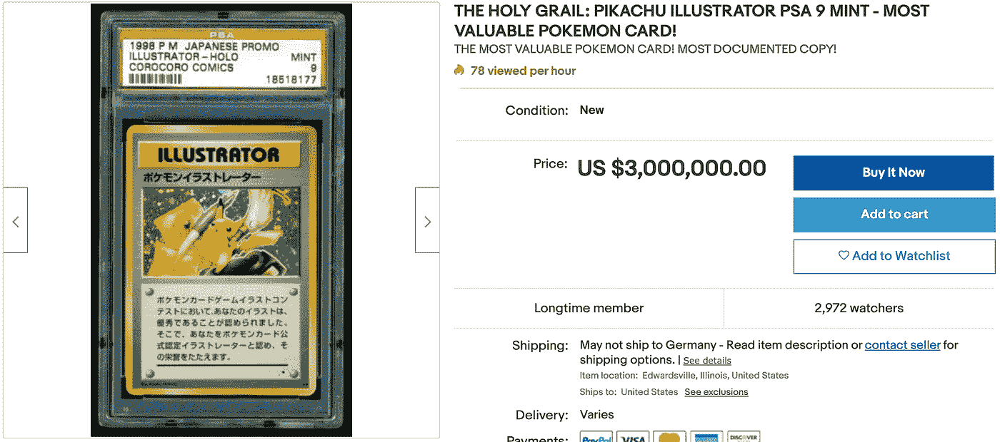

# NFT 趋势——为什么亿万富翁喜欢它们？

> 原文：<https://levelup.gitconnected.com/what-are-nfts-and-why-do-billionaires-love-them-153cb199ff89>

## 密码的最新趋势。趁你还能进来的时候进来！

马克·库班、查马斯·帕里哈皮蒂亚&加里·维(依次)；现在所有人都超级喜欢 NFT

过去的一年半对 crypto 来说是革命性的。比特币获得了 Microstrategy CEO 的背书；Twitter 首席执行官迈克尔·塞勒(Michael Saylor)；杰克·多西、拉乌尔·帕尔、保罗·都铎·琼斯等对冲基金经理，最近还获得了未来人类总裁/互联网之王/特斯拉和 SpaceX 首席执行官的支持；埃隆·马斯克。这一切都很棒。比特币已经从互联网上的网虫参与的东西，发展成为一种合法的对美元的押注。

比特币现在是一万亿美元的资产。但是如果你错过了那一波呢？或者，如果你正在寻找这个快速发展的加密货币世界的下一场革命，那该怎么办？我向你介绍 NFT 的。NFT 的是不可替代的代币，这是一种奇特的说法，与 1 个比特币等于另一个比特币的比特币不同，NFT 的是在区块链上令牌化的独特数字艺术作品。NFT 并不总是需要艺术，但现在，艺术似乎是最常见的用例，并且很容易这样解释。1 NFT 可能是我画的一幅价值 1 美元的画，另一幅可能是世界级艺术家画的价值数百万美元的画。

但不像互联网上的大多数文章只是简单地解释什么是“可替代性”和什么是 NFT 病。我会在这篇博文中更深入地向你解释为什么它会彻底改变这十年。但首先让我再给你宣传一下。还记得那个冷酷的前脸书亿万富翁吗——查马斯？这是他对除比特币之外的任何其他加密技术的看法:

或者至少，这是他一直以来的想法，直到最近，他承认他已经开始从比特币转向多元化，也进入了 NFT！这里有一个短片展示了这一点:

数字艺术和虚拟交易卡，这是世界上最聪明的投资者之一正在购买的东西。如果你有点像我，你一定在想；他到底在说什么？他想买数字棒球卡？游戏王卡片？毕加索画作的图片？

这听起来有点疯狂。尽管如此，让我尽力解释这里发生了什么，以及为什么 NFT 很有价值。

# 神奇宝贝交易卡游戏案例研究

你知道最近人们交易神奇宝贝卡片的趋势吗？是啊，太疯狂了。罕见的珍藏版 Charizards 售价高达 1000 美元，一张皮卡丘插画卡售价高达 10 万美元！如果你不相信我，就去查吧！有个人在易趣上要价 300 万美元:

某个疯子想要 300 万美元买这张卡

我不是神奇宝贝爱好者，所以我不能公平地评价这张卡。但是对神奇宝贝卡片显然有需求，而且这种需求似乎不会消失。现在想象一个数字神奇宝贝交易卡游戏，你可以购买这样的卡，然后在游戏中虚拟地使用它们。现在想象你有一张 NFT 形式的数字皮卡丘卡。除了卡在游戏中的用途，你还可以在区块链上证明它是你的。你把它放在你的电子钱包里，只要你保管好你的私人钥匙，没人能从你那里拿走它。你可以在区块链上向你的朋友展示你的卡片，而不是随身携带你的 200 张卡片。如果对朋友的收藏感到惋惜，可以即时发给朋友。或者，如果你找到买家并谈妥一个好价钱，你可以把它卖给以太坊或任何其他 ERC 20 代币。你也可以在像 OpenSea 和 Rarible 这样的网站上拍卖。一旦你同意一个价格，交易在几秒钟内完成，你在几秒钟内得到你同意的密码，买家也在几秒钟内得到数字皮卡丘卡 NFT。我希望我做了一个很好的例子来说明为什么 NFT 的就像真的一样，但是有更多的用途。

# 为弱势群体提供机会

假设你是一位才华横溢的音乐人，但缺乏资金，也没有与价值数百万美元的唱片公司签约。虽然你有自己的 Soundcloud 账户，但它有很多粉丝。你多年来一直在努力争取进入一家唱片公司，但没有成功。然而，你的歌迷喜欢你的音乐。你依靠他们的捐赠生活，但这并不足以让你长期生存。到目前为止，你对此无能为力。你将受到音乐产业寡头垄断的支配。

但是现在你可以把你的歌曲标记成 NFT 的，然后把你的歌曲的版权卖给你的粉丝，如果你愿意的话，你可以在几秒钟内收到加密货币形式的资金！你还可以在智能合同中加入你可以从任何转售收入中获得一定比例的佣金。例如，您可以向创建者(您)收取 10%的费用。所以，如果你的一个粉丝花 500 美元买了你的歌，却以 50 万美元卖给了一家唱片公司。当唱片公司购买它时，你还将再次获得 5 万美元。你猜怎么着？你不需要追上任何人或把任何人送上法庭——只要发生任何转售，你的加密货币钱包地址就会自动获得资金！

# 数字真实性和可收藏性

Ok 艺术和交易卡牌游戏很酷。它们看起来不错，它们的 NFT 版本使它们能够用于智能合约，而且它们更容易交易。但这就是 NFT 的全部吗？不，NFT 氏症还有很多其他的使用案例。其中一个例子是，它们允许我们商品化互联网空间中独特的数字内容。

如果你能拿到有史以来生产的第一部 iPhone，你认为它会有多值钱？还是最早的打字机之一？还是 Twitter 上有史以来的第一条推文？等等。前两个似乎很难，你必须在地球上寻找这些物品，然后花更长的时间从专家那里验证它们的真实性。但是有史以来的第一条推特？简单的谷歌搜索就能给你答案。事实上，我刚刚做了，这是弹出的推文:

在维基百科上简单查一下，Twitter 成立于 2006 年 3 月 21 日。所以日期吻合。这条推文也是创始人杰克·多西发的。这也说得通，到目前为止，这些数据是吻合的。也许你精通密码，你现在正兴奋地冒泡。因为这条推文被 Jack 正式标记了，可以出售。截至 2021 年 3 月 7 日的最高出价者？250 万美元。是的，你没看错。

NFT 可以保存情感价值。它可以像一个球员签名的篮球。有了 NFT，内容上创作者的亲笔签名，就是数字化的，并标注在区块链上。篮球上的签名可能会褪色，或者实体产品可能会受损。有了 NFT，这些数据将永远保存在区块链上，可以擦除，NFT 本身也不会被腐蚀。

这使得 NFT 是真实的。因此如果有需求的话，可以被认为是稀有的、独特的或有价值的。

自 90 年代以来，我们的世界变得越来越数字化和互联网连接。短信现在连接到互联网，以 Whatsapp/Telegram 消息的形式存在。平装书正在变成数字或有声读物。信件正被电子邮件所取代。公开演讲正被公开推特和 Youtube 视频所取代。电子音乐正在取代原声音乐，数字艺术正在取代绘画。所有这些都可以变成 NFT 的。我们每天花很多时间在网上，与数字事物互动。NFT 让我们能够用金钱来衡量这些我们一直珍视、却从未表达过感激之情的数字事物。现在，音乐家们终于可以更容易地出售他们音乐的版权并赚钱，而无需得到价值百万美元的唱片公司的支持。独立图形艺术家或任何其他数字创作者也是如此。这太美了。

我喜欢 NFT 的原因还有很多，我拥有一些，还想买更多。然而，我不想这篇博客写得太长，所以请跟我来，因为我会在后面的帖子中透露更多关于 NFT 的精彩世界。我也对加密领域的 DeFi 和 Oracle 空间感到非常兴奋。我写了一个新的 DeFi 硬币，我预测它最近会非常好。你可以在这里了解:[https://medium . com/swlh/100 x-your-money-with this-cryptocurrency-3c ab 1c 76 f1 db](https://medium.com/swlh/100x-your-money-with-this-cryptocurrency-3cab1c76f1db)。