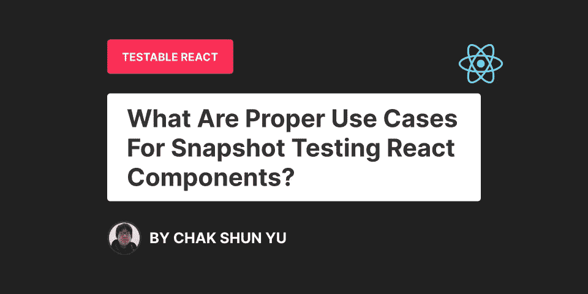

# 快照测试的正确用例反应组件

> 原文：<https://levelup.gitconnected.com/what-are-proper-use-cases-for-snapshot-testing-react-components-ac5ed2286081>

在 React 中编写测试的最常见方式之一是通过快照测试。它们非常方便，易于使用，几乎不需要测试。但是在过去的几年里，它们在 React 领域越来越不受欢迎。社区中的大多数人都认为快照测试几乎没有任何有意义的价值。而反映用户如何与应用程序交互的行为测试更可靠、更现实、更有用。

由于这个原因，大多数 React 开发人员已经完全摆脱了快照测试，并将他们的测试代码库迁移到行为测试集中的风格。如今，快照测试通常被视为一种虚假的测试形式，只能提供一种虚假的安全感。您会经常听到这样的说法，除非您有特定的理由来执行快照测试，否则建议您远离它们。

在一遍又一遍地听到这条建议后，我知道我不应该将快照测试作为一种默认方式，它实际上只有特定的用例。但是我不明白什么时候该用它。快照测试有哪些用例？它们什么时候有意义？它们实际上有什么用？

在过去的几个月里，我在开发 React 组件时一直在寻找这些用例。我想看看在哪些场景中快照测试比标准的单元或行为测试更有意义。在花了相当多的时间之后，我终于理解了快照测试的潜在问题。有了这个，我意识到为什么快照测试被放弃了，是什么让它们变得如此没有意义，以及在哪些用例中它们最相关。这篇文章将与你分享这些知识。

# 快照测试的潜在问题是什么？

快照测试现在经常被人反对的原因之一是它们非常不稳定。React 组件的 DOM 结构中最微小的变化都会导致测试失败。通常情况下，这些是假阴性测试结果，几乎没有价值，在代码库中被归类为“噪音”。

快照测试非常不稳定，因为它们捕获 React 组件树的整个 DOM 结构。不多不少。在大多数用例中，开发人员在测试中不需要整个 DOM 结构。但这仍然是他们测试中验证过程的一部分。结果是那些验证针对太多的代码，而只需要其中的一小部分。这导致了常见的挫折，即快照测试经常失败，并且在不相关的部分失败。

所以这种挫败感的根本问题是，与我们需要的相比，我们使用了多少代码。如果使用的代码中只有 5%与测试相关，那么测试在不相关的部分失败就不足为奇了。尤其是当所使用的代码很容易发生变化的时候。

防止这些假阴性测试结果的解决方案是使我们的测试更加具体，并且只使用验证过程所必需的东西。在大多数情况下，这意味着远离快照测试。

# 什么是快照测试的合适用例？

对于大多数开发人员来说，快照测试的问题是它们的不稳定性。这种不稳定性的根本原因是为验证过程检索了大量代码，但是只有很小一部分是相关的。有了这些知识，就更容易理解快照测试最相关的场景。

这意味着快照测试在大量检索到的代码与测试相关的场景中最有用。对于快照测试，该代码是结果 DOM 结构。因此，在以 React 组件的 DOM 结构为目标的测试案例中，实现快照测试是最相关的。

好吧，但是在哪些场景中，您希望针对 React 组件的大部分 DOM 结构执行验证呢？老实说，他们并不多。在三年的专业 React 开发中，我很少遇到积极证明快照测试的理由。但是我遇到的是:

*   **验证不同用途的 DOM 结构。🔍**使用快照测试的主要原因是当您需要验证 React 组件的结果 DOM 结构时。大多数时候，这个过程包括检查 HTML 属性、类或某些 HTML 元素的存在。这样做有很多不同的目的，包括但不限于验证 SEO、动画、可访问性和结构本身。
*   **防止 DOM 结构中的退化。🐛**与前面的主题相关，在一些场景中，您希望在不同版本的 React 组件之间保留相同的 DOM 结构。在我目前的团队中，我们主要负责为平台开发小部件。一个重要的标准是，我们不会在两个版本之间对这些小部件的 DOM 结构进行重大更改。对于这一点，对我们来说最佳的解决方案是快照测试。
*   **通过 CSS 验证可视挂载或卸载。** ⚙️正常情况下，挂载或卸载 React 组件是通过 JS 分别在 React 渲染树中添加或移除来完成的。但是在某些情况下，这将导致不希望的行为。一个常见的解决方案是不经历这些生命周期，而只通过 CSS 向用户提供可视化的反馈。这意味着组件仍然是 DOM 结构的一部分，因此是通过快照测试进行验证的主要候选对象。

所有这些场景不仅仅是快照测试的合适用例。实现这些用例也最理想地通过快照测试来完成，因为它们依赖于最终的 DOM 结构。使用其他形式的测试只会使它更加复杂、困难和冗长。因此，如果这些是您的用例，快照测试不仅是一个正确的选择，也是值得推荐的。

# 最后的想法

在过去的几年中，快照测试在 React 社区中已经不再受欢迎。由于其波动性和一贯的假阴性测试结果，它也得到了一个相对不好的名字。这导致了从快照测试的迁移，并在 React 代码库中采用更多的以行为为中心的测试。现在，我们经常建议您不要将快照测试作为默认设置，只在特定的场景中使用它。但是那些具体的用例是什么呢？

在这个问题上花了相当多的时间之后，潜在的问题是只有很小一部分代码与测试验证相关。在快照测试中，检索 React 组件树的整个 React DOM 结构，但是我们的测试的值只取决于它的一小部分。所以很多 DOM 结构都是不相关的，这导致了不稳定性和误判。

这意味着当测试用例中使用尽可能多的检索到的 DOM 结构时，快照测试是最有用的。基于这些信息和个人经验，测试 React 组件的正确用例应该是验证用于不同目的的 DOM 结构，并防止不同版本之间 DOM 结构的退化。

快照测试不应该作为默认的测试方式，只推荐在某些特定的用例中使用。尽管这些场景很少出现，但它们确实存在。在这些情况下，快照测试不仅是一个合适的用例，也是最理想的解决方案。

如果你喜欢这篇文章，可以考虑看看 Readable React 系列的其他文章，我的 T2 Twitter，或者我在 Medium 上的其他编程文章:

 [## 可读 React:内联条件呈现

### 内联条件渲染的 React 可读性分析

javascript.plainenglish.io](https://javascript.plainenglish.io/readable-react-inline-conditional-rendering-8dcdd86ca753)  [## 用 Typescript 键入可读 React 组件属性的 3 种方法

### 可读反应:类型脚本属性类型

better 编程. pub](https://betterprogramming.pub/3-ways-to-type-readable-react-components-props-with-typescript-a2991e59065e)  [## 与酶和 Jest 反应中正确行为测试的综合指南

### 基于三年实践经验的七点建议

better 编程. pub](https://betterprogramming.pub/a-comprehensive-guide-to-proper-behaviour-testing-in-react-with-enzyme-and-jest-ae866188f29a)  [## 模仿反应钩子的三个层次:对可表现性的控制和努力

### 向您展示了在模仿 React 钩子时如何平衡控制和努力与可表示性，以及为什么它很重要。

levelup.gitconnected.com](/3-levels-of-mocking-a-react-hook-control-and-effort-against-representability-2c6be067dba7)