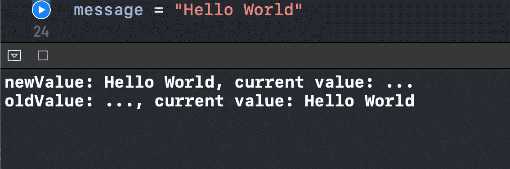
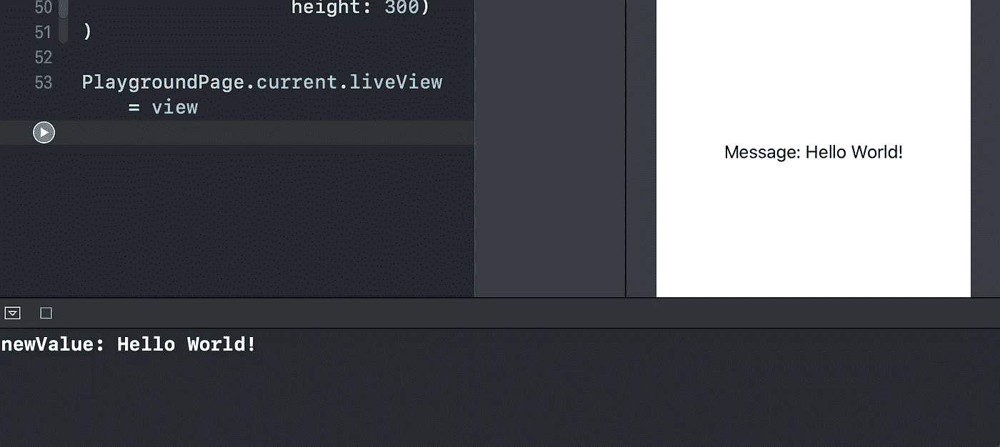

# Swift 中的物业观察员是什么？

> 原文：<https://levelup.gitconnected.com/what-are-property-observers-in-swift-4bda0945973>

## 对属性的更改做出反应

图片由 [SatyaPrem](https://pixabay.com/users/SatyaPrem-6578610/?utm_source=link-attribution&utm_medium=referral&utm_campaign=image&utm_content=3616959) 从 [Pixabay](https://pixabay.com/?utm_source=link-attribution&utm_medium=referral&utm_campaign=image&utm_content=3616959) 获得

在本文中，我们将了解什么是 Swift 中的属性观察器，以及如何有效地使用它们。

我们将很快在 Xcode 操场上对它们进行实验。

源代码可以在文章的底部找到。

# 我们开始吧

我们有两种类型的物业观察员:

*   willSet —在存储新值之前调用
*   *didSet —在之后调用*，存储一个新值**

*让我们创建一个简单的`message`变量:*

*并为其分配一个新值:*

*现在，我们在控制台中打印了以下内容:*

**

*正如我们所见，`willSet`在`didSet`之前被执行。所以在运行`willSet`的时候，我们可以获得一个新的值，即*被*赋值给变量。但是，该值尚未存储在属性中。*

*一旦`didSet`被执行，新值被存储。这就是为什么我们在`willSet`中有一个`newValue`参数，在`didSet`中有一个`oldValue`参数。*

*我们也可以如下更改`willSet`参数的名称:*

*现在让我们考虑一个实际的例子。*

*假设我们有一个简单的`UIView`叫做`CustomView`:*

*让我们按如下方式更改`message`属性:*

*并在初始化`CustomView`三秒后为其分配一个新值:*

*现在，如果我们运行操场，`willSet`属性观察者在三秒钟内触发 UI 更新:*

**

# *资源*

*源代码可以在[要点](https://gist.github.com/zafarivaev/710859161d360cb8cfcf6f1805a97077)中找到。*

# *包扎*

*对 Swift 更多鲜为人知的功能感兴趣？请随意查看我的其他相关文章:*

*   *[Swift 中的 ExpressibleByIntegerLiteral 协议是什么？](/cleansoftware/what-is-the-expressiblebyintegerliteral-protocol-in-swift-e71ad4a37a96)*
*   *[Swift 的价值绑定模式是什么？](/better-programming/what-is-the-value-binding-pattern-in-swift-a644be3e0597)*
*   *[Swift 中的 vDSP 框架是什么？](/better-programming/what-is-the-vdsp-framework-in-swift-fe2539693e9a)*
*   *[Swift 中的 CustomStringConvertible 协议是什么？](/better-programming/what-is-the-customstringconvertible-protocol-in-swift-4b7ddbc5785b)*
*   *[Swift 中的类和静态有什么区别？](/better-programming/what-is-the-difference-between-class-and-static-in-swift-3493848ed831)*

*感谢阅读！*