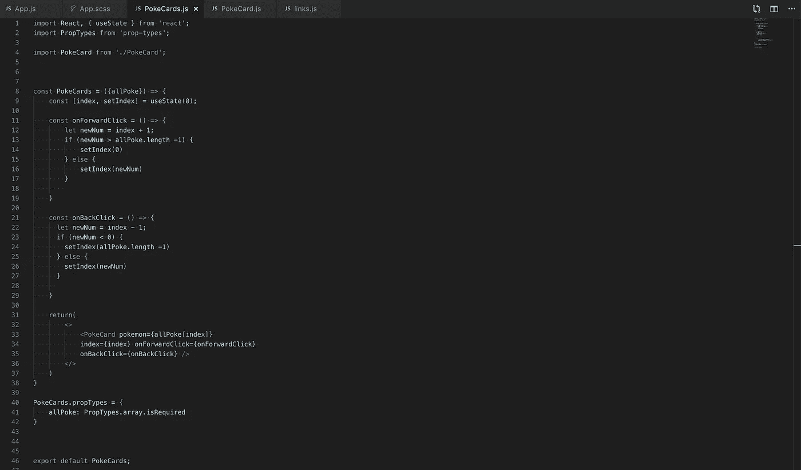

# 什么是 PropTypes？我们为什么要使用它们

> 原文：<https://levelup.gitconnected.com/what-are-proptypes-why-use-them-933744e7583e>

被劫持

在 React 中，我们将数据作为道具传递给 React 组件，不管它是来自另一个组件，还是来自 Redux store 或其他任何地方。数据在这些分隔化和模块化实体之间的移动是 React 如此吸引我和高效的原因。React 可用于无缝构建复杂的数据网络，这些数据在整个程序过程中流动和转换。然而，一个应用程序的复杂结构可能会无缝地瓦解并陷入完全的混乱和黑暗。我最近发现的在 React 中调试和管理数据流的最有帮助的方法之一就是使用 PropTypes。

“prop-types”库用于在数据移入组件时对其进行类型检查。PropTypes 可以帮助我们更有效地调试代码，并确保我们的代码在部署之前非常干净。

有了 prop-types 库，您可以对多种特性进行类型检查，包括但不限于从我们的 props 数据类型到对象 prop 的键和值。下面的例子展示了其中的一些，我创建了一个名为`Example`的假想组件，并给它分配了一个名为 propTypes 的属性，然后将它设置为等于一个对象。该对象包含作为键的属性，验证每个属性都存在并且包含与提供给 propTypes 对象的内容一致的值，无论它们是布尔值(bool)、对象、数字、字符串、函数(func)等。

为了引出道具类型的有用性，我绘制了一个超级简单的小 react 应用程序，并从经典的 Poke API 获取数据。

惊艳吧。

在这个应用程序中，我们可以无限循环播放前 40 个口袋妖怪，显示它们的名字，用圆圈的颜色表示它们的类型，特殊的动作和一点图像精灵。下面是我们应用组件的源代码:

在第一页上，在我们的应用程序功能组件中，我们正在获取口袋妖怪数据，并使用 React 钩子通过 useState 钩子设置 allPoke 的状态，并在 useEffect 钩子中获取我们的数据。然后，我们将存储在变量 allPoke 中的 Pokemon 数组作为道具传递给 Pokecards 组件。

在 PokeCards 组件中，我们在状态中设置了一个等于零的索引，并使用该索引状态将单个 Pokemon 从 allPoke 数组发送到 PokeCard。我们还定义了函数，我们将在 PokeCard 组件中调用这些函数。在这个组件中，我们看到了使用“prop-types”库的第一个实例。在第二行，我们导入库并将其命名为 PropTypes。prop-types 库现在可以用来在我们的道具从一个组件传递到另一个组件时对它们进行类型检查。在第 40 行，我们给组件一个名为 propTypes 的属性，并将其设置为一个对象，该对象对传递给组件的每个属性进行类型检查。在这种情况下，我们将 allPoke 向下传递给这个组件，我们希望确保它的类型是 array，并且它确实是运行所必需的，因此我们给它赋予了 isRequired 属性。

我现在要中断我的应用程序，将 allPoke 属性设置为一个对象，而不是属性类型所需的数组。在第 40 行，我没有传递 Pokemon 对象的 allPoke 数组，只是传递了一个对象。这是我们在浏览器控制台中看到的。

看看那些错误！这就成功破了 app。如果我们仔细看看第一个错误，我们会发现它是一个警告，告诉我们可能发生了什么。"警告:失败的属性类型:提供给` PokeCards '的类型` object '的属性` allPoke '无效，应为` array'。这个错误非常有用！它准确地告诉我们哪个变量被设置为错误的数据类型，警告在哪个组件中弹出，以及应该是哪种数据类型。想象一下，如果这发生在一个更大更复杂的应用程序上，会有多么大的帮助。想象一下，这是一个代码库，你只是在其中挖你的脚跟。

后一点展示了使用 PropTypes 的另一个好处:*上下文化*。使用 React 和查看其他 React 应用程序代码库的一个更困难的方面是理解另一个或许多其他开发人员的组件图的能力。PropTypes 可用于向其他开发人员指示组件中的每个 prop 是什么类型的数据，从而为其他人提供进入数据流逻辑的访问点。

这是另一个非常酷和有用的 prop-types 属性，我们可以用它来对代码进行类型检查。当在 PropTypes 对象上使用“exact”属性时，如果向对象添加了与我们的 PropTypes 中声明的值相矛盾的额外属性，该属性将警告我们。假设我们决定创建一个对象，该对象包含我们希望从 PokeCards 组件传递到 PokeCard 组件的样式属性。我们可以这样定义我们的州。

在将它作为道具从 PokeCards 传递到 PokeCard 之后，我们可以使用 PropType 的 exact 方法来检查这些确切的键。

如您所见，PokeCard propTypes 属性检查的不仅仅是 pokeAbilitiesStyle 属性。我们还检查我们的口袋妖怪道具是一个对象，onForwardClick 和 onBackClick 是函数，索引是一个数字。我们可以注入这个样式对象作为我们的任何 JSX 元素的样式，它将应用给定的样式！但是让我们看看如果我们给我们的颜色 pokeAbilitiesStyles 添加一个键会发生什么。

我们的代码没有中断，蓝色实际上被应用了(*pokeAbilities 样式被应用于“叶绿素”和“过度生长”，就在 bulbasaur sprite 下面)，但是看看我们控制台中的红色警告错误。该错误清楚地向我们表明，向 pokeAbilitiesStyle 属性提供了一个无效的键“color ”,而该颜色实际上不在我们的有效键中！

# 最后

PropTypes 是 JavaScript 语言基本属性的陪衬:JavaScript 是一种动态类型语言的事实。当我们在 JavaScript 中声明变量或给赋值函数参数时，我们不需要将它们赋给特定的数据类型。然而，对于 Swift(我最近才开始接触的一个框架)，它是静态类型的，我们在调用函数之前声明函数参数的数据类型以及返回值的数据类型。

不是 JAVASCRIPT

在上面的示例中，我们定义了一个名为 daysInQuarantine 的函数，并为它提供了参数 name 和 days。在我们的函数中，我们为每个参数分配了所需的数据类型，如果我们调用了 daysInQuarantine 并以不同的数据类型作为参数传入，将会产生一个错误。虽然这需要更多的输入，但这无疑比 JavaScript 更容易理解我们的代码，并使其符合上下文。

PropTypes 赋予我们的对 react props 进行类型检查的能力是调试、数据组织和代码上下文化的有用工具。如果您想了解更多关于 PropTypes 的信息，我当然推荐您通过下面提供的链接查看 React 自己的关于 PropTypes 的文档。

[https://reactjs.org/docs/typechecking-with-proptypes.html](https://reactjs.org/docs/typechecking-with-proptypes.html)