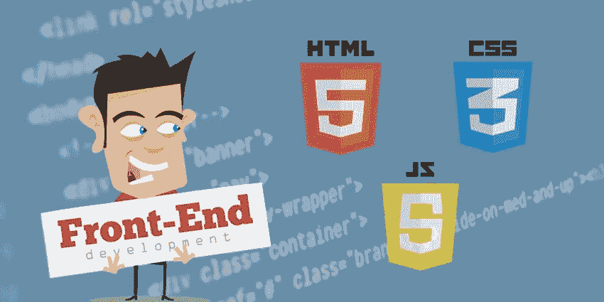
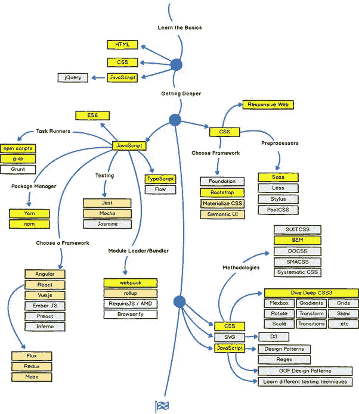
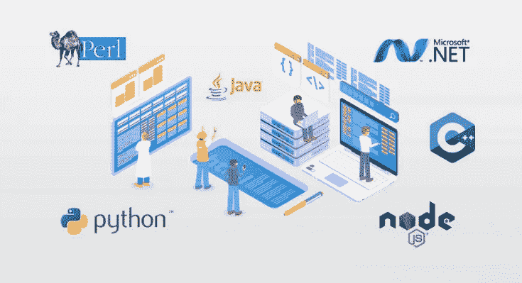
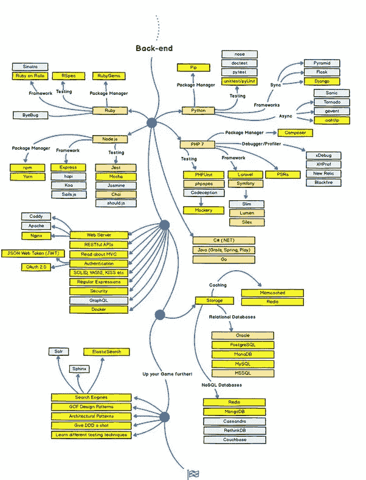

# 学习 web 开发最好的方法是什么？

> 原文：<https://levelup.gitconnected.com/what-are-the-good-ways-to-learn-web-development-cf7d5e6b7a6e>

初学者进入 web 开发的简单路线图！它也适合那些像我一样，在进入 web 开发世界后，不知道下一步该做什么的人🙃

图片来自 unsplash.com

让我们先了解一些关于 Web 开发的知识，然后再来看看如何处理它。在大多数情况下，Web 开发是指为互联网开发一个网站的工作。它可以是像个人作品集这样的单一静态页面，也可以是现代电子和社交网络业务的复杂动态网站和 web 应用程序。如果你愿意看列表，网页开发可能包括网页工程，网页设计，网页内容开发，客户端/服务器端脚本，等等！我宁愿把它看作是另一个海洋，就像 ML/数据科学或你所熟悉的任何广泛领域一样。

Web 开发通常分为**前端 Web 开发和后端 Web 开发。**前端+后端的组合称为**全栈开发。**先说前端！

# 前端开发

你在互联网上浏览时看到的一切，从字体和颜色到下拉菜单、滑块，以及你在浏览器或应用程序中看到的一切都属于前端开发。前端开发人员负责网站的外观和感觉。但是，成为一名前端 web 开发人员需要什么？

1.  **HTML(超文本标记语言):**HTML 用来设置你的页面的基本结构。它将定义页面的原始内容。它非常像你的页面的骨架。你肯定不需要掌握它来前进，而且在我看来，在 web 开发中你不可能完全掌握任何东西。Web Dev 是一个不断发展的东西，在这个过程中你会学到新的东西。然而，你应该知道 HTML 的基础知识，因为如果你对 HTML 不熟悉，以后就很难使用 CSS 和 JavaScript 了。
2.  **CSS(层叠样式表):**接下来你需要学习的是 CSS。它唯一的目的是设计你用 HTML 创建的结构，使它看起来更好，更容易使用。另外，记住 HTML 和 CSS 不是编程语言，编程意味着一组包含逻辑、条件、循环等的指令。鉴于 **HTML 是一种标记语言**而 CSS 是一种样式表用来设计 HTML 内容，使其更加用户友好。 **CSS 不是编程语言，也不是标记语言，它更像是 HTML 的补充**
3.  一旦你熟悉了 HTML 和 CSS，让我们来看看一些能让我们的生活变得更简单的方法，这些就是所谓的框架！**框架就像一个预先定义好的结构，它包括某些类，这些类包含网格、动画、按钮、表单元素、图标等等。这可以在以后访问，帮助 web 开发人员快速有效地开始。**这意味着开发人员可以将自己从一切从零开始解放出来，取而代之的是 CSS 框架将为他们创造一个坚实的基础！比较有名的有 Bootstrap，Foundation，Pure 等。
4.  **JavaScript: J** 正是 avaScript 让 HTML/CSS 变得实用！它更像是一个功能性的房子。房子的结构是使用 HTML 实现的，所有的绘画和设计工作都是使用 CSS 完成的，所有其他的东西，比如开关灯泡都是由 JavaScript 提供的！所以，如果你在网站上有一个按钮，可以提供一些东西，那么这个按钮很可能与 JavaScript 相关联。
5.  JavaScript 框架:就像 CSS 一样，JavaScript 也有大量的框架，这使得整个 JavaScript 体验感觉更流畅，这也允许开发者使他们的站点响应更快！一些著名的 JavaScript 框架有 React、Node.js、Angular、Vue 等。

这是我在网上找到的一个前端路线图:

# 后端开发

一切“幕后”都在后端开发之下。它帮助我们将 web 连接到数据库，管理所有的用户连接，从而驱动整个 web 应用程序本身。后端和前端的开发有助于我们实现三层客户-服务器架构，其中第一层是处理用户界面(HTML、CSS、JS)的表示层，中间层是处理逻辑(Python、C#、Java 等)的应用层。)和最后一层，即处理数据的数据层，通常由用户在表示层(MySQL、MongoDB、PostgreSQL 等)输入。).综合起来，我们可以称之为全栈开发(前端+后端)。同样，成为后端开发人员需要什么？

1.  **编程语言:**选择 Python、C#、Java 等一种编程语言。，先学基础。一旦你对基础知识有了信心，看看数据结构和算法部分。
2.  **框架:**每种编程语言都会有一定数量的框架与之相关联，让我们的生活变得更加简单。比较有名的有 Django，Flask，React，Node 等。
3.  **数据库管理系统(DBMS):** 数据库是有组织的数据集合。数据库支持数据的存储和操作。数据库使数据管理变得容易，它还帮助我们控制对特定数据库的访问。了解各种 DBMS 技术是后端开发人员的另一个重要需求。一些著名的技术有 MySQL、MongoDB、PostgreSQL、SQLServer 等。

这里有一个小路线图，您可以参考:

至此，我们已经涵盖了今天的主题，我希望这篇文章能帮助你从整体上对 web 开发有所了解。好吧，让我们很快在另一篇文章中见面，在那之前保重:)

[GitHub](https://github.com/ritchiepulikottil)

[**领英**](https://www.linkedin.com/in/ritchie-pulikottil-6876341aa/)

[**推特**](https://twitter.com/dloqcamguy)

[**Instagram**](https://instagram.com/ritchiepulikottil)