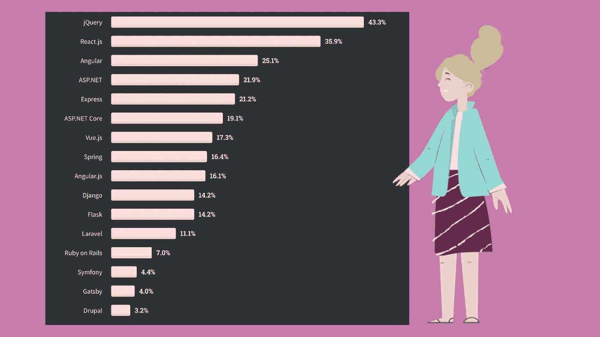
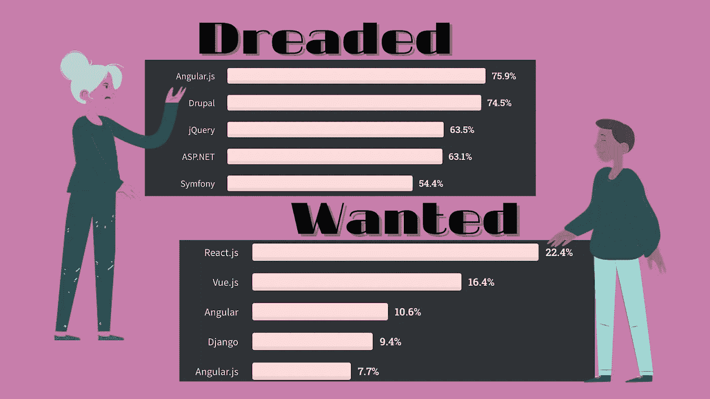
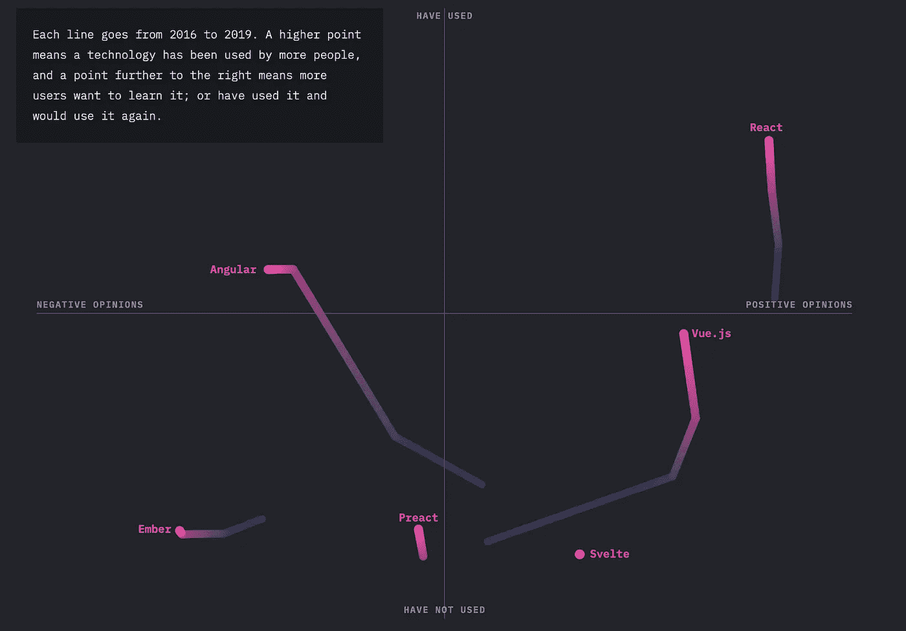

# 2021 年使用的顶级 web 开发框架是什么

> 原文：<https://levelup.gitconnected.com/what-are-top-web-development-frameworks-to-use-in-2021-b7ad4fa70cf1>

对于任何 JavaScript 开发，您总是希望过程尽可能舒适、快速和简单，同时提高产品质量。为此，有一些框架可以极大地简化过程并节省大量时间。

然而，当你刚开始做一个项目时，你会立即遇到选择框架的问题。哪个更好？哪个最适合我的项目？这些是一些棘手的问题，我将在本文中尝试解决。

# 如何选择合适的框架？

为了更好地理解这个主题，让我们强调一下，根据条件和您的需求，选择会有所不同，因此没有什么更好的明确答案。如果这是你第一次面对这样的问题，你很可能会试图找到**最值得信赖的框架**。所以这里有几个你应该依赖的因素。

1.  可靠性:可以通过社区的认知度和满意度来评估。
2.  易于学习和理解的事实:第一次使用时的一个要点。
3.  框架的好处:你要注意这个框架“擅长”什么。
4.  文档齐全的指南:将帮助您快速找到解决方案。

# 一些统计数据

现在，当我们知道应该关注什么时，让我们看看其他一些顶级 JavaScript 框架列表。基于 [Stack Overflow 开发者调查 2020](https://insights.stackoverflow.com/survey/2020) ，我们可以得出最流行的是 jQuery，然后是 React，还有 Angular。

(了解更多请访问[栈溢出](https://insights.stackoverflow.com/survey/2020))

但他们也提到“… jQuery 仍然是王者，但年复一年地慢慢失去了 React.js 和 Angular 的地位。…”jQuery 如此受欢迎主要是因为许多老项目都是基于它编写的。尽管如此，现在越来越多的开发者开始转向其他选择。

**相应地，选择最著名的框架并不能保证它的酷。**

(要了解更多信息，请访问[堆栈溢出](https://insights.stackoverflow.com/survey/2020))

从[最可怕和最想要的](https://insights.stackoverflow.com/survey/2020#technology-most-loved-dreaded-and-wanted-web-frameworks)框架来看，jQuery 和 Angular 让一些用户有点失望，而 **Vue.js 和 React 一起成为最有趣的框架之一**。

在 JavaScript 的[状态上，我们可以看到多年来的发展，清楚地了解社区对每个框架的看法。尽管如此，我们还是遇到了几个新名字，比如 Preact，Ember 和 Svelte。](https://2019.stateofjs.com/front-end-frameworks/)

(如果你想看到更多并帮助收集更多的数据，请转到 JavaScript 的[状态](https://2019.stateofjs.com/front-end-frameworks/)

***现在我建议对上述每个框架做一个小的概述，并多了解一点它们的特性。***

[**jQuery**](https://jquery.com/)**是由 John Resig 编写的开源 JavaScript 库，简化了 HTML、CSS、JavaScript 交互。它于 2006 年发布，吸引了很多开发者。**

**让 jQuery 如此受欢迎的是它的**易用性**、**大社区**和**保持代码简洁和相当简单的能力**。jQuery 主要设计用于轻松查找和操作网页上的元素。**

**💻该框架用于开发基于桌面的小型 JavaScript 应用程序。但是 jQuery 无法与 JavaScript 的高级简化、更少的编码和组件的可重用性的现代框架竞争。它通过放入大量代码使大型应用程序变得沉重。**

****

**[**React**](https://reactjs.org/)**是现代世界中最受关注的框架之一。它是脸书在 2014 年发布的，与 Angular 非常相似，但很快就超过了上一款。React 是**灵活**，**可以和其他框架**结合，**有一个庞大的社区**。****

****另一方面，由于框架中的多次更新，很难做出优化的文档，这增加了入手的难度。然而，大型社区使新的学习者很容易获得概念。****

****💻React 是单页面应用程序和创建可重用 UI 组件的正确解决方案。此外，在大型 web 应用程序中使用它也是一个好主意。****

********

****[**Angular**](https://angular.io/) 由谷歌于 2016 年正式推出，并提供所有必要的功能。Angular 与 React 的区别之一是它的**双向数据绑定**，这意味着模型和视图之间的实时同步。通常**不需要额外的库**，基于组件的路由、项目生成等功能都可以通过角度包的方式实现。尽管它需要花很多精力去学习，文档也可能太复杂或难以阅读。幸运的是，**大社区**会一直在那里等着你去帮助。****

****💻Angular 在开发 web 和移动应用程序、基于企业的应用程序以及单页面和多页面应用程序时非常有用。****

********

****[**Vue**](https://vuejs.org/) 是一个简单明了的框架，自 2014 年发布以来持续征服开发行业。事实上，它**结合了领先框架的精华，同时也更容易学习**。同时，中文文档和不太大的社区会成为一个问题。****

****💻Vue 被推荐用于灵活的设计结构，通常用于构建 UI、单页应用程序。****

********

******Ember 是**一个**快速且组织良好的**框架，于 2011 年**开发，具有适当的文档**，但是语法复杂且更新缓慢。由于传统的结构和小社区，这个框架的学习曲线很难。****

****💻Ember 非常适合大型项目、复杂的生态系统和客户端应用程序。****

********

****[**Preact**](https://preactjs.com/)**旨在使 JavaScript 框架体积更小，但提供与 react 相同的所有功能。它快速、有效、体积小，几个小时的学习后你就能明白。******

******💻如果您想创建一个能很好地完成某项功能的小应用程序，那么 Preact 可能正是您所需要的。******

************

********Svelte 是**2018 年推出的最有前途的框架之一。它并不出名，但由于其独特的方法，正变得越来越受欢迎。它比其他任何框架都快，简单易学，并且使用现有的 javascript 库。唯一的问题是社区很小，所以很难找到解决问题的方法。******

****💻Svelte 适合编写独立于框架的应用程序或任何 web 应用程序。****

# ****最后的话****

****总之，我们想提醒你，你不能挑出最好的框架。你必须把你的决定建立在期望的结果上。所以在为你的项目选择一个框架之前，我们建议你首先很好地解决它的概念**，并突出它必须满足的主要特征**。****

****如果你喜欢这篇文章，并想了解最新的编程新闻，请关注[顶级编程新闻](https://gitconnected.com/news)，随时了解新的趋势和令人兴奋的发展。****

****【https://www.webdatarocks.com】最初发表于**。******