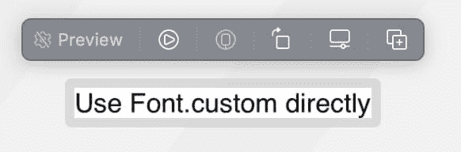
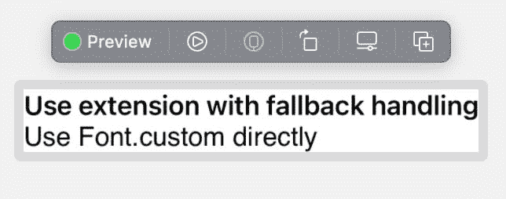

# 在 SwiftUI 中使用自定义字体时会出现什么问题

> 原文：<https://levelup.gitconnected.com/what-can-go-wrong-when-using-custom-fonts-in-swiftui-93d6252600e6>

这篇博客文章的目标是 SDK 开发人员，他们将自定义字体捆绑在他们的包/库/框架中，这些[字体将用于可重用的 SwiftUI 视图](https://developer.apple.com/documentation/swiftui/applying-custom-fonts-to-text)。

我将解释一个在未注册的自定义字体上使用字体粗细相关的视图修饰符(如`bold`)时观察到的问题。

让我们假设您将 [Open Sans](https://fonts.google.com/specimen/Open+Sans) true type 字体文件添加到您的包中

*   OpenSans-Regular.ttf
*   OpenSans-Bold.ttf
*   …

您还可以提供可重用的 SwiftUI 视图，这些视图将自动利用自定义字体。为此，你可以将`Font.custom(:size)`的结果传递给`font`视图修改器。

```
struct ReusableView: View {
    var body: some View {
        Text("Use Font.custom directly")
            .font(.custom("OpenSans-Regular", size: 17))
            .bold()
    }
}
```

如果你使用`bold`视图修改器，那么 SwiftUI 足够智能来加载 OpenSans-Bold。


只要应用程序开发人员没有忘记在应用程序中注册要使用的字体，这一切都很好。

```
Font.registerOpenSans()extension Font {
    static func registerOpenSans() {
        self.register(name: "OpenSans-Regular", withExtension: "ttf")
        self.register(name: "OpenSans-Bold", withExtension: "ttf")
        // ...
    } static func register(name: String, withExtension: String) {
        let fontURL = Bundle.main.url(forResource: name, withExtension: withExtension)!
        var error: Unmanaged<CFError>?
        CTFontManagerRegisterFontsForURL(fontURL as CFURL, .process, &error)
        if let error = error {
            print(error.takeUnretainedValue())
        }
    }
}
```

那么 app 开发者忘记注册字体了怎么办？



您可能会认为仍然会应用**粗体**字体粗细。但事实并非如此。苹果虫？

为了确保字体粗细得到应用，无论如何，我建议使用扩展。这个扩展要么加载字体，要么回退到系统字体。

```
extension Font {
    /// get "Open Sans" font or fallbacks to the system font in case the custom font was not registered
    /// - Parameter size: size of font
    /// - Returns: "Open Sans" font (or sytem font as fallback)
    static func openSans(size: CGFloat) -> Font {
        guard UIFont.familyNames.contains("Open Sans") else {
            return Font.system(size: size)
        }
        return .custom("OpenSans-Regular", size: size)
    }
}
```

这将确保 SwiftUI 能够对后备字体应用字体权重。



```
struct ReusableView: View {
    var body: some View {
        VStack(alignment: .leading) {
            Text("Use extension with fallback handling")
                .font(.openSans(size: 17))
                .bold() Text("Use Font.custom directly")
                .font(.custom("OpenSans-Regular", size: 17))
                .bold()
        }
    }
}
```

当然，在注册字体的情况下，结果是相同的。


*最初发布于*[*https://blog . ei dinger . info*](https://blog.eidinger.info/what-can-go-wrong-when-using-custom-fonts-in-swiftui)*。*